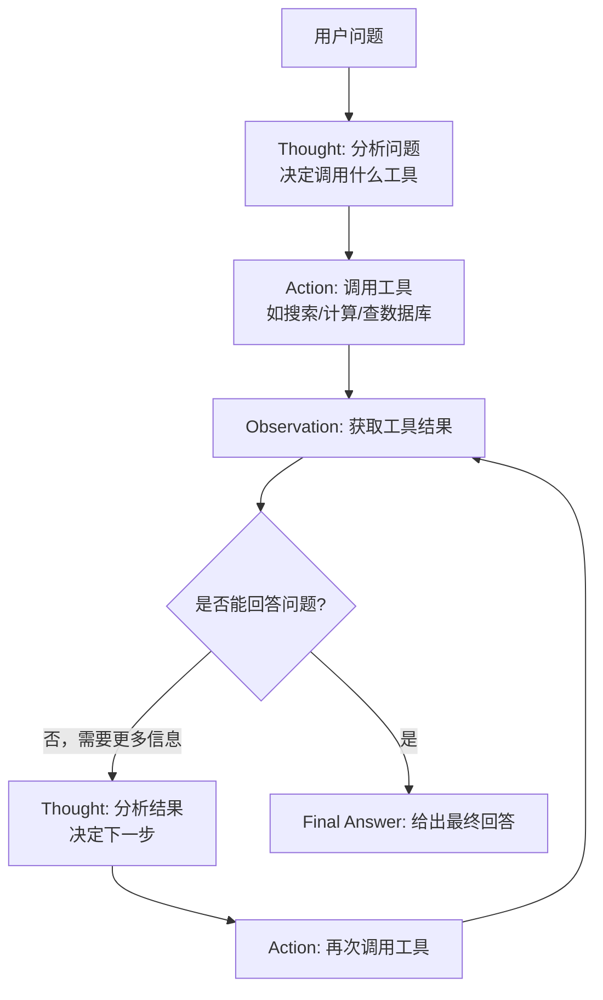

# LLM Agent 系统

## 速览

- Agent = LLM + 工具调用 + 记忆 + 规划，核心循环：Reason（推理）→ Act（执行工具）→ Observe（观察结果）→ 循环。
- ReAct（Reasoning + Acting）是最主流的 Agent 框架：思维链推理 + 工具调用交替进行，每步都显式输出思考过程。
- Function Calling / Tool Use：LLM 输出结构化 JSON 来调用函数，开发者执行函数并返回结果，LLM 继续生成。
- 规划策略：Plan-and-Execute 先制定全局计划再逐步执行（复杂任务），ReAct 动态决策（简单灵活任务）。
- 记忆分三层：短期（对话历史，受 context window 限制）、长期（向量数据库检索）、实体记忆（结构化事实）。
- 多 Agent：Orchestrator（编排者）+ Specialist Agents（专家代理）分工协作，适合复杂分工任务。
- Agent 四大失败模式：规划失败、工具调用失败、上下文溢出、无法终止（死循环）——可靠性是生产最大挑战。
- 调试核心手段：逐步追踪每个 Thought/Action/Observation，用 LangSmith/LangFuse 记录完整执行轨迹。

---

## Agent 核心循环（ReAct）

> **一句话理解：** ReAct = Reasoning + Acting，LLM 在每一步先用思维链推理"应该做什么"，再调用工具执行，观察结果后再推理，形成闭环直到得出最终答案。

**核心结论（可背）：**
```
ReAct 循环（Yao et al. 2022）：
  Thought：LLM 推理当前状态，决定下一步行动
  Action：调用工具（搜索/计算/API/代码执行）
  Observation：接收工具返回结果
  → 重复循环，直到 LLM 输出 Final Answer

ReAct vs 纯推理（CoT）vs 纯行动：
  纯 CoT：只推理不行动，无法获取实时信息
  纯行动：只调用工具无推理，无法处理复杂逻辑
  ReAct：两者结合，推理引导行动，行动验证推理

停止条件：
  LLM 输出 "Final Answer: ..."
  达到最大步数限制（max_iterations）
  工具返回错误超过阈值
```



**面试官常问：**
```
Q: ReAct 比 CoT 好在哪里？
A: CoT 只能利用 LLM 已有知识，无法获取实时信息或执行外部操作。
   ReAct 通过工具调用与外部世界交互（搜索、查数据库、执行代码），
   可以处理需要实时信息或计算的任务，且行动结果作为新信息补充推理。

Q: ReAct 的主要失败场景是什么？
A: ① LLM 推理错误导致行动方向偏差（规划失败）
   ② 工具返回不预期结果 LLM 无法处理（鲁棒性差）
   ③ 多步后 context 太长 LLM 忘记初始目标（目标漂移）
   ④ 陷入循环无法终止（死循环）
```

**易错点：**
- ❌ ReAct 中 LLM 直接执行工具 → ✅ LLM 只输出"调用什么工具+参数"，实际执行由框架/开发者代码完成
- ❌ 步数越多 Agent 越强 → ✅ 步数越多 context 越长，LLM 注意力分散，存在最优步数上限

**面试30秒回答：**
> ReAct 是最主流的 Agent 框架：每步 LLM 先输出 Thought（推理应该做什么），再执行 Action（调用工具），接收 Observation（工具结果），再推理下一步，循环直到得出 Final Answer。相比纯 CoT，ReAct 能与外部世界交互获取实时信息；相比纯工具调用，ReAct 有推理引导避免盲目执行。最大风险是多步后 context 积累、LLM 目标漂移或陷入死循环。

🎯 **Interview Triggers:**
- "ReAct 中 Thought 步骤有什么作用，去掉会怎样？"（WHY）
- "ReAct 和纯 Chain-of-Thought 相比有什么优势和劣势？"（TRADEOFF）
- "Agent 陷入无限循环是什么原因，怎么检测？"（FAILURE）

🧠 **Question Type:** principle explanation · comparison/tradeoff · debugging/failure analysis

🔥 **Follow-up Paths:**
- 循环控制 → max_iterations 和停止条件设计
- 工具调用 → Function Calling 实现
- 可观测性 → LangSmith 追踪每个 Thought/Action/Observation span

🛠 **Engineering Hooks:**
- 设置 `max_iterations=10~20`，超限返回 "无法完成" 而非无限循环
- 监控每次 ReAct 循环的 token 消耗（随步骤线性增长）
- LangSmith 追踪每个 Thought/Action/Observation span
- Observation 截断：工具返回结果过长时裁剪到 1000~2000 token

---

## Function Calling / Tool Use

> **一句话理解：** Function Calling 是 LLM 与外部世界交互的标准接口——开发者定义工具 schema，LLM 决定何时调用、传什么参数，框架执行工具并将结果返回给 LLM。

**核心结论（可背）：**
```
Function Calling 流程：
  1. 开发者定义工具 schema（JSON Schema：name、description、parameters）
  2. 发送 system message + tools 给 LLM
  3. LLM 判断是否需要调用工具
     - 不需要：直接文本回复
     - 需要：输出 tool_call（name + arguments JSON）
  4. 开发者执行对应函数，获取结果
  5. 将结果作为 tool_result 发给 LLM
  6. LLM 基于结果继续生成

工具 schema 关键要素：
  name：函数名（LLM 用于识别）
  description：功能描述（LLM 决策依据，非常重要）
  parameters：参数定义（JSON Schema，含 type/description/required）
```

**机制解释：**
```python
# OpenAI tools 定义示例
tools = [
    {
        "type": "function",
        "function": {
            "name": "search_web",
            "description": "搜索互联网获取最新信息，当用户询问实时数据时使用",
            "parameters": {
                "type": "object",
                "properties": {
                    "query": {
                        "type": "string",
                        "description": "搜索关键词"
                    }
                },
                "required": ["query"]
            }
        }
    }
]

# LLM 返回的 tool_call
{
    "tool_calls": [{
        "function": {
            "name": "search_web",
            "arguments": '{"query": "2024年AI发展趋势"}'
        }
    }]
}
```

**面试官常问：**
```
Q: 工具的 description 重要吗？
A: 非常重要，这是 LLM 决定是否调用工具的主要依据。
   description 不清晰 → LLM 调用时机错误或传错参数。
   最佳实践：说明工具的用途、适用场景、返回内容，必要时加 few-shot 示例。

Q: 并行工具调用是什么？
A: LLM 在一次响应中输出多个 tool_call，框架并行执行所有工具，
   然后将所有结果一起返回给 LLM。适合多个独立信息需要同时获取的场景。
   OpenAI GPT-4o 和 Anthropic Claude 都支持。
```

**易错点：**
- ❌ LLM 直接调用外部 API → ✅ LLM 只输出结构化 JSON 描述"想调用什么"，实际执行在开发者代码中
- ❌ 工具越多 Agent 越强 → ✅ 工具过多导致 LLM 选择困难，且 schema 占用大量 context；通常 5~10 个工具为佳

**面试30秒回答：**
> Function Calling 是 LLM 与外部世界的标准接口：开发者用 JSON Schema 定义工具名称、描述和参数，LLM 在需要时输出结构化的 tool_call（函数名+参数），框架执行函数并返回结果，LLM 再基于结果继续回答。工具 description 是关键——LLM 完全依赖它来决定何时调用。生产实践：工具数量控制在 10 个以内，description 要清晰说明适用场景，支持并行调用提升效率。

🎯 **Interview Triggers:**
- "Function Calling 和直接在 Prompt 里描述工具有什么本质区别？"（WHY）
- "工具数量增多对 Function Calling 效果有什么影响？"（TRADEOFF）
- "LLM 调用了不存在的工具或参数格式错误怎么处理？"（FAILURE）

🧠 **Question Type:** principle explanation · system design · debugging/failure analysis

🔥 **Follow-up Paths:**
- 工具选择 → 工具数量超 20 个时考虑工具检索（RAG over tools）
- 参数验证 → Pydantic schema 严格校验
- 并行工具调用 → OpenAI parallel_tool_calls

🛠 **Engineering Hooks:**
- 工具描述质量是成功率关键（description > 20 字，含参数说明和示例）
- 工具数量 >20 时成功率下降，考虑动态工具检索
- 用 Pydantic 校验参数，返回结构化错误让 LLM 自我修正
- 开启 `parallel_tool_calls=True` 可并行执行多个独立工具
- 监控工具调用成功率和错误分类

---

## 规划策略

> **一句话理解：** ReAct 动态决策适合简单灵活任务，Plan-and-Execute 先制定全局计划再执行适合多步复杂任务，Self-Refine 自我批评迭代改进适合输出质量要求高的场景。

**核心结论（可背）：**
| 策略 | 规划时机 | 特点 | 适用场景 |
|---|---|---|---|
| ReAct | 每步动态决策 | 灵活，但易失去全局目标 | 简单工具调用、信息检索 |
| Plan-and-Execute | 先制定全局计划 | 逻辑清晰，步骤可监控 | 复杂多步任务、有依赖关系 |
| Self-Refine | 生成→批评→修改迭代 | 输出质量高，适合创作 | 代码生成、文章写作、数据分析 |
| Reflection | 反思过去错误，更新策略 | 从失败中学习 | 长期运行 Agent |
| Tree-of-Thought（ToT） | 探索多条规划路径，回溯 | 最强推理但最慢 | 数学/逻辑难题 |

**机制解释：**
```
Plan-and-Execute 流程：
  1. Planner LLM：接收任务，输出完整执行计划（步骤列表）
  2. Executor：按计划逐步执行（每步可调用工具）
  3. Re-planner：执行过程中若步骤失败，重新规划剩余步骤

优点：
  计划可被人工审核和干预（Human-in-the-loop）
  每步执行失败不影响整体计划框架
  更容易 debug（清楚知道当前在第几步）

Self-Refine 流程：
  Generate → Critique（LLM 批评自己的输出）→ Refine → 重复
  终止：达到质量标准或最大迭代次数
  实际效果：代码正确率、文章质量显著提升
```

**面试官常问：**
```
Q: Plan-and-Execute 和 ReAct 怎么选？
A: 任务简单、工具调用独立 → ReAct（轻量，快速）
   任务复杂、步骤有依赖关系、需要人工审核 → Plan-and-Execute
   实际项目中：用 Plan-and-Execute 做任务分解，每个子任务内部用 ReAct 执行。

Q: Self-Refine 的批评者和生成者是同一个 LLM 吗？
A: 通常是同一个 LLM，只是 prompt 不同（生成者 prompt vs 批评者 prompt）。
   也可以是不同模型（如 GPT-4o 批评 GPT-4o-mini 的输出），效果更好但成本更高。
```

**易错点：**
- ❌ Plan-and-Execute 的计划一旦制定就不变 → ✅ Re-planner 在执行过程中可以动态调整计划
- ❌ Self-Refine 迭代越多越好 → ✅ 通常 2~3 轮后收益递减，过多迭代增加成本且可能过度修改

**面试30秒回答：**
> 两大主流规划策略：ReAct 适合简单任务，每步动态决策，灵活但容易失去全局目标；Plan-and-Execute 先让 Planner LLM 制定完整计划，再逐步执行，步骤清晰可审核，适合复杂多步有依赖的任务。实际工程中常组合：用 Plan-and-Execute 做任务分解，每个子任务内用 ReAct 动态执行。Self-Refine（生成→批评→改进循环）适合对输出质量要求高的代码生成或写作任务。

🎯 **Interview Triggers:**
- "Plan-and-Execute 和 ReAct 各自适合什么类型的任务？"（TRADEOFF）
- "为什么复杂任务用 ReAct 会失败？"（FAILURE）
- "Agent 的规划能力有什么根本局限？"（WHY）

🧠 **Question Type:** comparison/tradeoff · system design · debugging/failure analysis

🔥 **Follow-up Paths:**
- 长任务规划 → 计划中途失败的回滚机制
- 多 Agent 协作 → 子任务分配给专用 Agent
- 规划质量 → 用强模型做 Planner，弱模型做 Executor

🛠 **Engineering Hooks:**
- 复杂任务（>5步）用 Plan-and-Execute，简单交互用 ReAct
- Planner 用强模型（Opus/GPT-4o），Executor 用便宜模型降低成本
- 计划步骤数限制 10~15 步
- 监控计划执行成功率和平均修订次数
- 任务失败时记录失败的计划步骤用于离线分析

---

## 记忆机制

> **一句话理解：** Agent 记忆分三层：短期记忆（对话历史，受 context 限制）、长期记忆（向量数据库检索历史）、实体记忆（结构化关键事实），需要根据场景组合使用。

**核心结论（可背）：**
| 记忆类型 | 存储位置 | 容量 | 持久性 | 适用信息 |
|---|---|---|---|---|
| 短期/工作记忆 | Context Window | 受 token 限制 | 会话内 | 当前对话历史、工具结果 |
| 长期/情景记忆 | 向量数据库 | 无限 | 跨会话持久 | 历史对话摘要、用户偏好 |
| 实体记忆 | 结构化 KV 存储 | 无限 | 跨会话持久 | 用户名字、偏好、关键事实 |
| 语义记忆 | 知识库/RAG | 无限 | 永久 | 领域知识、文档 |

**机制解释：**
```
短期记忆管理（解决 context 溢出）：
  滑动窗口：只保留最近 N 轮对话
  摘要记忆：用 LLM 将旧对话压缩为摘要，放在 context 开头
  Token 预算：给历史对话分配固定 token 预算，超出则压缩

长期记忆写入/读取：
  写入：对话结束时提取关键信息，Embedding 后存入向量库
  读取：新对话开始时，用当前 query 检索相关历史，注入 context

实体记忆（Entity Memory）示例：
  从对话中提取：{"user_name": "张三", "preferred_language": "Python", "project": "RAG 系统"}
  下次对话自动加载 → 个性化体验
  MemGPT / mem0 是专注记忆管理的框架
```

**面试官常问：**
```
Q: Multi-turn 对话历史怎么处理 context 过长的问题？
A: 三种策略：
   ① 滑动窗口：只保留最近 K 轮（简单但丢失早期信息）
   ② 摘要压缩：定期用 LLM 将旧对话压缩为摘要（保留语义，节省 token）
   ③ 向量检索：将历史存向量库，按相关性检索（最完整，但有检索延迟）
   实际系统常用②+③组合。

Q: Agent 怎么在多个用户间隔离记忆？
A: 每个用户有独立的记忆存储（向量库命名空间/数据库用户ID分区）。
   检索时用 user_id 过滤，确保只读取当前用户的记忆。
```

**易错点：**
- ❌ 把所有对话历史塞入 context → ✅ 长对话必须做摘要或检索，否则超 context 长度且中间信息被 LLM 忽视
- ❌ 向量记忆检索总能找到正确信息 → ✅ 记忆检索也有召回率问题，和 RAG 一样需要评估和优化

**面试30秒回答：**
> Agent 记忆分三层：短期记忆是 context window 内的对话历史，受 token 限制；长期记忆用向量数据库存储历史对话摘要，按相关性检索注入；实体记忆用结构化存储记录用户名字、偏好等关键事实。长对话必须管理 context：滑动窗口保留最近 K 轮，或 LLM 压缩旧对话为摘要。实际系统常用摘要压缩 + 向量检索组合，兼顾完整性和 context 效率。

🎯 **Interview Triggers:**
- "为什么不把所有历史对话都放进 context，而需要专门的记忆机制？"（WHY）
- "短期记忆和长期记忆各有什么适用场景？"（TRADEOFF）
- "Agent 记忆污染（记住了错误信息）怎么处理？"（FAILURE）

🧠 **Question Type:** principle explanation · system design · comparison/tradeoff

🔥 **Follow-up Paths:**
- Context 长度 → 滑动窗口 vs 摘要压缩
- 长期记忆 → 向量数据库存储 + 语义检索
- 实体记忆 → 结构化更新用户偏好

🛠 **Engineering Hooks:**
- 短期记忆：保留最近 N 轮对话（`max_history=10`），旧对话用 LLM 压缩摘要
- 长期记忆：向量数据库存 embedding，相似度 >0.8 才召回
- 记忆写入时去重：和已有记忆相似度 >0.9 则更新而非新增
- 监控记忆库大小和检索延迟

---

## 多 Agent 系统

> **一句话理解：** 复杂任务一个 Agent 搞不定时，用 Orchestrator（编排者）协调多个 Specialist Agent（专家代理）分工，每个代理专注自己擅长的子任务。

**核心结论（可背）：**
| 架构模式 | 结构 | 特点 | 适用场景 |
|---|---|---|---|
| 顺序流水线 | A → B → C | 简单，输出即下一个输入 | 固定流程，低复杂度 |
| 层次（Hierarchical） | Orchestrator → [Agent1, Agent2...] | 编排者分配任务，专家执行 | 复杂分工、并行子任务 |
| 协作辩论 | Agent1 ↔ Agent2（互相 review） | 质量高，减少单点错误 | 代码 review、决策验证 |
| 竞争（Mixture of Agents） | 多 Agent 独立完成，取最优 | 可靠性高 | 高价值任务，成本不敏感 |

**机制解释：**
```
主流框架实现：
  LangGraph：图结构定义 Agent 工作流，状态机控制流转，支持循环和条件分支
  AutoGen（Microsoft）：多 Agent 对话框架，Agent 间互相发消息
  CrewAI：角色（Role）+ 任务（Task）+ 工具，声明式定义多 Agent 协作

层次架构示例（代码生成系统）：
  Orchestrator
  ├── Planner Agent：分析需求，拆分为编码任务
  ├── Coder Agent：逐个实现功能
  ├── Reviewer Agent：代码 review 和安全检查
  └── Tester Agent：生成测试用例并运行

多 Agent 通信方式：
  共享内存（Shared State）：所有 Agent 读写同一状态对象
  消息传递（Message Passing）：Agent 间发送结构化消息
  黑板系统（Blackboard）：中央存储，Agent 订阅更新
```

**面试官常问：**
```
Q: 多 Agent 系统的最大挑战是什么？
A: ① 协调复杂度：Agent 间通信和依赖关系难以管理
   ② 错误传播：上游 Agent 错误导致下游全错（错误级联）
   ③ 成本：多个 LLM 调用，token 消耗成倍增加
   ④ 调试困难：多 Agent 交互轨迹难以追踪
   解决：明确接口定义、单元测试每个 Agent、完整 trace 日志

Q: 什么时候用多 Agent，什么时候用单 Agent？
A: 单任务、工具调用 <5 步 → 单 Agent ReAct，简单可靠
   任务需要不同专业技能分工 → 多 Agent
   并行子任务（节省时间）→ 多 Agent
   原则：能单 Agent 解决就不用多 Agent（复杂性是代价）
```

**易错点：**
- ❌ 多 Agent 一定比单 Agent 更可靠 → ✅ 多 Agent 引入更多失败点和协调复杂性，可靠性设计难度更高
- ❌ Agent 越多任务完成越好 → ✅ Agent 数量应该按任务分工决定，冗余 Agent 只增加成本和复杂性

**面试30秒回答：**
> 多 Agent 系统用 Orchestrator 编排多个 Specialist Agent 分工协作，适合需要不同专业技能或并行子任务的复杂场景。常见框架：LangGraph 用图结构定义工作流，CrewAI 用角色+任务声明式定义，AutoGen 用 Agent 间对话协作。最大挑战是错误传播和调试困难——一个 Agent 出错可能让整个系统崩溃。原则：能单 Agent 解决就不用多 Agent，复杂性是真实代价。

🎯 **Interview Triggers:**
- "什么情况下需要多 Agent 而不是单 Agent？"（WHY）
- "多 Agent 协调的主要瓶颈在哪里？"（TRADEOFF）
- "多 Agent 系统最常见的失败模式是什么？"（FAILURE）

🧠 **Question Type:** system design · comparison/tradeoff · debugging/failure analysis

🔥 **Follow-up Paths:**
- Agent 通信 → 消息格式标准化和幂等性
- 编排框架 → LangGraph 状态机 vs AutoGen 对话 vs CrewAI 角色
- 可观测性 → 跨 Agent trace 链路追踪

🛠 **Engineering Hooks:**
- 用 LangGraph 定义状态机，明确 Agent 间消息格式（JSON schema）
- 设置全局超时：多 Agent 任务总时长上限（如 5 分钟）
- Agent 间通信用消息队列（异步）而非直接调用（避免死等）
- 监控各 Agent 的 token 消耗和错误率
- 任务分配日志记录到 trace 便于回放调试

---

## Agent 可靠性问题

> **一句话理解：** Agent 在生产中的主要可靠性问题是幻觉工具调用、无限循环、上下文漂移和错误级联，需要防御性设计而非寄希望于 LLM 始终正确。

**核心结论（可背）：**
| 可靠性问题 | 表现 | 根本原因 | 缓解方案 |
|---|---|---|---|
| 幻觉工具调用 | 调用不存在的函数/传错参数 | LLM 自信错误 | 工具 schema 严格校验，参数类型验证 |
| 无限循环 | Agent 反复调用同一工具 | 无终止条件 | max_iterations，循环检测 |
| 目标漂移 | 多步后忘记原始目标 | context 过长，注意力分散 | 在每步提示中重复原始目标 |
| 错误级联 | 一步失败导致后续全错 | 无错误处理 | 每步验证输出，try-except，fallback |
| 过度工具调用 | 简单问题也调用工具 | description 不够清晰 | 改进工具 description，加直接回答选项 |

**机制解释：**
```
防御性 Agent 设计原则：
  1. 最大步数限制：max_iterations=10，超出强制终止
  2. 参数验证：工具调用前校验参数类型和格式
  3. 工具 timeout：每次工具调用设置超时（5~30s）
  4. 重试限制：同一工具错误重试不超过 2 次
  5. 结果验证：工具结果不符合预期时，告知 LLM 并要求换策略
  6. Human-in-the-loop：高风险操作（删除、支付）必须人工确认

幻觉工具调用的典型场景：
  LLM 生成：{"name": "send_email", "args": {"to": "boss@company.com", "subject": "辞职信"}}
  → 如果没有验证，框架直接执行 → 严重后果
  防御：对危险操作（写入、删除、发送）额外确认步骤

循环检测：
  记录每步的 (action, args) 组合
  发现连续 3 次相同调用 → 注入提示"上一步方法无效，请换思路"
```

**面试官常问：**
```
Q: 如何防止 Agent 执行危险操作？
A: ① 权限分级：只读工具和写入工具分开，写入工具需要额外确认
   ② 沙箱执行：代码执行在隔离环境中（Docker/E2B）
   ③ Human-in-the-loop：危险操作前暂停，等待人工审批
   ④ 操作日志：所有工具调用记录，可审计可回滚

Q: Agent 在生产中最常见的故障是什么？
A: ① LLM API 超时/限流（网络/速率问题）
   ② 工具调用参数格式错误（JSON 解析失败）
   ③ 上下文过长超出 LLM 限制（context 溢出）
   ④ 无限循环耗尽 token 预算
   → 所有这些都需要 try-except + 日志 + 告警
```

**易错点：**
- ❌ LLM 足够智能，不需要额外验证 → ✅ LLM 有随机性，生产中必须防御性设计，不能假设 LLM 始终正确
- ❌ 设置 max_iterations 就能防止所有问题 → ✅ 还需要循环检测、参数验证、错误处理等多层防御

**面试30秒回答：**
> Agent 生产可靠性的核心挑战：幻觉工具调用（LLM 生成错误函数名/参数）、无限循环（没有终止条件）、目标漂移（多步后忘记原始目标）和错误级联（一步失败全链崩溃）。防御性设计必须包括：max_iterations 限制、参数类型校验、工具 timeout、同一错误最多重试 2 次、危险操作 human-in-the-loop。不能假设 LLM 始终正确，每步都要验证输出。

🎯 **Interview Triggers:**
- "幻觉工具调用是怎么发生的，有哪些防御措施？"（FAILURE）
- "如何在不降低能力的情况下提升 Agent 的可靠性？"（TRADEOFF）
- "为什么 Agent 会 context drift，如何检测？"（WHY）

🧠 **Question Type:** debugging/failure analysis · system design · comparison/tradeoff

🔥 **Follow-up Paths:**
- 工具调用验证 → Pydantic schema + 执行前确认
- context 管理 → 定期摘要压缩防止 drift
- 人工介入 → Human-in-the-loop 检查点设计

🛠 **Engineering Hooks:**
- 高风险工具（删除/支付/发送）加 `require_confirmation=True` 人工确认
- 工具执行结果验证：对比预期 schema，不匹配则让 LLM 重试（最多 3 次）
- Context 超 50% 上限时触发摘要压缩
- 监控任务成功率、平均重试次数、人工介入频率

---

## Agent Failure Modes & Debugging

> **一句话理解：** Agent 调试的核心是把黑盒变白盒——完整追踪每一步的 Thought/Action/Observation，用 LangSmith 等工具可视化执行轨迹，系统性分类失败模式才能针对性修复。

**核心结论（可背）：**
```
四类失败模式（按发生阶段）：

Type 1 — 规划失败（Planning Failure）：
  表现：工具调用顺序错误、遗漏必要步骤、过早给出最终答案
  原因：任务分解能力不足、system prompt 不清晰
  修复：改进 system prompt、加 few-shot 规划示例、用更强的 LLM

Type 2 — 工具执行失败（Tool Execution Failure）：
  表现：参数格式错误、调用不存在的工具、忽略工具错误结果
  原因：工具 description 不准确、LLM 参数推理能力弱
  修复：优化 description、加参数校验、错误时提示 LLM 换策略

Type 3 — 上下文失控（Context Failure）：
  表现：忘记原始目标、重复已完成的步骤、混淆不同任务的信息
  原因：context 过长、信息密度过高
  修复：在每步 prompt 中重申目标、压缩历史、限制 context 长度

Type 4 — 终止失败（Termination Failure）：
  表现：死循环、无法判断任务是否完成、过早停止
  原因：终止条件不明确、LLM 自信心不足或过度
  修复：明确终止条件在 prompt 中、max_iterations 强制终止
```

**机制解释：**
```
调试工具链：
  LangSmith：LangChain 官方 trace 工具，可视化每步输入/输出/延迟/token
  LangFuse：开源替代，支持自部署
  日志记录最佳实践：
    记录：步骤编号、action name、input args、output、延迟、token count
    标记：每次工具调用是否成功
    告警：失败率 >5%、平均步数 >7

Root Cause Analysis 流程：
  1. 复现问题（固定 seed/temperature=0）
  2. 逐步回放每个 Thought/Action/Observation
  3. 定位失败点（哪步开始偏离正确路径）
  4. 分类失败模式（上述四类）
  5. 针对性修复（prompt/工具/验证逻辑）

Evals 驱动的 Agent 改进：
  构建 test cases（输入 + 预期工具调用序列 + 预期最终答案）
  自动化运行，回归测试防止退化
  关键指标：任务成功率、平均步数、token 消耗
```

**面试官常问：**
```
Q: Agent 调试和普通代码调试有什么不同？
A: ① 不确定性：LLM 有随机性，同一输入可能产生不同行为（用 temperature=0 固定）
   ② 黑盒推理：LLM 的 Thought 不总是准确反映内部状态
   ③ 长链路：错误可能在第 5 步，但根因在第 2 步
   → 必须完整记录每步 trace，不能只看最终输出

Q: 如何系统性提升 Agent 的成功率？
A: ① 构建 eval test suite（覆盖典型场景和边界情况）
   ② 分析失败分布（哪类失败最多）
   ③ 针对最高频失败类型优化（prompt / 工具 / 验证）
   ④ 回归测试确保修复不引入新问题
   ⑤ 逐步灰度上线，监控生产指标
```

**易错点：**
- ❌ 调试时只看最终输出 → ✅ 必须逐步审查每个 Thought/Action/Observation，找到偏离点
- ❌ 一次修复能解决所有问题 → ✅ Agent 问题是分布式的，需要 eval 驱动的持续迭代

**面试30秒回答：**
> Agent 失败分四类：规划失败（工具顺序错）、工具执行失败（参数错误）、上下文失控（忘记目标）、终止失败（死循环）。调试核心是完整 trace——LangSmith 记录每步的 Thought/Action/Observation，用 temperature=0 固定随机性来复现问题。系统性改进：构建 eval test suite，量化各类失败的占比，针对最高频问题优化 prompt 或工具 description，回归测试防止退化。Agent 可靠性是个工程问题，不是一次修完的。

🎯 **Interview Triggers:**
- "生产环境 Agent 任务失败率高，你会怎么系统性排查？"（FAILURE）
- "如何在保证质量的前提下降低 Agent 的调试成本？"（TRADEOFF）
- "为什么 Agent 在测试时表现好但上线后频繁失败？"（FAILURE）

🧠 **Question Type:** debugging/failure analysis · system design · performance optimization

🔥 **Follow-up Paths:**
- 离线回放 → 记录完整 trace，复现失败场景
- LangSmith 数据集 → 失败案例转化为回归测试
- 失败分类 → 建立错误分类体系指导优化方向

🛠 **Engineering Hooks:**
- LangSmith `@traceable` 装饰器追踪每个 Thought/Action
- 失败 trace 转化为 LangSmith Dataset，定期回归测试
- 按失败类型分类监控（工具失败 / 规划失败 / 幻觉 / 循环）
- 设置 SLA：Agent 任务 P95 完成时间
- 每周分析 Top-5 失败模式，针对性改进

---

## 面试高频考点汇总

| 考点 | 核心答案 |
|---|---|
| ReAct 是什么？ | Reasoning + Acting：每步 Thought（推理）→ Action（工具调用）→ Observation（结果）循环 |
| Function Calling 中 LLM 执行工具吗？ | 不，LLM 只输出 JSON（工具名+参数），开发者代码执行，结果返回给 LLM |
| 工具 description 为什么重要？ | LLM 完全依赖 description 决定何时调用和传什么参数，不清晰 → 调用错误 |
| Plan-and-Execute vs ReAct？ | Plan-and-Execute 先制定全局计划（复杂任务）；ReAct 逐步动态决策（简单灵活） |
| Agent 记忆有哪几种？ | 短期（context 内对话历史）、长期（向量库）、实体记忆（结构化 KV）三层 |
| 多 Agent 的最大挑战？ | 错误级联、协调复杂性、调试困难、成本成倍增加 |
| 如何防止 Agent 无限循环？ | max_iterations 强制终止 + 循环检测（连续相同调用 → 提示换策略）|
| Agent 四大失败模式？ | 规划失败、工具执行失败、上下文失控（目标漂移）、终止失败（死循环）|
| 如何调试 Agent 问题？ | LangSmith trace 每步 Thought/Action/Observation，temperature=0 固定复现，逐步回放找偏离点 |
| 危险操作如何防护？ | 参数类型校验 + 沙箱执行 + human-in-the-loop 人工确认 + 完整操作日志 |
