```mermaid
gantt
    title 静态批处理 vs 连续批处理
    dateFormat X
    axisFormat %s

    section 静态批处理
    请求A(长) :0, 10
    请求B(短) :0, 4
    空闲等待  :crit, 4, 10
    请求C     :10, 15

    section 连续批处理
    请求A(长) :0, 10
    请求B(短) :0, 4
    请求C     :4, 9
    请求D     :9, 14
```

# LLM 推理系统

## 速览

- 量化（Quantization）将权重从 FP16 降到 INT8/INT4，内存减半到 1/4，推理速度提升，精度略损——GPTQ 和 AWQ 是主流 PTQ 方案。
- Continuous Batching（连续批处理）：新请求完成即换入，不等全 batch 结束，GPU 利用率从 ~30% 提升到 ~80%，是 vLLM 的核心创新之一。
- PagedAttention：用操作系统分页思路管理 KV Cache，消除内存碎片，同一 prefix 的 KV 可在多请求间共享。
- 推理并行：张量并行（Tensor Parallelism）横切权重矩阵跨 GPU，流水线并行（Pipeline Parallelism）按层分 GPU，适合不同瓶颈。
- 推理框架：vLLM 易用生产首选，TensorRT-LLM 最高性能（NVIDIA 硬件），llama.cpp 支持 CPU 本地部署。
- 投机解码（Speculative Decoding）：小 draft 模型生成 k 个 token，大模型一次并行验证，速度提升 2~3×，输出等价。
- TTFT（Time To First Token）= prefill 延迟，受 prompt 长度影响；TPOT（Time Per Output Token）= decode 延迟，是用户感知速度的关键。
- decode 阶段是内存带宽瓶颈（Memory-bandwidth bound），不是算力瓶颈（Compute-bound）。

---

## 量化（Quantization）

> **一句话理解：** 量化用低精度数值（INT8/INT4）表示模型权重，大幅减少内存占用和推理延迟，是在消费级硬件上运行大模型的核心技术。

**核心结论（可背）：**
| 量化类型 | 精度 | 内存压缩 | 精度损失 | 代表方案 |
|---|---|---|---|---|
| FP16/BF16 | 16bit | 基准（1×） | 无 | 默认推理 |
| INT8 | 8bit | ~2× | 极小（<1%） | bitsandbytes LLM.int8() |
| INT4 | 4bit | ~4× | 小~中 | GPTQ, AWQ, GGUF Q4 |
| INT2/1bit | 2~1bit | ~8× | 较大 | BitNet（实验性） |

**机制解释：**
```
训练后量化（PTQ）主流方案：

GPTQ（Generalization-Post-Training Quantization）：
  逐层量化，最小化每层权重量化后的输出误差
  用少量校准数据（calibration data）重建权重
  支持 INT4，是最常用的 GPU PTQ 方案

AWQ（Activation-aware Weight Quantization）：
  发现少量权重（~1%）对激活值影响极大（salient weights）
  保护这些关键权重不量化（或更高精度）
  比 GPTQ 精度更高，推理速度更快

GGUF（llama.cpp 格式）：
  支持多种量化级别：Q2_K, Q4_0, Q4_K_M, Q8_0
  Q4_K_M：4bit 混合量化，平衡精度和速度，CPU 推理首选
  GGUF 文件包含权重 + 元数据，无需其他依赖直接加载

量化感知训练（QAT）：
  训练时模拟量化误差 → 精度比 PTQ 好但需要重训，成本高
```

**面试官常问：**
```
Q: AWQ 和 GPTQ 有什么区别，哪个更好？
A: AWQ 关注激活值敏感性，保护关键权重；GPTQ 逐层最小化量化误差。
   AWQ 通常精度更高、推理更快；GPTQ 更成熟、工具链更完善。
   实际选择取决于硬件和框架支持，两者差距不大。

Q: INT4 量化会明显影响模型效果吗？
A: 对于 7B+ 的模型，INT4 量化通常损失 <2%（在通用基准上）。
   对于 <3B 的小模型，损失较明显。敏感任务（精确推理、代码）建议用 INT8。
```

**易错点：**
- ❌ 量化只是把权重变小 → ✅ 量化同时影响推理计算路径，需要对应的量化核（kernel）才能实际提速
- ❌ 量化越激进越好 → ✅ INT2/1bit 精度损失大，工程上 INT4 是精度和性能的最佳平衡点

**面试30秒回答：**
> 量化将模型权重从 FP16 降到 INT8/INT4，内存缩减 2~4 倍。主流方案：GPTQ 逐层最小化量化误差，AWQ 识别并保护对激活值敏感的关键权重，两者都是无需重训的 PTQ 方案。CPU 部署用 llama.cpp 的 GGUF Q4_K_M 格式。7B+ 模型 INT4 量化精度损失通常小于 2%，是生产部署的标准选择。

---

## Continuous Batching（连续批处理）

> **一句话理解：** 传统批处理等一批请求全部完成才换下一批，Continuous Batching 在迭代级别调度——某个序列生成完就立刻换入新请求，GPU 利用率从 30% 提升到 80%+。

**核心结论（可背）：**
```
传统静态批处理（Static Batching）的问题：
  一个 batch 中最短序列生成完后，必须等最长序列完成才能处理新请求
  短请求完成后 GPU 算力空闲浪费 → GPU 利用率低（~30%）

Continuous Batching（动态批处理）：
  也叫 In-flight Batching / Iteration-level Scheduling
  在每个生成步（iteration）后检查：是否有序列生成完 [EOS]
  有完成的 → 立刻从等待队列取新请求补充
  → GPU 始终满负荷运行，利用率 80%+

核心优势：
  吞吐量（throughput）大幅提升
  P99 延迟降低（短请求不被长请求阻塞）
  这是 vLLM 相比 HuggingFace 原生推理的最大优势之一
```



**面试官常问：**
```
Q: Continuous Batching 和普通动态批处理有什么区别？
A: 普通动态批处理：允许不同大小的 batch，但一个 batch 内仍需等所有序列完成。
   Continuous Batching：精细到每个 iteration，完成一个序列立刻换入新序列。
   粒度不同：batch 级 vs iteration 级。

Q: Continuous Batching 对延迟有影响吗？
A: 对单个请求的延迟无负面影响（甚至更低），因为不再被长请求阻塞。
   主要提升的是系统吞吐量（tokens/sec）和 GPU 利用率。
```

**易错点：**
- ❌ Batching 越大越好 → ✅ batch 过大会增加单个请求的排队延迟（TTFT 变长），需要在吞吐量和延迟间权衡
- ❌ Continuous Batching 是 vLLM 独有的 → ✅ TGI（HuggingFace）、TensorRT-LLM 也实现了类似机制

**面试30秒回答：**
> 传统批处理等一批请求全部完成才换下一批，短请求完成后 GPU 空闲浪费。Continuous Batching 在每个 token 生成步后检查是否有序列完成 [EOS]，完成就立刻换入新请求，让 GPU 始终满负荷运行，利用率从 ~30% 提升到 80%+，吞吐量大幅提升。这是 vLLM 比 HuggingFace 原生推理快数倍的核心原因之一。

---

## PagedAttention

> **一句话理解：** 受操作系统虚拟内存分页启发，PagedAttention 将 KV Cache 切成固定大小的 page 管理，消除内存碎片，并支持多请求共享同一 prefix 的 KV Cache。

**核心结论（可背）：**
```
传统 KV Cache 的问题：
  为每个请求预分配连续内存（最大序列长度 × 层数 × 维度）
  实际生成长度 << 最大长度 → 内存严重浪费
  不同请求不能共享内存 → 内存利用率 ~30%

PagedAttention 解决方案：
  KV Cache 切分为固定大小的 block（page），如每 block = 16 tokens
  请求的 KV Cache 由非连续的 block 组成（虚拟→物理地址映射）
  block 按需分配，用完释放 → 内存利用率 >90%

KV Cache 共享（Prefix Caching）：
  多个请求有相同的 prefix（如相同 system prompt）
  → 相同 prefix 对应的 KV block 只计算一次，多请求共享
  大幅减少重复计算（类似 OS 的 copy-on-write）
```

**机制解释：**
```
类比 OS 虚拟内存：
  OS 内存管理：进程地址空间 → 页表 → 物理内存页
  PagedAttention：KV Cache 逻辑块 → 块表 → 物理 KV 块

内存利用率对比：
  传统方式：~30%（大量预留+碎片）
  PagedAttention：>90%（按需分配，无碎片）

实际效益（vLLM 论文数据）：
  相比 HuggingFace Transformers：吞吐量提升 24×
  相比 FasterTransformer：吞吐量提升 3.5×
```

**面试官常问：**
```
Q: PagedAttention 和 KV Cache 是什么关系？
A: KV Cache 是机制（缓存历史 K/V 矩阵），PagedAttention 是 KV Cache 的内存管理方式。
   没有 PagedAttention，KV Cache 仍然存在但内存利用率低、有碎片；
   PagedAttention 让 KV Cache 的管理更高效。

Q: Prefix Caching 在什么场景下最有价值？
A: ① 大量请求共享同一 system prompt（客服/RAG 系统）
   ② 批量对同一文档做不同问题（文档问答）
   ③ Multi-turn 对话（历史对话的 KV 可复用）
```

**易错点：**
- ❌ PagedAttention 只是内存优化 → ✅ 它还支持 KV 共享（Prefix Caching），减少重复计算，提升吞吐量
- ❌ PagedAttention 改变了 Attention 计算结果 → ✅ 计算结果与标准 Attention 完全等价，只是内存管理方式不同

**面试30秒回答：**
> PagedAttention 参考 OS 分页内存管理：把 KV Cache 切成固定大小的 block，按需分配，非连续存储，内存利用率从 30% 提升到 90%+。更重要的是支持 Prefix Caching——多个请求共享相同 system prompt 的 KV block，避免重复计算。vLLM 的核心创新，让吞吐量比 HuggingFace 原生推理高出 24×。

---

## 推理并行策略

> **一句话理解：** 单 GPU 装不下大模型时，张量并行横切权重跨 GPU 协作，流水线并行按层分配 GPU，两者可组合，是部署 70B+ 模型的必须技术。

**核心结论（可背）：**
| 并行方式 | 切分维度 | 通信开销 | 适用场景 |
|---|---|---|---|
| 张量并行（TP） | 权重矩阵按列/行切分，每 GPU 算部分 | All-Reduce（每层） | 单节点多 GPU，延迟敏感 |
| 流水线并行（PP） | 按 Transformer 层切分，GPU 各算几层 | P2P（层间激活值） | 多节点，吞吐量优先 |
| 序列并行（SP） | 按序列长度维度切分 | All-Gather/ReduceScatter | 超长 context（>32K） |
| 数据并行（DP） | 每 GPU 完整模型副本，batch 切分 | All-Reduce（梯度） | 训练为主，推理不常用 |

**机制解释：**
```
张量并行（Megatron-LM 方式）：
  FFN 权重 W(d × 4d)：按列切成 N 份，每 GPU 算 W[:, 4d/N]
  每个 GPU 输出部分结果，All-Reduce 求和得完整输出
  优点：每层都同步，延迟低
  缺点：All-Reduce 通信频繁，要求节点内高带宽（NVLink）

流水线并行：
  Layer 0~7 → GPU0，Layer 8~15 → GPU1，...
  Micro-batching 切分 batch，像流水线一样填满所有 GPU
  Pipeline bubble（空闲）：GPU 等待上游/下游数据
  优点：节点间通信量小（只传激活值）

实际部署（如 LLaMA-70B，4×A100）：
  TP=4：每 GPU 25% 的权重，All-Reduce 延迟 ~0.5ms（NVLink）
  PP=1（单节点不做 PP，通信太慢）
  跨节点（8×A100 × 2 nodes）：TP=8 节点内，PP=2 节点间
```

**面试官常问：**
```
Q: 张量并行和流水线并行怎么选？
A: 单节点（NVLink 高带宽）→ 张量并行，通信延迟低。
   跨节点（InfiniBand/以太网）→ 流水线并行，减少跨节点通信频率。
   生产部署通常组合：节点内 TP + 节点间 PP。

Q: 推理时为什么不用数据并行？
A: 数据并行每 GPU 保存完整模型副本，不解决"模型装不下单 GPU"的问题。
   适合训练（每副本独立前向+反向），推理时 TP/PP 更合适。
```

**易错点：**
- ❌ 更多 GPU 一定更快 → ✅ 张量并行 GPU 过多时 All-Reduce 通信成为瓶颈，存在最优并行度
- ❌ 流水线并行没有空闲 → ✅ 存在 Pipeline Bubble（首尾 GPU 等待），需要 Micro-batching 来填充

**面试30秒回答：**
> 大模型推理两种主要并行方式：张量并行把权重矩阵按列/行切到多 GPU，每步 All-Reduce 合并结果，适合节点内 NVLink 高带宽场景；流水线并行把 Transformer 层按 GPU 分配，传递激活值，适合跨节点低带宽场景。实际部署 70B+ 模型通常组合：节点内张量并行 + 节点间流水线并行。

---

## 推理框架对比

> **一句话理解：** vLLM 易用生产首选，TensorRT-LLM 在 NVIDIA 硬件上性能最强，llama.cpp 支持 CPU 本地部署，按场景选型而非追求"最好"。

**核心结论（可背）：**
| 框架 | 核心优势 | 适用场景 | 局限 |
|---|---|---|---|
| vLLM | PagedAttention + Continuous Batching，Python 易用 | 生产服务、快速部署、OpenAI 兼容 API | 性能不如 TRT-LLM |
| TensorRT-LLM | NVIDIA 极致优化，吞吐量最高 | 追求最高性能、A100/H100 部署 | 上手复杂，仅 NVIDIA |
| llama.cpp | CPU 推理、GGUF 量化、跨平台 | 本地部署、资源受限设备、Mac 开发 | 不适合高并发生产 |
| Ollama | llama.cpp 封装，极易安装 | 个人本地开发调试 | 生产不适用 |
| TGI（HuggingFace） | HF 生态集成，Continuous Batching | HF 模型生产部署 | 性能不如 vLLM |
| SGLang | 支持 RadixAttention（前缀共享）、结构化生成 | 复杂 Agent/多轮推理场景 | 生态较新 |

**机制解释：**
```
vLLM 快速部署（OpenAI 兼容接口）：
  pip install vllm
  python -m vllm.entrypoints.openai.api_server \
    --model meta-llama/Llama-3-8B-Instruct \
    --tensor-parallel-size 2

TensorRT-LLM 为什么最快：
  模型编译为 TensorRT 引擎（算子融合、内核优化）
  Inflight Fused Batching（类 Continuous Batching）
  针对 H100 Tensor Core 优化（FP8 推理）
  代价：每个模型需单独编译，部署流程复杂

框架性能对比（大约，H100 单卡 LLaMA-70B）：
  TensorRT-LLM：~3000 tokens/s
  vLLM：~2000 tokens/s
  HF Transformers（基准）：~200 tokens/s
```

**面试官常问：**
```
Q: 生产环境推荐用哪个框架？
A: 快速上线：vLLM（OpenAI 兼容 API，社区活跃，功能完整）。
   追求极致性能（NVIDIA 硬件）：TensorRT-LLM。
   本地/开发调试：llama.cpp 或 Ollama。
   选框架要看：硬件、模型大小、延迟要求、团队熟悉度。

Q: vLLM 和 SGLang 什么区别？
A: vLLM 更成熟通用；SGLang 在多次 LLM 调用（如 Chain-of-Thought、Agent 循环）
   场景下用 RadixAttention 共享前缀更高效，适合复杂 Agent 系统。
```

**易错点：**
- ❌ TensorRT-LLM 一定比 vLLM 好 → ✅ TRT-LLM 性能更高但工程复杂度高，对多数团队 vLLM 的易用性更有价值
- ❌ llama.cpp 只能 CPU 跑 → ✅ llama.cpp 也支持 GPU（CUDA/Metal），速度介于纯 CPU 和 vLLM 之间

**面试30秒回答：**
> 三个核心框架各有定位：vLLM 是生产首选，PagedAttention + Continuous Batching + OpenAI 兼容 API，部署简单；TensorRT-LLM 在 NVIDIA H100/A100 上性能最强，但工程复杂；llama.cpp 支持 CPU 和 GGUF 量化，是本地开发和边缘部署首选。快速上线用 vLLM，追求极致吞吐用 TRT-LLM，个人开发用 Ollama。

---

## 投机解码（Speculative Decoding）

> **一句话理解：** 用小的 draft 模型快速生成 k 个 token，让大模型一次并行验证全部，接受则保留、拒绝则丢弃——速度提升 2~3×，输出分布与原始大模型完全等价。

**核心结论（可背）：**
```
核心思路（Leviathan et al. 2023）：
  目标：加速大模型自回归生成（bottleneck = sequential decoding）

  步骤：
  1. draft 模型（小，如 7B）自回归生成 k 个 token（快）
  2. target 模型（大，如 70B）并行验证这 k 个 token（一次前向）
  3. 接受规则（修正采样）：
     - draft token 概率 <= target 概率：接受
     - draft token 概率 > target 概率：以一定概率拒绝，重采样
  4. 至少接受 1 个 token（最坏情况 = 不加速）

  加速比 = 平均接受 token 数 / 1 次 target 前向的时间
  实测：2~3× 加速（draft 和 target 越相似，加速越大）

输出等价性：
  修正采样保证输出分布与直接用 target 采样完全等价
  这是区别于其他近似方法的核心优势
```

**机制解释：**
```
变种方案：
  Self-Speculative（Medusa）：在同一模型上加多个 draft head，无需单独 draft 模型
  EAGLE：预测隐藏状态而非直接预测 token，接受率更高
  Lookahead Decoding：用 Jacobi 迭代并行生成多个 token 候选

适用条件：
  draft 和 target 同系列模型（如 LLaMA-7B draft + LLaMA-70B target）
  生成内容有一定规律性（高 acceptance rate）
  batch size = 1 效果最好（小 batch 时 GPU 利用率低，加速空间大）

不适合的场景：
  大 batch 高并发（target 模型本已满载，投机验证反而增加开销）
  draft 和 target 模型差异太大（接受率低，无加速）
```

**面试官常问：**
```
Q: 投机解码的输出和不用投机解码一样吗？
A: 一样，数学上等价。修正采样（rejection sampling with correction）保证
   最终输出分布与直接从 target 采样的分布完全相同，不是近似。

Q: 什么场景最适合投机解码？
A: 单请求/低并发场景（GPU 利用率低，有空闲算力做 draft 验证）。
   高并发生产环境 Continuous Batching 已经填满 GPU，投机解码收益有限。
```

**易错点：**
- ❌ 投机解码会改变输出质量 → ✅ 数学等价，输出分布完全相同
- ❌ draft 模型越小越好 → ✅ draft 模型太小接受率低，加速反而不明显；需要与 target 同系列

**面试30秒回答：**
> 投机解码用小 draft 模型快速预生成 k 个 token，大 target 模型一次前向并行验证——接受则保留，拒绝则重采样，输出分布与直接用大模型完全等价。加速比 2~3×，适合低并发、单请求场景（GPU 有空闲算力）。高并发生产环境 Continuous Batching 更有效，投机解码收益有限。

---

## 推理延迟分析

> **一句话理解：** TTFT 是用户等第一个字的时间（prefill 决定），TPOT 是每个字的间隔（decode 决定），优化方向完全不同——prefill 是算力瓶颈，decode 是内存带宽瓶颈。

**核心结论（可背）：**
| 指标 | 全称 | 影响因素 | 优化方向 |
|---|---|---|---|
| TTFT | Time To First Token | prompt 长度、batch size、prefill 算力 | Flash Attention、Chunked Prefill |
| TPOT | Time Per Output Token | 模型大小、内存带宽、KV Cache 大小 | 量化、GQA、更大内存带宽 GPU |
| 吞吐量 | tokens/sec（系统级） | Continuous Batching、并行度 | Continuous Batching、更大 batch |
| E2E Latency | TTFT + TPOT × output_len | 以上所有因素 | 综合优化 |

**机制解释：**
```
Prefill 阶段（计算密集型）：
  并行处理整个 prompt（矩阵×矩阵乘法）
  算力利用率高，GPU 可以充分并行
  TTFT 主要由 prompt 长度决定：prompt × 2 → TTFT × 2

Decode 阶段（内存带宽密集型）：
  每步只生成一个 token（矩阵×向量乘法）
  GPU 大量算力闲置，瓶颈在显存读取速度（bandwidth）
  KV Cache 随 batch 增大：batch × 2 → TPOT × ~2

优化 TTFT：
  Flash Attention：IO-aware 分块计算，减少 HBM 读写
  Chunked Prefill：将长 prompt 分块处理，和 decode 交错
  Prefix Caching：相同 system prompt 不重复 prefill

优化 TPOT：
  GQA/MQA：减少 KV head 数，降低 KV Cache 内存占用
  量化 KV Cache：INT8 KV，减少内存带宽需求
  更大 GPU 内存带宽（H100 3.35TB/s vs A100 2TB/s）
```

**面试官常问：**
```
Q: 为什么 decode 是内存带宽瓶颈而不是算力瓶颈？
A: Decode 每步只处理 1 个 token，做的是矩阵×向量（而非矩阵×矩阵）。
   计算量小（不能充分利用 GPU TFLOPS），但每步都要把全部模型权重从显存读一遍。
   所以瓶颈在显存带宽，H100 比 A100 快主要就体现在 decode 速度上。

Q: 用户感知延迟主要是 TTFT 还是 TPOT？
A: 取决于场景：
   流式输出（Streaming）：用户主要感知 TTFT（等第一个字多久）和流畅度（TPOT）
   非流式（等待完整结果）：用户感知 TTFT + TPOT × 输出长度 = 总延迟
   对话场景优先优化 TTFT，长文档生成优先优化吞吐量。
```

**易错点：**
- ❌ 减少 batch size 一定能降低延迟 → ✅ 减小 batch 降低 TPOT 但降低吞吐量；不同指标需要独立优化
- ❌ 算力越强 decode 越快 → ✅ decode 是内存带宽瓶颈，算力翻倍不等于 decode 速度翻倍

**面试30秒回答：**
> 推理延迟分两段：TTFT（Time To First Token）是 prefill 延迟，受 prompt 长度影响，是算力瓶颈，用 Flash Attention 优化；TPOT（Time Per Output Token）是 decode 延迟，是内存带宽瓶颈，用 GQA 和 KV 量化优化。流式输出场景用户最敏感 TTFT，高并发场景关注系统吞吐量。H100 比 A100 在 decode 上更快，主要因为内存带宽从 2TB/s 提升到 3.35TB/s。

---

## 面试高频考点汇总

| 考点 | 核心答案 |
|---|---|
| INT8 和 INT4 量化的区别？ | INT8：内存减半、精度损失极小；INT4：内存减到 1/4、精度损失小但更多；GPTQ/AWQ 是主流 PTQ 方案 |
| Continuous Batching 解决什么问题？ | 传统批处理短请求等长请求浪费 GPU；CB 在 iteration 级别调度，GPU 利用率从 30% → 80%+ |
| PagedAttention 的核心创新是什么？ | OS 分页思路管理 KV Cache，消除内存碎片（利用率 30%→90%），支持多请求共享 prefix KV |
| 张量并行和流水线并行怎么选？ | 节点内（NVLink）→ 张量并行；跨节点→ 流水线并行；生产常组合使用 |
| 投机解码的输出和原始模型一样吗？ | 一样，修正采样保证输出分布完全等价，不是近似 |
| TTFT 和 TPOT 分别是什么？ | TTFT=Time To First Token（prefill 延迟）；TPOT=Time Per Output Token（decode 延迟）|
| 为什么 decode 是内存带宽瓶颈？ | 每步矩阵×向量，算力利用率低，瓶颈在读取模型权重的显存带宽 |
| vLLM 为什么比 HF 原生推理快？ | PagedAttention（KV 内存利用率 90%）+ Continuous Batching（GPU 利用率 80%）|
| 量化对模型精度影响大吗？ | 7B+ 模型 INT4 损失 <2%；敏感任务用 INT8；小模型量化损失更明显 |
| 推理框架怎么选？ | 生产→vLLM；最高性能 NVIDIA→TRT-LLM；本地/CPU→llama.cpp/Ollama |
