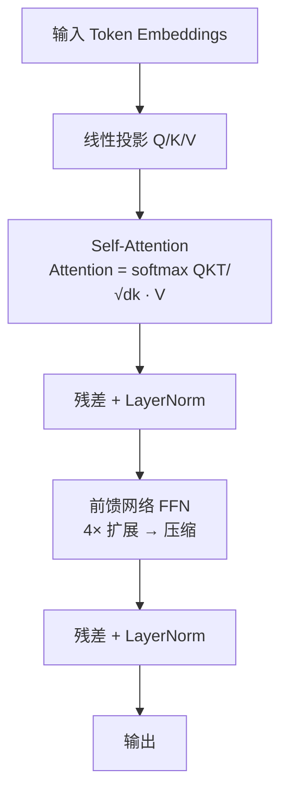

# LLM 基础

## 速览
- Transformer = Self-Attention + FFN + 残差 + LayerNorm，Decoder-only（GPT 系列）是当前主流 LLM 架构。
- Self-Attention 复杂度 O(n²)，计算 Q/K/V 矩阵后 softmax(QK^T/√d_k)V，每个 token 关注全局上下文。
- Tokenization：BPE 迭代合并高频字节对（GPT 系列），WordPiece 最大化语料似然（BERT），中文多用字符级。
- 预训练 = 下一个 token 预测（自监督），SFT = 指令-回答对监督微调，LoRA = 冻结基座 + 低秩矩阵（0.1% 参数）。
- 采样：Temperature 控制随机性，Top-p 动态截断词表，Beam Search 保留多候选（适合结构化输出）。
- KV Cache：缓存历史 token 的 K/V 矩阵，避免每步重算，生成速度从 O(n²) 降到 O(n)，内存随序列长度线性增长。
- Scaling Law（Chinchilla）：最优训练 token 数 ≈ 20× 模型参数量，越大的模型需要越多数据才发挥潜力。
- RoPE 位置编码：用旋转矩阵编码位置，天然支持长度外推，是 LLaMA/GPT-NeoX 等现代模型的标配。

---

## Transformer 架构

> **一句话理解：** Transformer 用 Self-Attention 让每个 token 直接关注所有其他 token，取代了 RNN 的顺序计算，是所有现代 LLM 的基础架构。

**核心结论（可背）：**
```
核心组件：
  Self-Attention：每个 token 对所有其他 token 打分，加权聚合信息
  Multi-Head Attention：多组独立 Attention，捕获不同维度的语义关系
  FFN（前馈网络）：两层线性变换，中间维度 4× 隐藏维度，处理 token 内特征
  残差连接：防止梯度消失，允许训练极深网络
  LayerNorm：Pre-LN（现代）比 Post-LN（原始论文）训练更稳定

三种架构变体：
  Encoder-only（BERT）：双向注意力，适合分类/NLU 任务
  Decoder-only（GPT/LLaMA）：因果注意力，适合文本生成，当前主流 LLM
  Encoder-Decoder（T5/BART）：编码器理解输入，解码器生成输出，适合翻译/摘要
```

**机制解释：**
```
Self-Attention 计算：
  Q = X·Wq,  K = X·Wk,  V = X·Wv
  Attention(Q,K,V) = softmax(QK^T / √d_k) · V

  √d_k：缩放因子，防止点积过大导致 softmax 梯度消失
  Mask（Decoder）：上三角 mask，确保 token 只看到过去，实现自回归

Multi-Head Attention：
  将 d_model 维度分成 h 个头，每头独立做 Attention，拼接后线性投影
  不同 head 捕获：句法关系、语义关联、共指等不同模式

时间复杂度：
  Self-Attention：O(n² · d)，n 是序列长度 → 长文本瓶颈
  FFN：O(n · d²)
```



**面试官常问：**
```
Q: 为什么 Decoder-only 成为 LLM 主流，而不是 Encoder-Decoder？
A: Decoder-only 训练目标（next-token prediction）天然利用所有 token 的监督信号，
   且 scaling 效果更好；Encoder-Decoder 两部分参数利用率不如 Decoder-only 高效。

Q: Self-Attention 为什么除以 √d_k？
A: d_k 维度大时 QK^T 点积方差大，softmax 趋于极端（梯度消失），
   除以 √d_k 将方差归一化，保持 softmax 梯度稳定。
```

**易错点：**
- ❌ Transformer 没有位置信息 → ✅ 有位置编码（PE），没有 PE 则 Attention 对顺序不敏感
- ❌ 层越多一定越好 → ✅ 深度需配合宽度和数据量，Pre-LN 才能稳定训练超深网络

**面试30秒回答：**
> Transformer 核心是 Self-Attention：每个 token 计算 Q/K/V，用 softmax(QK^T/√d_k)V 加权聚合所有 token 的信息，时间复杂度 O(n²)。多头注意力并行捕获不同语义关系。Decoder-only 架构因果 Mask 保证只看历史，是 GPT/LLaMA 等 LLM 的标准架构，配合残差和 LayerNorm 支持训练极深网络。

---

## Tokenization

> **一句话理解：** Tokenization 把文本切成模型能处理的 token（不是字），BPE 按频率合并字节对，token 数直接影响成本、速度和上下文容量。

**核心结论（可背）：**
| 算法 | 原理 | 使用模型 | 特点 |
|---|---|---|---|
| BPE | 迭代合并最高频字节对，构建词表 | GPT-2/3/4, LLaMA | 通用，灵活，英文效率高 |
| WordPiece | 最大化训练语料似然合并子词 | BERT, DistilBERT | 子词边界更"有意义" |
| SentencePiece | 语言无关，直接处理原始文本 | T5, LLaMA2, Gemma | 多语言强，无需预分词 |
| Unigram | 概率模型，从大词表减枝 | XLNet, ALBERT | 灵活，支持多种分词方案 |

**机制解释：**
```
BPE 过程（GPT 系列）：
  1. 初始词表：所有 Unicode 字节（256 个）
  2. 统计相邻 token 对的频率
  3. 合并最高频的 pair → 新 token
  4. 重复直到词表达到目标大小（如 GPT-4 约 100K）

Token ≠ 词：
  "unhappy" → ["un", "happy"] 或 ["unhappy"]（取决于训练数据）
  "ChatGPT" → ["Chat", "G", "PT"]（专有名词常被拆开）
  中文："你好" → ["你", "好"] 或 ["你好"]（频率决定）
  一个汉字约 = 1.5~2 个 token（比英文效率低）

Token 数的影响：
  API 成本：按输入+输出 token 计费
  上下文容量：128K context = 约 10 万中文字
  延迟：token 数越多，prefill 越慢
```

**面试官常问：**
```
Q: 为什么中文比英文"贵"（token 效率低）？
A: BPE 基于英文语料训练，中文字符出现频率相对低，大量汉字被拆分为多个 token。
   例如英文 "happy" = 1 token，对应中文"快乐" = 2 token，但信息量相近。
   LLaMA 针对中文微调时通常会扩展词表。

Q: 同一段文字不同 Tokenizer 结果一样吗？
A: 不一样。GPT-4 和 LLaMA 用不同词表，同一段话 token 数可能差 20~30%。
   要用对应模型的 Tokenizer（用 tiktoken 计算 OpenAI token，用 HF tokenizer 计算 LLaMA）。
```

**易错点：**
- ❌ Token 就是词 → ✅ Token 是子词单元，一个词可能被切成多个 token，一个 token 也可能是多个字符
- ❌ 模型直接处理字符/字节 → ✅ 模型处理 token ID（整数），通过 Embedding 层转为向量

**面试30秒回答：**
> Tokenization 把文本切成 token（子词单元），GPT 系列用 BPE——迭代合并高频字节对直到词表大小，词表约 10 万。Token 数直接影响 API 成本、上下文容量和延迟。中文比英文 token 效率低约 2 倍（一个汉字≈1.5 token），因为 BPE 基于英文语料训练。计算 token 数用 tiktoken 库，别用字符数估算。

---

## 预训练 vs 微调（SFT / LoRA / RLHF）

> **一句话理解：** 预训练给模型"通识"，SFT 教会它"听指令"，RLHF 让它"符合人类偏好"，LoRA 用极少参数高效微调，四者构成现代 LLM 训练完整流程。

**核心结论（可背）：**
```
四阶段训练流程：
  ① 预训练（Pre-training）：下一个 token 预测，海量数据（T 级别），建立世界知识
  ② SFT（Supervised Fine-tuning）：指令-回答对，教会模型遵从指令
  ③ 奖励模型（Reward Model）：人类标注偏好对，训练打分模型
  ④ RLHF/PPO 或 DPO：用奖励信号强化对齐，减少有害输出

参数高效微调（PEFT）：
  LoRA：冻结基座，在 Attention 权重旁插入低秩矩阵 A(d×r)·B(r×d)
         r=8/16/32，仅训练 0.1% 参数，效果接近全量微调
  QLoRA：LoRA + 4bit 量化基座，一张 A100 可微调 70B 模型
  Prefix Tuning：在输入前加可学习的 prefix token
  Adapter：在层间插入小型适配模块
```

**机制解释：**
```
LoRA 原理：
  原始权重 W (d×d) → 冻结
  引入 ΔW = A·B，其中 A(d×r), B(r×d)，r << d
  前向传播：y = Wx + αABx（α 是缩放系数）
  只更新 A 和 B，参数量从 d² 降到 2dr

  为什么有效？：大模型权重更新矩阵本身是低秩的，低秩近似足够捕获任务差异

SFT 数据格式：
  [SYSTEM]: 你是一个有用的助手
  [USER]: 解释什么是 RAG
  [ASSISTANT]: RAG 是检索增强生成...

DPO（Direct Preference Optimization）vs RLHF：
  RLHF：训练奖励模型 → PPO 强化学习（复杂，不稳定）
  DPO：直接在偏好对上优化语言模型，无需单独奖励模型（更简单，现在更流行）
```

**面试官常问：**
```
Q: LoRA 的 rank r 怎么选？
A: r 越大，表达能力越强但参数越多。通常：
   简单任务（分类/格式）：r=4~8
   复杂任务（复杂推理/领域知识）：r=16~64
   实践中先试 r=16，根据效果调整。

Q: 什么时候用 LoRA，什么时候全量微调？
A: 预算有限/快速迭代/希望保留基座能力 → LoRA
   有足够算力且任务差异大 → 全量微调（Full Fine-tuning）
   大多数工业场景 LoRA 效果已够用，QLoRA 可在消费级 GPU 微调大模型。
```

**易错点：**
- ❌ SFT 之后模型就对齐了 → ✅ SFT 只是让模型学会格式和指令，RLHF/DPO 才真正对齐人类偏好（减少有害输出）
- ❌ LoRA rank 越大越好 → ✅ rank 过大接近全量微调，失去节省参数的意义；且可能过拟合小数据集

**面试30秒回答：**
> 现代 LLM 训练分四步：预训练学世界知识（next-token prediction），SFT 教会听指令，训练奖励模型学人类偏好，RLHF/DPO 用偏好信号对齐。LoRA 是最常用的高效微调方法——冻结基座权重，在旁边插入低秩矩阵 A·B，只训练 0.1% 参数，一张 GPU 就能微调大模型，效果接近全量微调。

---

## 采样策略

> **一句话理解：** 采样控制模型"创意"与"确定性"的平衡，Temperature 调整分布锐度，Top-p 动态裁剪词表，Beam Search 保留多候选适合结构化输出。

**核心结论（可背）：**
| 策略 | 原理 | 参数 | 适用场景 |
|---|---|---|---|
| Greedy | 每步选最高概率 token | 无 | 快，但重复单调 |
| Temperature | logits ÷ T，T>1 更随机，T<1 更集中 | T ∈ (0, 2] | 创意写作/对话（T=0.7~1.0） |
| Top-k | 只从概率最高的 k 个 token 采样 | k=50~100 | 限制极低概率词 |
| Top-p (Nucleus) | 从累积概率 ≥ p 的最小 token 集采样 | p=0.9~0.95 | 最常用，动态词表 |
| Beam Search | 保留 k 条候选序列，取最高联合概率 | beam=4~8 | JSON/代码/翻译（确定输出） |
| Repetition Penalty | 降低已出现 token 的概率 | 1.1~1.3 | 防止重复输出 |

**机制解释：**
```
Temperature 原理：
  原始 logits → logits / T → softmax
  T=0：退化为 Greedy（最高概率）
  T=1：原始分布
  T=2：更平坦，随机性增加

Top-p 原理：
  将 token 按概率从高到低排序
  找最小集合使得累积概率 ≥ p
  从这个集合中采样
  → 高概率时词表小（集中），低概率时词表大（发散）
  → 比 Top-k 更自适应

生产推荐参数：
  对话/问答：Temperature=0.7, Top-p=0.9
  创意写作：Temperature=1.0~1.2, Top-p=0.95
  代码生成：Temperature=0.2, 或直接 Greedy/Beam Search
  JSON 提取：Temperature=0, 或用 JSON mode
```

**面试官常问：**
```
Q: Temperature=0 和 Greedy 有什么区别？
A: 理论上等价，都选最高概率 token。实现上 Temperature=0 可能有数值问题（除以0），
   大多数库把 T=0 视为 Greedy 的别名。

Q: Top-p 和 Top-k 同时设置哪个生效？
A: 通常先用 Top-k 过滤，再用 Top-p 过滤，两者都生效。
   实践中选一个即可，Top-p 更常用，更自适应。
```

**易错点：**
- ❌ Temperature 越高答案越好 → ✅ 高 Temperature 增加创意但也增加错误，事实性问答用低 Temperature
- ❌ Beam Search 比采样更好 → ✅ Beam Search 确定性强但输出单调，开放性生成任务用采样更自然

**面试30秒回答：**
> 采样控制 LLM 的输出随机性。Temperature 除以 logits 控制分布锐度，越低越确定；Top-p 从累积概率达到 p 的最小 token 集采样，比 Top-k 更自适应。对话和问答用 Temperature=0.7、Top-p=0.9；代码和 JSON 提取用低 Temperature 或 Greedy；Beam Search 适合需要精确结构化输出的场景（翻译、JSON），开放生成用采样更自然。

---

## KV Cache

> **一句话理解：** KV Cache 缓存历史 token 的 Key/Value 矩阵，避免每个生成步骤重算所有历史 token，是 LLM 高效推理的核心机制，内存换速度。

**核心结论（可背）：**
```
没有 KV Cache：
  生成第 n 个 token 时，需对前 n-1 个 token 重新计算 K、V
  时间复杂度：O(n²)（每步都重算）

有 KV Cache：
  生成每个 token 时，只计算当前 token 的 K、V，历史 K、V 从缓存读取
  时间复杂度：O(n)（每步只算一个）

内存占用：
  KV Cache 大小 = 2 × num_layers × num_heads × head_dim × seq_len × dtype_bytes
  LLaMA-2 70B，FP16，seq_len=4096：约 80GB（与模型权重相当！）
  → KV Cache 是推理内存的主要瓶颈
```

**机制解释：**
```
Prefill 阶段（处理输入 prompt）：
  计算所有 prompt token 的 Q/K/V，填充 KV Cache
  这是计算密集型（compute-bound）

Decode 阶段（逐 token 生成）：
  每步只计算新 token 的 Q，与缓存的所有历史 K/V 做 Attention
  这是内存带宽密集型（memory-bandwidth-bound）
  → 解码速度受限于 GPU 显存带宽，不是算力

多请求 KV Cache 共享（Prefix Caching）：
  多个请求有相同 prefix（如相同 system prompt）
  → 可共享 prefix 的 KV Cache，减少重复计算
  vLLM prefix caching 和 Anthropic prompt caching 都基于此
```

**面试官常问：**
```
Q: KV Cache 的内存为什么这么大？
A: 因为每一层、每个头、每个历史 token 都需要存 K 和 V 向量。
   层数越多、序列越长、batch 越大，KV Cache 越大。
   70B 模型长序列时 KV Cache 可能比模型权重本身还大。

Q: 如何减小 KV Cache 内存占用？
A: ① 量化 KV Cache（INT8/INT4）
   ② GQA（Grouped Query Attention）：多个 Query head 共享一组 K/V head
   ③ MQA（Multi Query Attention）：所有 Query head 共享一组 K/V
   ④ PagedAttention（vLLM）：分页管理，避免碎片化
```

**易错点：**
- ❌ KV Cache 让模型更慢 → ✅ KV Cache 大幅提速，代价是内存；没有 KV Cache 每步都要重算所有历史
- ❌ KV Cache 只在推理时有 → ✅ 训练时不用 KV Cache（需要完整的梯度，且 batch 内不同长度共享）

**面试30秒回答：**
> KV Cache 是 LLM 推理的关键优化：Attention 计算中 Key 和 Value 矩阵在生成时不变（历史 token 不变），缓存起来避免每步重算，把解码复杂度从 O(n²) 降到 O(n)。代价是内存——70B 模型长序列时 KV Cache 可能 80GB+。优化方案：GQA 让多个 Q head 共享 K/V（LLaMA-3 采用），量化 KV Cache，vLLM PagedAttention 分页管理避免碎片。

---

## Scaling Law（规模定律）

> **一句话理解：** Scaling Law 告诉你：给定计算预算，最优方案是同时扩大模型参数和训练数据，而不是只堆参数——Chinchilla 定律：训练 token 数 ≈ 20× 参数量。

**核心结论（可背）：**
```
Chinchilla 定律（Hoffmann et al. 2022，DeepMind）：
  最优训练配置：N（参数）× 20 ≈ D（训练 token 数）
  GPT-3（175B 参数）：按此应训练 3.5T token，实际只用了 300B → 严重欠训练
  LLaMA-1（7B 参数）：训练 1T token，比 175B 欠训练的 GPT-3 效果更好

损失函数的 Scaling Law：
  L(N, D) ≈ A/N^αN + B/D^αD + L_∞
  L_∞ = 不可约误差（数据质量上限）
  随模型/数据增大，Loss 幂律下降

涌现能力（Emergent Abilities）：
  某些能力（多步推理、上下文学习）在小模型上不存在
  超过某规模阈值后突然涌现，无法提前预测
  规模是必要条件，不是充分条件
```

**面试官常问：**
```
Q: Scaling Law 的实际工程意义是什么？
A: 在固定计算预算下，应该用更小的模型 + 更多数据，而不是更大的模型 + 少数据。
   LLaMA 的成功印证了这点：7B 参数充分训练后超过欠训练的大模型。

Q: Scaling Law 对推理成本意味着什么？
A: 训练最优不等于推理最优。实际部署时更小的模型推理成本低，
   充分训练的小模型（LLaMA 7B/13B）在很多任务上是更好的性价比选择。
```

**易错点：**
- ❌ 模型越大效果一定越好 → ✅ 欠训练的大模型可能不如充分训练的小模型，数据量同样关键
- ❌ Scaling Law 可以无限外推 → ✅ 存在数据质量上限 L_∞，以及架构/数据质量等因素不在 Scaling Law 中

**面试30秒回答：**
> Scaling Law 的核心结论是：给定算力预算，模型参数和训练数据要同步增大。Chinchilla 定律：最优 token 数 ≈ 20× 参数量。GPT-3 虽然有 175B 参数，但只用了 300B token，属于严重欠训练；LLaMA 7B 训练 1T token 反而效果更好。实际工程意义：更小但训练充分的模型往往是更好的推理性价比选择。

---

## 位置编码

> **一句话理解：** 没有位置编码，Attention 对 token 顺序无感知，RoPE 用旋转矩阵编码相对位置，是现代 LLM 的标配，天然支持长度外推。

**核心结论（可背）：**
| 方案 | 原理 | 优点 | 缺点 | 代表模型 |
|---|---|---|---|---|
| 绝对位置编码（正弦/余弦） | 预定义正弦函数，加到 Embedding | 简单 | 最大长度固定，外推差 | 原始 Transformer |
| 可学习绝对 PE | 训练位置 Embedding | 简单 | 最大长度固定 | BERT, GPT-2 |
| RoPE（旋转位置编码） | 将位置信息编码为旋转矩阵作用于 Q/K | 相对位置感知，外推好 | — | LLaMA, GPT-NeoX, Qwen |
| ALiBi | 直接在 Attention score 上加线性偏置 -m·|i-j| | 外推极好，简洁 | MPT, BLOOM |
| NTK-aware RoPE | 对 RoPE 频率做非线性插值以扩展上下文 | 无需重训练扩展 context | 效果不如继续预训练 | — |

**机制解释：**
```
RoPE 核心思想：
  传统：位置向量 p_i 加到 token Embedding
  RoPE：对 Q/K 向量的每对维度，乘以旋转矩阵 R(θ·i)
  内积 q_i^T k_j 自然编码了相对位置 i-j（通过旋转角差）
  → 只需知道相对位置，天然支持比训练长度更长的序列

长度外推问题：
  在训练长度内测试：无问题
  超过训练长度：RoPE 遇到未见过的旋转角，性能下降
  解决：YaRN/LongRoPE（非线性插值），或继续预训练更长序列

主流选择：
  LLaMA-3（8K→128K context）：用 RoPE + 长序列继续预训练
  GPT-4：内部细节未公开，推测类似机制
```

**面试官常问：**
```
Q: RoPE 为什么比绝对位置编码更适合 LLM？
A: ① 编码相对位置（|i-j|），而非绝对位置，泛化性更好
   ② 不需要额外的位置 Embedding 层，直接作用于 Q/K
   ③ 外推能力比正弦绝对编码强（配合 YaRN 可大幅扩展 context）

Q: 128K 上下文窗口是怎么实现的？
A: 通常需要：① 从短上下文继续预训练（长序列数据）② 调整 RoPE 频率
   单纯靠位置插值（NTK/YaRN）效果不如重新训练，但节省成本。
```

**易错点：**
- ❌ 上下文窗口越大模型越好 → ✅ "Lost in the Middle"：模型对中间位置的信息注意力弱，长 context 并非全部有效利用
- ❌ ALiBi 是 RoPE 的改进 → ✅ 两者是不同方向的位置编码方案，ALiBi 更简单但不如 RoPE 流行

**面试30秒回答：**
> 位置编码让 Attention 感知 token 顺序。现代 LLM 主流用 RoPE（旋转位置编码）：对 Q/K 每对维度乘旋转矩阵，内积自然包含相对位置信息，外推性比绝对 PE 好。LLaMA/Qwen/GPT-NeoX 都用 RoPE。扩展上下文（如 8K→128K）需要调整 RoPE 频率 + 长序列继续预训练，单靠插值效果有限。

---

## 常见模型系列对比

> **一句话理解：** GPT 系列闭源强大，LLaMA 系列开源可部署，BERT 系列适合 NLU 任务，T5 适合 Seq2Seq，了解各自定位和适用场景是工程师必备。

**核心结论（可背）：**
| 系列 | 架构 | 开源 | 训练目标 | 适用场景 |
|---|---|---|---|---|
| GPT-3/4 (OpenAI) | Decoder-only | ❌ | Next-token prediction | 通用对话、代码、推理 |
| LLaMA 2/3 (Meta) | Decoder-only | ✅ | Next-token prediction | 本地部署、微调、研究 |
| BERT (Google) | Encoder-only | ✅ | MLM + NSP | 分类、NER、语义相似度 |
| T5 (Google) | Encoder-Decoder | ✅ | Text-to-Text | 翻译、摘要、问答 |
| Mistral 7B | Decoder-only | ✅ | Next-token prediction | 高效小模型，超越同尺寸 |
| Claude (Anthropic) | Decoder-only | ❌ | Constitutional AI | 安全对话、长上下文分析 |
| Gemini (Google) | 多模态 | ❌ | 多模态 | 图文推理 |

**面试官常问：**
```
Q: 什么场景用 BERT，什么场景用 GPT？
A: BERT：理解任务（分类、NER、语义相似度、检索 Embedding）→ Encoder，双向上下文
   GPT：生成任务（对话、写作、代码生成）→ Decoder，自回归生成
   RAG 的 Embedding 模型通常基于 BERT 类架构。

Q: LLaMA 和 GPT-4 有什么本质区别？
A: 架构上类似（Decoder-only + RoPE）；
   主要差异：训练数据规模（GPT-4 更大）、RLHF 对齐程度（GPT-4 更强）、
   参数规模（GPT-4 据传超 1T，MoE 架构）、开源/闭源。
```

**易错点：**
- ❌ 模型越大必然越好 → ✅ Mistral 7B 在很多任务超过早期 13B 模型，架构和数据质量同样重要
- ❌ LLaMA 可以直接用于生产对话 → ✅ 原始 LLaMA 是 base 模型，需要 SFT/RLHF 后（如 Llama-3-Instruct）才适合对话

**面试30秒回答：**
> 主流 LLM 分三类架构：Decoder-only（GPT/LLaMA/Mistral）用于生成任务，是当前对话 AI 主流；Encoder-only（BERT）用于理解/分类/Embedding，是 RAG 检索的基础；Encoder-Decoder（T5）用于翻译摘要等 Seq2Seq 任务。选型原则：私有部署/微调用 LLaMA，最强效果用 GPT-4/Claude，NLU 任务和 Embedding 用 BERT 系。

---

## 面试高频考点汇总

| 考点 | 核心答案 |
|---|---|
| Self-Attention 的计算公式？ | softmax(QK^T / √d_k) · V，√d_k 防止梯度消失 |
| Transformer 为什么比 RNN 好？ | 并行计算（非顺序），长距离依赖直接建模，训练效率更高 |
| BPE Tokenization 原理？ | 迭代合并最高频字节对，构建词表；中文约 1.5~2 token/字 |
| LoRA 的核心思想？ | 冻结基座，插入低秩矩阵 ΔW=AB，只训练 0.1% 参数 |
| SFT 和 RLHF 的区别？ | SFT 学格式和指令遵循；RLHF 用人类偏好奖励信号对齐价值观 |
| KV Cache 解决什么问题？ | 缓存历史 K/V 避免重算，解码从 O(n²) 降到 O(n)；内存是瓶颈 |
| Temperature=0 意味着什么？ | Greedy 解码，每步选最高概率 token，输出确定但可能重复 |
| Chinchilla 定律？ | 最优训练 token ≈ 20× 参数量；数据和模型应同步扩大 |
| RoPE 相比绝对位置编码的优势？ | 编码相对位置，外推性更好，不需额外 Embedding 层 |
| BERT 和 GPT 架构有什么本质区别？ | BERT 双向 Encoder（MLM 任务，理解）；GPT 单向 Decoder（LM 任务，生成） |
