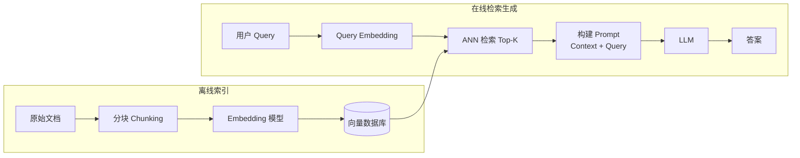

# RAG 检索增强生成

---

## 速览
- RAG = 检索增强生成，先从向量库召回相关文档，再拼入 Prompt 让 LLM 生成，解决知识截止和幻觉问题。
- 三代演进：Naive RAG（切块→检索→生成）→ Advanced RAG（加查询改写/重排序）→ Modular RAG（模块可插拔）。
- 分块（Chunking）是 RAG 质量的基础：Chunk 太小语义缺失，太大引入噪声，推荐 256~512 token，10~20% 重叠。
- Embedding 向量检索：Bi-encoder 快但粗糙，Cross-encoder 精准但慢，生产常用 HNSW 做 ANN。
- 混合检索 = BM25（关键词）+ Dense（语义）+ RRF 融合，比单一检索准确率显著更高。
- HyDE：先让 LLM 生成假答案，再用假答案的向量去检索，解决 query 和 document 表述不一致问题。
- RAG vs Fine-tuning：知识更新频繁/需溯源用 RAG；风格输出/领域推理用 Fine-tuning；两者可组合。
- RAGAS 四大指标：Faithfulness（忠于 context）/ Answer Relevancy / Context Recall / Context Precision。

---

## RAG 整体架构

> **一句话理解：** RAG = 检索增强生成，先从外部知识库召回相关文档，再把文档塞进 prompt 让 LLM 生成答案，解决 LLM 知识截止和幻觉问题。

**核心结论（可背）：**
```
三代 RAG 演进：
  Naive RAG：切块 → Embed → 存向量库 → 检索 Top-K → 塞 Prompt → 生成
  Advanced RAG：加查询改写 / 重排序 / 混合检索，解决召回质量问题
  Modular RAG：各模块可插拔，检索/生成/路由/记忆可自由组合

RAG 解决的核心问题：
  ① 知识截止（LLM 训练数据有时效）
  ② 幻觉（LLM 编造不存在的事实）
  ③ 私有数据访问（企业内部文档）
  ④ 可溯源（答案可追踪到原始文档）
```

| 对比维度 | Naive RAG | Advanced RAG |
|---|---|---|
| 查询处理 | 原始 query 直接检索 | 查询改写 / HyDE / 多路召回 |
| 检索方式 | 纯向量相似度 | BM25 + Dense 混合 + Re-rank |
| 上下文处理 | Top-K 直接拼接 | 过滤 / 压缩 / 重排后拼接 |
| 主要痛点 | 召回不准、上下文冗余 | 复杂度高、延迟增加 |

**机制解释：**
```
离线（Indexing）阶段：
  原始文档 → 清洗 → 分块（Chunking）→ Embedding → 向量数据库

在线（Retrieval + Generation）阶段：
  用户 Query → Embedding → ANN 检索 Top-K → 拼接 Context
  → [System Prompt + Context + Query] → LLM → 输出答案

关键参数：
  Chunk Size：太小 → 语义不完整；太大 → 引入噪声，推荐 256~512 token
  Top-K：通常 3~5，太多稀释相关性，太少可能漏掉关键信息
  Overlap：块间重叠 10~20%，防止语义在边界截断
```



**面试官常问：**
```
Q: RAG 和 Fine-tuning 怎么选？
A: 知识更新频繁、需要溯源 → RAG；特定风格/格式输出、领域推理能力不足 → Fine-tuning；两者不互斥可组合。

Q: RAG 最常见的失败原因？
A: 检索阶段：语义匹配不准（query 和文档表述差异）、Chunk 切割破坏语义；
   生成阶段：Context 太长 LLM 忽略中间内容（Lost in the Middle）；
   数据问题：原始文档质量差、未去重。

Q: 如何评估 RAG 系统质量？
A: 检索质量：Context Recall、Context Precision；生成质量：Faithfulness、Answer Relevancy；工具：RAGAS。
```

**易错点：**
- ❌ Top-K 越大越好 → ✅ 过多噪声文档干扰 LLM，占用 context window，通常 3~5 最优
- ❌ RAG 能解决所有幻觉 → ✅ 只能减轻，LLM 仍可能忽略 context 自行发挥
- ❌ 通用 Embedding 模型就够 → ✅ 专业领域（医疗/法律/代码）需领域微调的 Embedding 模型

**面试30秒回答：**
> RAG 核心是两阶段：离线把文档切块、向量化存入数据库；在线把 query 向量化，检索 Top-K 相关块拼入 prompt 让 LLM 生成。它解决了 LLM 知识截止和幻觉问题，适合知识更新频繁或需要引用私有数据的场景。最常见失败点在检索质量不够准，可用混合检索加重排序优化。

---

## 文档分块策略（Chunking）

> **一句话理解：** 分块是 RAG 质量的地基——块太小语义残缺，块太大引入噪声，正确的分块策略直接决定检索准确率。

**核心结论（可背）：**
| 策略 | 原理 | 优点 | 缺点 | 适用场景 |
|---|---|---|---|---|
| 固定大小（Fixed-size） | 按 token 数切割，设 overlap | 简单、稳定 | 可能切断句子/段落 | 通用入门 |
| 语义分块（Semantic） | 在语义边界（句号/段落）切割 | 语义完整 | 块大小不均 | 长文档、结构化文章 |
| 递归切割（Recursive） | 按 \n\n → \n → 句子 → 词 依次尝试 | 兼顾结构和语义 | 稍复杂 | 大多数场景（推荐） |
| 父子分块（Parent-Child） | 小块检索 + 大块作为上下文 | 精准召回 + 完整上下文 | 存储双倍 | 复杂问答 |
| 层次分块（Hierarchical） | 文档→章节→段落→句子 多粒度 | 多级检索 | 实现复杂 | 长结构文档（报告/手册） |

**机制解释：**
```
推荐参数（经验值）：
  Chunk Size：256~512 token（GPT-4 context 大可适当放大到 1024）
  Overlap：10~20%（约 50~100 token），防止关键信息在边界被截断

父子分块（Small-to-Big）原理：
  - 索引：将文档切成小块（128 token）建立向量索引
  - 检索：用小块做相似度检索（精准定位）
  - 生成：取小块的父块（512 token）作为 LLM 输入（上下文完整）
  - 好处：检索精度 + 生成质量两全

LangChain 推荐：RecursiveCharacterTextSplitter
  优先按 ["\n\n", "\n", " ", ""] 顺序分割，保留结构
```

**面试官常问：**
```
Q: Chunk Size 怎么选？
A: 取决于 Embedding 模型最大输入长度和 LLM context 窗口大小。
   通用建议：256~512 token + 10~20% overlap。
   对于代码或表格，按代码块/行分割更合理，不要硬切。

Q: 为什么需要 overlap？
A: 防止关键信息被切割在两个块之间的边界。例如：答案的前半句在 chunk_n 末尾，
   后半句在 chunk_n+1 开头，没有 overlap 就两块都检索不到完整信息。
```

**易错点：**
- ❌ Chunk 越小检索越精准 → ✅ 过小导致语义缺失，LLM 得到的是碎片而非完整信息
- ❌ 所有文档用同一策略 → ✅ 代码用代码块切割，表格不要切割，Markdown 按标题层级切割

**面试30秒回答：**
> 分块策略直接影响 RAG 检索质量。最常用的是 RecursiveCharacterTextSplitter，按段落→句子→词依次分割，保留语义完整性。推荐 256~512 token、10~20% 重叠。进阶做法是父子分块：小块做检索定位，取父块作为 LLM 上下文，同时保证精准召回和上下文完整。

---

## Embedding 与向量检索

> **一句话理解：** Embedding 把文本映射到向量空间，向量检索用 ANN（近似最近邻）在毫秒内从百万文档中找最相关的块，是 RAG 的核心引擎。

**核心结论（可背）：**
| 对比项 | 说明 |
|---|---|
| Bi-encoder | Query 和 Doc 各自独立 Embed，点积/余弦相似度打分，速度快（用于召回） |
| Cross-encoder | Query + Doc 拼接后输入模型，精度高但慢（用于 Re-rank） |
| ANN 算法 | HNSW（召回率/速度最优）、IVF-PQ（内存效率高）、ScaNN（Google） |

**常用 Embedding 模型：**
| 模型 | 特点 |
|---|---|
| text-embedding-3-small/large | OpenAI，闭源，通用强，按 token 收费 |
| BGE-M3 | 开源，多语言，支持稀疏+密集双模式 |
| E5-mistral-7b | 开源，指令微调，综合能力强 |
| Cohere Embed v3 | 闭源，多语言，支持 int8 量化 |

**机制解释：**
```
向量数据库核心操作：
  1. 插入：文本 → Embedding → 存储向量 + 原文
  2. 检索：Query → Embedding → ANN 搜索 Top-K → 返回原文

相似度计算：
  余弦相似度 = (A·B) / (|A| × |B|)
  → 对长度不敏感，文本 Embedding 推荐用余弦相似度或内积（归一化后等价）

HNSW（Hierarchical Navigable Small World）：
  - 分层图结构，上层稀疏（长跳），下层密集（短跳）
  - 查询：从最高层出发，逐层下降找近邻
  - 性能：召回率 >95%，查询 <10ms，但内存占用高

向量数据库对比：
  Pinecone：全托管，易用，生产首选
  Milvus：开源，功能全，自托管
  Chroma：轻量，本地开发快速原型
  pgvector：PostgreSQL 插件，已有 PG 的场景
```

**面试官常问：**
```
Q: 为什么用余弦相似度而不是欧氏距离？
A: 余弦相似度只关注方向（语义），不关注向量长度（受文本长度影响）。
   文本 Embedding 经归一化后欧氏距离和余弦相似度等价，但余弦更直观。

Q: Embedding 模型怎么选？
A: 开源首选 BGE-M3（多语言强，支持混合检索）；
   有预算用 OpenAI text-embedding-3-large；专业领域建议在开源模型上微调。
```

**易错点：**
- ❌ 向量检索就是精确匹配 → ✅ ANN 是近似搜索，可能漏掉部分相关结果（换取速度）
- ❌ 一个 Embedding 模型适合所有场景 → ✅ 代码、法律、医疗等领域需领域微调模型，通用模型语义空间对齐差

**面试30秒回答：**
> Embedding 把文本转成向量，向量数据库用 HNSW 等 ANN 算法在毫秒内从百万文档中找最相似的 Top-K 块。Bi-encoder 快（用于召回），Cross-encoder 精准但慢（用于重排序）。选 Embedding 模型时，开源用 BGE-M3，需要最好效果用 OpenAI text-embedding-3-large，专业领域要考虑微调。

---

## 混合检索与重排序

> **一句话理解：** BM25（关键词）擅长精确词匹配，Dense（语义）擅长同义词泛化，混合两者再用 Cross-encoder 重排序，是目前 RAG 检索质量最优方案。

**核心结论（可背）：**
```
两阶段检索流程：
  阶段1（召回）：BM25 + Dense 混合，用 RRF 融合分数，召回 Top-50~100
  阶段2（精排）：Cross-encoder 对 Top-50 重排序，取最终 Top-K

RRF（Reciprocal Rank Fusion）融合公式：
  score(d) = Σ 1 / (k + rank_i(d))
  k=60（默认），rank_i 是文档 d 在第 i 路检索结果中的排名
  无需调权重，简单有效
```

| 检索方式 | 原理 | 擅长 | 劣势 |
|---|---|---|---|
| BM25（稀疏） | TF-IDF 变体，关键词匹配 | 精确词汇、专有名词、代码、缩写 | 无法理解同义词 |
| Dense（密集） | 向量语义相似度 | 同义词、语义理解、跨语言 | 精确词汇匹配差 |
| Hybrid | BM25 + Dense + RRF | 两者优点结合 | 延迟略增，需多路检索 |
| Re-ranking | Cross-encoder 精排 | 最高精度 | 慢（逐对打分） |

**机制解释：**
```
为什么需要 Re-ranking：
  Bi-encoder 召回：Query 和 Doc 分别编码，无法看到彼此，语义理解有限
  Cross-encoder 重排：(Query + Doc) 拼接输入，模型完整看到两者关系，精度更高
  → 两阶段：快速召回（Bi-encoder）+ 精准排序（Cross-encoder）

常用 Re-ranker：
  Cohere Rerank：闭源 API，效果好
  BGE-reranker-v2：开源，中英文强
  FlashRank：轻量，低延迟
  ColBERT：token 级交互，速度和精度均衡
```

**面试官常问：**
```
Q: BM25 和 Dense 检索各自适合什么场景？
A: BM25 擅长精确词匹配，适合专有名词、产品代码、缩写（如"GPT-4o"）；
   Dense 擅长语义理解，适合用不同词汇描述相同概念。
   生产环境推荐混合使用，不要单一依赖。

Q: RRF 为什么不需要调权重？
A: RRF 只用排名（rank）而非原始分数，不同检索方式的分数量纲不同难以对齐。
   用倒数排名融合规避了分数校准问题，实际效果经常优于加权融合。
```

**易错点：**
- ❌ Dense 检索就够了 → ✅ Dense 对精确关键词（缩写、产品型号）匹配差，BM25 补充很重要
- ❌ Re-ranking 太慢不值得 → ✅ 只对召回的 Top-50 重排，延迟通常 <100ms，对最终精度提升显著

**面试30秒回答：**
> 混合检索是目前 RAG 召回质量最优方案：BM25 负责关键词精确匹配，Dense 负责语义相似度，用 RRF 公式融合两路排名分数，无需调权重。再加 Cross-encoder 重排序——把召回的 Top-50 逐对精排，取最终 Top-5。代价是延迟略增，但精度提升显著，生产环境值得投入。

---

## 查询优化

> **一句话理解：** 用户的原始 query 往往不是最佳检索词，查询优化在检索前对 query 进行改写、扩展或假设生成，显著提升召回质量。

**核心结论（可背）：**
| 技术 | 原理 | 适用问题 | 典型代价 |
|---|---|---|---|
| Query Rewriting | LLM 改写 query，更适合检索 | 口语化/模糊 query | +1 次 LLM 调用 |
| HyDE | 生成假答案，用假答案向量检索 | query/doc 表述差异大 | +1 次 LLM 调用 |
| Step-back Prompting | 抽象为更高层问题再检索 | 具体问题需要背景知识 | +1 次 LLM 调用 |
| Multi-query | 生成多个 query 变体，取并集 | 多维度复杂问题 | +1 次 LLM + 多次检索 |
| Sub-query | 将复杂问题拆解为子问题 | 多跳推理问题 | 最高代价，效果最好 |

**机制解释：**
```
HyDE（Hypothetical Document Embeddings）核心思路：
  问题：用户问"什么是 RAG？"，其向量和文档"RAG 是检索增强生成..."的向量
         在语义空间中距离较远（问句 vs 陈述句）
  解法：让 LLM 先生成一个假答案"RAG 是一种..."，用假答案的向量去检索
         假答案向量更接近文档空间，召回更准确

Multi-query 流程：
  原始 query → LLM 生成 3~5 个变体 query → 各自检索 → 去重合并 → 重排
  好处：覆盖不同角度，降低单一 query 误差

Sub-query 流程（适合多跳推理）：
  "A 公司 CEO 的毕业院校是哪里？"
  → 子问题1：A 公司 CEO 是谁？
  → 子问题2：[NAME] 的毕业院校是哪里？
  → 依次检索回答，组合最终答案
```

**面试官常问：**
```
Q: HyDE 有什么缺点？
A: 如果 LLM 生成的假答案本身有幻觉，假答案向量会把检索引向错误方向。
   适合 LLM 对领域有一定了解的场景，对完全陌生领域效果不稳定。

Q: 什么时候用 Multi-query，什么时候用 Sub-query？
A: Multi-query：问题本身清晰，只是表述不唯一时（同义变体）。
   Sub-query：问题需要多步推理，一次检索无法获取所有信息时。
```

**易错点：**
- ❌ 查询优化总是有帮助的 → ✅ 简单直接的 query 优化反而引入噪声，增加延迟；只在召回质量差时加
- ❌ HyDE 的假答案一定比原始 query 好 → ✅ LLM 生成的假答案可能有幻觉，导致检索方向偏移

**面试30秒回答：**
> 查询优化的核心问题是：用户原始 query 和文档的表述风格不同，导致向量距离大。HyDE 是最常用方案——让 LLM 先生成一个假答案，用假答案的向量去检索，因为假答案语言风格更接近文档。Multi-query 生成多个 query 变体取并集，适合模糊复杂的问题。注意这些方法都会增加延迟，只在召回质量不足时引入。

---

## RAG vs Fine-tuning

> **一句话理解：** RAG 注入外部知识（动态、可溯源），Fine-tuning 改变模型行为（输出风格、领域推理），两者解决不同问题，可以组合使用。

**核心结论（可背）：**
| 维度 | RAG | Fine-tuning |
|---|---|---|
| 解决的问题 | 知识注入、时效性、私有数据 | 输出风格、格式、领域推理能力 |
| 知识更新 | 实时（更新向量库即可） | 需要重新训练，成本高 |
| 可溯源性 | ✅ 答案可追踪到原始文档 | ❌ 知识烤进权重，无法溯源 |
| 成本 | 检索成本，无训练成本 | 训练成本高（GPU 时间） |
| 幻觉风险 | 较低（有 context 约束） | 较高（依赖训练数据） |
| 延迟 | 增加检索延迟（50~200ms） | 无额外延迟 |
| 适用场景 | FAQ、企业知识库、文档问答 | 特定语气、代码生成、分类任务 |

**机制解释：**
```
决策框架（按优先级判断）：
  1. 数据频繁更新？→ RAG（Fine-tuning 数据会过期）
  2. 需要引用溯源？→ RAG
  3. 领域推理能力差（不是知识缺失）？→ Fine-tuning
  4. 特定输出格式/风格？→ Fine-tuning
  5. 两者都需要？→ 组合：Fine-tune 行为 + RAG 补充知识

常见组合模式：
  企业知识库：RAG（动态文档）+ 少量 SFT（规范回答格式）
  代码助手：Fine-tuning（代码风格）+ RAG（最新 API 文档）
  客服机器人：Fine-tuning（语气/品牌声音）+ RAG（产品知识库）

经验法则：
  先用 RAG，快速验证价值 → 再考虑 Fine-tuning 优化边界效果
```

**面试官常问：**
```
Q: 知识更新频繁时为什么不用 Fine-tuning？
A: Fine-tuning 需要重新训练（成本高、周期长）；而 RAG 只需更新向量数据库，
   可以做到实时或每日更新，新知识立即可用。

Q: Fine-tuning 之后还需要 RAG 吗？
A: 通常需要。Fine-tuning 解决的是"模型怎么回答"（风格/格式/推理），
   RAG 解决的是"模型知道什么"（知识），两者不是替代关系。
```

**易错点：**
- ❌ Fine-tuning 让模型"记住"所有私有数据 → ✅ Fine-tuning 容易遗忘，且数据更新需重训；私有知识库用 RAG
- ❌ RAG 一定比 Fine-tuning 便宜 → ✅ 大规模高频检索的向量检索成本也不低，需综合评估

**面试30秒回答：**
> RAG 和 Fine-tuning 解决不同问题：RAG 负责知识注入，适合数据频繁更新、需要溯源的场景，实时更新向量库即可；Fine-tuning 改变模型行为，适合固定的输出风格、格式或领域推理能力提升。实际项目中通常组合使用：Fine-tuning 定义"怎么说"，RAG 补充"说什么"。优先用 RAG 快速验证，再考虑 Fine-tuning 突破瓶颈。

---

## RAG 评估（RAGAS）

> **一句话理解：** RAGAS 用四个指标自动评估 RAG 系统质量——Faithfulness 查幻觉，Answer Relevancy 查答非所问，Context Recall/Precision 查检索质量。

**核心结论（可背）：**
| 指标 | 评估的是 | 计算方法 | 需要 Ground Truth |
|---|---|---|---|
| Faithfulness | 答案是否完全基于 context（反幻觉） | 原子声明中有 context 支持的比例 | ❌ |
| Answer Relevancy | 答案是否回答了问题（反答非所问） | 反向生成问题与原问题的相似度 | ❌ |
| Context Recall | 检索是否找到了所有必要信息 | ground truth 语句被 context 覆盖的比例 | ✅ |
| Context Precision | 检索结果是否精准（无冗余） | 有用 chunk 在 Top-K 中的比例 | ✅ |

**机制解释：**
```
Faithfulness 计算（核心反幻觉指标）：
  1. 将 LLM 答案拆分为原子事实声明（atomic claims）
  2. 用 LLM 判断每个声明是否有 context 支撑
  3. Faithfulness = 有支撑的声明数 / 总声明数
  → 分数低 = LLM 在编造 context 中没有的信息

Answer Relevancy 计算：
  1. 用 LLM 根据答案反向生成几个可能的问题
  2. 计算这些反向问题与原始问题的 Embedding 余弦相似度
  3. 相似度低 = 答案跑题

LLM-as-Judge 在 RAGAS 中的应用：
  所有指标都用 LLM 作为评估器，不需要人工标注
  → 代价：评估本身有 LLM 的偏差，需用强模型（GPT-4o）

评估体系分层：
  无需 GT：Faithfulness + Answer Relevancy（快速迭代）
  需要 GT：Context Recall + Context Precision + Answer Correctness（完整评估）
```

**面试官常问：**
```
Q: 如果 Faithfulness 低但 Answer Relevancy 高，说明什么问题？
A: 说明答案回答了问题，但包含了 context 中没有的信息（幻觉）。
   LLM 在"发挥"，需要加强 prompt 约束（"只能基于提供的文档回答"）或改进检索质量。

Q: Context Recall 和 Context Precision 分别优化什么？
A: Recall 低：检索漏掉了必要信息 → 优化召回（增大 Top-K、混合检索）
   Precision 低：检索引入了太多无关 chunk → 优化精排（加 Re-ranking、减小 Top-K）
```

**易错点：**
- ❌ Faithfulness 高就代表 RAG 效果好 → ✅ 还需检查 Answer Relevancy（不答非所问）和 Context Recall（检索完整性）
- ❌ RAGAS 评估不需要强 LLM → ✅ RAGAS 用 LLM 作裁判，若用弱模型判断会不准，推荐 GPT-4o 或 Claude 3.5

**面试30秒回答：**
> RAGAS 是 RAG 系统的自动评估框架，四个核心指标：Faithfulness（答案忠于 context，反幻觉）、Answer Relevancy（答案回答了问题）、Context Recall（检索找到了所有必要信息）、Context Precision（检索没引入冗余噪声）。前两个不需要 Ground Truth，适合快速迭代；后两个需要 GT，用于完整评估。都用 LLM 作为裁判，推荐 GPT-4o。

---

## 面试高频考点汇总
| 考点 | 核心答案 |
|---|---|
| RAG 解决什么问题？ | 知识截止、幻觉、私有数据访问、答案可溯源 |
| Naive RAG vs Advanced RAG？ | Naive：直接检索；Advanced：加查询改写/混合检索/重排序，解决召回质量 |
| Chunk Size 怎么选？ | 256~512 token + 10~20% overlap，用 RecursiveCharacterTextSplitter，代码按块切 |
| 为什么用混合检索？ | BM25 精确词匹配 + Dense 语义理解，RRF 融合，互补提升召回率 |
| HyDE 是什么？ | 先生成假答案，用假答案向量检索，解决 query/doc 表述空间不一致问题 |
| RAG vs Fine-tuning 怎么选？ | 数据动态/需溯源→RAG；风格/推理能力→Fine-tuning；通常组合使用 |
| Faithfulness 低怎么办？ | 加强 prompt 约束 + 改进检索质量 + 减少 Top-K 噪声 |
| Context Recall 低怎么办？ | 增大 Top-K、加混合检索、优化 Chunk 策略 |
| Re-ranking 为什么能提升质量？ | Cross-encoder 同时看 query+doc，比 bi-encoder 理解更深，但慢，用于精排 |
| RAG 评估用什么框架？ | RAGAS：Faithfulness/Answer Relevancy（无需GT）+ Context Recall/Precision（需GT） |
