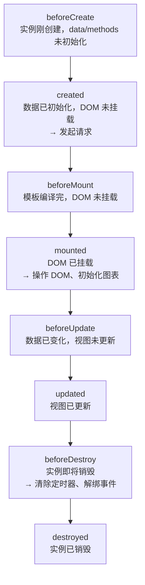

# Vue

---

## 速览

- Vue = MVVM 框架，Model 驱动 View，View 操作通过 ViewModel 双向同步。
- v-show vs v-if：show 切换 CSS display（保留 DOM），if 真正销毁/重建 DOM。
- 双向绑定：Vue2 用 Object.defineProperty（无法监听新增属性/数组索引），Vue3 改用 Proxy（全量拦截）。
- computed（有缓存，依赖不变不重算）vs watch（无缓存，监听变化执行副作用）。
- 生命周期 10 阶段：beforeCreate → created → beforeMount → mounted → beforeUpdate → updated → beforeDestroy → destroyed（+ activated/deactivated）。
- 组件通信 5 方式：props/emit、provide/inject、EventBus、$attrs/$listeners、Vuex。
- Vue Router：hash 模式（#，兼容性好）vs history 模式（pushState，需服务端配合）。
- Vuex = state + getters + mutations（同步）+ actions（异步）+ modules。
- Vue3 vs Vue2：Proxy 响应式、Composition API、树摇、多根节点、setup 代替 beforeCreate/created。

---

## MVVM 架构

> **一句话理解：** Model 是数据，View 是界面，ViewModel 是中间桥梁——数据变化自动更新视图，视图操作自动同步数据。

**核心结论（可背）：**
```
Model（数据层）
    ↕  双向绑定
ViewModel（Vue 实例）
  - 数据观测（Observer）
  - 模板编译（Compiler）
  - 虚拟 DOM Diff
    ↕  DOM 操作
View（视图层）
```

**MVC vs MVVM 区别：**
| 架构 | 特点 | 问题 |
|---|---|---|
| MVC | Controller 手动更新 View | Controller 臃肿，View/Model 耦合 |
| MVVM | ViewModel 自动双向绑定 | 引入框架开销，调试困难 |

---

## v-show vs v-if

> **一句话理解：** v-if 是真正的条件渲染（DOM 增删），v-show 只切换 CSS（保留 DOM）。

**核心结论（可背）：**
| 维度 | `v-if` | `v-show` |
|---|---|---|
| 实现方式 | DOM 节点真实创建/销毁 | 切换 `display: none` |
| 初始开销 | 低（false 时不渲染） | 高（无论条件都先渲染） |
| 切换开销 | 高（每次都销毁/重建） | 低（只改 CSS 属性） |
| 适用场景 | 条件很少改变 | 频繁切换显示/隐藏 |

**v-if + v-for 不建议同用：**
```
v-for 优先级高于 v-if（Vue2）
→ 每个循环项都需要执行 v-if 判断，性能浪费
→ 正确做法：先用 computed 过滤数组，再用 v-for 渲染
```

---

## 双向数据绑定

> **一句话理解：** Vue2 通过 Object.defineProperty 劫持属性的 getter/setter；Vue3 用 Proxy 代理整个对象，能监听新增/删除/数组索引变化。

**核心结论（可背）：**
```javascript
// Vue2：Object.defineProperty（逐属性劫持）
Object.defineProperty(obj, 'name', {
  get() { /* 依赖收集（dep.depend()） */ return val; },
  set(newVal) { val = newVal; /* 通知更新（dep.notify()） */ }
})
// 缺点：无法检测属性新增/删除；无法监听数组索引变化

// Vue3：Proxy（代理整个对象）
const proxy = new Proxy(obj, {
  get(target, key) { track(target, key); return target[key]; },
  set(target, key, val) { target[key] = val; trigger(target, key); return true; },
  deleteProperty(target, key) { delete target[key]; trigger(target, key); return true; }
})
// 优点：自动深度响应，监听新增/删除属性，监听数组所有操作
```

**Vue2 局限性：**
```
❌ this.obj.newProp = 'x'    // 不响应，需用 Vue.set(obj, 'newProp', 'x')
❌ this.arr[0] = 'x'        // 不响应，需用 Vue.set(arr, 0, 'x') 或 splice
❌ delete this.obj.prop     // 不响应，需用 Vue.delete(obj, 'prop')
```

---

## computed vs watch

> **一句话理解：** computed 是有缓存的派生数据（依赖不变就不重算），watch 是监听变化执行副作用（无缓存，每次变化都执行）。

**核心结论（可背）：**
| 维度 | `computed` | `watch` |
|---|---|---|
| 缓存 | ✅ 有缓存，依赖不变不重新计算 | ❌ 无缓存，每次变化都执行 |
| 返回值 | 有返回值（用于模板渲染） | 无返回值（执行副作用） |
| 适用场景 | 从已有数据派生新数据 | 数据变化时请求接口、触发动画 |
| 异步支持 | ❌ 不支持异步 | ✅ 支持异步 |

```javascript
// computed：计算全名（有缓存）
computed: {
  fullName() { return this.first + ' ' + this.last; }
}

// watch：监听 userId 变化后请求数据
watch: {
  userId: {
    handler(newVal) { this.fetchUser(newVal); },
    immediate: true  // 立即执行一次
  }
}
```

---

## 生命周期

> **一句话理解：** Vue 组件从创建到销毁经历 10 个钩子，核心是 created（数据就绪）和 mounted（DOM 就绪）。

**核心结论（可背）：**


| 钩子 | 适合做的事 |
|---|---|
| `created` | 发起数据请求（data 已可用，DOM 未挂载） |
| `mounted` | 操作 DOM、初始化第三方库（DOM 已挂载） |
| `beforeDestroy` | 清除定时器、取消订阅、解绑事件 |

**keep-alive 独有钩子：**
```
activated   → 组件被激活时（从缓存中恢复）
deactivated → 组件被停用时（隐藏到缓存）
```

---

## 组件通信

> **一句话理解：** 父子用 props/emit，跨层级用 provide/inject，兄弟用 EventBus，全局状态用 Vuex。

**核心结论（可背）：**
| 场景 | 方式 | 说明 |
|---|---|---|
| 父 → 子 | `props` | 父传值，子只读 |
| 子 → 父 | `$emit` | 子触发事件，父监听 |
| 跨层级 | `provide / inject` | 祖先提供，后代注入（非响应式） |
| 兄弟组件 | `EventBus` | 全局事件总线（小型项目） |
| 全局状态 | `Vuex / Pinia` | 统一状态管理（中大型项目） |
| 访问实例 | `$parent / $children / $refs` | 直接访问，慎用 |

```javascript
// EventBus 实现
const bus = new Vue();
// 发送事件
bus.$emit('update', { data: 'xxx' });
// 监听事件
bus.$on('update', (data) => { console.log(data); });
// 卸载时取消监听（防内存泄漏）
bus.$off('update');
```

---

## Vue Router

> **一句话理解：** hash 模式用 `#` 分割路由（兼容性好，不需要服务端），history 模式用 pushState（URL 干净，需服务端配合处理 404）。

**核心结论（可背）：**
| 维度 | Hash 模式（`#`） | History 模式 |
|---|---|---|
| URL 样式 | `example.com/#/user/1` | `example.com/user/1` |
| 原理 | `window.location.hash` + `hashchange` 事件 | `history.pushState/replaceState` + `popstate` 事件 |
| 服务端配合 | ❌ 不需要（`#` 后不发送到服务器） | ✅ 需要（刷新时服务器需返回 index.html） |
| SEO | 差（`#` 后内容搜索引擎不识别） | 好（标准 URL） |

```javascript
const router = new VueRouter({
  mode: 'history',  // 或 'hash'
  routes: [
    { path: '/user/:id', component: User },
    { path: '*', redirect: '/404' }  // 兜底重定向
  ]
})
```

**面试官常问：**
- history 模式刷新 404 怎么解决？→ nginx 配置 `try_files $uri /index.html`，让所有路由都返回 index.html，再由前端路由匹配。

---

## Vuex

> **一句话理解：** Vuex = 集中式状态管理，state 存数据，getters 计算数据，mutations 同步改数据，actions 异步操作，modules 分模块。

**核心结论（可背）：**
| 概念 | 类比 | 说明 |
|---|---|---|
| `state` | data | 存储数据，唯一数据源 |
| `getters` | computed | 派生状态，有缓存 |
| `mutations` | 同步方法 | 唯一修改 state 的方式（必须同步） |
| `actions` | 异步方法 | 提交 mutation，可包含异步操作 |
| `modules` | 模块拆分 | 大型应用按功能拆分 store |

```javascript
// 数据流向：View → dispatch(action) → commit(mutation) → state → View
store.dispatch('fetchUser')      // 触发异步 action
store.commit('setUser', user)    // 直接提交 mutation（同步）
store.state.user                 // 读取状态
store.getters.userName           // 读取派生数据
```

**Flux 单向数据流原则：**
```
View → Action → Dispatcher → Store → View
mutation 必须同步 → 便于 devtools 追踪每次状态变化
action 可异步 → 异步操作完成后再 commit mutation
```

---

## 虚拟 DOM & Diff 算法

> **一句话理解：** 虚拟 DOM 是用 JS 对象描述 DOM 树，数据变化时先 diff 两棵虚拟树，只把差异批量更新到真实 DOM。

**核心结论（可背）：**
```
数据改变 → 生成新虚拟 DOM → Diff 算法计算差异 → 生成 patch → 更新真实 DOM

虚拟 DOM 对象：
{
  tag: 'div',
  props: { id: 'app' },
  children: [
    { tag: 'p', props: {}, children: ['hello'] }
  ]
}
```

**Diff 算法三个优化策略：**
```
① 只比较同层级节点（不跨层比较）→ 时间复杂度 O(n)
② 标签不同直接删除替换（不深度比较）
③ 同层级用 key 标识 → React/Vue 通过 key 判断是移动还是重建节点
```

**key 的作用：**
```
没有 key：列表重排时全部重新渲染
有 key：通过 key 复用已有节点，只移动位置，性能大幅提升
❌ 不要用 index 作为 key → 增删时 index 变化，diff 失效
```

---

## Vue3 vs Vue2

> **一句话理解：** Vue3 用 Proxy 替代 defineProperty，用 Composition API 替代 Options API，更好支持 TypeScript 和树摇。

**核心结论（可背）：**
| 特性 | Vue2 | Vue3 |
|---|---|---|
| 响应式原理 | `Object.defineProperty`（无法监听新增属性/数组） | `Proxy`（全量拦截，监听新增/删除/数组） |
| 组件 API | Options API（data/methods/computed 分组） | Composition API（按功能逻辑组织） |
| TypeScript | 支持有限 | 原生 TS 重写，完全支持 |
| 模板根节点 | 只能有一个根节点 | 支持多根节点（Fragment） |
| 生命周期 | `beforeCreate / created` | 被 `setup()` 替代 |
| 状态管理 | `new Vuex.Store()` | `createStore()` |
| 打包体积 | 全量引入 | 支持 Tree-Shaking |

**Composition API vs Options API：**
```javascript
// Options API（Vue2 风格）
export default {
  data() { return { count: 0 }; },
  methods: { increment() { this.count++; } },
  computed: { double() { return this.count * 2; } }
}

// Composition API（Vue3 风格）
import { ref, computed } from 'vue';
export default {
  setup() {
    const count = ref(0);
    const double = computed(() => count.value * 2);
    const increment = () => count.value++;
    return { count, double, increment };
  }
}
```

**为什么 Proxy 替代 defineProperty：**
```
defineProperty 缺陷：
  ❌ 无法监听属性新增/删除（需 Vue.set/Vue.delete）
  ❌ 无法监听数组索引变化（通过重写 push/pop 等 7 个方法绕过）
  ❌ 嵌套对象需递归监听（初始化开销大）

Proxy 优势：
  ✅ 代理整个对象，自动监听所有操作（get/set/has/deleteProperty）
  ✅ 懒递归（访问到嵌套属性时才代理），初始化更快
  ✅ 完整的数组监听能力
```

---

## 面试高频考点汇总

| 考点 | 核心答案 |
|---|---|
| MVVM 和 MVC 的区别？ | MVC 需手动更新 View；MVVM 通过 ViewModel 双向自动绑定，消除了 Controller 臃肿 |
| v-show vs v-if？ | v-if 销毁/重建 DOM（切换成本高）；v-show 切换 CSS（初始成本高），频繁切换用 v-show |
| Vue2 为什么监听不到数组索引？ | defineProperty 只能劫持已有属性，无法监听赋值给新索引的操作；Vue 重写了 push/pop 等 7 个方法 |
| computed 和 watch 的区别？ | computed 有缓存，用于派生数据；watch 无缓存，用于副作用（如请求、动画） |
| 父子组件通信方式？ | 父→子：props；子→父：$emit；跨层：provide/inject；全局：Vuex |
| hash 模式 vs history 模式？ | hash 不需服务端配合但 SEO 差；history URL 干净需服务端配合（刷新需 nginx 配置） |
| Vue3 为什么用 Proxy？ | defineProperty 无法监听属性新增/删除/数组索引，Proxy 全量拦截且支持懒代理 |
| Composition API 的优势？ | 按逻辑功能聚合代码（而不是 data/methods 分散），便于复用和 TS 类型推断 |
| Diff 算法优化？ | 只比同层（O(n)）、标签不同直接删、同层用 key 标识复用 |
| Vuex mutation 为什么必须同步？ | 便于 devtools 追踪每次状态快照，异步操作需放在 action 中 |
