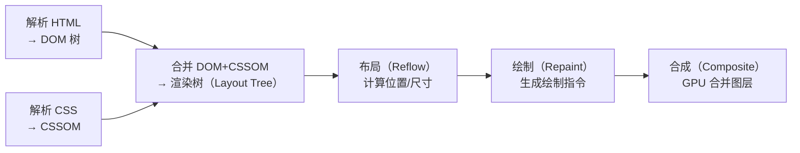
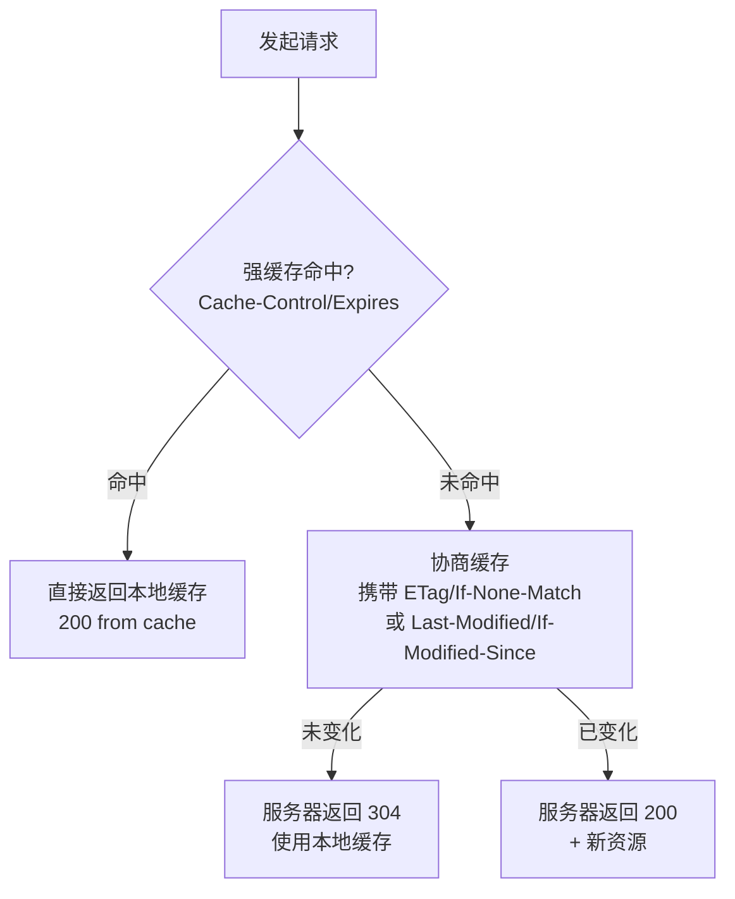

# 浏览器与网络

---

## 速览

- 浏览器多进程架构：主进程 + 网络进程 + GPU 进程 + 渲染进程（每个 Tab 独立，沙箱隔离）。
- 渲染进程多线程：GUI 渲染线程与 JS 引擎线程互斥（JS 执行时 GUI 暂停）。
- 事件循环：同步代码 → 清空微任务（Promise/MutationObserver）→ 执行一个宏任务（setTimeout/setInterval）→ 循环。
- 跨域解决方案：CORS（服务端设置响应头）、代理（开发环境）、JSONP（只支持 GET）。
- 输入 URL → DNS 解析 → TCP 三次握手 → HTTP 请求 → 服务器响应 → 浏览器渲染 → TCP 四次挥手。
- HTTP 缓存：强缓存（Cache-Control/Expires，不过服务器）→ 协商缓存（ETag/Last-Modified，过服务器返回 304）。
- HTTP/2：二进制分帧 + 多路复用 + 头部压缩 + 服务器推送。
- 浏览器存储：Cookie（4KB，自动携带）→ localStorage（5MB，持久）→ sessionStorage（5MB，会话）→ IndexedDB（大容量，异步）。

---

## 浏览器多进程架构

> **一句话理解：** 多进程架构让每个 Tab 独立运行，一个页面崩溃不影响其他页面，沙箱隔离保证安全性。

**核心结论（可背）：**
| 进程 | 职责 |
|---|---|
| 浏览器主进程 | 控制页面创建/销毁、网络资源管理、下载 |
| 网络进程 | 负责网络资源加载（从主进程独立） |
| GPU 进程 | 3D 绘制、GPU 加速合成（最多一个） |
| 渲染进程 | 每个 Tab 一个，负责 HTML/CSS/JS 渲染（沙箱保护） |
| 插件进程 | 每种插件一个，隔离崩溃 |

**渲染进程内部线程（核心）：**
```
GUI 渲染线程    → 解析 HTML/CSS，构建 DOM/CSSOM/渲染树，负责重绘重排
JS 引擎线程     → 解析执行 JS（V8），与 GUI 线程互斥！！
定时触发线程    → 独立计时，setTimeout/setInterval 到期后通知事件线程
事件触发线程    → 管理事件队列，将事件加入任务队列
异步 HTTP 线程  → XMLHttpRequest 的异步处理

⚠️ GUI 渲染线程与 JS 引擎线程互斥：
  JS 执行时 GUI 暂停 → JS 执行时间过长导致页面卡顿 → 脚本放底部或用 defer
```

**为什么是多进程？**
```
单进程问题：插件/渲染崩溃导致整个浏览器崩溃；脚本死循环卡死整个浏览器；插件可访问系统资源（不安全）
多进程优势：进程隔离（一个崩溃不影响其他）；沙箱安全（渲染进程无法直接访问系统资源）
```

---

## 事件循环（Event Loop）

> **一句话理解：** JS 单线程靠事件循环实现异步：同步代码执行完 → 清空微任务队列 → 执行一个宏任务 → 循环往复。

**核心结论（可背）：**
```
宏任务（Macrotask）：script（整体代码）、setTimeout、setInterval、I/O、UI rendering
微任务（Microtask）：Promise.then、MutationObserver、queueMicrotask（浏览器）、process.nextTick（Node）

执行顺序：
  ① 执行当前宏任务（同步代码）
  ② 清空所有微任务队列（直到微任务队列为空）
  ③ 执行下一个宏任务
  ④ 重复②③

关键规则：
  - 微任务比宏任务先执行（一次宏任务结束后立即清空微任务）
  - 一个 Event Loop 可以有多个宏任务队列，但只有一个微任务队列
  - requestAnimationFrame 不在宏任务也不在微任务，在渲染阶段执行
```

**经典面试题输出顺序：**
```javascript
console.log('start')           // 1 (同步)
setTimeout(() => console.log('setTimeout'), 0)  // 宏任务
Promise.resolve().then(() => console.log('promise'))  // 微任务
console.log('end')             // 2 (同步)
// 输出：start → end → promise → setTimeout
```

**async/await 与 Promise 的关系：**
```
await 后面的代码等价于 .then() 的回调（放入微任务队列）
async function 在遇到 await 之前是同步执行的
```

---

## 跨域

> **一句话理解：** 同源策略要求协议+域名+端口完全相同，否则浏览器拦截响应（请求已发出，响应被拦截）。

**核心结论（可背）：**
| 解决方案 | 原理 | 限制 |
|---|---|---|
| CORS | 服务端设置 Access-Control-Allow-Origin 响应头 | 需要服务端配合 |
| 代理 | 开发环境 webpack-dev-server 或 nginx 转发 | 生产一般不需要 |
| JSONP | 利用 `<script>` 不受同源限制，传递回调函数 | 只支持 GET |
| WebSocket | 请求头带 Origin，服务端可判断允许跨域 | 需要 WebSocket 协议 |

**CORS 三种请求模式：**
```
简单请求（GET/POST + 安全头 + text/plain等Content-Type）：
  浏览器直接发请求，在请求头加 Origin，服务端响应 Access-Control-Allow-Origin

预检请求（非简单请求，如 JSON body、自定义头）：
  ① 先发 OPTIONS 预检，询问服务器是否允许
  ② 服务器返回 Access-Control-Allow-Methods/Headers/Max-Age
  ③ 浏览器发真实请求

附带身份凭证（携带 Cookie）：
  xhr.withCredentials = true；服务器必须响应 Access-Control-Allow-Credentials: true
  且 Access-Control-Allow-Origin 不能为 *（必须具体域名）
```

**开发代理配置：**
```javascript
// webpack devServer
proxy: { '/api': { target: 'http://dev.server.com' } }
// nginx
location /api { proxy_pass http://backend.server.com; }
```

---

## 输入 URL 到页面渲染

> **一句话理解：** URL 解析 → DNS → TCP 三次握手 → HTTP 请求/响应 → 浏览器渲染 → TCP 四次挥手，共 10 多个步骤。

**核心结论（可背）：**
```
① URL 解析：检查是否搜索词/URL，组装完整 URL
② DNS 解析：浏览器缓存 → OS 缓存(hosts) → 路由器缓存 → ISP DNS → 根/顶级/权威 DNS
③ TCP 三次握手：
   Client → SYN（同步序号，seq=x）        → Server [SYN-SENT]
   Server → SYN+ACK（seq=y, ack=x+1）    → Client [SYN-RCVD]
   Client → ACK（ack=y+1）               → Server [ESTABLISHED]
   为什么三次？防止"失效的连接请求"到达服务器造成资源浪费
④ 发送 HTTP 请求（检查缓存：强缓存命中直接返回 200 from cache）
⑤ 服务器处理并响应
⑥ 浏览器渲染：解析 HTML→DOM → 解析 CSS→CSSOM → 合并→渲染树→布局→绘制→合成
⑦ TCP 四次挥手（FIN-ACK-FIN-ACK，为什么四次：服务器关闭需要时间）
```

**浏览器渲染流程：**


**JS 阻塞 DOM 解析：**
```
<script>：阻塞 DOM 解析（下载+执行完才继续）
<script defer>：并行下载，DOM 解析完后按序执行（推荐）
<script async>：并行下载，下载完立即执行（可能打断 DOM 解析）
CSS 阻塞 JS 执行：CSSOM 构建完才执行 JS（JS 可能操作 CSS）
```

---

## HTTP 缓存

> **一句话理解：** 强缓存直接用本地副本（不问服务器），协商缓存验证后服务器说"没变"就返回 304 用本地缓存。

**核心结论（可背）：**


| 类型 | 字段 | 说明 |
|---|---|---|
| 强缓存 | `Cache-Control: max-age=N`（优先） | 相对时间，单位秒 |
| 强缓存 | `Expires`（HTTP/1.0） | 绝对时间点，受本地时钟影响 |
| 协商缓存 | `ETag` / `If-None-Match`（优先） | 文件内容哈希，精确 |
| 协商缓存 | `Last-Modified` / `If-Modified-Since` | 文件最后修改时间，秒级精度 |

**Cache-Control 常用值：**
```
public        → 客户端和代理服务器均可缓存
private       → 只有客户端可缓存（默认）
no-cache      → 跳过强缓存，直接协商缓存
no-store      → 不缓存（完全不缓存）
max-age=N     → 缓存 N 秒有效
```

---

## HTTP/2.0

> **一句话理解：** HTTP/2 用二进制帧 + 多路复用解决了 HTTP/1.1 队头阻塞问题，但 TCP 层丢包时仍有队头阻塞，由 HTTP/3 解决。

**核心结论（可背）：**
| 特性 | 说明 |
|---|---|
| 二进制分帧 | 数据分帧传输（Header Frame + Data Frame），取代明文 |
| 多路复用 | 一个 TCP 连接并发多个流（Stream），每个请求一个 StreamID，乱序传输 |
| 头部压缩（HPACK） | 维护头部表，相同字段只发索引号，减少重复传输 |
| 服务器推送 | 服务器可主动推送资源到客户端缓存（无需客户端请求） |

**队头阻塞问题：**
```
HTTP/1.1：请求必须按序响应，前一个慢了后面全等 → 应用层队头阻塞
HTTP/2.0：多路复用解决了应用层队头阻塞 → 但 TCP 丢包时整个连接暂停 → TCP 层队头阻塞
HTTP/3.0：基于 QUIC/UDP，每个 Stream 独立丢包重传 → 彻底解决队头阻塞
```

---

## 浏览器存储

> **一句话理解：** Cookie 用于会话鉴权（随请求自动发送），localStorage/sessionStorage 用于前端状态缓存，IndexedDB 用于大量数据。

**核心结论（可背）：**
| 方案 | 大小 | 生命周期 | 自动携带 | 特点 |
|---|---|---|---|---|
| Cookie | 4KB | 可设过期时间 | ✅ 随 HTTP 请求 | HttpOnly 防 XSS；SameSite 防 CSRF |
| localStorage | 5MB | 永久（手动删除） | ❌ | 同源策略；同域名共享 |
| sessionStorage | 5MB | 会话（关标签清除） | ❌ | 同标签页共享 |
| IndexedDB | 无上限 | 永久 | ❌ | 异步 API，支持 JS 对象 |

**Cookie 安全属性：**
```
HttpOnly    → 禁止 JS 访问（document.cookie），防 XSS 窃取 Cookie
Secure      → 只在 HTTPS 传输
SameSite    → Strict（完全禁止跨域发送）/ Lax（宽松）/ None（允许跨域）
```

**Cookie vs Session vs JWT：**
```
Cookie+Session：
  服务器存 Session 数据，Cookie 存 SessionID
  问题：服务器有状态（内存开销大）；集群需共享 Session

JWT（JSON Web Token）：
  Header.Payload.Signature（Base64+签名）
  无需服务器存储，服务器无状态
  问题：无法主动失效（Token 未过期就一直有效）
```

---

## 浏览器渲染性能优化

> **一句话理解：** 减少重排（影响布局）、重绘（影响颜色），利用 GPU 合成（transform/opacity）避开主线程。

**核心结论（可背）：**
```
重排（Reflow）= 修改了影响布局的属性（宽高、位置、DOM 结构）→ 代价高
重绘（Repaint）= 修改了不影响布局的属性（颜色、背景）→ 代价中
合成（Composite）= transform/opacity 直接由 GPU 处理 → 代价低，不触发重排重绘

优化手段：
  ① 批量 DOM 修改：使用 DocumentFragment 或 display:none 后修改
  ② 使用 transform 代替 top/left（避免重排）
  ③ 使用 will-change: transform 提前创建图层
  ④ 避免逐条读取 offsetWidth/clientHeight（会强制刷新渲染队列）
  ⑤ 避免使用 table 布局（任何改动都可能引发整个 table 重排）
  ⑥ visibility: hidden 代替 display: none（只重绘，不重排）
```

---

## 面试高频考点汇总

| 考点 | 核心答案 |
|---|---|
| 浏览器进程架构？ | 主进程+网络进程+GPU+渲染进程（每Tab一个，沙箱隔离）+插件进程 |
| GUI 线程和 JS 线程为什么互斥？ | JS 可操作 DOM，同时渲染和执行 JS 会产生冲突，引擎设计为互斥 |
| 宏任务和微任务的区别？ | 微任务（Promise.then）在每个宏任务结束后立即清空，优先于下一个宏任务 |
| 跨域解决方案？ | CORS（服务端设置 Allow-Origin）、开发代理、JSONP（只 GET） |
| 输入 URL 发生了什么？ | DNS→TCP 握手→HTTP 请求→服务器响应→浏览器渲染（DOM/CSSOM→渲染树→布局→绘制→合成） |
| 强缓存 vs 协商缓存？ | 强缓存：Cache-Control，不过服务器；协商缓存：ETag/Last-Modified，过服务器验证 |
| HTTP/2 多路复用解决了什么？ | 解决了 HTTP/1.1 应用层队头阻塞（响应必须按序）；一个连接并发多个请求 |
| TCP 为什么三次握手？ | 防止旧的连接请求迟到到达服务器，导致服务器资源浪费 |
| TCP 为什么四次挥手？ | 服务器收到 FIN 后还可能有数据要发，需要等数据发完再 FIN |
| Cookie 的安全属性？ | HttpOnly（防 XSS）、Secure（只 HTTPS）、SameSite（防 CSRF） |
| localStorage vs sessionStorage？ | localStorage 永久存储，sessionStorage 关标签清除；都不随请求发送 |
