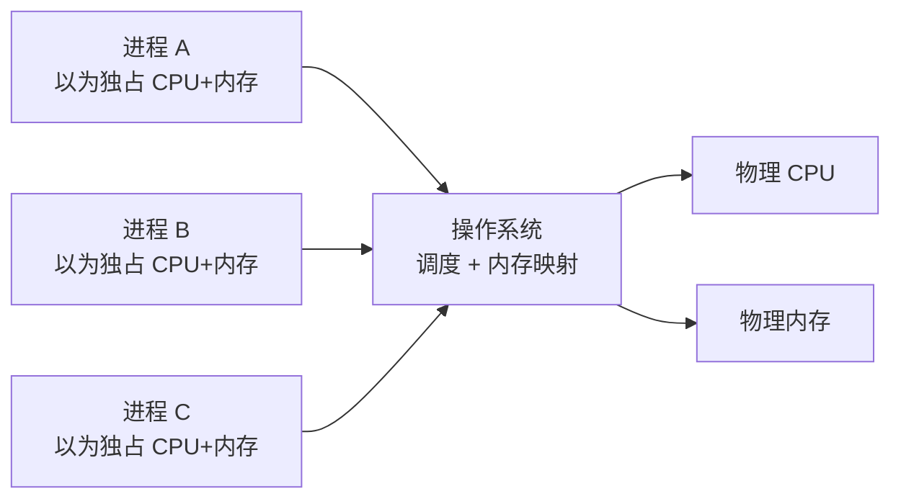

# 操作系统基础

---

## 速览

- 操作系统是硬件和应用程序之间的中间层，管理资源、提供服务。
- 核心职能：CPU 管理（进程调度）、内存管理、I/O 管理、系统调用。
- 四大特征：并发、共享、虚拟、异步。
- OS 扮演两个角色：管理者（分配/回收资源）和魔术师（虚拟化）。

---

## 操作系统是什么

> **一句话理解：** OS 是介于硬件和应用之间的软件层，让应用无需直接操作硬件。

**核心结论（可背）：**
```
硬件资源（CPU / 内存 / 磁盘 / I/O）
        ↑ 管理
   操作系统（OS）
        ↓ 服务
应用程序（通过系统调用使用硬件）
```

- 没有 OS：应用直接操作硬件，编程极难，误操作损坏硬件。
- 有了 OS：统一接口（系统调用），应用只需调用 API，OS 负责底层细节。

---

## 四大特征

> **一句话理解：** 并发+共享是基础，虚拟+异步是手段。

**核心结论（可背）：**
| 特征 | 含义 | 注意点 |
|---|---|---|
| **并发** | 多个程序在同一时间段内都在"运行" | 并发 ≠ 并行（见下） |
| **共享** | 系统资源被多个进程共同使用 | 分互斥共享和同时访问两种 |
| **虚拟** | 把一个物理资源变成多个逻辑资源 | CPU 虚拟化、内存虚拟化 |
| **异步** | 进程以不可预知的速度推进 | 调度时机不确定 |

**并发 vs 并行（必考）：**
```
并发（Concurrency）：同一时间段内，多个任务交替执行，宏观上"同时"。
并行（Parallelism）：同一时刻，多个任务在多个核心上真正同时执行。

单核 CPU → 只能并发，不能并行
多核 CPU → 既能并发也能并行
```

**面试官常问：**
- 并发和并行的区别？→ 时间段 vs 时刻；交替执行 vs 真正同时。

**易错点：**
- ❌ 并发等于并行 → 并发是宏观现象，并行是物理同时；单核机器能并发不能并行。

---

## 操作系统的功能

> **一句话理解：** 资源分配 + 回收 + 为应用提供系统调用接口。

**核心结论（可背）：**
| 功能 | 说明 |
|---|---|
| **CPU 管理** | 进程调度，决定哪个进程使用 CPU |
| **内存管理** | 内存分配、回收、虚拟内存、地址映射 |
| **I/O 管理** | 驱动设备，统一 I/O 接口 |
| **文件系统** | 文件的存储、组织、访问控制 |
| **系统调用** | 提供用户态进入内核态的安全接口 |

**内核的四大能力：**
```
进程调度能力  → 管理 CPU 使用权
内存管理能力  → 管理物理/虚拟内存
硬件通信能力  → 管理 I/O 设备驱动
系统调用能力  → 提供应用与内核的安全边界
```

---

## 操作系统的两个角色

> **一句话理解：** OS 是管理者也是魔术师——既分配资源，又制造"独占"假象。

**管理者：**
- 管 CPU（进程调度）、内存（分配回收）、磁盘（文件系统）、I/O 设备。
- 负责资源的分配和回收，防止进程互相干扰。

**魔术师（虚拟化）：**
- 让每个进程**以为自己独占 CPU** → 时间片轮转实现虚拟 CPU。
- 让每个进程**以为自己独占内存** → 虚拟地址空间，实际映射到物理内存的一部分。



---

## 系统调用

> **一句话理解：** 系统调用是用户态程序请求内核服务的唯一合法通道。

**核心结论（可背）：**
```
用户态（User Mode）   → 权限低，不能直接操作硬件
内核态（Kernel Mode） → 权限高，可以操作所有硬件

系统调用流程：
  应用发起系统调用（如 read、write、fork）
    → CPU 切换到内核态
      → 内核执行对应操作
        → 返回结果，切回用户态
```

- 常见系统调用：`fork()`（创建进程）、`exec()`（执行程序）、`read()/write()`（I/O）、`malloc()`（内存申请，底层调 `brk/mmap`）。

**易错点：**
- ❌ 以为 `malloc` 是系统调用 → `malloc` 是 C 库函数，底层才调系统调用 `brk` 或 `mmap`。

---

## 面试高频考点汇总

| 考点 | 核心答案 |
|---|---|
| 操作系统的作用？ | 硬件与应用之间的中间层：管理资源、提供系统调用接口 |
| 并发 vs 并行？ | 时间段内交替 vs 同一时刻真正同时；单核只能并发 |
| OS 四大特征？ | 并发、共享、虚拟、异步 |
| 系统调用是什么？ | 用户态请求内核服务的安全接口，触发 CPU 权限切换 |
| OS 内核的四大能力？ | 进程调度、内存管理、硬件通信、系统调用 |
| 虚拟化体现在哪？ | 虚拟 CPU（时间片）、虚拟内存（地址空间映射） |
