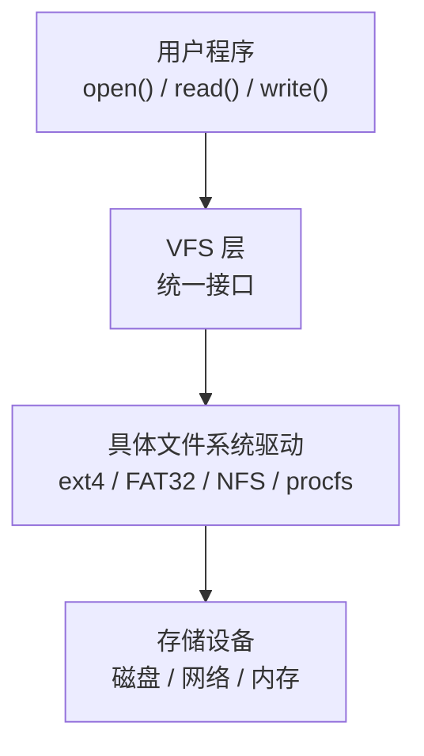

# 文件系统

---

## 速览

- 文件逻辑结构（用户视角）：流式文件（字节流）和记录式文件（顺序/索引/直接文件）。
- 文件物理结构（磁盘布局）：连续分配（随机访问快）、链接分配（无碎片但随机访问慢）、索引分配（推荐，兼顾效率和扩展性）。
- 目录结构进化：单级→两级→树形（现代OS）→无环图（支持共享）。
- 文件共享三级内核结构：FD（文件描述符）→ File Table（文件表）→ Inode（索引节点）。
- VFS（虚拟文件系统）= 统一接口层，屏蔽 ext4/FAT32/NFS 等底层差异。
- 文件重定位：链接阶段（静态）或运行时（动态）修正符号地址。

---

## 文件逻辑结构 vs 物理结构

> **一句话理解：** 逻辑结构是用户怎么看文件，物理结构是文件在磁盘上怎么存。

**核心结论（可背）：**

**逻辑结构分类：**
| 类型 | 说明 | 适用场景 |
|---|---|---|
| 无结构（流式文件） | 字节流，无固定格式，由应用程序解析 | 文本文件、图像、可执行文件 |
| 顺序文件 | 记录按顺序排列；定长记录支持折半查找，变长记录只能顺序查找 | 批量处理、磁带 |
| 索引文件 | 额外维护索引表，每条记录一个索引项 | 变长记录的快速查找 |
| 索引顺序文件 | 分组建索引，组间有序，组内可无序（类似分块查找） | 折中方案，查找 O(√N) |
| 直接文件 | 用散列函数直接计算记录物理地址，O(1) 访问 | 高频精确查找，不支持范围查询 |

**物理结构分类：**
| 类型 | 原理 | 优点 | 缺点 |
|---|---|---|---|
| 连续分配 | 占据连续物理块 | 顺序/随机访问都快，磁头移动少 | 外部碎片严重，文件扩展困难 |
| 链接分配（隐式） | 每个块末尾存下一块指针 | 无外部碎片，动态扩展 | 只能顺序访问，随机访问效率极低 |
| 链接分配（显式/FAT） | 指针集中存在 FAT 表，常驻内存 | 支持快速随机访问 | FAT 表占用大量内存（大容量磁盘） |
| 索引分配 | 每个文件有索引块记录所有盘块号 | 快速随机访问，无外部碎片 | 索引块占额外空间，大文件需多级索引 |

**机制解释：**
```
Unix/Linux inode 使用多级索引：
  直接块：存储小文件的数据块指针（直接访问）
  一级间接块：指向一个装满指针的块
  二级间接块：指向一个装满一级间接块指针的块
  三级间接块：理论上支持文件大小 = 磁盘容量

FAT（文件分配表）：
  开机时加载到内存，所有文件共用一张 FAT
  FAT 表项记录：当前块的下一块编号（链表结构）
  优点：查找在内存中完成，速度快
  缺点：FAT 表本身占用内存（FAT32 可能需几十 MB）
```

---

## 目录结构

> **一句话理解：** 现代操作系统用树形目录结构，在此基础上加有向边形成无环图以支持文件共享。

**核心结论（可背）：**
| 类型 | 特点 | 缺点 |
|---|---|---|
| 单级目录 | 所有文件在一个目录，文件名唯一 | 不允许重名，多用户冲突，检索慢 |
| 两级目录 | 主目录 + 用户目录，允许不同用户同名文件 | 不能对文件分类管理 |
| 树形目录 | 无限层级子目录，路径唯一标识文件 | 不便于文件共享 |
| 无环图目录 | 树形+允许多个目录指向同一文件/子目录 | 实现复杂，维护成本高 |

**树形目录相关概念：**
```
绝对路径：从根目录（/）开始的路径，如 /home/user/file.txt
相对路径：从当前目录开始的路径，如 ../docs/file.txt
当前目录（Working Directory）：进程当前所在目录，加速文件检索
```

---

## 文件共享机制

> **一句话理解：** Linux 通过 FD → File Table → Inode 三级结构实现文件共享，多个进程可共享同一 inode（同一文件）。

**核心结论（可背）：**
```
三级结构：
  进程1 FD[3] ──► File Table Entry A ──► Inode ──► 磁盘数据
                  (offset, flags)
  进程2 FD[5] ──► File Table Entry B ──► 同一个 Inode

  FD（File Descriptor）：每个进程独立，open() 返回，进程内标识
  File Table：记录当前读写偏移量（offset）、访问模式（flags）
  Inode：文件元数据（权限、大小、数据块指针），唯一标识文件
```

**共享方式对比：**
| 方式 | 共享 File Table | 共享 Inode | 共享偏移量 |
|---|---|---|---|
| `fork()` | ✅ 是 | ✅ 是 | ✅ 是 |
| 两次 `open()` | ❌ 否 | ✅ 是 | ❌ 否（各自独立偏移） |
| `dup()` / `dup2()` | ✅ 是 | ✅ 是 | ✅ 是 |

**并发访问一致性：**
```
文件锁（File Lock）：
  fcntl()：细粒度锁（字节范围锁），可非阻塞
  flock()：粗粒度锁（整个文件），简单易用
  共享锁（Shared Lock）：多个进程可同时读
  独占锁（Exclusive Lock）：只有一个进程可写

页缓存（Page Cache）：
  所有进程共享同一份内核页缓存，提升读效率
  写后需 fsync(fd) 强制刷到磁盘，否则缓存数据可能丢失
```

---

## 虚拟文件系统（VFS）

> **一句话理解：** VFS 是用户程序和底层各种文件系统之间的统一接口层，让 open/read/write 对所有文件系统都适用。

**核心结论（可背）：**


**VFS 四个核心数据结构（Linux）：**
| 结构 | 作用 |
|---|---|
| `super_block` | 整个文件系统的元信息（挂载信息、类型等） |
| `inode` | 文件元数据（权限、大小、数据块指针等）|
| `dentry` | 目录项，提供路径名到 inode 的映射 |
| `file` | 表示打开的文件，包含读写偏移，与进程相关 |

**VFS 调用流程：**
```
int fd = open("test.txt", O_RDONLY);
  ① VFS 接收 open() 调用
  ② 通过路径解析找到对应 dentry
  ③ 由 dentry 找到 inode
  ④ 通过 inode 确定具体文件系统类型（ext4/FAT32...）
  ⑤ 调用该文件系统的具体 open() 实现
  ⑥ 创建 file 结构，分配 FD，返回给用户
```

---

## 文件顺序存取 vs 随机存取

> **一句话理解：** 顺序存取按顺序依次读写（适合磁带/日志），随机存取可直接定位任意位置（适合数据库）。

**核心结论（可背）：**
| 维度 | 顺序存取 | 随机存取 |
|---|---|---|
| 访问方式 | 从头按顺序读写，不能跳过 | 通过偏移/索引直接跳到任意位置 |
| 效率 | 读整个文件时效率高 | 访问少量离散数据时效率高 |
| 适用场景 | 日志文件、音视频流、文本处理 | 数据库、大文件局部编辑、FAT 表查找 |
| 存储介质 | 磁带等顺序介质 | 硬盘、SSD 等随机访问介质 |

---

## 文件重定位

> **一句话理解：** 链接时（静态重定位）或加载/运行时（动态重定位）修正程序中符号（函数/变量）的实际地址。

**核心结论（可背）：**
| 类型 | 发生时机 | 执行者 | 场景 |
|---|---|---|---|
| 静态重定位 | 链接阶段 | 链接器 | 生成固定地址可执行文件 |
| 动态重定位 | 加载/运行时 | 动态链接器（ld.so） | 动态库（.so），ASLR |

**ELF 重定位相关段：**
```
.symtab   → 符号表（函数/变量名和偏移）
.rel.text → 重定位表（记录哪些位置需要修正，引用了哪些符号）
.plt      → 过程链接表（动态链接用）
.got      → 全局偏移表（动态链接用）
```

---

## 面试高频考点汇总

| 考点 | 核心答案 |
|---|---|
| 三种文件物理结构各自优缺点？ | 连续：随机访问快，碎片多；链接：无碎片，随机访问慢；索引：随机快，无碎片，推荐 |
| FAT vs inode？ | FAT 是显式链接，集中存在内存；inode 是索引分配，直接/间接指针多级索引 |
| fork() 后文件描述符如何共享？ | 父子进程共享同一 File Table，共享偏移量，写入可能竞争同一偏移位置 |
| VFS 的作用？ | 屏蔽底层不同文件系统差异，提供统一的 open/read/write 接口 |
| 树形 vs 无环图目录？ | 树形每个文件只有一个父目录；无环图允许多父目录（支持文件共享） |
| 顺序存取 vs 随机存取？ | 顺序：按序依次，适合日志流；随机：任意跳转，适合数据库索引 |
