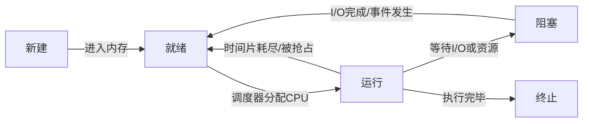

# 线程与进程

---

## 速览

- 进程 = 资源分配最小单位，有独立地址空间；线程 = CPU 调度最小单位，共享进程资源。
- 并发 vs 并行：并发是宏观同时（时间片交替），并行是真正同时（多核）。
- 用户态 vs 内核态：用户态权限低，内核态权限最高，通过系统调用切换。
- 六大调度算法：FCFS、SJF、SRTF、优先级、RR、MLFQ，各有优劣。
- IPC 六种方式：管道、消息队列、共享内存（最快）、信号量、信号、Socket。
- 僵尸进程：子进程终止但父进程未回收；孤儿进程：父进程先终止，由 init 接管。

---

## 进程 vs 线程

> **一句话理解：** 进程是资源的容器，线程是执行的实体；同一进程的线程共享内存，不同进程相互隔离。

**核心结论（可背）：**
| 维度 | 进程 | 线程 |
|---|---|---|
| 资源分配 | 独立地址空间，资源不共享 | 共享进程的代码段、数据段、堆、文件 |
| 切换开销 | 大（需保存完整页表、寄存器等） | 小（只保存寄存器和栈信息） |
| 创建销毁 | 重量级，开销大 | 轻量级，开销小 |
| 通信方式 | 需 IPC（管道/消息队列/共享内存等） | 直接访问共享内存（需同步机制） |
| 安全性 | 互相隔离，崩溃不影响其他进程 | 一个线程崩溃可导致整个进程崩溃 |
| 独占资源 | 独立栈、文件描述符、信号处理 | 独立栈和寄存器上下文 |

**机制解释：**
```
进程上下文切换：保存/恢复完整进程状态（页表、内存映射、寄存器、文件描述符）
线程上下文切换：只需保存/恢复寄存器 + 栈指针，同进程内线程复用页表

一个进程至少有一个线程（主线程），多个线程共享：
  代码段（.text）、数据段（.data、.bss）、堆（heap）、打开的文件
每个线程独有：
  栈（stack）、寄存器（PC、SP）、线程局部存储（TLS）
```

---

## 并发 vs 并行

> **一句话理解：** 并发是一个人快速切换处理多件事，并行是多个人同时处理多件事。

**核心结论（可背）：**
```
并发（Concurrency）：单核 CPU 时间片轮转，宏观上"同时"执行多个任务
  → 同一时刻只有一个任务真正在 CPU 上执行

并行（Parallelism）：多核 CPU 上多个任务真正同时执行
  → 依赖多个处理单元

关系：并行是并发的子集，并发不一定并行，并行一定并发
```

---

## 用户态 vs 内核态

> **一句话理解：** 内核态有最高权限，用户程序通过系统调用进入内核态请求特权服务。

**核心结论（可背）：**
| 维度 | 用户态 | 内核态 |
|---|---|---|
| 权限 | 低，只能访问用户空间 | 最高，可访问全部内存和硬件 |
| 运行内容 | 用户程序代码 | 操作系统内核代码 |
| 切换方式 | 通过系统调用（System Call）切入内核态 | 执行完后返回用户态 |
| 切换开销 | 需保存用户态上下文，存在较大开销 | — |

**机制解释：**
```
用户态 → 内核态触发方式：
  1. 系统调用（System Call）：用户程序主动请求内核服务（如 read/write/fork）
  2. 异常（Exception）：CPU 执行指令时检测到异常（如缺页中断、除零）
  3. 中断（Interrupt）：外部设备触发（如键盘、网卡）

CPU 中有程序状态字寄存器（PSW）控制当前模式
  1 = 内核态，0 = 用户态（或反之，取决于架构）
```

---

## 六大调度算法

> **一句话理解：** 选调度算法 = 选在响应时间、吞吐量、公平性之间做取舍。

**核心结论（可背）：**
| 算法 | 抢占式 | 优点 | 缺点 | 适用场景 |
|---|---|---|---|---|
| FCFS（先来先服务） | 否 | 简单公平 | 长进程阻塞短进程（队列效应） | 批处理，任务均匀 |
| SJF（最短作业优先） | 否 | 平均等待时间最短 | 长进程饥饿，需预测执行时间 | 执行时间已知 |
| SRTF（最短剩余时间） | 是 | 响应快 | 长进程饥饿更严重 | 剩余时间可知 |
| 优先级调度 | 可是/否 | 保证重要任务先执行 | 低优先级进程饥饿（aging 算法解决） | 实时系统 |
| RR（时间片轮转） | 是 | 公平，响应时间短 | 时间片过小则上下文切换开销大 | 交互式系统 |
| MLFQ（多级反馈队列） | 是 | 综合 FCFS+SJF+优先级的优点 | 实现复杂 | 通用操作系统 |

**MLFQ 工作原理：**
```
新进程 → 最高优先级队列（时间片最短）
用完时间片未完成 → 降到下一级队列（时间片更长）
在高优先级队列完成 → 移除

效果：短作业快速执行，长作业逐步降级，类似于自动识别 CPU 密集型 vs IO 密集型
```

---

## 进程间通信（IPC）

> **一句话理解：** 从效率低到高：管道 < 消息队列 < 共享内存；共享内存最快但需要同步机制。

**核心结论（可背）：**
| IPC 方式 | 特点 | 适用场景 |
|---|---|---|
| 管道（Pipe） | 半双工，内核缓冲区；匿名管道只能父子进程用 | 父子进程通信 |
| 命名管道（FIFO） | 有文件路径，任意进程可访问 | 无亲缘关系进程 |
| 消息队列 | 内核消息链表，有消息大小限制；存在用户/内核拷贝开销 | 异步消息传递 |
| 共享内存 | 多进程映射同一物理内存，通信效率最高 | 大数据量传输（需配合信号量同步） |
| 信号量（Semaphore） | 整型计数器，用于进程间同步互斥，不传数据 | 同步控制 |
| 信号（Signal） | 操作系统异步通知机制，用于异常处理 | 进程控制（kill/SIGINT/SIGTERM） |
| Socket | 同机器或跨网络通信 | 网络通信、跨机器 |

---

## 僵尸进程与孤儿进程

> **一句话理解：** 僵尸进程是"已死但未被收尸"，孤儿进程是"父亲先走子进程被收养"。

**核心结论（可背）：**
| 类型 | 原因 | 危害 | 处理 |
|---|---|---|---|
| 僵尸进程 | 子进程退出，父进程未调用 wait() 回收 | 占用进程表项，表项耗尽无法创建新进程 | 父进程调用 `wait()`/`waitpid()` 回收；或 kill 父进程让 init 接管 |
| 孤儿进程 | 父进程先于子进程退出 | 无危害 | OS 自动让 init 进程（PID=1）接管并回收 |

---

## 进程状态转换

> **一句话理解：** 进程在新建→就绪→运行→阻塞→终止之间流转，调度器控制就绪↔运行。

**核心结论（可背）：**


---

## 中断机制

> **一句话理解：** 中断是操作系统获取 CPU 控制权的唯一方式，分内部异常和外部中断。

**核心结论（可背）：**
| 类型 | 来源 | 特点 | 例子 |
|---|---|---|---|
| 内部异常（Exception） | CPU 执行指令时内部产生 | 同步，与当前指令相关 | 缺页中断、除零错误、系统调用 |
| 外部中断（Interrupt） | CPU 外部设备触发 | 异步，与当前指令无关 | 键盘输入、网卡数据到达、定时器 |

---

## 面试高频考点汇总

| 考点 | 核心答案 |
|---|---|
| 进程和线程的区别？ | 资源分配单位 vs CPU 调度单位；独立地址空间 vs 共享内存；切换开销大 vs 小 |
| 并发 vs 并行？ | 并发：单核时间片交替（宏观同时）；并行：多核真正同时执行 |
| 用户态 vs 内核态？ | 权限不同；通过系统调用、异常、中断切换到内核态 |
| 为什么线程切换比进程切换快？ | 同进程线程共享页表，只需切换寄存器和栈，不需切换地址空间 |
| IPC 最快的方式？ | 共享内存（直接内存映射，无需内核拷贝），但需要同步机制 |
| 僵尸进程怎么处理？ | 父进程调用 wait()/waitpid()；或 kill 父进程让 init 接管回收 |
| MLFQ 的优点？ | 综合多种算法，短作业快速完成，长作业自动降级，兼顾公平性和响应性 |
