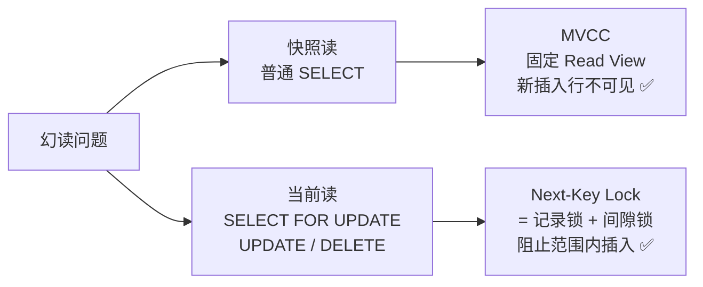
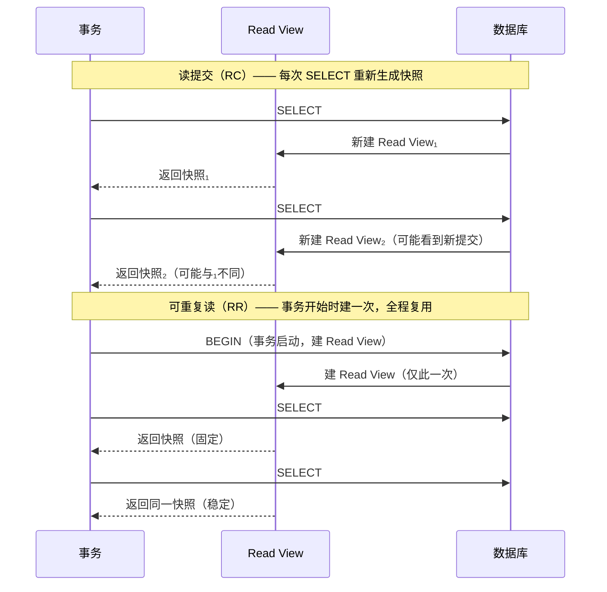

# 事务

---

## 速览

- 事务 = 一组操作的原子单元，要么全做，要么全不做。
- ACID 四大特性各有对应机制：原子性靠 undo log，持久性靠 redo log，隔离性靠 MVCC 或锁。
- 四种隔离级别解决三类并发问题：脏读 → 不可重复读 → 幻读（严重性递增）。
- MySQL InnoDB 默认隔离级别是**可重复读**，通过 MVCC + 间隙锁在大多数场景下规避幻读。
- 长事务是生产事故高发区：持锁时间长、undo log 膨胀、阻塞其他事务。

---

## ACID 四大特性

> **一句话理解：** 事务靠四个特性保证数据在并发和故障下仍然正确。

**核心结论（可背）：**
| 特性 | 保证内容 | 实现机制 |
|---|---|---|
| 原子性 Atomicity | 操作不可分割，失败则全部回滚 | `undo log`（回滚日志） |
| 一致性 Consistency | 事务前后数据库始终满足约束 | 由 A + I + D 共同保障，不单独实现 |
| 隔离性 Isolation | 并发事务互不干扰中间状态 | MVCC 或锁 |
| 持久性 Durability | 提交后数据不因崩溃丢失 | `redo log`（重做日志，WAL） |

**机制解释：**
- **undo log**：记录数据修改前的旧值，事务回滚时按日志逆向恢复。
- **redo log**：事务提交前先写日志到磁盘，崩溃重启后按日志重放，保证持久。
- **一致性**不是独立机制，是原子性 + 隔离性 + 持久性共同作用的结果。

**面试官常问：**
- ACID 各自如何实现？→ 按上表背出机制即可。
- 一致性靠什么保证？→ 不是单独保证的，是 A+I+D 的合力结果。

**易错点：**
- ❌ 以为一致性有独立的实现机制 → 没有，它是目标不是手段。
- ❌ 混淆 undo log（回滚）和 redo log（重做）→ undo 管原子性，redo 管持久性，方向相反。

---

## 三大并发异常

> **一句话理解：** 并发事务不加控制，会读到不该读的数据或读到前后不一致的数据。

**核心结论（可背）：**
| 异常 | 触发条件 | 本质 |
|---|---|---|
| 脏读 | 读到另一个**未提交**事务的数据 | 读了"可能不存在"的数据 |
| 不可重复读 | 同一行，同一事务内两次读值不同（另一事务已提交修改） | 针对**单行**，值变了 |
| 幻读 | 同一查询，两次执行行数不同（另一事务插入/删除） | 针对**行集合**，数量变了 |

**易错点：**
- ❌ 把不可重复读和幻读混为一谈：不可重复读 = 某行的**值**变了；幻读 = 结果集的**行数**变了。
- ❌ 脏读必须涉及未提交的数据；若对方已提交则属于不可重复读。

---

## 四种隔离级别

> **一句话理解：** 隔离级别越高，并发问题越少，性能越差，按需权衡。

**核心结论（可背）：**
| 隔离级别 | 脏读 | 不可重复读 | 幻读 | 实现方式 |
|---|---|---|---|---|
| 读未提交 | ✅ 可能 | ✅ 可能 | ✅ 可能 | 直接读最新数据 |
| 读提交 | ❌ | ✅ 可能 | ✅ 可能 | 每次 SELECT 生成新 Read View |
| 可重复读（InnoDB 默认） | ❌ | ❌ | ⚠️ 大部分规避 | 事务开始时生成一次 Read View |
| 串行化 | ❌ | ❌ | ❌ | 读写全加锁，事务串行执行 |

**机制解释：**
- 读提交 vs 可重复读的本质区别只有一处：**Read View 的创建时机**。
  - 读提交：每次 SELECT 都新建 Read View → 能看到其他事务刚提交的数据。
  - 可重复读：事务启动时建一次 Read View，全程复用 → 看到的始终是事务开始时的快照。

**面试官常问：**
- MySQL 默认隔离级别是什么？→ 可重复读（Repeatable Read）。
- 读提交和可重复读的区别？→ Read View 创建时机不同（每次 SELECT vs 事务启动时）。

**易错点：**
- ❌ 以为可重复读完全解决幻读 → InnoDB 用 MVCC + Next-Key Lock 大幅规避，但不是 SQL 标准意义上的"完全解决"。

---

## MVCC 多版本并发控制

> **一句话理解：** MVCC 让读操作不加锁，通过维护数据多个历史版本实现一致性读。

**核心结论（可背）：**
- 每行数据在 undo log 中保存多个历史版本（版本链）。
- 每个事务持有一个 **Read View**，决定它能看到哪个版本。
- **快照读**（普通 SELECT）→ 走 MVCC，不加锁。
- **当前读**（`SELECT ... FOR UPDATE`、`UPDATE`、`DELETE`）→ 读最新版本并加锁。

**机制解释：**

```
Read View 内容：
  - m_ids：创建时活跃（未提交）的事务 ID 列表
  - min_trx_id：m_ids 中最小值
  - max_trx_id：下一个将分配的事务 ID
  - creator_trx_id：创建此 Read View 的事务 ID

判断某行版本是否可见：
  版本 trx_id < min_trx_id     → 已提交，可见
  版本 trx_id >= max_trx_id    → 还未开始，不可见
  版本 trx_id 在 m_ids 中      → 活跃未提交，不可见
  否则                         → 可见
```

**面试官常问：**
- MVCC 是怎么实现可重复读的？→ 事务启动时固定 Read View，之后的快照读都用这个视图，不会读到新提交的数据。
- 读写为什么不互相阻塞？→ 读走 MVCC 快照，不加锁；写加行锁，两者不冲突。

**易错点：**
- ❌ 以为 MVCC 用锁实现 → MVCC 的核心就是**无锁读**，锁只在当前读时使用。
- ❌ 以为读提交和可重复读的 MVCC 原理不同 → 原理完全一样，唯一差别是 Read View 的创建时机。

---

## 幻读的解决方案

> **一句话理解：** InnoDB 通过 MVCC 处理快照读的幻读，通过 Next-Key Lock 处理当前读的幻读。

**核心结论（可背）：**

```
普通 SELECT（快照读）
  → MVCC：Read View 在事务启动时固定，新插入的行对当前事务不可见 ✅

SELECT ... FOR UPDATE / UPDATE / DELETE（当前读）
  → Next-Key Lock = 记录锁（Record Lock）+ 间隙锁（Gap Lock）
  → 锁住查询范围，阻止其他事务在范围内插入/删除 ✅
```

**机制解释：**
- **间隙锁（Gap Lock）**：锁的是索引记录之间的"间隙"，阻止新行插入该范围。
- **Next-Key Lock**：间隙锁 + 记录锁的组合，既锁已有行又锁间隙。
- 只有**当前读**才需要 Next-Key Lock；快照读靠 MVCC 天然解决。

**易错点：**
- ❌ 以为普通 SELECT 需要加间隙锁 → 不需要，快照读走 MVCC。
- ❌ 以为间隙锁锁的是行 → 间隙锁锁的是**范围**，不是具体行。



---

## 隔离级别的实现细节

> **一句话理解：** 读提交和可重复读都用 MVCC，区别仅在 Read View 的创建时机。

**核心结论（可背）：**



---

## 死锁与锁等待

> **一句话理解：** 锁等待是正常并发，死锁是两个事务互相等对方释放锁，MySQL 自动打破。

**核心结论（可背）：**
- **锁等待**：事务 A 等事务 B 释放锁，正常现象，等待超时后报错。
- **死锁**：A 等 B，B 等 A，循环等待，谁都无法推进。
- MySQL InnoDB **自动检测死锁**，选择代价较小的事务回滚，另一个继续执行。

**预防手段：**
| 手段 | 说明 |
|---|---|
| 固定加锁顺序 | 所有事务按相同顺序获取锁，消除循环依赖 |
| 缩小锁粒度 | 行锁优于表锁，减少锁冲突范围 |
| 降低隔离级别 | 读提交比可重复读持锁时间短 |
| 设置锁等待超时 | `innodb_lock_wait_timeout`，防止无限等待 |

**易错点：**
- ❌ 混淆锁等待和死锁：锁等待最终会自己解除（对方提交后）；死锁不会，需要 MySQL 介入。

---

## 长事务

> **一句话理解：** 长时间不提交的事务会持锁、膨胀 undo log，是生产环境的定时炸弹。

**危害：**
- 长时间持有行锁 → 阻塞其他写操作。
- undo log 无法回收 → 存储膨胀。
- 增大死锁概率。

**排查方式：**
```sql
-- 查找当前活跃事务（information_schema 库）
SELECT * FROM information_schema.INNODB_TRX
WHERE TIME_TO_SEC(TIMEDIFF(NOW(), trx_started)) > 60;
```

**避免手段：**
| 维度 | 措施 |
|---|---|
| 应用层 | 禁用 `autocommit=0`；去掉不必要的只读事务；控制语句执行超时 `max_execution_time` |
| 数据库层 | 监控 `INNODB_TRX`，超阈值报警/KILL；使用 `pt-kill` 工具自动清理 |

**易错点：**
- ❌ 用 `set autocommit=0` + 长连接 → 每条语句都会开启事务且不自动提交，极易产生长事务。推荐始终使用 `set autocommit=1` + 显式 `BEGIN`。

---

## 面试高频考点汇总

| 考点 | 核心答案 |
|---|---|
| ACID 各靠什么保证？ | A=undo log，C=A+I+D合力，I=MVCC/锁，D=redo log |
| 默认隔离级别？ | InnoDB：可重复读 |
| 不可重复读 vs 幻读？ | 前者是单行值变，后者是行数变 |
| 读提交 vs 可重复读区别？ | Read View 创建时机：每次SELECT vs 事务启动时 |
| InnoDB 如何解决幻读？ | 快照读→MVCC，当前读→Next-Key Lock |
| MVCC 用锁吗？ | 不用，MVCC 的价值就是无锁读 |
| 死锁如何处理？ | MySQL 自动检测，回滚代价小的那个 |
| 如何查找长事务？ | `SELECT * FROM information_schema.INNODB_TRX` |
