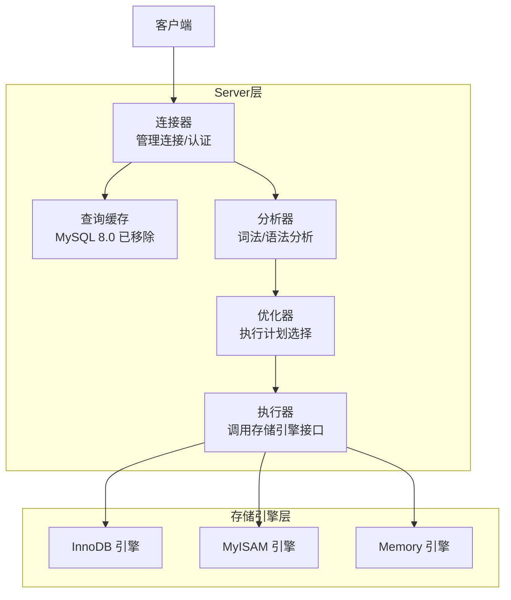

# 存储引擎

---

## 速览

- MySQL 最常用的引擎是 **InnoDB**（默认）和 **MyISAM**。
- 核心区别：InnoDB 支持事务、行锁、外键；MyISAM 不支持事务、用表锁。
- 绝大多数业务场景选 InnoDB，MyISAM 已基本退出历史舞台。
- InnoDB 通过锁 + redo log + undo log + MVCC 实现完整事务支持。

---

## 四种引擎对比

> **一句话理解：** 引擎决定数据怎么存、怎么锁、能不能回滚。

**核心结论（可背）：**
| 特性 | InnoDB | MyISAM | Memory | Archive |
|---|---|---|---|---|
| 事务 | ✅ | ❌ | ❌ | ❌ |
| 行级锁 | ✅ | ❌（表锁） | ❌（表锁） | ❌ |
| 外键 | ✅ | ❌ | ❌ | ❌ |
| 崩溃恢复 | ✅（redo log） | ❌ | ❌（断电数据丢失） | ❌ |
| 数据存储位置 | 磁盘 | 磁盘 | 内存 | 磁盘（高压缩） |
| 适用场景 | 通用，高并发写 | 读多写少，无事务 | 临时表、缓存 | 日志归档 |

---

## InnoDB

> **一句话理解：** MySQL 默认引擎，支持 ACID，行锁高并发，redo/undo log 保数据安全。

**核心结论（可背）：**
- 支持完整 **ACID 事务**（undo log 保原子性，redo log 保持久性）。
- **行级锁**：只锁需要的行，高并发写性能强。
- 支持**外键约束**，维护参照完整性。
- **Buffer Pool**：内存缓存数据和索引，减少磁盘 I/O。
- **崩溃自恢复**：宕机后 redo log 重放，数据不丢失。

**InnoDB 实现事务的四个机制：**
```
锁（行锁/间隙锁）   → 隔离性
redo log            → 持久性
undo log            → 原子性 + MVCC（隔离性）
MVCC               → 非锁定读，提升并发度
```

**面试官常问：**
- InnoDB 怎么实现事务？→ 锁 + redo log + undo log + MVCC 四件套。
- InnoDB 为什么适合高并发写？→ 行级锁，多事务可以同时修改不同行，互不阻塞。

---

## MyISAM

> **一句话理解：** 老式引擎，无事务无行锁，读快但写并发差，新项目不建议使用。

**核心结论（可背）：**
- **表级锁**：写操作锁整张表，高并发写严重瓶颈。
- **无事务**：写入失败无法回滚，数据一致性无保证。
- **无崩溃恢复**：宕机可能导致数据损坏。
- 唯一优势：全文索引（旧版本）、简单只读场景速度快。

**与 InnoDB 的核心区别（必背）：**
| 维度 | InnoDB | MyISAM |
|---|---|---|
| 锁粒度 | 行锁 | 表锁 |
| 事务 | 支持 | 不支持 |
| 外键 | 支持 | 不支持 |
| 崩溃恢复 | redo log 自动恢复 | 手动修复或数据丢失 |
| COUNT(*) | 需扫描（无维护行数） | O(1)（维护了总行数） |

**易错点：**
- ❌ 以为 MyISAM COUNT(*) 性能好所以该用 → COUNT(*) 快是因为维护了行数，但无事务的代价远大于此。
- ❌ 以为新项目可以用 MyISAM 读多写少场景 → InnoDB 读性能已足够好，且有事务保障，新项目一律 InnoDB。

---

## Memory 引擎

> **一句话理解：** 数据放内存，极快但断电全丢，只用于临时表或会话级缓存。

**核心结论（可背）：**
- 数据全在内存 → 读写极快，服务重启 → 数据全部丢失。
- 支持哈希索引（默认），等值查询快。
- 表级锁，高并发写性能差。
- 适合：临时计算结果、会话级缓存、不需要持久化的热点数据。

---

## Archive 引擎

> **一句话理解：** 高度压缩存归档数据，只能追加写，不支持索引，查询极慢。

**核心结论（可背）：**
- 压缩比高，节省存储空间。
- 支持高速 INSERT，不支持 UPDATE/DELETE。
- 无索引，查询只能全表扫描。
- 适合：传感器数据、历史日志等只写不查的场景。

---

## MySQL 架构与引擎位置



**关键：binlog 在 Server 层，redo log / undo log 在 InnoDB 层。**

---

## 引擎选择决策树

```
需要事务？
  是 → InnoDB（基本上所有业务场景）
  否 → 需要持久化？
         否 → Memory（临时缓存）
         是 → 只写不查且量大？
                是 → Archive（归档日志）
                否 → InnoDB（仍然更好）
```

---

## 面试高频考点汇总

| 考点 | 核心答案 |
|---|---|
| InnoDB 和 MyISAM 核心区别？ | 行锁 vs 表锁；有事务 vs 无事务；支持外键 vs 不支持 |
| 为什么 InnoDB 适合高并发？ | 行级锁，多事务可并发修改不同行 |
| InnoDB 如何实现事务？ | 锁 + redo log + undo log + MVCC |
| Memory 引擎的致命缺点？ | 断电数据全丢，不可持久化 |
| MyISAM 的 COUNT(*) 为什么快？ | 维护了总行数，O(1) 直接返回 |
| binlog 属于哪一层？ | Server 层，所有引擎共用 |
| redo log 属于哪一层？ | InnoDB 引擎层 |
