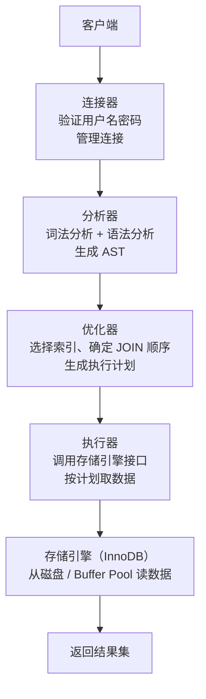

# 数据库基础

---

## 速览

- 主键唯一标识行，外键建立表间关系，索引加速查询——三者职责不同。
- SQL 执行流程：连接 → 解析 → 优化 → 执行 → 返回，MySQL 8.0 已移除查询缓存。
- 三大范式消除冗余：1NF 原子性，2NF 消除部分依赖，3NF 消除传递依赖。
- 分片（跨实例）vs 分区（单实例内）：解决不同规模的大表问题。

---

## 主键、外键、索引的区别

> **一句话理解：** 主键保证行唯一，外键建立关联，索引加速查询——功能完全不同。

**核心结论（可背）：**
| 概念 | 定义 | 是否可重复 | 是否可为 NULL | 作用 |
|---|---|---|---|---|
| 主键 | 唯一标识一行的字段 | ❌ 不可重复 | ❌ 不可为 NULL | 唯一标识 + 聚簇索引基础 |
| 外键 | 引用另一张表主键的字段 | ✅ 可重复 | ✅ 可为 NULL | 建立表间关系，维护参照完整性 |
| 索引 | 加速查询的数据结构 | 普通索引可重复 | ✅ 可为 NULL（唯一索引除外） | 提升查询性能 |

**易错点：**
- ❌ 主键 = 索引：主键会自动建聚簇索引，但索引不一定是主键。
- ❌ 外键约束性能好：外键在高并发写入时增加检查开销，互联网项目多不使用数据库外键，改为应用层保证。

---

## SQL 执行流程

> **一句话理解：** 一条 SQL 从连接到返回，要经过连接器、分析器、优化器、执行器、存储引擎五个阶段。

**核心结论（可背）：**



**关键节点说明：**
| 阶段 | 职责 | 面试要点 |
|---|---|---|
| 连接器 | TCP 握手 + 用户认证 | 长连接复用，短连接每次新建 |
| 查询缓存 | （MySQL 8.0 已移除）完全匹配才命中 | 表更新即失效，命中率低 |
| 分析器 | 词法分析 + 语法分析，生成 AST | 语法错误在此阶段报出 |
| 优化器 | 基于统计信息选最优执行计划 | 不一定选最优索引，可 FORCE INDEX |
| 执行器 | 按执行计划逐步取数据 | 权限校验在此阶段 |

**面试官常问：**
- MySQL 8.0 为什么移除查询缓存？→ 表一更新所有相关缓存失效，高并发写场景命中率极低，维护成本高于收益。
- 慢 SQL 如何诊断？→ `EXPLAIN` 看执行计划；开启 `slow_query_log`；`SHOW ENGINE INNODB STATUS` 查锁。

---

## 三大范式

> **一句话理解：** 三大范式层层递进，逐步消除冗余——1NF 原子，2NF 完全依赖，3NF 直接依赖。

**核心结论（可背）：**
| 范式 | 要求 | 解决的问题 |
|---|---|---|
| 1NF | 每个字段值不可再分（原子性） | 消除集合/复合字段 |
| 2NF | 满足 1NF + 非主键字段完全依赖于整个主键 | 消除部分依赖（针对复合主键） |
| 3NF | 满足 2NF + 非主键字段直接依赖于主键 | 消除传递依赖（A→B→主键变成 A→主键） |

**典型违反示例：**
```
违反 2NF：
  表 (学生ID, 课程ID, 学生姓名, 成绩)
  主键是 (学生ID, 课程ID)，但"学生姓名"只依赖于学生ID → 部分依赖
  拆分 → 学生表(学生ID, 姓名) + 成绩表(学生ID, 课程ID, 成绩)

违反 3NF：
  表 (员工ID, 员工姓名, 部门ID, 部门名称)
  部门名称依赖部门ID，部门ID依赖员工ID → 传递依赖
  拆分 → 员工表(员工ID, 员工姓名, 部门ID) + 部门表(部门ID, 部门名称)
```

**易错点：**
- ❌ 实际开发严格遵守三范式 → 有时为性能适当反范式（如冗余字段减少 JOIN）。

---

## JOIN 操作

> **一句话理解：** JOIN 是多表连接的核心，内连接取交集，外连接保留一侧全量。

**核心结论（可背）：**
| 类型 | 返回结果 | 适用场景 |
|---|---|---|
| INNER JOIN | 两表都有匹配的行 | 只要有关联的数据 |
| LEFT JOIN | 左表全部 + 右表匹配（无则 NULL） | 保留左表所有数据 |
| RIGHT JOIN | 右表全部 + 左表匹配（无则 NULL） | 保留右表所有数据 |
| FULL JOIN | 两表全部（无匹配补 NULL） | MySQL 不直接支持，用 UNION 模拟 |
| CROSS JOIN | 笛卡尔积（所有组合） | 生成测试数据 |

---

## 分片 vs 分区

> **一句话理解：** 分区在单机内拆表，分片跨多机拆库，应对不同数据规模。

**核心结论（可背）：**
| 维度 | 分区（Partitioning） | 分片（Sharding） |
|---|---|---|
| 范围 | 单一数据库实例内 | 多个数据库实例/服务器 |
| 目的 | 优化大表查询性能和管理 | 水平扩展容量和吞吐 |
| 复杂度 | 较低（MySQL 内置支持） | 较高（需要路由层、分布式事务） |
| 适用场景 | 数据量大但单机能承受 | 单机无法承受，需分布式 |

---

## 连接池

> **一句话理解：** 连接池预先建立一批连接，复用而不是每次新建，大幅降低建连开销。

**核心结论（可背）：**
- 建立数据库连接需要 TCP 握手 + 认证，开销大。
- 连接池维护一个连接复用池，请求来了从池里取，用完还回去。
- 关键参数：最大连接数（限制并发）、最小空闲连接数（避免频繁建连）、连接超时时间。

---

## MySQL vs Redis

**核心结论（可背）：**
| 维度 | MySQL | Redis |
|---|---|---|
| 类型 | 关系型数据库 | 键值对缓存/NoSQL |
| 存储 | 磁盘 | 内存（可持久化） |
| 数据结构 | 表/行/列 | String、Hash、List、Set、ZSet |
| 事务 | 完整 ACID | 弱事务（MULTI/EXEC，不支持回滚） |
| 持久化 | redo log（InnoDB） | RDB 快照 + AOF 日志 |
| 适用场景 | 复杂查询、事务、关系数据 | 缓存、计数、排行榜、会话存储 |

---

## 面试高频考点汇总

| 考点 | 核心答案 |
|---|---|
| SQL 执行流程？ | 连接→分析→优化→执行→存储引擎→返回 |
| 为什么 MySQL 8.0 移除查询缓存？ | 更新即失效，高并发写命中率极低 |
| 三大范式？ | 1NF 原子，2NF 消除部分依赖，3NF 消除传递依赖 |
| 外键性能影响？ | 写入时需校验关联，高并发场景通常在应用层维护 |
| 分片 vs 分区？ | 分区单实例内，分片跨实例；应对规模不同 |
| JOIN 类型？ | INNER（交集）、LEFT（保左）、RIGHT（保右）、CROSS（笛卡尔积） |
