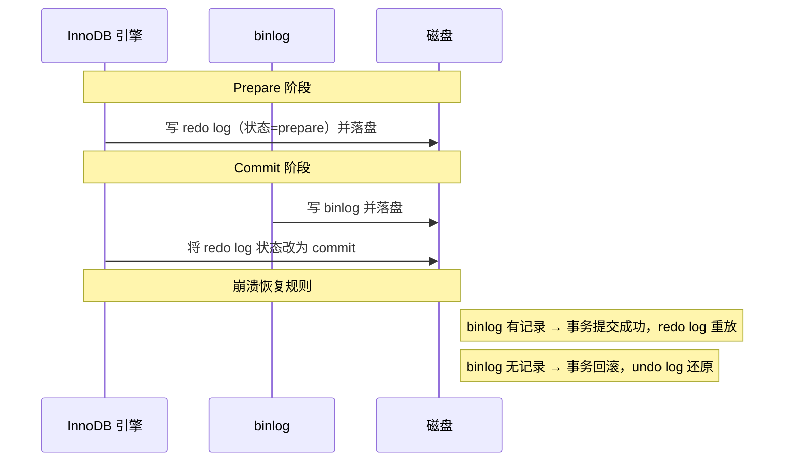

# 日志（undo log / redo log / binlog）

---

## 速览

- MySQL 有三种核心日志：undo log（回滚）、redo log（重做）、binlog（归档）。
- undo log 和 redo log 属于 InnoDB 层；binlog 属于 Server 层，所有引擎共用。
- redo log 和 binlog 必须保持一致，通过**两阶段提交（2PC）**来保证。
- 崩溃后：提交前崩溃 → 用 undo log 回滚；提交后崩溃 → 用 redo log 恢复。

---

## 三大日志对比

> **一句话理解：** undo 管"撤销"，redo 管"重做"，binlog 管"同步"。

**核心结论（可背）：**
| 日志 | 所属层 | 格式 | 写入方式 | 用途 |
|---|---|---|---|---|
| undo log | InnoDB 层 | 逻辑日志（旧值） | 随事务产生 | 事务回滚 + MVCC 版本链 |
| redo log | InnoDB 层 | 物理日志（页修改） | 循环写，固定大小 | 崩溃恢复（持久性） |
| binlog | Server 层 | Statement/Row/Mixed | 追加写，不覆盖 | 主从复制 + 数据备份 |

**机制解释：**
- **undo log**：记录操作前的旧值，构成版本链（每条记录有 `roll_pointer` 串联历史）。事务回滚时逆向执行；MVCC 快照读时沿版本链找可见版本。
- **redo log**：记录某数据页做了什么物理修改。事务提交前先把 redo log 写盘（WAL，Write-Ahead Log），崩溃重启后回放即可。
- **binlog**：记录所有 DDL 和 DML（不含 SELECT），用于从库同步和数据恢复。

**面试官常问：**
- undo log 和 redo log 有什么区别？→ undo 记录前值（回滚用），redo 记录后值（重做用）；方向相反。
- redo log 和 binlog 有什么区别？→ 见上表；核心：层次不同、格式不同、写入方式不同、用途不同。

**易错点：**
- ❌ 混淆 undo（原子性）和 redo（持久性）→ 记方向：undo = 撤销，redo = 重做。
- ❌ 以为 binlog 是 InnoDB 的 → binlog 是 MySQL Server 层，与引擎无关。

---

## undo log 详解

> **一句话理解：** 每次修改都留一份"后悔药"，版本链让 MVCC 能穿越时间读旧数据。

**核心结论（可背）：**
```
每行数据有两个隐藏字段：
  trx_id        — 最后修改该行的事务 ID
  roll_pointer  — 指向 undo log 版本链上一条记录

版本链：旧值₁ ← 旧值₂ ← 旧值₃ ← ... ← 当前值
                  ↑
          MVCC Read View 在此链上找到可见版本
```

**两个用途：**
1. **事务回滚** — 按版本链逆向恢复旧值。
2. **MVCC 快照读** — Read View 沿版本链找第一个符合可见性规则的版本。

---

## redo log 详解

> **一句话理解：** 先写日志再写磁盘（WAL），保证提交的事务在崩溃后也能恢复。

**核心结论（可背）：**
```
写入顺序：
  修改内存（Buffer Pool）
    → 写 redo log（顺序写，极快）
      → 事务提交（只需 redo log 落盘即可算"成功"）
        → 后台异步刷脏页到磁盘

崩溃场景：
  提交前崩溃 → undo log 回滚
  提交后崩溃 → redo log 重放，恢复已提交的修改
```

- redo log 是**循环写**（固定大小），写满后覆盖最旧的；被覆盖的说明已刷盘，安全。

---

## binlog 与两阶段提交

> **一句话理解：** redo log 和 binlog 各写各的，用两阶段提交保证两者不会不一致。

**为什么需要 2PC：**
- redo log 写成功但 binlog 没写 → 主库有数据，从库没有 → 主从不一致。
- binlog 写成功但 redo log 没写 → 主库无数据，从库有 → 主从不一致。

**两阶段提交过程（可背）：**



**易错点：**
- ❌ 以为只要 redo log 落盘就够了 → binlog 用于主从同步，两者都要一致。
- ❌ redo log commit 状态不需要立刻落盘 → 只要 binlog 成功写盘，redo log prepare 状态也被认为成功。

---

## 面试高频考点汇总

| 考点 | 核心答案 |
|---|---|
| 三种日志各自作用？ | undo=回滚+MVCC，redo=崩溃恢复，binlog=主从复制+备份 |
| undo 和 redo 区别？ | 记录前值 vs 后值；回滚 vs 重做；原子性 vs 持久性 |
| redo log 和 binlog 区别？ | InnoDB层 vs Server层；物理日志 vs 逻辑日志；循环写 vs 追加写 |
| 为什么需要两阶段提交？ | 防止 redo log 和 binlog 不一致导致主从数据分裂 |
| 崩溃后如何恢复？ | 提交前→undo回滚；提交后→redo重放 |
| MVCC 和 undo log 关系？ | undo log 维护版本链，Read View 在版本链上找可见数据 |
