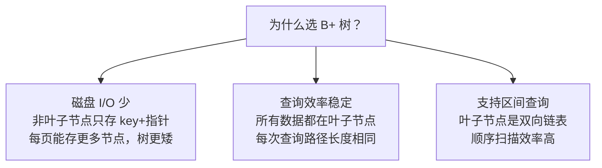

# 索引

---

## 速览

- 索引 = 数据库的"目录"，用空间换时间，大幅减少扫描行数。
- MySQL InnoDB 默认使用 **B+ 树**索引，叶子节点双向链表支持区间查询。
- 分类：按数据结构（B+树/Hash）、按存储方式（聚簇/二级索引）、按字段数（单列/联合）。
- 覆盖索引避免回表，联合索引遵循**最左匹配原则**。
- 索引不是越多越好：写操作需维护索引，增加开销。

---

## 索引分类

> **一句话理解：** 索引有多种分类维度，面试按维度分层回答最清晰。

**核心结论（可背）：**
| 分类维度 | 类型 |
|---|---|
| 数据结构 | B+树索引（默认）、Hash 索引、全文索引（Full-text） |
| 物理存储 | 聚簇索引（主键索引）、二级索引（非主键） |
| 字段特性 | 主键索引、唯一索引、普通索引、前缀索引 |
| 字段个数 | 单列索引、联合索引（复合索引） |

---

## 为什么用 B+ 树

> **一句话理解：** B+ 树矮胖、叶子链表、只存数据在叶子——三个特性完美契合数据库需求。

**核心结论（可背）：**


**B 树 vs B+ 树（必考）：**
| 维度 | B 树 | B+ 树 |
|---|---|---|
| 数据存储 | 所有节点都存数据 | 只有叶子节点存数据 |
| 区间查询 | 需要中序遍历 | 叶子链表直接扫 |
| 非叶子节点容量 | 存数据，容量小，树更高 | 只存 key，容量大，树更矮 |
| 适用场景 | 文件系统 | 数据库索引 |

**易错点：**
- ❌ 以为 B+ 树区间查询时要从根开始 → 找到起始叶子后，沿叶子链表顺序扫即可。

---

## 聚簇索引 vs 二级索引

> **一句话理解：** 聚簇索引的叶子存完整行数据；二级索引的叶子存主键值，查完还要回表。

**核心结论（可背）：**
```
聚簇索引（主键索引）：
  叶子节点 = 完整的数据行
  一张表只有一个聚簇索引
  InnoDB 默认用主键建聚簇索引

二级索引（非主键索引）：
  叶子节点 = 索引列值 + 主键值
  查到主键后，再去聚簇索引查完整行 → 回表

覆盖索引：
  查询的列都在索引中，不需要回表
  例：SELECT id, name FROM users WHERE name = 'xxx'
      若 (name, id) 是联合索引 → 覆盖索引，无需回表
```

**面试官常问：**
- 什么是回表？→ 二级索引查到主键后，需再去聚簇索引取完整行，多一次 B+ 树查询。
- 什么是覆盖索引？→ 查询所需列全在索引中，不需回表，性能更好。

---

## 联合索引与最左匹配原则

> **一句话理解：** 联合索引按最左字段开始匹配，跳过任一前缀则索引失效。

**核心结论（可背）：**
```
联合索引 (a, b, c)：

能走索引：
  WHERE a = 1
  WHERE a = 1 AND b = 2
  WHERE a = 1 AND b = 2 AND c = 3
  WHERE a = 1 AND b > 2         ← a 精确，b 范围，c 失效

不走索引：
  WHERE b = 2                   ← 跳过 a
  WHERE c = 3                   ← 跳过 a、b
  WHERE b = 2 AND c = 3         ← 跳过 a
```

**建联合索引原则：区分度高的字段排在前面。**

---

## 索引失效场景

> **一句话理解：** 这几种写法会让优化器放弃索引，直接全表扫——面试必考。

**核心结论（可背）：**
| 场景 | 示例 | 原因 |
|---|---|---|
| 前缀通配符 | `LIKE '%abc'` | 无法确定起始位置 |
| 索引列参与计算 | `WHERE age + 1 = 18` | 无法直接用索引定位 |
| 索引列使用函数 | `WHERE UPPER(name) = 'A'` | 函数结果无索引 |
| OR 后列无索引 | `WHERE a = 1 OR b = 2`（b 无索引） | 全表扫更高效 |
| 违反最左匹配 | 跳过联合索引前缀列 | 见上节 |
| 隐式类型转换 | `WHERE id = '1'`（id 是 int） | 转换导致索引失效 |
| 区分度太低 | 性别字段 | 全表扫代价更低 |

**面试官常问：**
- `LIKE 'abc%'` 能走索引吗？→ 能，后缀通配符可以利用 B+ 树前缀定位。
- `LIKE '%abc'` 呢？→ 不能，前缀不确定，需全表扫。

---

## 索引优化技巧

> **一句话理解：** 建对索引，查少数据，尽量覆盖，避免回表。

**核心结论（可背）：**
| 技巧 | 说明 |
|---|---|
| 覆盖索引 | 查询列包含在索引中，避免回表 |
| 前缀索引 | 对长字符串字段取前 N 个字符建索引，节省空间 |
| 主键自增 | 避免页分裂，插入总是追加，性能好 |
| 区分度优先 | 联合索引中区分度高的字段放前面 |
| 避免冗余索引 | (a) 和 (a, b) 同时存在，(a) 是冗余的 |

**什么时候不建索引：**
- 小表（索引开销 > 收益）
- 区分度极低的字段（如性别、状态值只有几种）
- 频繁更新的字段（维护索引成本高）
- 极少用于查询的字段

---

## 面试高频考点汇总

| 考点 | 核心答案 |
|---|---|
| 为什么用 B+ 树？ | 矮胖（磁盘 I/O 少）、叶子双向链表（区间查询快）、数据只在叶子（稳定） |
| 聚簇索引和二级索引区别？ | 聚簇存完整行；二级存主键值，需回表 |
| 什么是回表？ | 二级索引找到主键，再去聚簇索引取完整行 |
| 什么是覆盖索引？ | 查询列全在索引中，不需回表 |
| 最左匹配原则？ | 联合索引从最左列开始，跳过前缀则失效 |
| 索引失效典型场景？ | 前缀 LIKE、索引列参与计算/函数、隐式类型转换、违反最左匹配 |
| 索引越多越好吗？ | 不是，写操作需维护索引，增加开销，按需建索引 |
