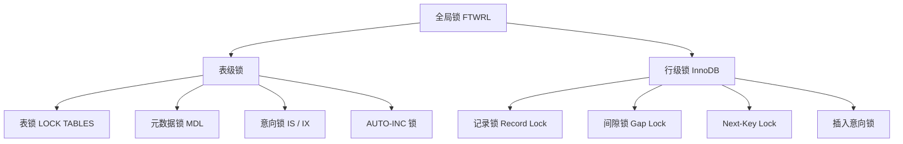

# 锁

---

## 速览

- MySQL 锁按粒度分三层：全局锁 → 表级锁 → 行级锁，粒度越细并发越高、开销越大。
- InnoDB 的行级锁基于**索引**实现；无索引则退化为全表锁。
- 行锁三件套：记录锁（锁行）、间隙锁（锁范围）、Next-Key Lock（记录+间隙）。
- 悲观锁用数据库锁实现；乐观锁用版本号在应用层实现，适合低冲突场景。

---

## 锁的粒度分层

> **一句话理解：** 锁的粒度越粗越安全但并发越差，InnoDB 默认用行锁换高并发。

**核心结论（可背）：**



---

## 全局锁

> **一句话理解：** 锁整个库，只读不写，仅用于全库逻辑备份。

**核心结论（可背）：**
```sql
FLUSH TABLES WITH READ LOCK;   -- 加全局锁，全库只读
UNLOCK TABLES;                  -- 释放
```
- 备份期间所有写操作阻塞，生产环境用 `mysqldump --single-transaction`（InnoDB 可不加全局锁，利用 MVCC 快照备份）。

---

## 表级锁

> **一句话理解：** 锁整张表，开销小但并发差，MyISAM 默认用它。

**核心结论（可背）：**
| 类型 | 触发时机 | 作用 |
|---|---|---|
| 表锁 | `LOCK TABLES t READ/WRITE` | 锁整表，MyISAM 默认 |
| 元数据锁（MDL） | 自动加，访问表时 | 防止 DDL 和 DML 并发冲突 |
| 意向锁（IS/IX） | InnoDB 自动加 | 快速判断表上是否有行锁，避免遍历 |
| AUTO-INC 锁 | INSERT 自增列时 | 保证自增值唯一，插完即释放 |

**意向锁的作用（常被忽略）：**
- 事务加行锁前，InnoDB 先在表上加意向锁（IS 或 IX）。
- 其他事务申请表锁时，只需检查意向锁，不用逐行扫描是否有行锁。
- 意向锁之间**互相兼容**，不会互相阻塞。

**面试官常问：**
- MDL 是什么？→ 访问表时自动加的表级锁，防止 DDL 和 DML 同时操作一张表结构。
- 意向锁有什么用？→ 快速判断表上是否存在行锁，提高加表锁时的兼容性检查效率。

---

## 行级锁

> **一句话理解：** 只锁需要的行，InnoDB 的核心并发能力，基于索引实现。

**核心结论（可背）：**
| 类型 | 锁定范围 | 用途 |
|---|---|---|
| 记录锁（Record Lock） | 单条索引记录 | 锁住已有行，防止并发修改 |
| 间隙锁（Gap Lock） | 两条索引记录之间的间隙 | 防止幻读，阻止在间隙中插入 |
| Next-Key Lock | 记录 + 前面的间隙 | InnoDB 默认行锁，兼顾记录和范围 |
| 插入意向锁 | 间隙内的插入点 | INSERT 时使用，不互相阻塞（除非有冲突间隙锁） |

**关键：行锁基于索引**
- InnoDB 行锁锁的是**索引记录**，不是数据行本身。
- 查询条件无索引 → InnoDB 扫全表，对每条记录加 Next-Key Lock，效果近似表锁。

**机制解释：**
```
间隙锁（Gap Lock）：
  索引值：1, 5, 10
  间隙：(-∞,1), (1,5), (5,10), (10,+∞)
  锁住间隙 (1,5) → 阻止其他事务在此范围插入 2、3、4

Next-Key Lock = 记录锁(5) + 间隙锁(1,5)
  → 锁住索引值 5 以及它之前的间隙
```

**面试官常问：**
- 间隙锁解决什么问题？→ 防止幻读，阻止在已锁范围内插入新行。
- 什么隔离级别下有间隙锁？→ 可重复读（RR）下才有，读提交（RC）下无间隙锁。

**易错点：**
- ❌ 以为行锁锁的是行 → 行锁锁的是**索引记录**，没有索引就退化成全表。
- ❌ 间隙锁之间会互相阻塞 → 间隙锁之间兼容，只阻塞**插入**操作。

---

## 悲观锁 vs 乐观锁

> **一句话理解：** 悲观锁"先锁再用"，乐观锁"先用后验"，冲突多用悲观，冲突少用乐观。

**核心结论（可背）：**
| 维度 | 悲观锁 | 乐观锁 |
|---|---|---|
| 假设 | 冲突频繁，先加锁 | 冲突少见，提交时才检查 |
| 实现 | `SELECT ... FOR UPDATE`（数据库锁） | 版本号字段 + CAS（应用层） |
| 适用场景 | 高并发写、银行转账 | 低冲突读多写少 |
| 缺点 | 持锁期间阻塞其他事务 | 冲突时需回滚重试，重试成本高 |

**乐观锁实现示例：**
```sql
-- 读时带上版本号
SELECT id, stock, version FROM products WHERE id = 1;

-- 更新时验证版本号，版本号匹配才写入
UPDATE products
SET stock = stock - 1, version = version + 1
WHERE id = 1 AND version = 2;
-- 影响 0 行 → 说明被别人改过 → 重试
```

**易错点：**
- ❌ 乐观锁是数据库实现的 → 乐观锁是**应用层**逻辑，数据库只提供原子更新。
- ❌ 高并发场景乐观锁更好 → 高冲突时乐观锁会大量重试，性能更差。

---

## 隔离级别与锁的关系

**核心结论（可背）：**
| 隔离级别 | 行锁类型 | 解决问题 |
|---|---|---|
| 读提交（RC） | 记录锁（读完即释放） | 解决脏读；仍有不可重复读 |
| 可重复读（RR） | Next-Key Lock + MVCC | 解决不可重复读；大部分解决幻读 |
| 串行化 | 读写全加锁 | 解决所有并发问题，性能最差 |

---

## 面试高频考点汇总

| 考点 | 核心答案 |
|---|---|
| InnoDB 行锁基于什么？ | 基于索引；无索引退化为全表锁 |
| 间隙锁作用？ | 防幻读；只在可重复读（RR）下有 |
| Next-Key Lock 是什么？ | 记录锁 + 间隙锁的组合，InnoDB 默认行锁 |
| 意向锁作用？ | 快速检测表上是否有行锁，不遍历全表 |
| 悲观锁如何实现？ | `SELECT ... FOR UPDATE` |
| 乐观锁如何实现？ | 版本号字段 + 更新时校验版本，应用层实现 |
| MDL 是什么？ | 元数据锁，防止 DDL 和 DML 并发改表结构 |
