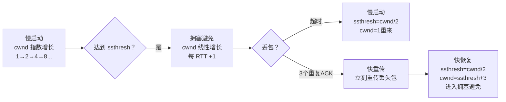

# 传输层协议（TCP / UDP）

---

## 速览

- TCP 面向连接、可靠；UDP 无连接、快速——核心权衡是可靠性 vs 速度。
- TCP 可靠性靠：序列号、确认应答、超时重传、流量控制、拥塞控制。
- TCP 流量控制用**滑动窗口**，拥塞控制用**慢启动 → 拥塞避免 → 快重传 → 快恢复**。
- TCP Keepalive ≠ HTTP Keep-Alive：前者是传输层保活，后者是应用层长连接。

---

## TCP vs UDP

> **一句话理解：** TCP 是挂号信（确认送达），UDP 是明信片（发完不管）。

**核心结论（可背）：**
| 对比维度 | TCP | UDP |
|---|---|---|
| 连接方式 | 面向连接（三次握手建立） | 无连接 |
| 可靠性 | 可靠（确认、重传、校验） | 不可靠（可能丢包、乱序） |
| 传输顺序 | 有序（序列号保证） | 不保证顺序 |
| 速度 | 较慢（连接开销 + 控制机制） | 极快 |
| 头部大小 | 最小 20 字节 | 固定 8 字节 |
| 流量控制 | 有（滑动窗口） | 无 |
| 拥塞控制 | 有（慢启动等） | 无 |
| 适用场景 | HTTP、SMTP、FTP、数据库 | DNS、视频流、游戏、直播 |

**面试官常问：**
- UDP 能实现可靠传输吗？→ 能，在应用层加序列号 + ACK + 超时重传模拟 TCP 的可靠性（QUIC 协议就是这样做的）。

---

## TCP 三次握手

> **一句话理解：** 三次握手确认双方的收发能力都正常，是建立全双工连接的最少次数。

**核心结论（可背）：**
```
客户端 → SYN(seq=x)               → 服务器   "我想连"
客户端 ← SYN+ACK(seq=y, ack=x+1)  ← 服务器   "同意，你能收到吗？"
客户端 → ACK(ack=y+1)             → 服务器   "能，连接建立"
```

**为什么是三次不是两次？**
- 两次：服务器无法确认客户端能收到消息（缺少第三次 ACK）。
- 还有历史 SYN 包的问题：若旧的 SYN 到达服务器，两次握手下服务器误认为连接建立；三次握手时客户端会拒绝，服务器及时释放。

**为什么不是四次？**
- 三次已经确认双方都能正常收发，无需第四次。

---

## TCP 四次挥手

> **一句话理解：** 四次挥手因为 TCP 全双工，双方各自关闭发送通道，所以需要各自一个 FIN+ACK。

**核心结论（可背）：**
```
客户端 → FIN          → 服务器   "我不发了"
客户端 ← ACK          ← 服务器   "收到，我还有数据要发"
客户端 ← FIN          ← 服务器   "我也发完了"
客户端 → ACK          → 服务器   "好，再见"
↑
客户端进入 TIME_WAIT（等待 2MSL）再关闭
```

**为什么需要 TIME_WAIT（2MSL）？**
1. 确保最后一个 ACK 能到达服务器（若丢失，服务器重传 FIN，客户端可以重发 ACK）。
2. 让网络中的旧数据包消亡，避免影响下一个连接。

**易错点：**
- ❌ 三次挥手就能关闭 → 服务器在收到 FIN 后可能还有数据要发，必须等发完再发 FIN，所以 ACK 和 FIN 是分开的。

---

## TCP 可靠性机制

> **一句话理解：** TCP 靠序列号+确认+重传+流控+拥塞五件套保证数据可靠有序。

**核心结论（可背）：**
| 机制 | 作用 |
|---|---|
| 序列号（Seq） | 保证数据有序重组，检测丢包 |
| 确认应答（ACK） | 通知发送方哪些数据已收到 |
| 数据校验和 | 检测传输过程中的数据损坏 |
| 超时重传 | ACK 超时则重传，保证数据不丢失 |
| 流量控制（滑动窗口） | 防止接收方被淹没 |
| 拥塞控制 | 防止网络过载 |

---

## 流量控制：滑动窗口

> **一句话理解：** 接收方通过 ACK 告知自己的接收窗口大小，发送方动态调整发送量，防止接收缓冲区溢出。

**核心结论（可背）：**
```
接收方在每次 ACK 中携带 rwnd（接收窗口大小）
发送方实际发送量 = min(cwnd拥塞窗口, rwnd接收窗口)

窗口 = 0 → 发送方停止发送，等待接收方通知新的窗口大小
```

---

## 拥塞控制：四个阶段

> **一句话理解：** 慢启动探路，拥塞避免稳增，快重传急救，快恢复快恢复——不让网络崩。

**核心结论（可背）：**


**四阶段要点（可背）：**
| 阶段 | 触发条件 | cwnd 变化 |
|---|---|---|
| 慢启动 | 新连接建立或超时 | 指数增长（每收一个 ACK +1MSS） |
| 拥塞避免 | cwnd ≥ ssthresh | 线性增长（每 RTT +1MSS） |
| 快重传 | 收到 3 个重复 ACK | 立即重传，不等超时 |
| 快恢复 | 快重传后 | ssthresh=cwnd/2，cwnd=ssthresh，直接进拥塞避免 |

**超时 vs 快重传的区别：**
- 超时：cwnd 归 1，从慢启动重来（更严重）。
- 快重传（3 个重复 ACK）：cwnd 减半，进快恢复，不归 1（更温和）。

---

## TCP Keepalive vs HTTP Keep-Alive

> **一句话理解：** 两者名字像但完全不同，一个在传输层探活，一个在应用层复用连接。

**核心结论（可背）：**
| 维度 | TCP Keepalive | HTTP Keep-Alive |
|---|---|---|
| 所属层 | 传输层 | 应用层 |
| 作用 | 检测空闲连接是否仍然有效（探活） | 在一个 TCP 连接上复用多个 HTTP 请求/响应 |
| 实现 | TCP 协议栈发送探测包 | HTTP 头 `Connection: keep-alive` |
| 触发时机 | 连接空闲一段时间后自动发送 | 客户端/服务器协商 |

---

## 面试高频考点汇总

| 考点 | 核心答案 |
|---|---|
| TCP vs UDP 核心区别？ | 连接/可靠/有序 vs 无连接/不可靠/无序；速度换可靠性 |
| 三次握手为什么不能两次？ | 两次无法确认客户端接收能力；历史连接问题 |
| 四次挥手为什么不能三次？ | 服务器 ACK 和 FIN 要分开，中间可能还有数据要发 |
| TIME_WAIT 的作用？ | 确保最后 ACK 到达；让旧数据包消亡 |
| TCP 可靠性靠什么保证？ | 序列号+ACK+校验和+超时重传+流量控制+拥塞控制 |
| 拥塞控制四阶段？ | 慢启动→拥塞避免→（丢包）→快重传+快恢复 |
| 超时和快重传的区别？ | 超时：cwnd 归 1 慢启动；快重传：cwnd 减半进快恢复 |
