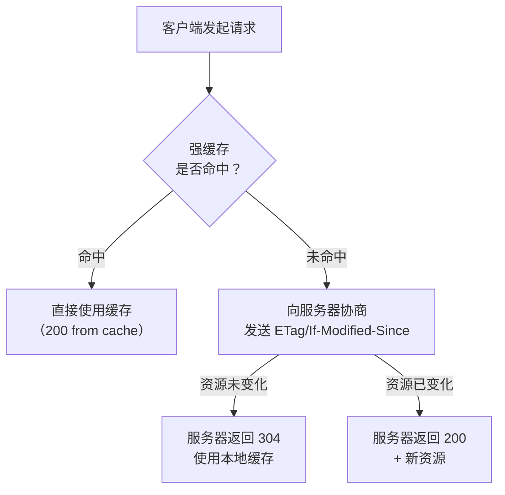

# 应用层协议

---

## 速览

- HTTP 报文 = 请求行/状态行 + 头部 + 空行 + 报文体，掌握 10 个高频状态码。
- GET vs POST：GET 幂等、参数在 URL、可缓存；POST 非幂等、参数在 body、默认不缓存。
- 缓存两类：强缓存（Cache-Control/Expires，不过服务器）、协商缓存（ETag/Last-Modified，过服务器）。
- HTTP 版本进化：1.0（短连接）→ 1.1（Keep-Alive，持久连接）→ 2.0（多路复用，二进制帧）→ 3.0（QUIC/UDP，彻底解决队头阻塞）。
- DNS 查询：先查本地缓存 → 本地 DNS → 根/顶级/权限 DNS（迭代查询）。
- Cookie（浏览器端）vs Session（服务器端）：都用于维持状态，Cookie 安全性低，Session 依赖服务器资源。

---

## HTTP 报文结构

> **一句话理解：** 请求报文 = 请求行 + 请求头 + 空行 + 请求体；响应报文 = 状态行 + 响应头 + 空行 + 响应体。

**核心结论（可背）：**
```
HTTP 请求报文：
┌─────────────────────────────┐
│ POST /api/login HTTP/1.1    │ ← 请求行：方法 + URL + 版本
├─────────────────────────────┤
│ Host: example.com           │
│ Content-Type: application/json│ ← 请求头
│ Authorization: Bearer xxx   │
├─────────────────────────────┤
│                             │ ← 空行（分隔头和体）
├─────────────────────────────┤
│ {"username":"test","pwd":""} │ ← 请求体（GET 请求无此部分）
└─────────────────────────────┘

HTTP 响应报文：
┌─────────────────────────────┐
│ HTTP/1.1 200 OK             │ ← 状态行：版本 + 状态码 + 描述
├─────────────────────────────┤
│ Content-Type: application/json│
│ Cache-Control: max-age=3600 │ ← 响应头
├─────────────────────────────┤
│                             │ ← 空行
├─────────────────────────────┤
│ {"code":0,"data":{...}}     │ ← 响应体
└─────────────────────────────┘
```

---

## 常见 HTTP 状态码

> **一句话理解：** 2xx 成功，3xx 重定向，4xx 客户端错误，5xx 服务器错误。

**核心结论（可背）：**
| 状态码 | 含义 | 典型场景 |
|---|---|---|
| **200** OK | 请求成功 | 网页加载成功、API 返回数据 |
| **301** Moved Permanently | 资源永久重定向（浏览器缓存新地址） | 旧域名跳转新域名、HTTP→HTTPS |
| **302** Found | 资源临时重定向 | 登录后跳转、OAuth 回调 |
| **304** Not Modified | 资源未修改，使用本地缓存 | 浏览器缓存验证（If-Modified-Since） |
| **400** Bad Request | 客户端请求格式错误 | 参数缺失、JSON 格式错误 |
| **401** Unauthorized | 未认证（没有凭证） | 未登录、Token 过期 |
| **403** Forbidden | 已认证但无权限 | 普通用户访问管理员接口 |
| **404** Not Found | 资源不存在 | URL 错误、资源被删除 |
| **500** Internal Server Error | 服务器内部错误 | 代码异常、数据库崩溃 |
| **503** Service Unavailable | 服务暂不可用 | 服务器维护、熔断降级 |

**易错点：**
- ❌ 401 和 403 混淆 → 401：没有身份（需要登录）；403：有身份但没权限（无权访问）。
- ❌ 301 和 302 混淆 → 301：永久重定向（浏览器缓存新地址）；302：临时重定向（不缓存）。

---

## GET vs POST

> **一句话理解：** GET 请求资源（幂等，参数在 URL），POST 提交数据（非幂等，参数在 body）。

**核心结论（可背）：**
| 维度 | GET | POST |
|---|---|---|
| 功能 | 请求/获取资源 | 提交/修改数据 |
| 幂等性 | ✅ 幂等（多次结果相同） | ❌ 非幂等（多次会重复提交） |
| 参数位置 | URL 后（?key=value） | 请求体（body） |
| 安全性 | 低（参数可见，有历史记录） | 相对高（参数不在 URL） |
| 长度限制 | 有（URL 长度受浏览器限制） | 无明确限制 |
| 缓存 | 可以缓存 | 默认不缓存 |

---

## HTTP 缓存机制

> **一句话理解：** 强缓存直接使用本地缓存，不问服务器；协商缓存先问服务器资源是否变化，没变就返回 304。

**核心结论（可背）：**


**强缓存：**
| 字段 | 作用 | 缺点 |
|---|---|---|
| `Expires` | 设置过期时间点（HTTP 1.0） | 依赖本地时钟，时钟不准会失效 |
| `Cache-Control: max-age=N` | 设置缓存有效期（相对时间，HTTP 1.1） | 推荐使用，优先级高于 Expires |

**协商缓存：**
| 字段对 | 原理 | 缺点 |
|---|---|---|
| `Last-Modified` / `If-Modified-Since` | 比较文件最后修改时间 | 秒级精度；改名再改回也会判断为已修改 |
| `ETag` / `If-None-Match` | 比较文件内容的哈希指纹 | 计算 ETag 有性能开销，但精确 |

**面试官常问：**
- ETag 和 Last-Modified 哪个优先？→ ETag 优先级更高（更精确），服务器同时返回时以 ETag 为准。

---

## HTTP 版本对比

> **一句话理解：** 每个版本都在解决上一个版本的性能瓶颈。

**核心结论（可背）：**
| 版本 | 核心改进 | 遗留问题 |
|---|---|---|
| HTTP/1.0 | 基础请求/响应；短连接（每次请求新建 TCP） | 连接开销大，无持久连接 |
| HTTP/1.1 | Keep-Alive 持久连接；管道化；Host 头 | 管道化有队头阻塞（响应必须按序） |
| HTTP/2.0 | 二进制帧；多路复用（解决应用层队头阻塞）；HPACK 头压缩；服务器推送 | TCP 层仍有队头阻塞（丢包重传） |
| HTTP/3.0 | 基于 QUIC/UDP；彻底解决 TCP 队头阻塞；0-RTT 握手 | 生态尚在成熟阶段 |

**多路复用 vs 管道化：**
```
HTTP/1.1 管道化：请求可并发发送，但响应必须按顺序返回
  → 第一个响应慢了，后续所有响应都被阻塞（队头阻塞）

HTTP/2.0 多路复用：请求/响应都有 StreamID，可乱序传输，互不影响
  → 真正解决了应用层的队头阻塞

HTTP/3.0 QUIC：基于 UDP，每个流独立丢包重传，不影响其他流
  → 解决了 TCP 层的队头阻塞（丢包不影响其他请求）
```

---

## DNS 查询

> **一句话理解：** 浏览器缓存 → OS 缓存 → 本地 DNS → 根 DNS → 顶级 DNS → 权限 DNS，层层委托，结果被缓存。

**核心结论（可背）：**
```
迭代查询（实际采用）：
  客户端 → 本地 DNS（递归查询，帮我全查完）
  本地 DNS → 根 DNS → 返回顶级 DNS 地址
  本地 DNS → 顶级 DNS → 返回权限 DNS 地址
  本地 DNS → 权限 DNS → 返回最终 IP
  本地 DNS 缓存并返回给客户端

递归查询（与迭代的区别）：
  根 DNS 自己去查顶级 DNS，层层递归直到获得结果返回
  实际上根 DNS 负载高，通常使用迭代查询

DNS 缓存层次：
  浏览器缓存 → 操作系统缓存（/etc/hosts + DNS 缓存） → 本地 DNS 服务器缓存 → ...
```

---

## Cookie vs Session

> **一句话理解：** Cookie 存在客户端（浏览器），Session 存在服务器；SessionID 通过 Cookie 传递。

**核心结论（可背）：**
| 维度 | Cookie | Session |
|---|---|---|
| 存储位置 | 浏览器（客户端） | 服务器 |
| 数据容量 | 小（约 4KB） | 大（取决于服务器配置） |
| 安全性 | 低（可被读取和篡改，XSS 风险） | 高（数据在服务器端） |
| 生命周期 | 可设置过期时间 | 依赖会话时长或用户活动 |
| 传输方式 | 每次请求自动发送（Cookie 头） | SessionID 通过 Cookie 或 URL 参数传递 |

**Session 工作流：**
```
① 用户登录 → 服务器创建 Session，生成唯一 SessionID
② 服务器将 SessionID 写入 Cookie 发给浏览器
③ 后续请求浏览器自动携带 Cookie（含 SessionID）
④ 服务器根据 SessionID 查找对应的 Session 数据
```

---

## WebSocket

> **一句话理解：** WebSocket 在 HTTP 握手后升级为全双工 TCP 长连接，服务器可主动推送数据给客户端。

**核心结论（可背）：**
```
HTTP 请求：客户端发起，服务器响应（单向请求-响应模式）
WebSocket：握手后建立持久双向通道，服务器可主动推送

握手过程：
  ① 客户端发 HTTP Upgrade 请求（Upgrade: websocket）
  ② 服务器返回 101 Switching Protocols
  ③ 连接升级为 WebSocket，保持持久双向通道

适用场景：实时聊天、在线游戏、股票行情、协同文档
```

---

## 面试高频考点汇总

| 考点 | 核心答案 |
|---|---|
| GET vs POST 核心区别？ | 幂等性；参数位置（URL vs body）；可缓存性 |
| 强缓存 vs 协商缓存？ | 强：Cache-Control，不经服务器；协商：ETag/Last-Modified，经服务器验证 |
| HTTP/2.0 核心改进？ | 多路复用（解决队头阻塞）+ 二进制帧 + 头部压缩 + 服务器推送 |
| HTTP/3.0 为什么用 UDP？ | QUIC 在 UDP 上自己实现可靠传输，每个流独立，丢包不阻塞其他流 |
| DNS 迭代 vs 递归？ | 迭代：本地 DNS 自己去问各级；递归：根 DNS 帮你问完整个链路 |
| Cookie vs Session？ | Cookie 存客户端（安全性低）；Session 存服务器（SessionID 通过 Cookie 传） |
| 304 什么时候返回？ | 协商缓存命中时：服务器验证资源未变化，返回 304，客户端使用本地缓存 |
