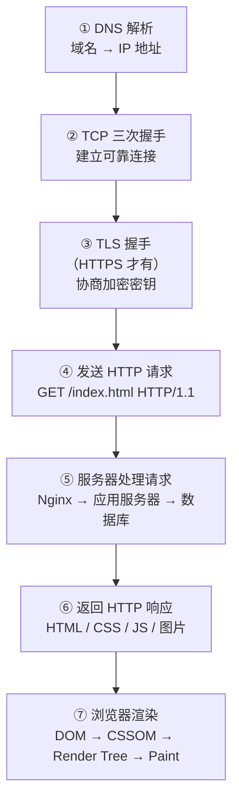

# 输入 URL 到页面显示发生了什么

---

## 速览

- 这是计算机网络最高频的综合考题，能串联 DNS、TCP、HTTP、TLS、浏览器渲染全链路。
- 回答时按七个阶段展开，每个阶段可根据面试官追问深入展开。
- 关键词：DNS 解析 → TCP 三次握手 → TLS 握手（HTTPS）→ HTTP 请求/响应 → 浏览器渲染。

---

## 七阶段流程

> **一句话理解：** 从 URL 到页面，经历了域名解析、建立连接、发送请求、接收响应、渲染页面五大核心过程。

**核心结论（可背）：**



---

## ① DNS 解析

> **一句话理解：** 把域名翻译成 IP 地址，查缓存优先，无缓存才递归查询。

**核心结论（可背）：**
```
查询顺序（就近原则）：
  浏览器 DNS 缓存
    → 系统 hosts 文件
      → 操作系统 DNS 缓存
        → 路由器缓存
          → ISP DNS 服务器
            → 根 DNS → 顶级域 DNS → 权威 DNS
```

**面试官常问：**
- DNS 用什么协议？→ UDP（默认）；响应超 512 字节或区域传输用 TCP。
- DNS 递归查询和迭代查询的区别？→ 客户端到 Local DNS 是递归（由 Local DNS 代查）；Local DNS 到上级是迭代（自己一步步查）。

---

## ② TCP 三次握手

> **一句话理解：** 三次握手确认双方都能收发，建立可靠全双工连接。

**核心结论（可背）：**
```
客户端 → SYN(seq=x)              → 服务器    "我要连"
客户端 ← SYN+ACK(seq=y,ack=x+1) ← 服务器    "我同意，你能收到吗"
客户端 → ACK(ack=y+1)            → 服务器    "能，连接建立"
```

**为什么是三次不是两次？**
两次握手无法确认客户端能收到服务器的数据，存在历史连接请求误触发的风险。三次是建立可靠连接的最少次数。

---

## ③ TLS 握手（HTTPS）

> **一句话理解：** 握手阶段用非对称加密安全交换密钥，之后用对称加密高效传数据。

**核心结论（可背）：**
```
① Client Hello   → 发送支持的 TLS 版本、加密套件、随机数 C
② Server Hello   ← 选定加密套件、随机数 S、发送证书（含公钥）
③ 证书验证       → 客户端验证 CA 签名、域名、有效期
④ 密钥交换       → 客户端用公钥加密预主密钥发给服务器
⑤ 会话密钥生成   → 双方用 C + S + 预主密钥推导出会话密钥
⑥ 握手完成       → 双方确认，后续用会话密钥对称加密通信
```

**为什么握手用非对称，通信用对称？**
非对称加密安全但慢，只用于安全地传递密钥；对称加密快，用于大量数据加密。

---

## ④⑤⑥ HTTP 请求与响应

> **一句话理解：** 客户端发报文，服务器处理后返回资源。

**请求报文结构：**
```
GET /index.html HTTP/1.1
Host: www.example.com
User-Agent: Mozilla/5.0
Accept: text/html
```

**服务器处理链路：**
```
Nginx（反向代理/负载均衡）→ 应用服务器（业务逻辑）→ 数据库 / 缓存 → 响应
```

---

## ⑦ 浏览器渲染

> **一句话理解：** 拿到 HTML/CSS/JS 后，浏览器按固定流水线把它变成像素。

**核心结论（可背）：**
```
HTML 解析 → DOM Tree
CSS 解析  → CSSOM Tree
           ↓
      Render Tree（DOM + CSSOM 合并，只含可见节点）
           ↓
      Layout（计算每个元素的位置和尺寸）
           ↓
      Paint（将元素绘制成位图）
           ↓
      Composite（图层合成，显示到屏幕）
```

**阻塞关系（重要）：**
- CSS 阻塞渲染：CSSOM 未构建完毕，Render Tree 无法生成。
- JS 阻塞 HTML 解析：遇到 `<script>` 默认立即执行，阻塞后续 HTML 解析。
- 解决：`<script defer>` 延迟执行；`<script async>` 异步加载。

---

## 性能优化拓展（可主动引导）

| 优化手段 | 原理 |
|---|---|
| HTTP 缓存（强缓存/协商缓存） | 减少重复请求，304 Not Modified |
| CDN | 静态资源就近分发，减少 RTT |
| 懒加载（Lazy Load） | 图片/组件按需加载，减少首屏资源 |
| JS/CSS 压缩合并 | 减小文件体积，减少请求数 |
| `defer` / `async` | 避免 JS 阻塞页面渲染 |

---

## 面试高频考点汇总

| 考点 | 核心答案 |
|---|---|
| DNS 查询顺序？ | 浏览器缓存→系统缓存→路由器→ISP DNS→根→权威 DNS |
| 三次握手为什么不能两次？ | 两次无法确认客户端接收能力，且无法防历史连接 |
| TLS 为什么握手用非对称、通信用对称？ | 非对称安全但慢（只传密钥）；对称快（大量数据加密） |
| 浏览器渲染流程？ | HTML→DOM，CSS→CSSOM，合并→Render Tree→Layout→Paint→Composite |
| JS 为什么阻塞渲染？怎么解决？ | 默认同步执行，用 `defer`/`async` 解决 |
| CSS 为什么阻塞渲染？ | CSSOM 未就绪则无法生成 Render Tree |
