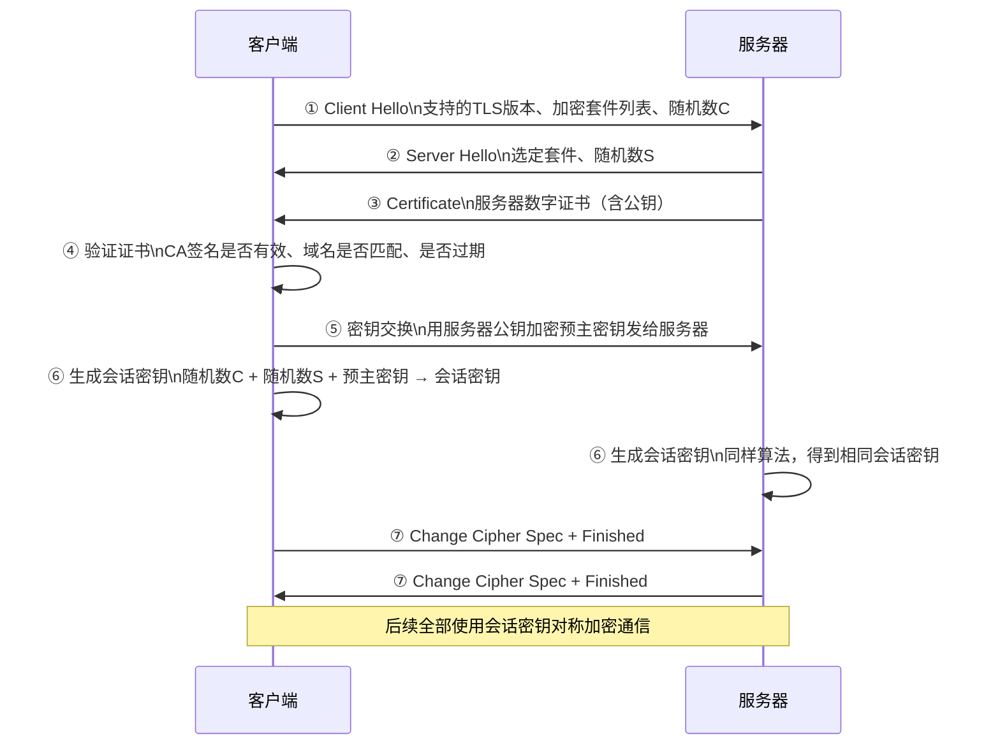

# 网络安全（HTTPS / TLS）

---

## 速览

- HTTPS = HTTP + SSL/TLS，解决三大风险：窃听、篡改、冒充。
- TLS 握手用**非对称加密**安全传递密钥，通信用**对称加密**高效传数据（混合加密）。
- 证书由 CA 颁发，客户端验证证书确认服务器身份合法。
- HTTP/3（QUIC）将 TLS 1.3 内置，握手 1-RTT 甚至 0-RTT。

---

## HTTP vs HTTPS

> **一句话理解：** HTTP 是明文裸奔，HTTPS 是加密通道，现代 Web 标配 HTTPS。

**核心结论（可背）：**
| 特性 | HTTP | HTTPS |
|---|---|---|
| 安全性 | 明文传输，易窃听篡改 | 加密传输，安全 |
| 端口 | 80 | 443 |
| 协议层 | 直接 TCP | TCP + SSL/TLS |
| 证书 | 不需要 | 必须配置 CA 证书 |
| 握手开销 | TCP 三次握手即可 | TCP 握手 + TLS 握手 |
| 浏览器标识 | "不安全"警告 | 锁形图标 |

**HTTPS 解决三大安全问题：**
```
窃听风险    → 混合加密（对称+非对称）
篡改风险    → 摘要算法（数字指纹校验完整性）
冒充风险    → CA 数字证书验证服务器身份
```

---

## HTTPS 混合加密原理

> **一句话理解：** 握手时用非对称加密安全地交换对称密钥，之后全程对称加密通信。

**核心结论（可背）：**
```
非对称加密（RSA / ECDHE）：
  公钥加密，私钥解密
  安全但慢（计算复杂）→ 只用于握手阶段传递密钥

对称加密（AES 等）：
  加解密用同一密钥
  快，适合大量数据 → 用于正式通信

混合方案：
  握手 → 非对称安全交换会话密钥
  通信 → 对称加密高效传输数据
```

**面试官常问：**
- 为什么握手用非对称，通信用对称？→ 非对称安全但慢，只用于安全传密钥；对称快，用于大量数据加密。

---

## TLS 握手过程

> **一句话理解：** 握手目的就是让双方安全地协商出一个只有彼此知道的会话密钥。

**核心结论（可背）：**



**证书验证三步（必背）：**
1. CA 签名验证：证书是否由受信任的 CA 机构签发。
2. 有效期验证：证书是否在有效期内。
3. 域名验证：证书中的域名是否与访问的域名一致。

**易错点：**
- ❌ 以为 HTTPS 全程用非对称加密 → 握手才用非对称，正式通信全用对称。
- ❌ 以为会话密钥是直接传输的 → 会话密钥不在网络中传输，双方各自用相同算法推导出来。

---

## CA 数字证书

> **一句话理解：** CA 是权威第三方，给服务器的公钥盖章背书，客户端信任 CA 就信任服务器。

**核心结论（可背）：**
```
证书内容：
  ├── 服务器公钥
  ├── 服务器域名
  ├── 证书有效期
  ├── 颁发机构（CA）
  └── CA 对以上内容的数字签名（用 CA 私钥签）

验证方式：
  客户端用 CA 公钥（内置在操作系统/浏览器）
  解密证书签名 → 验证证书真实性
```

**为什么需要 CA？**
防止中间人伪造服务器证书。没有 CA 背书，客户端无法判断公钥是否来自真实服务器。

---

## HTTP/3 与 QUIC

> **一句话理解：** HTTP/3 基于 QUIC（UDP），内置 TLS 1.3，握手更快，解决了 TCP 的队头阻塞。

**核心结论（可背）：**
| 版本 | 传输层 | TLS | 握手 RTT |
|---|---|---|---|
| HTTP/1.1 | TCP | 外置 TLS | TCP(1.5RTT) + TLS(2RTT) |
| HTTP/2 | TCP | 外置 TLS | TCP(1.5RTT) + TLS(1RTT，TLS1.3) |
| HTTP/3 | QUIC（UDP） | 内置 TLS 1.3 | 1-RTT，可 0-RTT |

- **0-RTT**：重连时复用之前的会话信息，首包即携带数据，延迟极低。

---

## 面试高频考点汇总

| 考点 | 核心答案 |
|---|---|
| HTTPS 解决哪三个问题？ | 窃听（加密）、篡改（摘要算法）、冒充（CA 证书） |
| 为什么握手用非对称、通信用对称？ | 非对称安全但慢，只传密钥；对称快，用于数据加密 |
| TLS 握手流程？ | Client Hello → Server Hello + 证书 → 验证证书 → 密钥交换 → 生成会话密钥 → 完成 |
| 会话密钥是如何生成的？ | 客户端随机数 + 服务器随机数 + 预主密钥 → 双方各自推导，不经网络传输 |
| CA 的作用？ | 权威第三方给公钥背书，防止中间人伪造 |
| HTTP/3 为什么快？ | 基于 UDP + QUIC，内置 TLS 1.3，1-RTT 或 0-RTT，无队头阻塞 |
