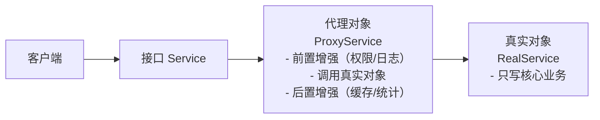

# 代理模式

---

## 速览

- 代理模式 = 在访问对象前插入一层代理，控制访问并添加增强逻辑。
- 分静态代理（编译期生成）和动态代理（运行期反射生成）。
- Java 动态代理两种：JDK 动态代理（基于接口）、CGLIB（基于继承）。
- Spring AOP、`@Transactional`、RPC 框架都是代理模式的典型应用。

---

## 代理模式结构

> **一句话理解：** 客户端只和代理打交道，代理在核心业务前后插入增强逻辑，真实对象专注业务。

**核心结论（可背）：**


**三个角色：**
| 角色 | 职责 |
|---|---|
| 抽象主题（Subject） | 定义代理和真实对象的公共接口 |
| 真实主题（RealSubject） | 实现核心业务逻辑，不关心增强逻辑 |
| 代理（Proxy） | 持有真实对象引用，实现增强逻辑，控制访问 |

---

## 示例代码

**机制解释：**
```java
// 抽象主题
interface Service {
    void doWork();
}

// 真实主题：只写核心业务
class RealService implements Service {
    @Override
    public void doWork() {
        System.out.println("执行真实核心业务");
    }
}

// 代理：增强逻辑 + 调用真实对象
class ProxyService implements Service {
    private final Service realService;

    public ProxyService(Service realService) {
        this.realService = realService;
    }

    @Override
    public void doWork() {
        System.out.println("前置增强：权限校验 / 日志记录");
        realService.doWork();   // 核心业务委托给真实对象
        System.out.println("后置增强：缓存结果 / 统计耗时");
    }
}

// 客户端：只和代理交互
Service proxy = new ProxyService(new RealService());
proxy.doWork();
```

---

## 静态代理 vs 动态代理

> **一句话理解：** 静态代理手写麻烦扩展差，动态代理运行期自动生成，是实际开发的选择。

**核心结论（可背）：**
| 维度 | 静态代理 | 动态代理 |
|---|---|---|
| 生成时机 | 编译期，手动编写 | 运行期，JVM 反射自动生成 |
| 扩展性 | 差，真实类新增方法需同步修改代理类 | 好，一个代理类可代理任意真实类 |
| 类数量 | 每个真实类一个代理类，类爆炸 | 动态生成，无需额外类 |
| 性能 | 略好（无反射） | 稍有反射开销，可忽略 |
| 适用场景 | 业务固定、代理逻辑简单 | 通用增强（日志、权限、事务） |

---

## JDK 动态代理 vs CGLIB

**核心结论（可背）：**
| 维度 | JDK 动态代理 | CGLIB |
|---|---|---|
| 实现原理 | 基于接口，实现同一接口 | 基于继承，生成子类 |
| 要求 | 目标类必须实现接口 | 目标类不能是 final |
| 生成方式 | `java.lang.reflect.Proxy` | 字节码增强（ASM） |
| 性能 | JDK 8+ 后差距不大 | 无接口时唯一选择 |

**Spring 的选择逻辑：**
```
目标类实现了接口 → 默认 JDK 动态代理
目标类没有接口   → CGLIB
Spring Boot 2.x 默认全用 CGLIB（可配置）
```

---

## 四种代理类型

**核心结论（可背）：**
| 类型 | 用途 |
|---|---|
| 远程代理（Remote Proxy） | 本地调用远程服务，屏蔽网络细节（RPC 框架的核心） |
| 虚拟代理（Virtual Proxy） | 延迟创建开销大的对象（懒加载） |
| 保护代理（Protection Proxy） | 控制访问权限，权限不足则拒绝 |
| 智能引用（Smart Reference） | 调用时附加额外操作，如引用计数 |

---

## 面试官常问

**Q: 代理模式和装饰者模式有什么区别？**
> - **代理模式**：核心是**控制访问**，代理决定是否调用真实对象，增强逻辑是辅助（权限、日志）。
> - **装饰者模式**：核心是**功能扩展**，装饰者增强真实对象的核心功能，两者都实现接口动态叠加。

**Q: 静态代理 vs 动态代理，为什么选动态代理？**
> 业务频繁迭代，新增接口方法时，静态代理需同步修改所有代理类，维护成本高；动态代理自动适配，无需修改。

**Q: Spring 中哪里用了代理模式？**
> `@Transactional` — Spring 为带注解的 Bean 生成代理对象，代理在方法调用前开启事务，调用后提交/回滚。AOP 切面同理。

**Q: 你在项目中用过代理模式吗？**
> 用动态代理统一处理日志和权限校验，为所有业务类生成代理，在调用核心方法前验证 token 和权限，业务类只需关注核心逻辑。

---

## 易错点

- ❌ 代理 = 装饰者 → 代理控制访问，装饰者扩展功能；意图不同。
- ❌ 以为 JDK 动态代理不需要接口 → JDK 代理要求目标类必须实现接口，否则用 CGLIB。
- ❌ 以为代理修改了真实对象的代码 → 代理模式的核心是**不修改**真实对象，符合开闭原则。

---

## 面试高频考点汇总

| 考点 | 核心答案 |
|---|---|
| 代理模式的作用？ | 控制对象访问，在不修改真实对象的前提下添加增强逻辑 |
| 静态 vs 动态代理？ | 编译期手写 vs 运行期反射生成；扩展性差 vs 好 |
| JDK vs CGLIB？ | 基于接口 vs 基于继承；有接口用 JDK，无接口用 CGLIB |
| 代理 vs 装饰者？ | 控制访问 vs 功能扩展 |
| Spring 中的应用？ | @Transactional、AOP 切面，都是动态代理 |
