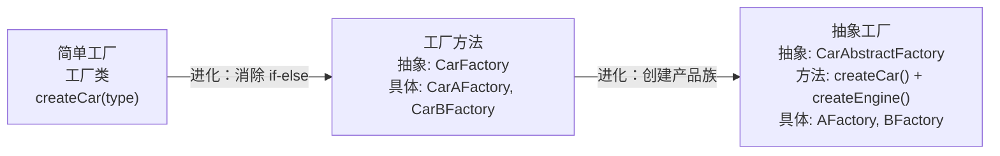

# 工厂模式

---

## 速览

- 工厂模式 = 将对象创建逻辑封装，客户端只知道接口，不知道具体实现类。
- 三种形式：简单工厂（静态方法，违反开闭）→ 工厂方法（一厂一产品，符合开闭）→ 抽象工厂（一厂一产品族）。
- 核心价值：创建与使用分离、扩展新产品不修改已有代码（开闭原则）。
- Spring 应用：BeanFactory（简单工厂+工厂方法）、FactoryBean（工厂方法，处理复杂 Bean 创建）。
- 不适合场景：创建逻辑极简（一行 new）、产品类型极少且固定。

---

## 三种工厂模式对比

> **一句话理解：** 简单工厂一个类管所有，工厂方法一个类管一种，抽象工厂一个类管一族产品。

**核心结论（可背）：**
| 模式 | 角色 | 扩展性 | 适用场景 |
|---|---|---|---|
| 简单工厂 | 一个工厂类 + if-else | ❌ 新增产品要改工厂类（违反开闭原则） | 产品类型少且固定 |
| 工厂方法 | 抽象工厂接口 + 多个具体工厂 | ✅ 新增产品只需新增工厂类 | 产品类型多，频繁扩展 |
| 抽象工厂 | 抽象工厂接口 + 多个具体工厂（每个管一族） | ✅ 产品族扩展符合开闭；❌ 产品等级扩展需改所有代码 | 创建一组相关产品（产品族） |



---

## 简单工厂模式

> **一句话理解：** 一个工厂类通过 if-else（或 switch）根据参数创建不同产品，简单但违反开闭原则。

**核心结论（可背）：**
```java
// 产品接口
interface Car {
    void drive();
}

// 具体产品
class CarA implements Car {
    public void drive() { System.out.println("驾驶A车"); }
}
class CarB implements Car {
    public void drive() { System.out.println("驾驶B车"); }
}

// 简单工厂：用静态方法集中创建逻辑
class CarFactory {
    public static Car createCar(String type) {
        if ("CarA".equals(type)) return new CarA();
        else if ("CarB".equals(type)) return new CarB();
        return null;
    }
}

// 客户端：不需要知道 CarA、CarB 的存在
Car car = CarFactory.createCar("CarA");
car.drive();
```

**三个角色：**
| 角色 | 职责 |
|---|---|
| 工厂类（Factory） | 核心，封装创建逻辑，可被客户端直接调用 |
| 抽象产品（Product） | 所有具体产品的父类/接口，定义公共方法 |
| 具体产品（ConcreteProduct） | 实际被创建的对象，实现产品接口 |

**缺点：**
- 新增产品必须修改工厂类的 if-else → **违反开闭原则**。

**JDK 中的应用：**
```
DateFormat.getInstance()    → 根据参数返回不同格式的 DateFormat
Calendar.getInstance()      → 根据地区参数返回不同的 Calendar 实现
```

---

## 工厂方法模式

> **一句话理解：** 把工厂类变成抽象接口，每种产品对应一个具体工厂类，新增产品只需新增工厂类，不改已有代码。

**核心结论（可背）：**
```java
// 工厂接口
interface CarFactory {
    Car createCar();  // 无需传参，每个工厂只创建一种产品
}

// 具体工厂：一个工厂对应一个产品
class CarAFactory implements CarFactory {
    public Car createCar() { return new CarA(); }
}
class CarBFactory implements CarFactory {
    public Car createCar() { return new CarB(); }
}

// 客户端：通过工厂接口获取产品，不直接依赖具体产品类
CarFactory factory = new CarBFactory();  // 替换工厂即换产品
Car car = factory.createCar();
car.drive();

// 新增产品：只需新增 CarC + CarCFactory，不改任何已有代码 ✅
```

**四个角色：**
| 角色 | 职责 |
|---|---|
| 抽象工厂（Factory Interface） | 定义创建产品的方法签名 |
| 具体工厂（ConcreteFactory） | 实现创建方法，创建对应产品 |
| 抽象产品（Product Interface） | 产品的公共接口 |
| 具体产品（ConcreteProduct） | 工厂创建的实际对象 |

**JDK 中的应用：**
```
Collection.iterator() → 每个具体集合（ArrayList、LinkedList）实现自己的 iterator()
  ArrayList.iterator()   → 返回 ArrayList 专用迭代器
  LinkedList.iterator()  → 返回 LinkedList 专用迭代器
```

---

## 抽象工厂模式

> **一句话理解：** 一个工厂接口创建一组相关产品（产品族），保证同族产品的一致性。

**核心结论（可背）：**
```java
// 抽象工厂接口：创建一族产品
interface CarAbstractFactory {
    Car createCar();      // 产品族的第一个产品
    Engine createEngine(); // 产品族的第二个产品
}

// 具体工厂：创建 A 系列产品族
class AFactory implements CarAbstractFactory {
    public Car createCar()       { return new CarA(); }
    public Engine createEngine() { return new AEngine(); }
}

// 客户端：通过抽象工厂接口使用产品族，保证一致性
CarAbstractFactory factory = new AFactory(); // 切换整个产品族
Car car = factory.createCar();       // 得到 A 系列车
Engine engine = factory.createEngine(); // 得到 A 系列发动机
```

**扩展性注意：**
```
产品族扩展（新增 C 工厂）→ 符合开闭原则，新增 CFactory 类即可
产品等级扩展（新增 Tire 轮胎接口）→ 违反开闭原则，需修改所有工厂接口和实现类
```

---

## Spring 中的应用

> **一句话理解：** BeanFactory 是简单工厂+工厂方法的结合，FactoryBean 是自定义复杂 Bean 的工厂方法。

**核心结论（可背）：**
```
BeanFactory（Spring IoC 根接口）：
  是简单工厂 + 工厂方法的结合体
  getBean("userService") → 返回对应的 Bean 对象
  封装了 Bean 的创建、初始化、依赖注入等全部过程
  客户端不需要知道 Bean 如何被创建

FactoryBean（Spring 扩展接口）：
  用于创建某个特定的、创建逻辑复杂的 Bean
  实现 getObject() 方法定义具体创建逻辑
  Spring 调用 getObject() 获取 Bean 实例
  例如：MyBatis 的 SqlSessionFactoryBean 就是 FactoryBean
```

---

## 使用场景与选择

> **一句话理解：** 产品少且固定用简单工厂，需要扩展用工厂方法，需要一组相关产品用抽象工厂。

**核心结论（可背）：**
```
工厂模式的本质：根据不同条件创建不同对象，封装创建逻辑

适用：
  ✅ 根据配置/参数/环境选择不同数据库连接
  ✅ 根据文件类型选择不同解析器
  ✅ 根据日志级别选择不同日志记录器
  ✅ 不知道要创建哪个具体类，由配置/运行时决定

不适用：
  ❌ 创建逻辑就一行 new Xxx()（过度设计）
  ❌ 产品类型极少且永远不会扩展
  ❌ 小型工具类项目（增加类的数量反而增加复杂度）
```

---

## 工厂模式 vs 单例 vs 原型

**核心结论（可背）：**
| 模式 | 核心目标 |
|---|---|
| 工厂模式 | 按需创建不同类型的**全新对象**，统一对象的生产和封装创建细节 |
| 单例模式 | 确保**全局只有一个实例**，核心做对象的全局复用 |
| 原型模式 | 基于已有对象**克隆**生成新对象，高效复制复杂对象 |

---

## 面试高频考点汇总

| 考点 | 核心答案 |
|---|---|
| 三种工厂模式的区别？ | 简单工厂：一类管所有（违反开闭）；工厂方法：一厂一产品（符合开闭）；抽象工厂：一厂一族（扩展族符合，扩展等级违反） |
| 工厂方法 vs 简单工厂？ | 工厂方法将工厂抽象化，新增产品不需要修改工厂类，符合开闭原则 |
| 抽象工厂的限制？ | 适合产品族扩展，不适合产品等级扩展（后者需改所有工厂接口和实现） |
| Spring 中的工厂模式应用？ | BeanFactory（简单工厂+工厂方法，管理所有 Bean）；FactoryBean（自定义复杂 Bean 创建） |
| 什么时候不用工厂模式？ | 创建逻辑极简（一行 new）、产品类型极少且固定、小型工具项目 |
| 工厂模式的设计原则？ | 开闭原则（扩展不修改）、单一职责（工厂专注创建）、依赖倒置（依赖接口不依赖实现） |
