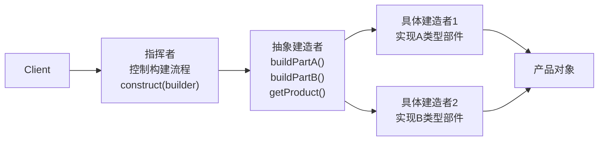

# 建造者模式

---

## 速览

- 建造者模式 = 将复杂对象的构建过程分步拆解，不同建造者实现不同部件，同一流程构建不同表示。
- 解决的问题：多参数构造器臃肿（Telescoping Constructor 反模式）。
- 四个角色：产品、抽象建造者、具体建造者、指挥者。
- 现代用法：链式调用的 Builder（Lombok `@Builder`、JDK StringBuilder）更常见。

---

## 模式结构

> **一句话理解：** 客户端告诉指挥者"我要 A 类型产品"，指挥者按固定流程调用建造者各个步骤，建造者组装对应部件。

**核心结论（可背）：**



**四个角色：**
| 角色 | 职责 |
|---|---|
| 产品（Product） | 被构建的复杂对象，包含多个部件 |
| 抽象建造者（Builder） | 定义构建步骤的模板方法 |
| 具体建造者（ConcreteBuilder） | 实现步骤，构建特定类型的产品部件 |
| 指挥者（Director） | 控制构建顺序，客户端只和它交互 |

---

## 示例代码

**机制解释：**
```java
// 产品：复杂对象
class Product {
    private String partA;
    private String partB;
    public void setPartA(String a) { this.partA = a; }
    public void setPartB(String b) { this.partB = b; }
}

// 抽象建造者：定义构建步骤
abstract class Builder {
    protected Product product = new Product();
    public abstract void buildPartA();
    public abstract void buildPartB();
    public Product getProduct() { return product; }
}

// 具体建造者1：构建 A 类型产品
class ConcreteBuilder1 extends Builder {
    public void buildPartA() { product.setPartA("部件A-类型1"); }
    public void buildPartB() { product.setPartB("部件B-类型1"); }
}

// 指挥者：控制流程，客户端只和它交互
class Director {
    public Product construct(Builder builder) {
        builder.buildPartA();   // 固定顺序
        builder.buildPartB();
        return builder.getProduct();
    }
}

// 客户端：替换建造者就能得到不同产品，流程不变
Director director = new Director();
Product p1 = director.construct(new ConcreteBuilder1());
Product p2 = director.construct(new ConcreteBuilder2());
```

---

## 现代用法：链式 Builder

> **一句话理解：** 实际开发中更常用链式调用的 Builder 模式，不需要指挥者，由客户端自行组装。

**核心结论（可背）：**
```java
// 链式 Builder（更常见，如 Lombok @Builder）
Person person = new Person.Builder()
    .name("张三")
    .age(25)
    .email("zhang@example.com")
    .build();

// 内部实现：
class Person {
    private String name;
    private int age;
    private String email;

    private Person() {}

    public static class Builder {
        private String name;
        private int age;
        private String email;

        public Builder name(String name) { this.name = name; return this; }
        public Builder age(int age) { this.age = age; return this; }
        public Builder email(String email) { this.email = email; return this; }

        public Person build() {
            Person p = new Person();
            p.name = this.name;
            p.age = this.age;
            p.email = this.email;
            return p;
        }
    }
}
```

**链式 Builder 解决的问题：**
```
// 问题：多参数构造器（Telescoping Constructor 反模式）
new HttpRequest("POST", "/api", headers, body, timeout, retries, encoding...)
// 参数顺序容易搞错，可读性差

// 解决：Builder 链式调用
new HttpRequest.Builder()
    .method("POST")
    .url("/api")
    .timeout(3000)
    .build()
// 参数语义清晰，可选参数灵活
```

---

## 建造者模式 vs 工厂模式

**核心结论（可背）：**
| 维度 | 建造者模式 | 工厂模式 |
|---|---|---|
| 关注点 | 复杂对象的**构建过程**（分步骤） | 快速**创建**对象（直接返回） |
| 对象复杂度 | 多部件、多配置的复杂对象 | 通常是单一对象 |
| 客户端感知 | 可以控制每个构建步骤 | 只需说明类型，不关心过程 |
| 典型场景 | HTTP 请求对象、SQL 查询构建器 | 数据库连接对象、各类 DAO 对象 |

---

## 使用场景

| 场景 | 示例 |
|---|---|
| 多参数对象构建 | HTTP 请求、SQL Builder、配置对象 |
| 同一流程，不同表示 | 游戏角色（战士/法师/刺客），步骤相同但部件不同 |
| 对象构建步骤需要严格控制顺序 | 文档生成（标题→摘要→正文→附录） |

**框架中的典型应用：**
- `StringBuilder`：链式 append，最终 toString() 得到字符串。
- Lombok `@Builder`：自动生成链式 Builder。
- MyBatis `SqlSessionFactoryBuilder`：构建复杂的 SqlSessionFactory。

---

## 易错点

- ❌ 建造者模式 = 工厂模式 → 工厂关注"创建什么"，建造者关注"怎么构建"（步骤和顺序）。
- ❌ 以为必须有指挥者类 → 现代链式 Builder 通常省略指挥者，客户端直接链式调用。
- ❌ 所有多参数对象都用建造者 → 只有参数多且需要灵活组合时才值得引入；简单对象直接构造器即可。

---

## 面试高频考点汇总

| 考点 | 核心答案 |
|---|---|
| 建造者模式的四个角色？ | 产品、抽象建造者、具体建造者、指挥者 |
| 解决什么问题？ | 多参数构造器臃肿；复杂对象分步构建，同流程不同实现 |
| 建造者 vs 工厂？ | 构建过程（步骤） vs 直接创建（类型）；复杂 vs 简单 |
| 现代用法？ | 链式 Builder，省略指挥者，客户端流式调用 |
| 框架中的应用？ | StringBuilder、Lombok @Builder、MyBatis Builder |
