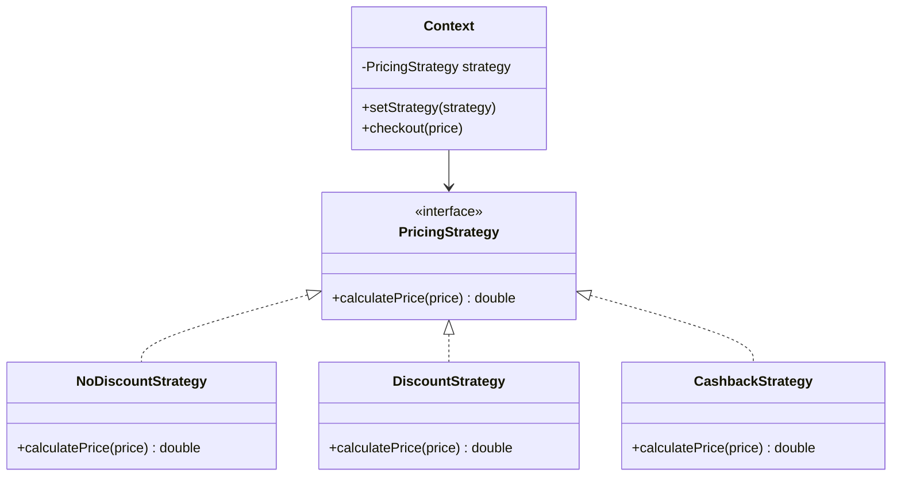

# 策略模式

---

## 速览

- 策略模式 = 把一族算法封装成独立类，通过接口互相替换，消灭 if-else 链。
- 三个角色：策略接口（定义算法）、具体策略（实现算法）、上下文（持有并调用策略）。
- 核心价值：对修改关闭，对扩展开放——新增算法只需新增策略类，不修改已有代码。
- 策略类过多时，结合工厂模式 + Map 缓存解决。

---

## 模式结构

> **一句话理解：** 把可变的算法抽出来，让上下文只依赖接口，运行时动态切换行为。

**核心结论（可背）：**



**三个角色：**
| 角色 | 职责 |
|---|---|
| 策略接口（Strategy） | 定义所有策略的统一方法签名 |
| 具体策略（ConcreteStrategy） | 实现具体算法，互相可替换 |
| 上下文（Context） | 持有策略引用，调用策略执行算法 |

---

## 示例代码（促销计价）

**机制解释：**
```java
// 策略接口
interface PricingStrategy {
    double calculatePrice(double price);
}

// 具体策略：无折扣
class NoDiscountStrategy implements PricingStrategy {
    public double calculatePrice(double price) { return price; }
}

// 具体策略：九折
class DiscountStrategy implements PricingStrategy {
    public double calculatePrice(double price) { return price * 0.9; }
}

// 具体策略：满 200 减 50
class CashbackStrategy implements PricingStrategy {
    public double calculatePrice(double price) {
        return price >= 200 ? price - 50 : price;
    }
}

// 上下文：持有策略，运行时切换
class ShoppingCart {
    private PricingStrategy strategy;
    public void setStrategy(PricingStrategy strategy) { this.strategy = strategy; }
    public double checkout(double price) { return strategy.calculatePrice(price); }
}

// 客户端：动态注入策略
ShoppingCart cart = new ShoppingCart();
cart.setStrategy(new DiscountStrategy());    // 随时可以换策略
cart.checkout(100);   // → 90.0
```

---

## 策略模式 vs if-else

> **一句话理解：** if-else 是硬编码，新增条件必须修改已有代码；策略模式只需新增类。

**核心结论（可背）：**
```
// 反模式：if-else 链（违反开闭原则）
if (type.equals("no_discount")) {
    return price;
} else if (type.equals("discount")) {
    return price * 0.9;
} else if (type.equals("cashback")) {
    return price >= 200 ? price - 50 : price;
}
// 每次新增促销类型都要改这里 ❌

// 策略模式（符合开闭原则）
Map<String, PricingStrategy> strategies = new HashMap<>();
strategies.put("no_discount", new NoDiscountStrategy());
strategies.put("discount", new DiscountStrategy());
// 新增策略 → 只需新增类 + 注册，不修改已有代码 ✅
PricingStrategy strategy = strategies.get(type);
return strategy.calculatePrice(price);
```

---

## 策略类过多的解决方案

> **一句话理解：** 策略工厂 + Map 缓存 + 参数化，三层优化解决策略爆炸。

**核心结论（可背）：**
```
第一层：策略工厂（封装策略创建逻辑）
  StrategyFactory.getStrategy("discount") → 返回对应策略对象

第二层：Map 缓存（项目启动时注册，O(1) 查询）
  Map<String, PricingStrategy> strategyMap = new HashMap<>();
  strategyMap.put("discount", new DiscountStrategy());

第三层：参数化复用（同一策略类，不同参数）
  new DiscountStrategy(0.9)   // 九折
  new DiscountStrategy(0.8)   // 八折
  // 不需要新建两个类
```

---

## 使用场景

| 场景 | 示例 |
|---|---|
| 多种算法可互换 | 排序算法切换（快排/归并/堆排） |
| 替代复杂 if-else/switch | 促销策略、支付方式、消息发送渠道 |
| 不暴露算法实现细节 | 加密算法、压缩算法 |
| 同类行为多种实现 | 不同的日志输出格式（JSON/文本/CSV） |

---

## 易错点

- ❌ 以为策略模式必须运行时切换 → 编译期固定策略也可以，只要结构符合即可。
- ❌ 策略模式和工厂模式混用时搞不清职责 → 工厂负责**创建**策略对象，策略模式负责**使用**策略。
- ❌ 一看到 if-else 就用策略模式 → 仅 2-3 个简单条件不值得引入策略模式，避免过度设计。

---

## 面试高频考点汇总

| 考点 | 核心答案 |
|---|---|
| 策略模式的三个角色？ | 策略接口、具体策略、上下文 |
| 解决什么问题？ | 消灭 if-else，让算法可替换，符合开闭原则 |
| 策略类过多怎么办？ | 策略工厂 + Map 缓存 + 参数化复用 |
| 策略模式 vs 模板方法模式？ | 策略：整体算法可替换（组合）；模板：骨架固定，步骤可变（继承） |
| 项目中如何应用？ | 促销策略、支付渠道选择、消息发送方式等 if-else 多的地方 |
