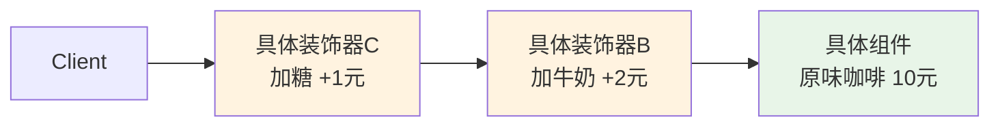

# 装饰器模式

---

## 速览

- 装饰器模式 = 通过包装对象动态叠加功能，替代继承，解决类爆炸问题。
- 核心思想：组合优于继承——n 个装饰器可以实现 2ⁿ 种功能组合。
- 装饰器和被装饰对象实现同一接口，客户端无感知差异。
- Java IO 流（BufferedInputStream、DataInputStream）就是典型应用。

---

## 模式结构

> **一句话理解：** 装饰器持有被装饰对象的引用，在调用时叠加自己的功能，就像俄罗斯套娃。

**核心结论（可背）：**



**四个角色：**
| 角色 | 职责 |
|---|---|
| 组件接口（Component） | 定义被装饰对象和装饰器的公共接口 |
| 具体组件（ConcreteComponent） | 只包含核心基础功能 |
| 抽象装饰器（Decorator） | 持有组件引用，实现组件接口，供具体装饰器继承 |
| 具体装饰器（ConcreteDecorator） | 在调用原有方法时叠加自己的扩展功能 |

---

## 示例代码（咖啡加配料）

**机制解释：**
```java
// 组件接口
interface Coffee {
    String getDescription();
    double getPrice();
}

// 具体组件：核心业务
class PlainCoffee implements Coffee {
    public String getDescription() { return "原味咖啡"; }
    public double getPrice() { return 10.0; }
}

// 抽象装饰器：持有组件引用
abstract class CoffeeDecorator implements Coffee {
    protected Coffee coffee;
    public CoffeeDecorator(Coffee coffee) { this.coffee = coffee; }
}

// 具体装饰器：叠加新功能
class MilkDecorator extends CoffeeDecorator {
    public MilkDecorator(Coffee coffee) { super(coffee); }
    public String getDescription() { return coffee.getDescription() + " + 牛奶"; }
    public double getPrice() { return coffee.getPrice() + 2.0; }
}

class SugarDecorator extends CoffeeDecorator {
    public SugarDecorator(Coffee coffee) { super(coffee); }
    public String getDescription() { return coffee.getDescription() + " + 糖"; }
    public double getPrice() { return coffee.getPrice() + 1.0; }
}

// 客户端：自由组合
Coffee coffee = new PlainCoffee();           // 10.0
coffee = new MilkDecorator(coffee);          // 12.0
coffee = new SugarDecorator(coffee);         // 13.0
```

---

## 装饰器 vs 继承

> **一句话理解：** 继承功能组合会产生 2ⁿ 个子类，装饰器只需 n 个类，运行时自由组合。

**核心结论（可背）：**
```
假设有 3 种扩展功能：加牛奶、加糖、加巧克力

继承方案：需要创建 2³=8 个子类（所有组合）
  原味咖啡、加牛奶、加糖、加巧克力、
  加牛奶+糖、加牛奶+巧克力、加糖+巧克力、全加...

装饰器方案：只需 3 个装饰器类
  new ChocolateDecorator(new MilkDecorator(new SugarDecorator(new PlainCoffee())))
  → 任意顺序、任意组合
```

---

## 装饰器 vs 代理模式

**核心结论（可背）：**
| 维度 | 装饰器模式 | 代理模式 |
|---|---|---|
| 设计目的 | 功能扩展（增强核心业务） | 控制访问（权限校验、日志） |
| 装饰器来源 | 客户端主动选择和组合 | 客户端不知道代理的存在 |
| 功能方向 | 扩展对象能做什么 | 控制对象能不能做 |
| 叠加方式 | 多层嵌套叠加 | 通常单层 |

---

## 使用场景

| 场景 | 示例 |
|---|---|
| 避免继承爆炸 | IO 流功能组合（文件流+缓冲+数据处理） |
| 运行时动态添加/移除功能 | HTTP 请求装饰器（超时重试+加密+日志） |
| 功能可任意排列组合 | 咖啡配料、游戏角色装备 |

**Java IO 的典型应用：**
```java
// FileInputStream 是具体组件
// BufferedInputStream 是缓冲装饰器
// DataInputStream 是数据处理装饰器

InputStream in = new DataInputStream(
                    new BufferedInputStream(
                        new FileInputStream("file.txt")));
```

---

## 易错点

- ❌ 装饰器 = 代理 → 两者结构相似，但目的不同：装饰器扩展功能，代理控制访问。
- ❌ 以为装饰器修改了原始对象 → 装饰器不修改原始对象，只在外层包装，原始对象不变。
- ❌ 多层嵌套时搞不清调用顺序 → 从最外层装饰器开始，依次调用内层，最后到具体组件。

---

## 面试高频考点汇总

| 考点 | 核心答案 |
|---|---|
| 装饰器模式解决什么问题？ | 避免继承类爆炸，n 个装饰器实现 2ⁿ 种功能组合 |
| 装饰器 vs 代理？ | 功能扩展 vs 访问控制；客户端主动选 vs 透明 |
| Java IO 为什么用装饰器？ | 多种流类型 × 多种功能，继承会产生大量子类无法维护 |
| 具体实现关键点？ | 装饰器和组件实现同一接口；持有组件引用；叠加时调用 `super.method()` |
