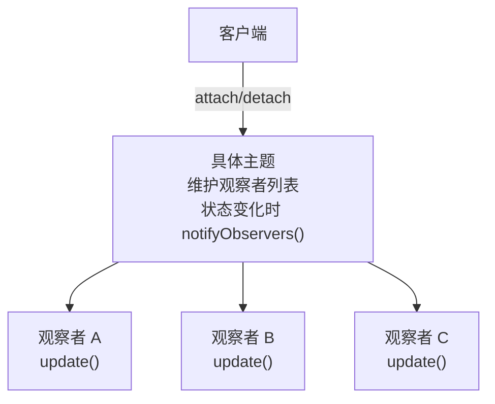

# 观察者模式

---

## 速览

- 观察者模式 = 一对多依赖，主题状态变化时自动通知所有订阅的观察者。
- 四个角色：抽象主题、具体主题、抽象观察者、具体观察者。
- 核心价值：解耦发布者和订阅者，主题不需要知道具体有哪些观察者。
- 观察者模式 vs 发布-订阅：前者主题直接持有观察者引用；后者有中间层完全解耦。
- Spring `ApplicationEvent`、Redis Pub/Sub 都是观察者模式的应用。

---

## 模式结构

> **一句话理解：** 主题维护一个观察者列表，状态变化时遍历通知所有观察者——像微信公众号推送。

**核心结论（可背）：**



**四个角色：**
| 角色 | 职责 |
|---|---|
| 抽象主题（Subject） | 提供注册/移除/通知观察者的接口 |
| 具体主题（ConcreteSubject） | 维护观察者列表，状态变化时通知全部 |
| 抽象观察者（Observer） | 定义 `update()` 接口 |
| 具体观察者（ConcreteObserver） | 实现 `update()` 响应主题变化 |

---

## 示例代码

**机制解释：**
```java
// 观察者接口
interface Observer {
    void update(String message);
}

// 主题接口
interface Subject {
    void attach(Observer observer);
    void detach(Observer observer);
    void notifyObservers(String message);
}

// 具体主题：维护订阅列表，状态变化时通知
class ConcreteSubject implements Subject {
    private List<Observer> observers = new ArrayList<>();

    public void attach(Observer o) { observers.add(o); }
    public void detach(Observer o) { observers.remove(o); }

    public void notifyObservers(String message) {
        for (Observer o : observers) {
            o.update(message);  // 逐个通知
        }
    }

    // 业务方法：状态变化时调用 notify
    public void changeState(String newState) {
        notifyObservers("状态变更为：" + newState);
    }
}

// 具体观察者：响应通知
class ConcreteObserver implements Observer {
    private String name;
    public ConcreteObserver(String name) { this.name = name; }
    public void update(String message) {
        System.out.println(name + " 收到: " + message);
    }
}

// 客户端
ConcreteSubject subject = new ConcreteSubject();
subject.attach(new ConcreteObserver("张三"));
subject.attach(new ConcreteObserver("李四"));
subject.changeState("运行中");
// 输出：张三 收到: 状态变更为：运行中
//       李四 收到: 状态变更为：运行中
```

---

## 观察者模式 vs 发布-订阅模式

> **一句话理解：** 观察者直接耦合，发布-订阅通过中间层完全解耦。

**核心结论（可背）：**
| 维度 | 观察者模式 | 发布-订阅模式 |
|---|---|---|
| 耦合程度 | 主题直接持有观察者引用 | 发布者和订阅者互不知道对方 |
| 中间层 | 无 | 有（消息代理/事件总线） |
| 通信方式 | 同步调用（默认） | 异步（通过消息队列） |
| 适用场景 | 单机、轻量级场景 | 分布式、跨进程（Kafka、RabbitMQ） |

---

## 常见问题和解决方案

**核心结论（可背）：**
| 问题 | 解决方案 |
|---|---|
| 通知无序 | 给观察者设置优先级，按优先级排序通知 |
| 内存泄漏 | 使用弱引用存储观察者；生命周期结束时主动 detach |
| 循环通知（A 通知 B，B 又触发 A） | update 中加状态标记，避免重复触发 |
| 同步通知性能瓶颈 | 用线程池异步通知 |

---

## 使用场景

| 场景 | 示例 |
|---|---|
| GUI 事件监听 | 按钮点击、键盘输入事件 |
| 发布-订阅通知 | 微信公众号推送、邮件/短信通知 |
| 数据驱动更新 | MVC 中 Model 变化通知 View |
| 框架事件机制 | Spring `ApplicationEvent/ApplicationListener` |

**框架中的应用：**
```
Spring 事件：
  ApplicationEvent    → 抽象主题（事件）
  ApplicationListener → 抽象观察者（监听器）
  ApplicationContext  → 具体主题（事件发布者）

Redis Pub/Sub：
  Publisher → 发布消息
  Subscriber → 订阅并接收消息
  Channel → 中间层频道
```

---

## 易错点

- ❌ 以为发布-订阅就是观察者模式 → 发布-订阅有独立的中间层，是观察者模式的进化版，两者不同。
- ❌ 观察者注册后不注销 → 内存泄漏风险，主题长期持有观察者引用，GC 无法回收。
- ❌ 在 update() 中修改主题状态 → 可能引发循环通知，导致死循环或 StackOverflow。

---

## 面试高频考点汇总

| 考点 | 核心答案 |
|---|---|
| 观察者模式的四个角色？ | 抽象主题、具体主题、抽象观察者、具体观察者 |
| 解决什么问题？ | 一对多依赖通知，主题和观察者解耦 |
| 和发布-订阅的区别？ | 观察者直接耦合（无中间层），发布-订阅有中间层完全解耦 |
| 内存泄漏怎么解决？ | 弱引用 + 生命周期结束时主动 detach |
| Spring 中的应用？ | ApplicationEvent + ApplicationListener |
| 设计原则？ | 依赖倒置（依赖抽象）、开闭原则（新增观察者不改主题）、单一职责 |
