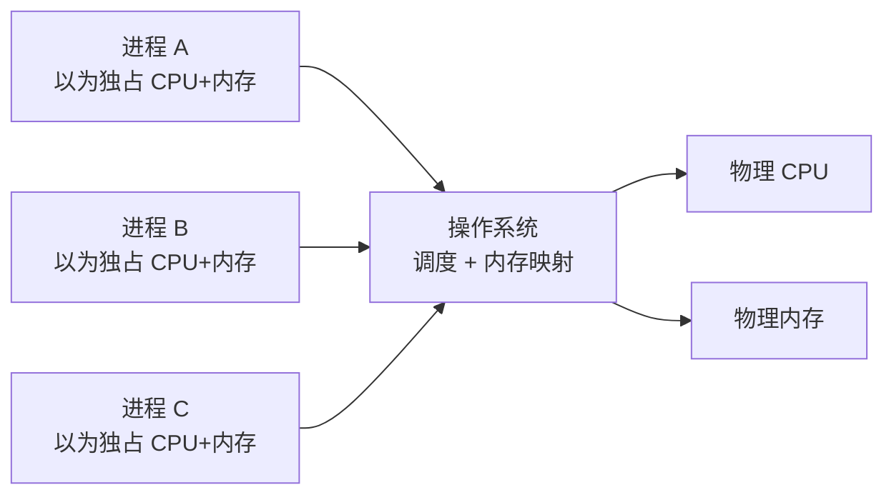

# 操作系统基础

---

## 速览

- 操作系统是硬件和应用程序之间的中间层，管理资源、提供服务。
- 核心职能：CPU 管理（进程调度）、内存管理、I/O 管理、系统调用。
- 四大特征：并发、共享、虚拟、异步。
- OS 扮演两个角色：管理者（分配/回收资源）和魔术师（虚拟化）。

---

## 操作系统是什么

> **一句话理解：** OS 是介于硬件和应用之间的软件层，让应用无需直接操作硬件。

**核心结论（可背）：**
```
硬件资源（CPU / 内存 / 磁盘 / I/O）
        ↑ 管理
   操作系统（OS）
        ↓ 服务
应用程序（通过系统调用使用硬件）
```

- 没有 OS：应用直接操作硬件，编程极难，误操作损坏硬件。
- 有了 OS：统一接口（系统调用），应用只需调用 API，OS 负责底层细节。

🎯 **Interview Triggers:**
- 操作系统的本质作用是什么，为什么需要它？（WHY）
- 如果没有操作系统，应用程序直接操作硬件会有哪些问题？（SCENARIO）
- 操作系统如何通过系统调用为应用程序提供硬件访问能力？（MECHANISM）
- 操作系统和固件（Firmware）有什么区别？（COMPARISON）

🧠 **Question Type:** 操作系统基本定义与存在意义概念题

🔥 **Follow-up Paths:**
- 系统调用 → 用户态与内核态切换的代价
- 硬件抽象 → 驱动程序在 OS 与硬件之间的角色
- OS 分层 → 微内核（Microkernel）与宏内核（Monolithic Kernel）的架构对比
- 操作系统 → 实时操作系统（RTOS）与通用 OS 的区别
- 虚拟机监控器（Hypervisor）→ 在 OS 之下再加一层抽象的意义

🛠 **Engineering Hooks:**
- 理解 OS 的抽象层次是读懂 Linux 内核源码、容器技术（Docker）、虚拟化（KVM）的基础
- 嵌入式系统（如 MCU）有时无 OS 直接裸机编程，遇到资源冲突完全由开发者手动管理
- 容器本质上共享宿主机 OS 内核，与虚拟机（每个 VM 有独立 OS）形成鲜明对比
- 面试中被问"OS 是什么"时，可从"抽象"和"复用"两个维度展开，体现系统设计思维
- 系统调用的开销（上下文切换）是高性能编程需要减少系统调用次数的根本原因

---

## 四大特征

> **一句话理解：** 并发+共享是基础，虚拟+异步是手段。

**核心结论（可背）：**
| 特征 | 含义 | 注意点 |
|---|---|---|
| **并发** | 多个程序在同一时间段内都在"运行" | 并发 ≠ 并行（见下） |
| **共享** | 系统资源被多个进程共同使用 | 分互斥共享和同时访问两种 |
| **虚拟** | 把一个物理资源变成多个逻辑资源 | CPU 虚拟化、内存虚拟化 |
| **异步** | 进程以不可预知的速度推进 | 调度时机不确定 |

**并发 vs 并行（必考）：**
```
并发（Concurrency）：同一时间段内，多个任务交替执行，宏观上"同时"。
并行（Parallelism）：同一时刻，多个任务在多个核心上真正同时执行。

单核 CPU → 只能并发，不能并行
多核 CPU → 既能并发也能并行
```

**面试官常问：**
- 并发和并行的区别？→ 时间段 vs 时刻；交替执行 vs 真正同时。

**易错点：**
- ❌ 并发等于并行 → 并发是宏观现象，并行是物理同时；单核机器能并发不能并行。

🎯 **Interview Triggers:**
- 并发和并行的区别是什么？（CONCEPT）
- 操作系统的"共享"特征分为哪两种类型，有什么区别？（MECHANISM）
- 虚拟化在 OS 中具体体现在哪些方面？（IMPLEMENTATION）
- 异步特征会带来哪些问题，操作系统如何应对？（FAILURE）
- 为什么说并发和共享是操作系统四大特征的基础？（WHY）

🧠 **Question Type:** 操作系统四大特征定义与相互关系分析题

🔥 **Follow-up Paths:**
- 并发 → 进程调度算法（时间片轮转、优先级调度）
- 共享 → 互斥锁、信号量解决资源竞争的机制
- 虚拟 → 虚拟内存（分页、分段）的实现原理
- 异步 → 进程同步原语（互斥量、条件变量、管程）
- 并发 vs 并行 → Go 语言 goroutine 调度模型（M:N 线程模型）
- 虚拟化 → 容器（namespaces + cgroups）对 OS 虚拟化的轻量级实现

🛠 **Engineering Hooks:**
- Go 语言的并发模型（goroutine + channel）是并发特征在语言层面的直接体现，面试常被关联提问
- 数据库事务隔离级别（读未提交到串行化）本质上是在并发共享资源时的安全性与性能权衡
- Linux cgroups 实现资源共享限制，namespaces 实现资源虚拟化隔离，两者合力支撑容器技术
- 多线程程序中的竞态条件（race condition）正是"并发+共享"特征在工程中产生的核心挑战
- 理解"异步"特征是理解 Node.js 事件循环、Python asyncio 等异步编程框架设计动机的基础

---

## 操作系统的功能

> **一句话理解：** 资源分配 + 回收 + 为应用提供系统调用接口。

**核心结论（可背）：**
| 功能 | 说明 |
|---|---|
| **CPU 管理** | 进程调度，决定哪个进程使用 CPU |
| **内存管理** | 内存分配、回收、虚拟内存、地址映射 |
| **I/O 管理** | 驱动设备，统一 I/O 接口 |
| **文件系统** | 文件的存储、组织、访问控制 |
| **系统调用** | 提供用户态进入内核态的安全接口 |

**内核的四大能力：**
```
进程调度能力  → 管理 CPU 使用权
内存管理能力  → 管理物理/虚拟内存
硬件通信能力  → 管理 I/O 设备驱动
系统调用能力  → 提供应用与内核的安全边界
```

🎯 **Interview Triggers:**
- 操作系统的核心功能有哪些，各自解决什么问题？（CONCEPT）
- 内存管理和文件系统在 OS 中分别承担什么职责？（MECHANISM）
- 如果没有统一的 I/O 管理，应用程序会面临什么问题？（WHY）
- 系统调用为什么必须经过内核而不能直接操作硬件？（SCENARIO）

🧠 **Question Type:** 操作系统功能模块职责划分与设计意图题

🔥 **Follow-up Paths:**
- CPU 管理 → 进程调度算法（FCFS、SJF、RR、多级反馈队列）
- 内存管理 → 分页机制、TLB 缓存、缺页中断处理
- I/O 管理 → 设备驱动框架与字符设备/块设备的区别
- 文件系统 → ext4、NTFS 的 inode 结构与日志机制
- 系统调用 → POSIX 标准系统调用接口与跨平台兼容性
- 内核态/用户态 → 上下文切换的开销与优化（vDSO）

🛠 **Engineering Hooks:**
- Linux 的 vDSO（虚拟动态共享对象）将部分系统调用（如 `gettimeofday`）映射到用户空间，避免切换内核态的开销
- `strace` 命令可以追踪进程的所有系统调用，是线上排查程序卡顿和权限问题的利器
- 内存泄漏本质是内存管理功能中分配后未回收，`valgrind`、`pprof` 等工具在此层面工作
- 文件系统的日志机制（journaling）保证崩溃恢复，直接影响数据库等持久化系统的设计选择
- 理解 OS 功能模块是评估技术选型的基础，例如选择文件系统类型对数据库性能有直接影响

---

## 操作系统的两个角色

> **一句话理解：** OS 是管理者也是魔术师——既分配资源，又制造"独占"假象。

**管理者：**
- 管 CPU（进程调度）、内存（分配回收）、磁盘（文件系统）、I/O 设备。
- 负责资源的分配和回收，防止进程互相干扰。

**魔术师（虚拟化）：**
- 让每个进程**以为自己独占 CPU** → 时间片轮转实现虚拟 CPU。
- 让每个进程**以为自己独占内存** → 虚拟地址空间，实际映射到物理内存的一部分。



🎯 **Interview Triggers:**
- 操作系统如何让每个进程"以为"自己独占 CPU 和内存？（MECHANISM）
- 时间片轮转调度是如何实现虚拟 CPU 的？（IMPLEMENTATION）
- 虚拟地址空间和物理内存的映射关系是如何建立和维护的？（MECHANISM）
- 管理者角色和魔术师角色在设计上有什么矛盾，OS 如何平衡？（TRADEOFF）
- 进程隔离是如何防止一个进程访问另一个进程的内存的？（SCENARIO）

🧠 **Question Type:** 操作系统虚拟化机制与进程隔离原理题

🔥 **Follow-up Paths:**
- 虚拟 CPU → 上下文切换的代价（寄存器保存/恢复、TLB 刷新）
- 虚拟内存 → 页表结构（多级页表）与 TLB 命中率优化
- 进程隔离 → Linux 内存保护机制（内存保护键、ASLR）
- 容器技术 → namespaces 如何在 OS 层面实现进程视角的"虚拟化"
- 虚拟机 → Hypervisor 对 CPU 和内存的二次虚拟化
- 时间片 → 实时操作系统（RTOS）中固定优先级抢占调度与时间片的区别

🛠 **Engineering Hooks:**
- 上下文切换开销（通常几微秒）是高并发系统避免过多线程的根本原因，协程（coroutine）正是为此设计
- ASLR（地址空间布局随机化）是 OS 安全机制，通过随机化虚拟地址布局防止缓冲区溢出攻击
- Docker 容器共享内核，进程隔离依赖 namespaces；KVM 虚拟机独立内核，隔离更彻底但开销更大
- 理解虚拟内存有助于分析 Java GC 停顿：GC 时大量内存操作可能触发缺页中断，加剧停顿时间
- `perf stat` 可以统计上下文切换次数（`context-switches`），是分析多线程性能瓶颈的重要指标

---

## 系统调用

> **一句话理解：** 系统调用是用户态程序请求内核服务的唯一合法通道。

**核心结论（可背）：**
```
用户态（User Mode）   → 权限低，不能直接操作硬件
内核态（Kernel Mode） → 权限高，可以操作所有硬件

系统调用流程：
  应用发起系统调用（如 read、write、fork）
    → CPU 切换到内核态
      → 内核执行对应操作
        → 返回结果，切回用户态
```

- 常见系统调用：`fork()`（创建进程）、`exec()`（执行程序）、`read()/write()`（I/O）、`malloc()`（内存申请，底层调 `brk/mmap`）。

**易错点：**
- ❌ 以为 `malloc` 是系统调用 → `malloc` 是 C 库函数，底层才调系统调用 `brk` 或 `mmap`。

🎯 **Interview Triggers:**
- 系统调用和普通函数调用有什么本质区别？（COMPARISON）
- 用户态切换到内核态的完整流程是什么？（MECHANISM）
- `malloc` 和 `brk/mmap` 的关系是什么，为什么 `malloc` 不是系统调用？（CONCEPT）
- 系统调用的开销来自哪里，如何在工程中减少系统调用次数？（TRADEOFF）
- `fork()` 创建进程时内核做了哪些工作？（IMPLEMENTATION）

🧠 **Question Type:** 系统调用机制与用户态/内核态权限边界原理题

🔥 **Follow-up Paths:**
- 系统调用 → 中断（trap/syscall 指令）触发内核态切换的硬件机制
- `fork()` → 写时复制（Copy-on-Write）在进程创建中的优化
- `mmap` → 内存映射文件与零拷贝技术的关联
- 系统调用开销 → vDSO 机制将高频系统调用移至用户空间
- `epoll` → 作为系统调用如何实现高效 I/O 多路复用
- 系统调用 → seccomp 沙箱机制对系统调用的白名单过滤（容器安全）

🛠 **Engineering Hooks:**
- `strace -c ./program` 可统计程序各系统调用的次数和耗时，是性能分析的第一步
- glibc 的 `malloc` 内部维护内存池，小块内存复用不触发系统调用，大块内存直接调 `mmap`
- Redis 单线程高性能的关键之一是减少系统调用次数：批量命令、pipeline 减少 `read/write` 调用频率
- 容器安全中 seccomp 通过白名单限制容器可用的系统调用集合，减小攻击面
- `perf trace` 是 `strace` 的低开销替代，适合在生产环境追踪系统调用而不影响性能

---

## 面试高频考点汇总

| 考点 | 核心答案 |
|---|---|
| 操作系统的作用？ | 硬件与应用之间的中间层：管理资源、提供系统调用接口 |
| 并发 vs 并行？ | 时间段内交替 vs 同一时刻真正同时；单核只能并发 |
| OS 四大特征？ | 并发、共享、虚拟、异步 |
| 系统调用是什么？ | 用户态请求内核服务的安全接口，触发 CPU 权限切换 |
| OS 内核的四大能力？ | 进程调度、内存管理、硬件通信、系统调用 |
| 虚拟化体现在哪？ | 虚拟 CPU（时间片）、虚拟内存（地址空间映射） |
