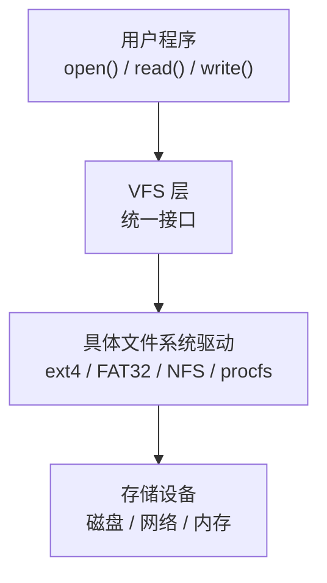

# 文件系统

---

## 速览

- 文件逻辑结构（用户视角）：流式文件（字节流）和记录式文件（顺序/索引/直接文件）。
- 文件物理结构（磁盘布局）：连续分配（随机访问快）、链接分配（无碎片但随机访问慢）、索引分配（推荐，兼顾效率和扩展性）。
- 目录结构进化：单级→两级→树形（现代OS）→无环图（支持共享）。
- 文件共享三级内核结构：FD（文件描述符）→ File Table（文件表）→ Inode（索引节点）。
- VFS（虚拟文件系统）= 统一接口层，屏蔽 ext4/FAT32/NFS 等底层差异。
- 文件重定位：链接阶段（静态）或运行时（动态）修正符号地址。

---

## 文件逻辑结构 vs 物理结构

> **一句话理解：** 逻辑结构是用户怎么看文件，物理结构是文件在磁盘上怎么存。

**核心结论（可背）：**

**逻辑结构分类：**
| 类型 | 说明 | 适用场景 |
|---|---|---|
| 无结构（流式文件） | 字节流，无固定格式，由应用程序解析 | 文本文件、图像、可执行文件 |
| 顺序文件 | 记录按顺序排列；定长记录支持折半查找，变长记录只能顺序查找 | 批量处理、磁带 |
| 索引文件 | 额外维护索引表，每条记录一个索引项 | 变长记录的快速查找 |
| 索引顺序文件 | 分组建索引，组间有序，组内可无序（类似分块查找） | 折中方案，查找 O(√N) |
| 直接文件 | 用散列函数直接计算记录物理地址，O(1) 访问 | 高频精确查找，不支持范围查询 |

**物理结构分类：**
| 类型 | 原理 | 优点 | 缺点 |
|---|---|---|---|
| 连续分配 | 占据连续物理块 | 顺序/随机访问都快，磁头移动少 | 外部碎片严重，文件扩展困难 |
| 链接分配（隐式） | 每个块末尾存下一块指针 | 无外部碎片，动态扩展 | 只能顺序访问，随机访问效率极低 |
| 链接分配（显式/FAT） | 指针集中存在 FAT 表，常驻内存 | 支持快速随机访问 | FAT 表占用大量内存（大容量磁盘） |
| 索引分配 | 每个文件有索引块记录所有盘块号 | 快速随机访问，无外部碎片 | 索引块占额外空间，大文件需多级索引 |

**机制解释：**
```
Unix/Linux inode 使用多级索引：
  直接块：存储小文件的数据块指针（直接访问）
  一级间接块：指向一个装满指针的块
  二级间接块：指向一个装满一级间接块指针的块
  三级间接块：理论上支持文件大小 = 磁盘容量

FAT（文件分配表）：
  开机时加载到内存，所有文件共用一张 FAT
  FAT 表项记录：当前块的下一块编号（链表结构）
  优点：查找在内存中完成，速度快
  缺点：FAT 表本身占用内存（FAT32 可能需几十 MB）
```

🎯 **Interview Triggers:**
- 文件的三种物理存储结构各有什么优缺点，实际系统如何选择？（COMPARISON）
- inode 的多级索引结构是如何支持大文件的？（MECHANISM）
- FAT 和 inode 在文件定位上有什么本质区别？（COMPARISON）
- 为什么连续分配对磁盘顺序读写性能好，但实际很少单独使用？（TRADEOFF）
- 直接文件（散列文件）为什么不支持范围查询？（CONCEPT）

🧠 **Question Type:** 存储结构类——考察文件从用户视角到磁盘布局的多层抽象及各方案工程权衡

🔥 **Follow-up Paths:**
- 物理结构 → inode 多级索引与 ext4 实现细节
- FAT → FAT12/FAT16/FAT32/exFAT 的演进与适用场景
- 索引分配 → 大文件支持与 extent-based 分配（ext4 extents）
- 逻辑结构 → 数据库存储引擎（B+ 树）与直接文件的对比
- 碎片问题 → 磁盘碎片整理与 SSD 不适合碎片整理的原因
- 物理结构 → 文件系统日志（journaling）与崩溃一致性

🛠 **Engineering Hooks:**
- ext4 使用 extent 结构（连续块范围描述符）替代传统块指针，大文件 inode 更紧凑，顺序写性能提升
- FAT32 单文件最大 4GB 限制（FAT 表项 32 位，但高 4 位保留），exFAT 解决了这一限制
- SSD 上连续分配优势减弱（随机访问延迟接近顺序访问），但大块连续写仍有利于减少写放大
- `debugfs` 工具可直接查看 ext4 文件系统 inode 内容，用于底层调试
- 文件系统预分配（fallocate）可提前分配磁盘空间避免碎片，数据库和视频录制常用

---

## 目录结构

> **一句话理解：** 现代操作系统用树形目录结构，在此基础上加有向边形成无环图以支持文件共享。

**核心结论（可背）：**
| 类型 | 特点 | 缺点 |
|---|---|---|
| 单级目录 | 所有文件在一个目录，文件名唯一 | 不允许重名，多用户冲突，检索慢 |
| 两级目录 | 主目录 + 用户目录，允许不同用户同名文件 | 不能对文件分类管理 |
| 树形目录 | 无限层级子目录，路径唯一标识文件 | 不便于文件共享 |
| 无环图目录 | 树形+允许多个目录指向同一文件/子目录 | 实现复杂，维护成本高 |

**树形目录相关概念：**
```
绝对路径：从根目录（/）开始的路径，如 /home/user/file.txt
相对路径：从当前目录开始的路径，如 ../docs/file.txt
当前目录（Working Directory）：进程当前所在目录，加速文件检索
```

🎯 **Interview Triggers:**
- 树形目录和无环图目录的区别是什么，分别适用于什么场景？（COMPARISON）
- Linux 的硬链接和软链接分别对应目录结构中的什么概念？（CONCEPT）
- 无环图目录如何保证"无环"，删除共享文件时如何处理引用计数？（MECHANISM）
- 为什么目录本身也是一种特殊文件？（CONCEPT）
- 路径解析时绝对路径和相对路径在内核中的处理流程有何不同？（MECHANISM）

🧠 **Question Type:** 结构设计类——考察目录组织方式的演进逻辑及文件共享的实现机制

🔥 **Follow-up Paths:**
- 无环图目录 → 硬链接（hard link）与 inode 引用计数
- 软链接 → 符号链接的实现与跨文件系统支持
- 目录结构 → VFS dentry 缓存（dcache）与路径查找加速
- 目录删除 → 引用计数归零与数据实际释放时机
- 目录权限 → rwx 对目录的具体含义（x = 进入权限）
- 目录遍历 → `readdir` 系统调用与 `getdents` 底层实现

🛠 **Engineering Hooks:**
- Linux 硬链接直接指向 inode，inode 引用计数（nlink）归零时数据块才真正释放，`stat` 命令可查看 nlink
- 软链接存储的是目标路径字符串，跨文件系统有效，但目标删除后变为悬空链接（dangling link）
- VFS dentry 缓存（dcache）将最近访问的路径组件缓存在内存，加速路径解析，`/proc/sys/fs/dentry-state` 可查看
- 目录的 x 权限（执行位）表示是否可进入（cd）及访问其内文件，无 x 权限时即使知道文件名也无法访问
- `find` 命令的 `-maxdepth` 参数可限制目录遍历深度，避免在深度嵌套或有循环软链接的目录中陷入

---

## 文件共享机制

> **一句话理解：** Linux 通过 FD → File Table → Inode 三级结构实现文件共享，多个进程可共享同一 inode（同一文件）。

**核心结论（可背）：**
```
三级结构：
  进程1 FD[3] ──► File Table Entry A ──► Inode ──► 磁盘数据
                  (offset, flags)
  进程2 FD[5] ──► File Table Entry B ──► 同一个 Inode

  FD（File Descriptor）：每个进程独立，open() 返回，进程内标识
  File Table：记录当前读写偏移量（offset）、访问模式（flags）
  Inode：文件元数据（权限、大小、数据块指针），唯一标识文件
```

**共享方式对比：**
| 方式 | 共享 File Table | 共享 Inode | 共享偏移量 |
|---|---|---|---|
| `fork()` | ✅ 是 | ✅ 是 | ✅ 是 |
| 两次 `open()` | ❌ 否 | ✅ 是 | ❌ 否（各自独立偏移） |
| `dup()` / `dup2()` | ✅ 是 | ✅ 是 | ✅ 是 |

**并发访问一致性：**
```
文件锁（File Lock）：
  fcntl()：细粒度锁（字节范围锁），可非阻塞
  flock()：粗粒度锁（整个文件），简单易用
  共享锁（Shared Lock）：多个进程可同时读
  独占锁（Exclusive Lock）：只有一个进程可写

页缓存（Page Cache）：
  所有进程共享同一份内核页缓存，提升读效率
  写后需 fsync(fd) 强制刷到磁盘，否则缓存数据可能丢失
```

🎯 **Interview Triggers:**
- fork() 之后父子进程的文件描述符如何共享，并发写同一文件会怎样？（SCENARIO）
- dup() 和两次 open() 的区别是什么，偏移量共享有什么实际影响？（COMPARISON）
- 页缓存（Page Cache）在文件读写中起什么作用，fsync 和 fflush 有何区别？（MECHANISM）
- 文件锁 fcntl 和 flock 各适用于什么场景？（SCENARIO）
- 进程间可以通过文件描述符传递吗，如何实现？（IMPLEMENTATION）

🧠 **Question Type:** 系统编程类——考察 Linux 文件描述符体系及多进程文件共享的并发安全问题

🔥 **Follow-up Paths:**
- 文件共享 → select/poll/epoll 基于 fd 的多路复用
- 页缓存 → 直接 I/O（O_DIRECT）与缓存 I/O 的选择
- 文件锁 → 数据库锁与文件系统锁的层次关系
- fork 共享 FD → exec 后 FD 的 close-on-exec 标志
- 偏移量竞争 → 原子追加写（O_APPEND）的语义保证
- inode 共享 → 硬链接与文件删除时机的关系

🛠 **Engineering Hooks:**
- `O_APPEND` 标志保证多进程追加写的原子性（write 系统调用内部自动 seek 到末尾再写），适合日志场景
- `sendfile()` 系统调用可在内核内直接将文件数据传输到 socket，避免用户态拷贝，Nginx 静态文件服务核心优化
- `fsync(fd)` 将页缓存和元数据都刷盘；`fdatasync(fd)` 只刷数据不刷元数据，性能略好，数据库常用
- Unix domain socket 可通过 `SCM_RIGHTS` 消息在进程间传递文件描述符，实现跨进程 FD 共享
- `/proc/<pid>/fd/` 目录列出进程所有打开的 FD，可用于诊断文件描述符泄漏问题

---

## 虚拟文件系统（VFS）

> **一句话理解：** VFS 是用户程序和底层各种文件系统之间的统一接口层，让 open/read/write 对所有文件系统都适用。

**核心结论（可背）：**


**VFS 四个核心数据结构（Linux）：**
| 结构 | 作用 |
|---|---|
| `super_block` | 整个文件系统的元信息（挂载信息、类型等） |
| `inode` | 文件元数据（权限、大小、数据块指针等）|
| `dentry` | 目录项，提供路径名到 inode 的映射 |
| `file` | 表示打开的文件，包含读写偏移，与进程相关 |

**VFS 调用流程：**
```
int fd = open("test.txt", O_RDONLY);
  ① VFS 接收 open() 调用
  ② 通过路径解析找到对应 dentry
  ③ 由 dentry 找到 inode
  ④ 通过 inode 确定具体文件系统类型（ext4/FAT32...）
  ⑤ 调用该文件系统的具体 open() 实现
  ⑥ 创建 file 结构，分配 FD，返回给用户
```

🎯 **Interview Triggers:**
- VFS 的设计目的是什么，解决了什么问题？（WHY）
- VFS 四个核心数据结构各自的职责是什么？（CONCEPT）
- 为什么 Linux 可以同时挂载 ext4、FAT32、NFS 并对用户透明？（MECHANISM）
- procfs 和 sysfs 也是文件系统，它们和磁盘文件系统有什么本质区别？（COMPARISON）
- VFS 的 dentry 缓存（dcache）如何加速路径查找？（MECHANISM）

🧠 **Question Type:** 架构设计类——考察 VFS 抽象层的设计思想及其在 Linux 内核中的实现结构

🔥 **Follow-up Paths:**
- VFS → 文件系统挂载（mount）的内核实现
- inode → inode 缓存（icache）与 dentry 缓存的协作
- VFS → 网络文件系统（NFS/CIFS）透明访问的实现
- procfs/sysfs → 内核信息暴露机制与 `/proc` 文件读写原理
- VFS → FUSE（用户态文件系统）框架与应用（如 sshfs）
- VFS 接口 → 实现自定义文件系统需要实现哪些 inode_operations

🛠 **Engineering Hooks:**
- Linux `mount` 系统调用将具体文件系统挂载到 VFS 目录树的某个挂载点，`/proc/mounts` 可查看所有挂载
- FUSE（Filesystem in Userspace）允许用户态程序实现文件系统，GlusterFS、sshfs、EncFS 等均基于 FUSE
- `strace -e trace=openat,read,write` 可追踪程序所有文件系统调用，是性能分析和调试的利器
- procfs（`/proc`）和 sysfs（`/sys`）数据在读取时实时生成，不占用磁盘空间，是内核向用户暴露状态的主要方式
- 容器文件系统（如 OverlayFS）通过 VFS 层叠多个目录实现镜像分层，Docker 镜像层只读、容器层可写

---

## 文件顺序存取 vs 随机存取

> **一句话理解：** 顺序存取按顺序依次读写（适合磁带/日志），随机存取可直接定位任意位置（适合数据库）。

**核心结论（可背）：**
| 维度 | 顺序存取 | 随机存取 |
|---|---|---|
| 访问方式 | 从头按顺序读写，不能跳过 | 通过偏移/索引直接跳到任意位置 |
| 效率 | 读整个文件时效率高 | 访问少量离散数据时效率高 |
| 适用场景 | 日志文件、音视频流、文本处理 | 数据库、大文件局部编辑、FAT 表查找 |
| 存储介质 | 磁带等顺序介质 | 硬盘、SSD 等随机访问介质 |

🎯 **Interview Triggers:**
- 顺序存取和随机存取各适用于什么场景，底层机制有何不同？（COMPARISON）
- 数据库为什么偏向随机存取，日志系统为什么偏向顺序存取？（SCENARIO）
- SSD 和 HDD 在顺序/随机存取性能上有何差异，对系统设计有何影响？（TRADEOFF）
- 文件系统的预读（read-ahead）机制是如何优化顺序存取的？（MECHANISM）
- 为什么写日志（顺序写）比随机更新数据库记录（随机写）快得多？（WHY）

🧠 **Question Type:** 性能优化类——考察存取模式对 I/O 性能的影响及系统设计中的存储选型

🔥 **Follow-up Paths:**
- 顺序存取 → LSM-Tree（日志结构合并树）与顺序写优化
- 随机存取 → B+ 树索引支持随机查找的原理
- 存取模式 → 数据库 WAL（Write-Ahead Log）的顺序写设计
- 存储介质 → SSD 的 FTL 层如何将随机写转为顺序写
- 预读机制 → Linux 页缓存的 readahead 算法
- 存取性能 → mmap 相比 read/write 的性能特性

🛠 **Engineering Hooks:**
- HDD 顺序读写速度约 100-200 MB/s，随机 4K IOPS 约 100-200；SSD 顺序读可达 3000+ MB/s，随机 IOPS 可达数十万
- Kafka 使用追加写（append-only）顺序写磁盘，结合 `sendfile` 零拷贝，实现高吞吐消息队列
- LSM-Tree（LevelDB/RocksDB）将随机写转化为顺序写（先写内存 memtable，再批量 flush 到磁盘），写性能极高
- Linux 预读（readahead）默认大小 128KB，顺序访问时内核自动探测并增大预读窗口，`posix_fadvise(FADV_SEQUENTIAL)` 可提示内核
- 数据库 B+ 树索引的叶子节点连成链表，支持高效范围扫描（顺序遍历叶子节点），兼顾随机查找和顺序扫描

---

## 文件重定位

> **一句话理解：** 链接时（静态重定位）或加载/运行时（动态重定位）修正程序中符号（函数/变量）的实际地址。

**核心结论（可背）：**
| 类型 | 发生时机 | 执行者 | 场景 |
|---|---|---|---|
| 静态重定位 | 链接阶段 | 链接器 | 生成固定地址可执行文件 |
| 动态重定位 | 加载/运行时 | 动态链接器（ld.so） | 动态库（.so），ASLR |

**ELF 重定位相关段：**
```
.symtab   → 符号表（函数/变量名和偏移）
.rel.text → 重定位表（记录哪些位置需要修正，引用了哪些符号）
.plt      → 过程链接表（动态链接用）
.got      → 全局偏移表（动态链接用）
```

🎯 **Interview Triggers:**
- 静态链接和动态链接有什么区别，各自适用于什么场景？（COMPARISON）
- 动态库（.so）在加载时如何确定函数的实际地址？（MECHANISM）
- PLT 和 GOT 在动态链接中各自的作用是什么，延迟绑定如何实现？（MECHANISM）
- ASLR 开启后动态链接如何保证代码可重定位？（SCENARIO）
- 静态重定位的可执行文件能否在不同机器上运行？（TRADEOFF）

🧠 **Question Type:** 编译链接类——考察程序从源码到内存执行的地址解析与修正全流程

🔥 **Follow-up Paths:**
- 动态链接 → 延迟绑定（Lazy Binding）与 PLT/GOT 机制
- ELF 格式 → 程序头表（Program Header）与段加载
- 重定位 → ASLR 与位置无关代码（PIC）的关系
- 动态库 → 共享库在多进程间的内存共享方式
- 符号解析 → 弱符号与强符号的链接规则
- 安全视角 → GOT 覆写攻击与 RELRO 保护机制

🛠 **Engineering Hooks:**
- `ldd` 命令显示可执行文件依赖的动态库及加载地址，`readelf -r` 查看重定位表条目
- PLT（过程链接表）实现延迟绑定：第一次调用时触发动态链接器解析并填充 GOT，后续直接跳转 GOT 地址，消除重复解析开销
- `LD_PRELOAD` 环境变量可在程序启动前预加载指定动态库，常用于函数 hook、内存分配器替换（如 jemalloc/tcmalloc）
- RELRO（Relocation Read-Only）安全机制在重定位完成后将 GOT 设为只读，防止 GOT 覆写攻击，`checksec` 可检测
- `nm -D` 查看动态库导出符号，`objdump -d` 反汇编可查看 PLT 跳转存根代码

---

## 面试高频考点汇总

| 考点 | 核心答案 |
|---|---|
| 三种文件物理结构各自优缺点？ | 连续：随机访问快，碎片多；链接：无碎片，随机访问慢；索引：随机快，无碎片，推荐 |
| FAT vs inode？ | FAT 是显式链接，集中存在内存；inode 是索引分配，直接/间接指针多级索引 |
| fork() 后文件描述符如何共享？ | 父子进程共享同一 File Table，共享偏移量，写入可能竞争同一偏移位置 |
| VFS 的作用？ | 屏蔽底层不同文件系统差异，提供统一的 open/read/write 接口 |
| 树形 vs 无环图目录？ | 树形每个文件只有一个父目录；无环图允许多父目录（支持文件共享） |
| 顺序存取 vs 随机存取？ | 顺序：按序依次，适合日志流；随机：任意跳转，适合数据库索引 |
