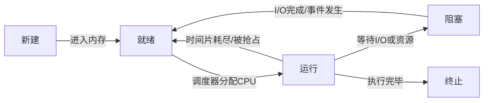

# 线程与进程

---

## 速览

- 进程 = 资源分配最小单位，有独立地址空间；线程 = CPU 调度最小单位，共享进程资源。
- 并发 vs 并行：并发是宏观同时（时间片交替），并行是真正同时（多核）。
- 用户态 vs 内核态：用户态权限低，内核态权限最高，通过系统调用切换。
- 六大调度算法：FCFS、SJF、SRTF、优先级、RR、MLFQ，各有优劣。
- IPC 六种方式：管道、消息队列、共享内存（最快）、信号量、信号、Socket。
- 僵尸进程：子进程终止但父进程未回收；孤儿进程：父进程先终止，由 init 接管。

---

## 进程 vs 线程

> **一句话理解：** 进程是资源的容器，线程是执行的实体；同一进程的线程共享内存，不同进程相互隔离。

**核心结论（可背）：**
| 维度 | 进程 | 线程 |
|---|---|---|
| 资源分配 | 独立地址空间，资源不共享 | 共享进程的代码段、数据段、堆、文件 |
| 切换开销 | 大（需保存完整页表、寄存器等） | 小（只保存寄存器和栈信息） |
| 创建销毁 | 重量级，开销大 | 轻量级，开销小 |
| 通信方式 | 需 IPC（管道/消息队列/共享内存等） | 直接访问共享内存（需同步机制） |
| 安全性 | 互相隔离，崩溃不影响其他进程 | 一个线程崩溃可导致整个进程崩溃 |
| 独占资源 | 独立栈、文件描述符、信号处理 | 独立栈和寄存器上下文 |

**机制解释：**
```
进程上下文切换：保存/恢复完整进程状态（页表、内存映射、寄存器、文件描述符）
线程上下文切换：只需保存/恢复寄存器 + 栈指针，同进程内线程复用页表

一个进程至少有一个线程（主线程），多个线程共享：
  代码段（.text）、数据段（.data、.bss）、堆（heap）、打开的文件
每个线程独有：
  栈（stack）、寄存器（PC、SP）、线程局部存储（TLS）
```

🎯 **Interview Triggers:**
- 进程和线程的本质区别是什么？（CONCEPT）
- 为什么线程上下文切换比进程上下文切换快？（WHY）
- 线程共享堆但不共享栈，这是为什么？（MECHANISM）
- 什么情况下应该用多进程而不是多线程？（SCENARIO）
- 线程崩溃为什么会导致整个进程退出？（FAILURE）

🧠 **Question Type:** 基础概念辨析 + 机制原理（进程线程资源模型）

🔥 **Follow-up Paths:**
- 线程切换 → 上下文保存的具体内容
- 进程隔离 → 地址空间与页表机制
- 线程共享堆 → 堆内存并发访问的同步问题
- 多进程 vs 多线程 → 稳定性与通信效率权衡
- 线程独有栈 → 栈溢出只影响当前线程分析

🛠 **Engineering Hooks:**
- Nginx 默认多进程模型（worker 进程），崩溃不影响其他 worker，稳定性高
- Python 因 GIL 限制多线程无法真正并行 CPU 密集型任务，推荐多进程（multiprocessing）
- Go goroutine 是用户态线程，切换不涉及系统调用，比 OS 线程切换快约 10 倍
- 线程局部存储（TLS）在 Java 中通过 ThreadLocal 实现，避免线程间数据干扰

---

## 并发 vs 并行

> **一句话理解：** 并发是一个人快速切换处理多件事，并行是多个人同时处理多件事。

**核心结论（可背）：**
```
并发（Concurrency）：单核 CPU 时间片轮转，宏观上"同时"执行多个任务
  → 同一时刻只有一个任务真正在 CPU 上执行

并行（Parallelism）：多核 CPU 上多个任务真正同时执行
  → 依赖多个处理单元

关系：并行是并发的子集，并发不一定并行，并行一定并发
```

🎯 **Interview Triggers:**
- 并发和并行的区别是什么？（CONCEPT）
- 单核 CPU 上能实现并行吗？为什么？（WHY）
- 并发编程的核心挑战是什么？（SCENARIO）
- 并发和并行在实际服务器设计中如何体现？（SCENARIO）
- Go 语言的并发模型是并发还是并行？（COMPARISON）

🧠 **Question Type:** 概念辨析（并发与并行的定义与关系）

🔥 **Follow-up Paths:**
- 时间片轮转 → RR 调度算法与上下文切换
- 多核并行 → CPU 缓存一致性（MESI 协议）
- 并发挑战 → 竞态条件与同步原语
- 服务器并发模型 → 多进程/多线程/IO 多路复用/协程
- Go 并发 → goroutine + channel 的 CSP 模型

🛠 **Engineering Hooks:**
- Node.js 单线程事件循环是高并发低并行的典型：靠异步 IO 实现并发，无真正并行
- Java ForkJoinPool 实现真正并行计算，适合 CPU 密集型任务的多核利用
- Redis 单线程处理命令（并发请求排队），通过 IO 多路复用实现高并发
- Python asyncio 是协程并发（非并行），适合 IO 密集型场景

---

## 用户态 vs 内核态

> **一句话理解：** 内核态有最高权限，用户程序通过系统调用进入内核态请求特权服务。

**核心结论（可背）：**
| 维度 | 用户态 | 内核态 |
|---|---|---|
| 权限 | 低，只能访问用户空间 | 最高，可访问全部内存和硬件 |
| 运行内容 | 用户程序代码 | 操作系统内核代码 |
| 切换方式 | 通过系统调用（System Call）切入内核态 | 执行完后返回用户态 |
| 切换开销 | 需保存用户态上下文，存在较大开销 | — |

**机制解释：**
```
用户态 → 内核态触发方式：
  1. 系统调用（System Call）：用户程序主动请求内核服务（如 read/write/fork）
  2. 异常（Exception）：CPU 执行指令时检测到异常（如缺页中断、除零）
  3. 中断（Interrupt）：外部设备触发（如键盘、网卡）

CPU 中有程序状态字寄存器（PSW）控制当前模式
  1 = 内核态，0 = 用户态（或反之，取决于架构）
```

🎯 **Interview Triggers:**
- 用户态和内核态的本质区别是什么？（CONCEPT）
- 哪些操作会触发用户态到内核态的切换？（MECHANISM）
- 系统调用和普通函数调用有什么区别？（COMPARISON）
- 为什么用户程序不能直接访问硬件？（WHY）
- 内核态切换的开销来自哪里？如何减少？（TRADEOFF）

🧠 **Question Type:** 特权级机制理解 + 系统调用原理（内核保护与模式切换）

🔥 **Follow-up Paths:**
- 系统调用 → 中断向量表与 syscall 指令
- 内核态切换开销 → 上下文保存与 TLB 刷新
- 异常处理 → 缺页中断与内存管理
- 减少切换开销 → vDSO（虚拟动态共享对象）
- 容器隔离 → namespace 与 cgroup 在内核态的实现

🛠 **Engineering Hooks:**
- glibc 的 read()/write() 本质是对 sys_read/sys_write 系统调用的封装
- vDSO 技术让 gettimeofday() 等高频调用不需真正陷入内核，减少切换开销
- epoll 通过一次系统调用监听大量 fd，减少用户/内核态切换次数，是高性能 IO 的关键
- 容器技术（Docker）依赖 Linux 内核的 namespace/cgroup，本质上在内核态实现隔离

---

## 六大调度算法

> **一句话理解：** 选调度算法 = 选在响应时间、吞吐量、公平性之间做取舍。

**核心结论（可背）：**
| 算法 | 抢占式 | 优点 | 缺点 | 适用场景 |
|---|---|---|---|---|
| FCFS（先来先服务） | 否 | 简单公平 | 长进程阻塞短进程（队列效应） | 批处理，任务均匀 |
| SJF（最短作业优先） | 否 | 平均等待时间最短 | 长进程饥饿，需预测执行时间 | 执行时间已知 |
| SRTF（最短剩余时间） | 是 | 响应快 | 长进程饥饿更严重 | 剩余时间可知 |
| 优先级调度 | 可是/否 | 保证重要任务先执行 | 低优先级进程饥饿（aging 算法解决） | 实时系统 |
| RR（时间片轮转） | 是 | 公平，响应时间短 | 时间片过小则上下文切换开销大 | 交互式系统 |
| MLFQ（多级反馈队列） | 是 | 综合 FCFS+SJF+优先级的优点 | 实现复杂 | 通用操作系统 |

**MLFQ 工作原理：**
```
新进程 → 最高优先级队列（时间片最短）
用完时间片未完成 → 降到下一级队列（时间片更长）
在高优先级队列完成 → 移除

效果：短作业快速执行，长作业逐步降级，类似于自动识别 CPU 密集型 vs IO 密集型
```

🎯 **Interview Triggers:**
- FCFS 为什么会产生护航效应？（MECHANISM）
- SJF 平均等待时间最短，但为什么实际系统不常用？（TRADEOFF）
- RR 时间片大小如何权衡？（TRADEOFF）
- MLFQ 如何兼顾短作业响应和长作业公平？（MECHANISM）
- 优先级调度中饥饿问题如何解决？（FAILURE）

🧠 **Question Type:** 算法对比 + 场景权衡（调度算法的优劣与适用边界）

🔥 **Follow-up Paths:**
- FCFS 护航效应 → 平均等待时间计算
- SJF 执行时间预测 → 指数平均法估算
- 饥饿问题 → aging 算法（随时间提升优先级）
- MLFQ → Linux CFS（完全公平调度器）的实现
- 实时调度 → 优先级抢占与截止时间保证

🛠 **Engineering Hooks:**
- Linux 使用 CFS（完全公平调度器），基于红黑树按虚拟运行时间调度，近似 MLFQ
- Nginx worker 进程调度由 OS 控制，通常用 RR 或 CFS，不直接干预
- 数据库连接池线程调度可设置优先级，保证 OLTP 查询优先于批量导出任务
- Go runtime 实现了 M:N 线程调度（多个 goroutine 映射到少量 OS 线程），类似 MLFQ

---

## 进程间通信（IPC）

> **一句话理解：** 从效率低到高：管道 < 消息队列 < 共享内存；共享内存最快但需要同步机制。

**核心结论（可背）：**
| IPC 方式 | 特点 | 适用场景 |
|---|---|---|
| 管道（Pipe） | 半双工，内核缓冲区；匿名管道只能父子进程用 | 父子进程通信 |
| 命名管道（FIFO） | 有文件路径，任意进程可访问 | 无亲缘关系进程 |
| 消息队列 | 内核消息链表，有消息大小限制；存在用户/内核拷贝开销 | 异步消息传递 |
| 共享内存 | 多进程映射同一物理内存，通信效率最高 | 大数据量传输（需配合信号量同步） |
| 信号量（Semaphore） | 整型计数器，用于进程间同步互斥，不传数据 | 同步控制 |
| 信号（Signal） | 操作系统异步通知机制，用于异常处理 | 进程控制（kill/SIGINT/SIGTERM） |
| Socket | 同机器或跨网络通信 | 网络通信、跨机器 |

🎯 **Interview Triggers:**
- 共享内存为什么是最快的 IPC 方式？（WHY）
- 管道和消息队列相比有哪些局限性？（COMPARISON）
- 在什么情况下应该用 Socket 而不是其他 IPC？（SCENARIO）
- 共享内存使用时需要注意哪些并发安全问题？（FAILURE）
- 信号（Signal）和信号量（Semaphore）有什么区别？（CONCEPT）

🧠 **Question Type:** IPC 机制对比 + 场景选型（通信方式的效率与适用范围）

🔥 **Follow-up Paths:**
- 共享内存 → mmap 实现与同步机制配合
- 管道 → 内核缓冲区大小限制与阻塞行为
- 消息队列 → 与 Kafka/RabbitMQ 等消息中间件的关系
- Socket → Unix Domain Socket 与 TCP Socket 的性能差异
- 信号 → SIGINT/SIGTERM/SIGKILL 的处理方式

🛠 **Engineering Hooks:**
- Nginx 与 PHP-FPM 通过 Unix Domain Socket 通信，比 TCP 少一次网络栈处理，延迟更低
- 共享内存 + 信号量是 Redis 持久化 fork 子进程的核心机制（写时复制 COW）
- Kafka 本质上是进程间消息队列的分布式扩展，保留了消息队列的异步解耦特性
- Python multiprocessing.Queue 底层使用管道实现，跨进程数据需序列化（pickle），有开销

---

## 僵尸进程与孤儿进程

> **一句话理解：** 僵尸进程是"已死但未被收尸"，孤儿进程是"父亲先走子进程被收养"。

**核心结论（可背）：**
| 类型 | 原因 | 危害 | 处理 |
|---|---|---|---|
| 僵尸进程 | 子进程退出，父进程未调用 wait() 回收 | 占用进程表项，表项耗尽无法创建新进程 | 父进程调用 `wait()`/`waitpid()` 回收；或 kill 父进程让 init 接管 |
| 孤儿进程 | 父进程先于子进程退出 | 无危害 | OS 自动让 init 进程（PID=1）接管并回收 |

🎯 **Interview Triggers:**
- 僵尸进程是如何产生的？有什么危害？（MECHANISM）
- 如何在代码中避免产生僵尸进程？（IMPLEMENTATION）
- 孤儿进程和僵尸进程的区别是什么？（COMPARISON）
- 如果父进程是一个死循环不调用 wait()，如何清理僵尸进程？（FAILURE）
- systemd/init 如何处理孤儿进程的回收？（MECHANISM）

🧠 **Question Type:** 进程生命周期理解 + 异常状态处理（僵尸与孤儿的产生与清理）

🔥 **Follow-up Paths:**
- 僵尸进程 → wait()/waitpid() 系统调用语义
- 进程表项耗尽 → 系统资源泄漏与监控
- SIGCHLD 信号 → 父进程异步回收子进程
- init 进程 → systemd 接管孤儿进程的机制
- 进程组 → 会话领导进程与终端控制

🛠 **Engineering Hooks:**
- 服务端 fork 子进程处理请求时，必须注册 SIGCHLD 信号处理函数调用 waitpid()，避免僵尸堆积
- 使用 double fork 技巧可让子进程成为孤儿（被 init 接管），彻底避免僵尸进程
- Kubernetes Pod 中 PID=1 的容器进程需正确处理 SIGCHLD，否则僵尸进程无法被回收
- ps aux 中 Z 状态（zombie）的进程即为僵尸进程，数量异常说明父进程未正确回收

---

## 进程状态转换

> **一句话理解：** 进程在新建→就绪→运行→阻塞→终止之间流转，调度器控制就绪↔运行。

**核心结论（可背）：**


🎯 **Interview Triggers:**
- 进程的五种状态分别是什么？如何转换？（CONCEPT）
- 阻塞状态和就绪状态的区别是什么？（COMPARISON）
- 进程从阻塞到运行需要经过哪个中间状态？（MECHANISM）
- 什么事件会导致运行态进程转换为就绪态？（MECHANISM）
- 进程终止时操作系统需要做哪些清理工作？（MECHANISM）

🧠 **Question Type:** 状态机模型理解（进程五态转换图与触发条件）

🔥 **Follow-up Paths:**
- 阻塞状态 → IO 等待与事件驱动
- 就绪队列 → 调度器的运行队列管理
- 进程终止 → 资源回收与僵尸进程
- 挂起状态 → 换出到磁盘（七状态模型扩展）
- 上下文切换 → 保存/恢复进程控制块（PCB）

🛠 **Engineering Hooks:**
- Linux top/htop 中 S（sleeping）对应阻塞态，R（running）对应就绪/运行态，Z 对应僵尸态
- 高并发服务中大量进程处于 S 状态是正常的（等待网络 IO），D 状态（不可中断睡眠）才需关注
- 进程控制块（PCB）在 Linux 中对应 task_struct 结构体，保存进程所有状态信息
- ulimit -u 限制用户最大进程数，防止 fork bomb 耗尽进程表

---

## 中断机制

> **一句话理解：** 中断是操作系统获取 CPU 控制权的唯一方式，分内部异常和外部中断。

**核心结论（可背）：**
| 类型 | 来源 | 特点 | 例子 |
|---|---|---|---|
| 内部异常（Exception） | CPU 执行指令时内部产生 | 同步，与当前指令相关 | 缺页中断、除零错误、系统调用 |
| 外部中断（Interrupt） | CPU 外部设备触发 | 异步，与当前指令无关 | 键盘输入、网卡数据到达、定时器 |

🎯 **Interview Triggers:**
- 中断和异常的区别是什么？（COMPARISON）
- 缺页中断的处理流程是怎样的？（MECHANISM）
- 操作系统如何通过中断获得 CPU 控制权？（WHY）
- 系统调用是中断还是异常？（CONCEPT）
- 中断处理程序为什么要尽量短小？（TRADEOFF）

🧠 **Question Type:** 中断机制原理（同步异常与异步中断的区别与处理流程）

🔥 **Follow-up Paths:**
- 缺页中断 → 虚拟内存与页面置换算法
- 系统调用 → 软中断（int 0x80/syscall 指令）
- 中断向量表 → IDT（中断描述符表）结构
- 中断上半部/下半部 → Linux 软中断与工作队列
- 定时器中断 → 时间片调度的实现基础

🛠 **Engineering Hooks:**
- Linux 内核将中断处理分为上半部（快速，禁止中断）和下半部（延迟处理，如 tasklet/workqueue）
- 网卡收包触发硬中断，内核通过 NAPI 机制在软中断中批量处理，减少中断频率
- 缺页中断是虚拟内存实现的核心：访问未映射页 → 陷入内核 → 加载页面 → 返回用户态重试
- 高频定时器中断（HZ=1000）是 Linux 进程调度时间片的计时基础

---

## 面试高频考点汇总

| 考点 | 核心答案 |
|---|---|
| 进程和线程的区别？ | 资源分配单位 vs CPU 调度单位；独立地址空间 vs 共享内存；切换开销大 vs 小 |
| 并发 vs 并行？ | 并发：单核时间片交替（宏观同时）；并行：多核真正同时执行 |
| 用户态 vs 内核态？ | 权限不同；通过系统调用、异常、中断切换到内核态 |
| 为什么线程切换比进程切换快？ | 同进程线程共享页表，只需切换寄存器和栈，不需切换地址空间 |
| IPC 最快的方式？ | 共享内存（直接内存映射，无需内核拷贝），但需要同步机制 |
| 僵尸进程怎么处理？ | 父进程调用 wait()/waitpid()；或 kill 父进程让 init 接管回收 |
| MLFQ 的优点？ | 综合多种算法，短作业快速完成，长作业自动降级，兼顾公平性和响应性 |
