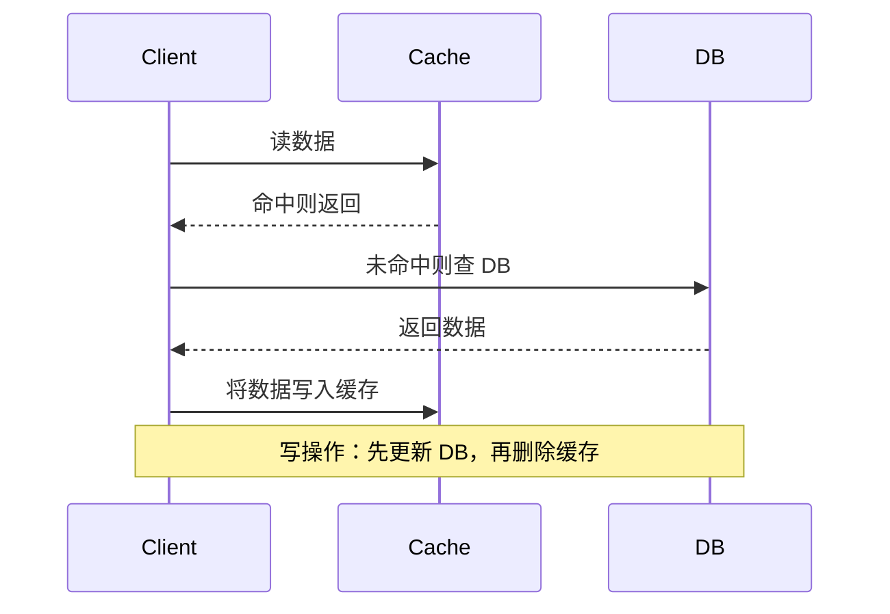

# Redis

---

## 速览

- Redis = 基于内存的高性能键值数据库，读写速度极快，常用于缓存、消息队列、分布式锁。
- 单线程处理命令（网络 IO 6.0 后多线程），避免锁竞争，配合 I/O 多路复用实现高并发。
- 五种基本数据类型：String、List、Set、Hash、Zset；后续新增 BitMap、HyperLogLog、GEO、Stream。
- 两种持久化：RDB（快照）和 AOF（追加日志），推荐混合使用。
- 三种集群模式：主从复制、哨兵（高可用）、切片集群 Cluster（水平扩展）。
- 缓存三大问题：雪崩（大量失效）、击穿（热点失效）、穿透（查不存在的 key）。
- 分布式锁用 `SET key value NX PX 10000`，保证原子性和自动过期。

---

## 为什么 Redis 这么快

> **一句话理解：** 内存存储 + 单线程无锁 + 高效数据结构 + I/O 多路复用，四重加速。

**核心结论（可背）：**
| 原因 | 说明 |
|---|---|
| 基于内存 | 内存读写速度比磁盘快 100 倍以上 |
| 单线程处理命令 | 无线程切换和锁开销，不存在竞态条件 |
| 高效数据结构 | SDS、跳表、压缩列表专门优化读写效率 |
| I/O 多路复用 | 单线程同时监听多个 Socket，处理多路 I/O 流 |

**机制解释：**
```
Redis 单线程 ≠ Redis 是单线程程序
  - 网络请求处理：单线程（Redis 6.0 起，网络 I/O 使用多线程）
  - 命令执行：始终单线程（保证原子性）
  - 后台任务（2.6+）：关闭文件、AOF 刷盘、懒释放内存（lazyfree）由独立后台线程处理

为什么网络 I/O 引入多线程（6.0+）？
  Redis 瓶颈不在内存，而在网络 I/O 的 CPU 耗时
  → 多线程 I/O 提升至少 1 倍性能，命令执行仍是单线程
```

**易错点：**
- ❌ 以为 Redis 完全单线程 → 命令执行是单线程，后台任务和 6.0+ 的网络 I/O 有多线程。

🎯 **Interview Triggers:**
- Redis 为什么这么快，能说出几个维度？（MECHANISM）
- 单线程怎么处理高并发，不会成为瓶颈吗？（WHY）
- Redis 6.0 引入多线程是为了什么，命令执行也多线程了吗？（COMPARISON）

🧠 **Question Type:** mechanism explanation · comparison · principle explanation

🔥 **Follow-up Paths:**
- 单线程命令执行 → 无锁竞争 → 命令原子性天然保证
- 网络 I/O 多线程（6.0+）→ 瓶颈从 CPU 转移到网络
- I/O 多路复用 → epoll → 单线程监听多 socket

🛠 **Engineering Hooks:**
- 监控 Redis 延迟：`redis-cli --latency`，正常应 < 1ms
- 避免大 key（value > 1MB）：会阻塞单线程命令循环
- `OBJECT ENCODING key` 查看底层编码，判断是否已升级为大结构

---

## 五种基本数据类型

> **一句话理解：** 选对数据类型 = 选对底层结构，直接影响性能和内存。

**核心结论（可背）：**
| 类型 | 底层结构 | 典型场景 | 常用命令 |
|---|---|---|---|
| String | SDS（简单动态字符串） | 缓存、计数、分布式锁、Session | `get/set/incr/setnx` |
| List | quicklist（链表+压缩列表） | 消息队列、朋友圈点赞排序 | `lpush/rpop/lrange` |
| Hash | 哈希表 / listpack | 缓存对象、购物车 | `hset/hget/hgetall` |
| Set | 哈希表 / 整数集合 | 点赞、共同关注、抽奖去重 | `sadd/smembers/sinter` |
| Zset | 跳表 + 哈希表 | 排行榜、带权重排序 | `zadd/zrange/zrangebyscore` |

**Zset 为什么用跳表而不用红黑树：**
```
跳表实现更简单，易于调试
跳表天然支持范围查询（zrangebyscore），红黑树不支持
跳表插入/删除性能与红黑树持平（O(log N)），且缓存局部性更好
```

**新增四种类型（面试加分）：**
| 类型 | 版本 | 用途 |
|---|---|---|
| BitMap | 2.2+ | 签到统计、用户登录状态（bit 级存储，极省内存） |
| HyperLogLog | 2.8+ | 百万级 UV 基数统计（误差 0.81%，内存固定小） |
| GEO | 3.2+ | 地理位置存储，底层是 Zset |
| Stream | 5.0+ | 专业消息队列（自动全局唯一 ID，支持消费组） |

**易错点：**
- ❌ List 底层是双向链表 → 3.2 版本后改为 quicklist，7.0 后压缩列表被 listpack 替代。
- ❌ HyperLogLog 精确统计 → 是近似统计，有误差，不能用于精确计数。

🎯 **Interview Triggers:**
- Zset 为什么用跳表而不用红黑树？（TRADEOFF）
- 百万 UV 统计用哪种数据类型，为什么？（SCENARIO）
- List 底层是链表吗，真实结构是什么？（MECHANISM）

🧠 **Question Type:** comparison/tradeoff · scenario application · mechanism explanation

🔥 **Follow-up Paths:**
- Zset 跳表 → 范围查询高效 → zrangebyscore 原理
- HyperLogLog → 近似统计 → 误差 0.81%，不能精确计数
- List quicklist → 小数据 listpack，大数据双向链表

🛠 **Engineering Hooks:**
- 大 Hash（field > 128 或 value > 64B）自动从 listpack 升级为哈希表，注意内存突增
- BitMap 签到：`SETBIT user:sign:20240101 userId 1`，`BITCOUNT` 统计月签到天数
- Zset 排行榜：`ZADD leaderboard score userId`，`ZREVRANGE` 取 Top N

---

## 持久化机制

> **一句话理解：** RDB 是快照，定时全量保存；AOF 是日志，每条命令追加写；混合模式两者兼顾。

**核心结论（可背）：**
| 方式 | 原理 | 优点 | 缺点 |
|---|---|---|---|
| RDB | 定时将内存数据以二进制快照写入磁盘 | 文件紧凑，恢复快 | 可能丢失最后一次快照后的数据 |
| AOF | 每条写命令追加到日志文件 | 数据更安全，最多丢 1 秒 | 文件大，恢复慢 |
| 混合（4.0+） | AOF 文件前段是 RDB，后段是 AOF 增量 | 兼顾两者优点 | 推荐生产使用 |

**AOF 三种写回策略：**
```
Always    → 每次写命令同步刷盘（最安全，性能最低）
Everysec  → 每秒刷一次缓冲区到磁盘（推荐，最多丢 1 秒数据）
No        → 由操作系统决定何时写盘（性能最高，最不安全）
```

**面试官常问：**
- RDB 和 AOF 哪个更好？→ 混合持久化，优先加载 AOF 恢复数据。

🎯 **Interview Triggers:**
- RDB 和 AOF 各有什么优缺点，生产怎么选？（TRADEOFF）
- AOF 文件会越来越大吗，怎么解决？（FAILURE）
- Redis 重启后数据从哪里恢复，顺序是什么？（MECHANISM）

🧠 **Question Type:** comparison/tradeoff · failure analysis · mechanism explanation

🔥 **Follow-up Paths:**
- AOF 文件膨胀 → AOF Rewrite 重写压缩 → 后台 fork 子进程
- 混合持久化 → AOF 前段 RDB 快照 + 后段增量命令
- 重启恢复优先级：混合 AOF > 纯 AOF > RDB

🛠 **Engineering Hooks:**
- 生产推荐：`aof-use-rdb-preamble yes`（混合持久化）+ `appendfsync everysec`
- AOF Rewrite 阈值：`auto-aof-rewrite-percentage 100`（文件大小翻倍时触发）
- 监控 AOF 缓冲区积压：`INFO persistence` 查看 `aof_buffer_length`

---

## 三种集群模式

> **一句话理解：** 主从解决读写分离，哨兵解决高可用，切片集群解决水平扩展。

**核心结论（可背）：**


**主从复制同步过程：**
```
① 从节点发送 SYNC 命令请求建立连接
② 主节点执行 BGSAVE 生成 RDB 快照
③ 主节点将 RDB 文件 + AOF 缓冲区命令发送给从节点
④ 从节点载入 RDB，执行缓冲区命令，追赶最新状态
⑤ 进入增量复制：主节点实时将写命令传播给从节点
```

**哨兵机制：**
```
监控：定期向主从节点发送 PING，检测存活
主观下线：单个哨兵连续未收到响应
客观下线：多数哨兵达成共识才确认下线
故障转移：按复制偏移量选出从节点升为新主节点，更新配置通知客户端
```

**切片集群（Redis Cluster）：**
```
16384 个槽（slot），每个槽对应一个 CRC16(key) % 16384 的整数
每个节点负责一部分槽，数据均匀分布
节点间通过 gossip 协议通信，维持集群状态
客户端计算 key 的哈希槽，直接路由到对应节点
```

🎯 **Interview Triggers:**
- 主从、哨兵、Cluster 三种模式分别解决什么问题？（COMPARISON）
- 哨兵如何判断主节点真的下线了？（MECHANISM）
- Redis Cluster 为什么是 16384 个槽？（WHY）

🧠 **Question Type:** comparison/tradeoff · mechanism explanation · system design

🔥 **Follow-up Paths:**
- 主从复制 → 全量同步（RDB）→ 增量同步（repl backlog）
- 哨兵主观下线 → 多数共识客观下线 → 选举 Leader 故障转移
- Cluster 槽分配 → CRC16 哈希 → MOVED 重定向

🛠 **Engineering Hooks:**
- 主从延迟监控：`INFO replication` 查看 `master_repl_offset` vs slave offset
- 哨兵模式至少部署 3 个哨兵节点，避免脑裂（网络分区时多数原则）
- Cluster 模式 key 包含 `{}` 可指定 hash tag，让相关 key 落在同一 slot（方便 mget/pipeline）

---

## 内存淘汰策略

> **一句话理解：** 8 种策略按"是否只针对设了过期时间的 key"和"淘汰算法"两个维度分组。

**核心结论（可背）：**
| 策略 | 说明 |
|---|---|
| noeviction（默认） | 内存满时写操作报错，不淘汰 |
| volatile-ttl | 优先淘汰 TTL 最短（即将过期）的 key |
| volatile-lru | 只对设了过期时间的 key 用 LRU 淘汰 |
| volatile-lfu | 只对设了过期时间的 key 用 LFU 淘汰 |
| volatile-random | 随机淘汰设了过期时间的 key |
| allkeys-lru | 对所有 key 用 LRU 淘汰 |
| allkeys-lfu | 对所有 key 用 LFU 淘汰 |
| allkeys-random | 随机淘汰任意 key |

**LRU vs LFU：**
```
LRU（最近最少使用）：淘汰最久未访问的 key
  → Redis 用近似 LRU（随机采样 5 个，淘汰最旧的）
  → 问题：某个 key 被大量访问一次后长期不用，仍可能保留

LFU（最不频繁使用）：淘汰访问频率最低的 key
  → 维护使用计数器，更精确
  → 适合访问模式稳定的场景
```

**过期删除策略（配合淘汰）：**
```
惰性删除：访问 key 时才检查是否过期，过期就删（节省 CPU，但可能内存积压）
定期删除：每隔一段时间随机抽取一批 key 检查并删除过期的
Redis 使用：惰性删除 + 定期删除 组合策略
```

🎯 **Interview Triggers:**
- Redis 内存满了会怎样，如何配置淘汰策略？（SCENARIO）
- LRU 和 LFU 怎么选，各适合什么场景？（TRADEOFF）
- Redis 过期 key 是立刻删除的吗？（MECHANISM）

🧠 **Question Type:** scenario application · comparison/tradeoff · mechanism explanation

🔥 **Follow-up Paths:**
- 内存满 → noeviction 报错 → 生产必须配置淘汰策略
- LRU 热点一次性访问问题 → LFU 更适合稳定热点场景
- 惰性删除 + 定期删除 → 内存可能积压大量过期 key → 配合淘汰策略

🛠 **Engineering Hooks:**
- 缓存场景推荐：`allkeys-lru`（所有 key 均可淘汰，最常用）
- 会话/分布式锁场景：`volatile-lru`（只淘汰带 TTL 的 key，保护永久 key）
- 监控内存使用：`INFO memory` 查看 `used_memory_human` 和 `maxmemory`

---

## 缓存三大问题

> **一句话理解：** 雪崩是大面积失效，击穿是热点失效，穿透是查不存在的数据。

**核心结论（可背）：**
| 问题 | 原因 | 解决方案 |
|---|---|---|
| 缓存雪崩 | 大量 key 同时过期，请求打穿到 DB | 过期时间加随机值；永不过期+异步更新 |
| 缓存击穿 | 热点 key 过期，大量并发直接打 DB | 互斥锁（分布式锁），只允许一个请求查 DB 并回填缓存 |
| 缓存穿透 | 查询不存在的 key，每次都打 DB | 布隆过滤器拦截非法 key；缓存空值（短 TTL） |

**机制解释：**
```
穿透 vs 击穿 vs 雪崩 区分口诀：
  穿透 → 数据从未存在（恶意攻击/非法 key）
  击穿 → 数据曾经存在，但缓存过期了（热点 key 问题）
  雪崩 → 大量数据同时过期（批量失效）
```

🎯 **Interview Triggers:**
- 缓存雪崩、击穿、穿透怎么区分，怎么解决？（COMPARISON）
- 布隆过滤器如何防缓存穿透，有误判吗？（MECHANISM）
- 热点 key 刚过期那一刻，系统会发生什么？（FAILURE）

🧠 **Question Type:** comparison/tradeoff · mechanism explanation · failure analysis

🔥 **Follow-up Paths:**
- 缓存穿透 → 布隆过滤器 → 允许少量误判（不存在的判为存在）
- 缓存击穿 → 分布式互斥锁 → 只有一个请求回填，其他等待或降级
- 缓存雪崩 → 过期时间随机化 → 避免集中失效

🛠 **Engineering Hooks:**
- 雪崩防御：TTL = 基础时间 + `random(0, 300)`，打散失效时间
- 击穿防御：`SET lock_key 1 NX EX 5` 加互斥锁，回填后删锁
- 穿透防御：布隆过滤器误判率建议 < 0.1%，可用 Redisson BloomFilter 开箱即用

---

## 缓存与数据库一致性

> **一句话理解：** Cache Aside 是最常用策略——读缓存，写时先更新 DB 再删缓存。

**核心结论（可背）：**


**三种策略对比：**
| 策略 | 原理 | 问题 |
|---|---|---|
| Cache Aside | 应用自己管理缓存，写时更新 DB 删缓存 | 极小概率脏数据（读未命中+并发写） |
| Read/Write Through | 缓存层代理数据库操作，对应用透明 | 需要缓存层支持，实现复杂 |
| Write Behind | 只写缓存，异步批量刷 DB | 数据可能丢失，非强一致 |

**保证缓存删除成功：**
```
引入消息队列：删除失败则发消息重试，成功后消费消息
订阅 binlog：监听 MySQL binlog，伪装成从节点接收数据变更，异步删缓存
```

🎯 **Interview Triggers:**
- 先更新 DB 还是先删缓存，顺序重要吗？（TRADEOFF）
- Cache Aside 在什么情况下会出现脏数据？（FAILURE）
- 如何保证缓存删除一定成功？（ENGINEERING）

🧠 **Question Type:** tradeoff · failure analysis · implementation detail

🔥 **Follow-up Paths:**
- 先删缓存再更新 DB → 并发读可能写入旧值 → 推荐先更新 DB 再删缓存
- 删缓存失败 → 消息队列重试 → 最终一致性
- binlog 订阅（Canal）→ 异步删缓存 → 解耦业务代码

🛠 **Engineering Hooks:**
- 标准 Cache Aside 写流程：UPDATE DB → DELETE cache（不是 SET cache）
- 删缓存失败重试：发 MQ 消息，消费者重试删除，设置最大重试次数
- Canal + Redis：监听 MySQL binlog 自动同步变更到缓存，适合读多写少场景

---

## 分布式锁

> **一句话理解：** SETNX 命令实现分布式锁，一定要同时设置过期时间防止死锁。

**核心结论（可背）：**
```bash
# 原子加锁：NX 保证不存在才设置，PX 设置过期时间（防死锁）
SET lock_key unique_value NX PX 10000

# 解锁：先验证 unique_value，再删除（用 Lua 脚本保证原子性）
if redis.call("get", KEYS[1]) == ARGV[1] then
    return redis.call("del", KEYS[1])
end
```

**为什么需要 unique_value？**
```
场景：客户端 A 加锁 → 业务超时锁自动过期 → 客户端 B 加锁 → A 完成删了 B 的锁
unique_value = 加锁时的唯一标识（UUID），解锁前验证是自己加的锁才删除
```

🎯 **Interview Triggers:**
- Redis 分布式锁如何实现，为什么要用 NX+PX 原子命令？（MECHANISM）
- 不设过期时间会有什么问题，设了过期时间还有什么问题？（FAILURE）
- Redlock 算法是什么，解决什么问题？（TRADEOFF）

🧠 **Question Type:** implementation detail · failure analysis · comparison/tradeoff

🔥 **Follow-up Paths:**
- 无过期时间 → 宕机 → 永久死锁
- 有过期时间但业务超时 → 锁提前释放 → 并发安全问题（需 watchdog 续期）
- 单节点锁 → 主节点宕机 → Redlock（多节点多数派）提升可靠性

🛠 **Engineering Hooks:**
- 生产推荐用 Redisson：内置 watchdog 自动续期，防止锁提前过期
- Lua 脚本解锁保证原子性：GET 验证 + DEL 删除不可分割
- 锁粒度要细：`lock:order:orderId` 而非 `lock:order`，避免全局锁影响并发

---

## 面试高频考点汇总

| 考点 | 核心答案 |
|---|---|
| Redis 为什么快？ | 内存存储 + 单线程命令执行 + 高效数据结构 + I/O 多路复用 |
| 单线程为什么高性能？ | 无锁竞争、无上下文切换；命令执行极快，不存在 CPU 瓶颈 |
| RDB vs AOF？ | RDB 快照恢复快，AOF 安全丢数据少，混合模式推荐生产 |
| 三种集群模式？ | 主从（读写分离）→ 哨兵（自动故障转移）→ Cluster（水平扩展） |
| 缓存三大问题解决？ | 雪崩：随机过期时间；击穿：互斥锁；穿透：布隆过滤器 |
| Cache Aside 有什么问题？ | 并发写+读未命中时极低概率脏数据；实际影响极小 |
| 分布式锁注意事项？ | NX+过期时间原子设置；unique_value 防误删；Lua 脚本保证解锁原子性 |
| LRU vs LFU？ | LRU 按最近访问时间，LFU 按访问频率；Redis 用近似 LRU |
| Zset 为什么用跳表？ | 实现简单，范围查询高效，性能与红黑树持平 |
