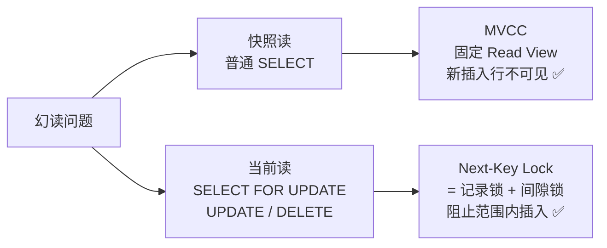
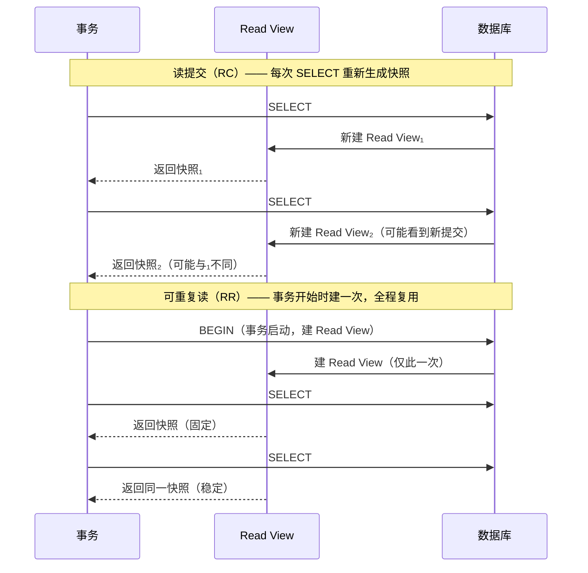

# 事务

---

## 速览

- 事务 = 一组操作的原子单元，要么全做，要么全不做。
- ACID 四大特性各有对应机制：原子性靠 undo log，持久性靠 redo log，隔离性靠 MVCC 或锁。
- 四种隔离级别解决三类并发问题：脏读 → 不可重复读 → 幻读（严重性递增）。
- MySQL InnoDB 默认隔离级别是**可重复读**，通过 MVCC + 间隙锁在大多数场景下规避幻读。
- 长事务是生产事故高发区：持锁时间长、undo log 膨胀、阻塞其他事务。

---

## ACID 四大特性

> **一句话理解：** 事务靠四个特性保证数据在并发和故障下仍然正确。

**核心结论（可背）：**
| 特性 | 保证内容 | 实现机制 |
|---|---|---|
| 原子性 Atomicity | 操作不可分割，失败则全部回滚 | `undo log`（回滚日志） |
| 一致性 Consistency | 事务前后数据库始终满足约束 | 由 A + I + D 共同保障，不单独实现 |
| 隔离性 Isolation | 并发事务互不干扰中间状态 | MVCC 或锁 |
| 持久性 Durability | 提交后数据不因崩溃丢失 | `redo log`（重做日志，WAL） |

**机制解释：**
- **undo log**：记录数据修改前的旧值，事务回滚时按日志逆向恢复。
- **redo log**：事务提交前先写日志到磁盘，崩溃重启后按日志重放，保证持久。
- **一致性**不是独立机制，是原子性 + 隔离性 + 持久性共同作用的结果。

**面试官常问：**
- ACID 各自如何实现？→ 按上表背出机制即可。
- 一致性靠什么保证？→ 不是单独保证的，是 A+I+D 的合力结果。

**易错点：**
- ❌ 以为一致性有独立的实现机制 → 没有，它是目标不是手段。
- ❌ 混淆 undo log（回滚）和 redo log（重做）→ undo 管原子性，redo 管持久性，方向相反。

🎯 **Interview Triggers:**
- ACID 四个特性各靠什么机制保证？（MECHANISM）
- undo log 和 redo log 的区别，方向相反体现在哪？（COMPARISON）
- 一致性为什么没有独立的实现机制？（WHY）
- 如果 redo log 写到一半时宕机，数据库重启后怎么处理？（FAILURE）
- WAL（Write-Ahead Logging）的核心思想是什么？（MECHANISM）

🧠 **Question Type:** 机制原理 对比辨析 故障恢复

🔥 **Follow-up Paths:**
- 原子性 → undo log 记录旧值 → 回滚时逆向恢复 → 多版本链 → MVCC 基础
- 持久性 → redo log WAL → 先写日志再写数据页 → 崩溃重放 → 保证提交不丢
- 一致性 → 不独立实现 → A+I+D 合力 → 违反任意一个都可能破坏一致性

🛠 **Engineering Hooks:**
- `innodb_flush_log_at_trx_commit=1` 保证每次提交都将 redo log 刷盘，是持久性的硬性保障；设置为 2 可提升写性能但宕机时可能丢失最近 1 秒数据，需根据业务容忍度选择。
- undo log 不仅用于回滚，还是 MVCC 版本链的数据来源，长事务会导致 undo log 无法回收，需监控 `information_schema.INNODB_TRX`。
- 生产中避免大事务：单次修改行数控制在 1000 行以内，超出则分批提交，防止 undo log 膨胀。
- 可通过 `SHOW ENGINE INNODB STATUS` 查看当前 undo log 段的使用情况，判断是否有长事务残留。

---

## 三大并发异常

> **一句话理解：** 并发事务不加控制，会读到不该读的数据或读到前后不一致的数据。

**核心结论（可背）：**
| 异常 | 触发条件 | 本质 |
|---|---|---|
| 脏读 | 读到另一个**未提交**事务的数据 | 读了"可能不存在"的数据 |
| 不可重复读 | 同一行，同一事务内两次读值不同（另一事务已提交修改） | 针对**单行**，值变了 |
| 幻读 | 同一查询，两次执行行数不同（另一事务插入/删除） | 针对**行集合**，数量变了 |

**易错点：**
- ❌ 把不可重复读和幻读混为一谈：不可重复读 = 某行的**值**变了；幻读 = 结果集的**行数**变了。
- ❌ 脏读必须涉及未提交的数据；若对方已提交则属于不可重复读。

🎯 **Interview Triggers:**
- 不可重复读和幻读的区别是什么？（COMPARISON）
- 脏读和不可重复读的本质差异？（COMPARISON）
- 什么隔离级别能解决脏读但不能解决幻读？（MECHANISM）
- 举一个幻读的实际业务场景？（SCENARIO）
- 为什么幻读比不可重复读更难解决？（WHY）

🧠 **Question Type:** 概念辨析 场景举例 隔离级别关联

🔥 **Follow-up Paths:**
- 脏读 → 读未提交隔离级别 → 对方事务回滚 → 读到"从未存在"的数据 → 数据错误
- 不可重复读 → 同一行两次读值不同 → 需要行级锁或 MVCC 快照 → 可重复读隔离级别解决
- 幻读 → 行集合数量变化 → 行锁无法阻止新行插入 → 需间隙锁 → 引出 Next-Key Lock

🛠 **Engineering Hooks:**
- 在订单、库存等对数据一致性敏感的业务中，避免使用读未提交隔离级别，脏读会导致超卖等生产事故。
- 统计类报表查询中不可重复读可接受，可使用读提交以换取更高并发；账务类操作则需要可重复读。
- 幻读的典型业务场景：检查用户名是否存在 → 不存在则插入，并发时两个事务都通过检查并插入，造成重复。解决方案：唯一索引 + 捕获冲突异常。
- 可通过 `SELECT @@transaction_isolation` 确认当前会话隔离级别，排查并发问题时先确认隔离级别再分析现象。

---

## 四种隔离级别

> **一句话理解：** 隔离级别越高，并发问题越少，性能越差，按需权衡。

**核心结论（可背）：**
| 隔离级别 | 脏读 | 不可重复读 | 幻读 | 实现方式 |
|---|---|---|---|---|
| 读未提交 | ✅ 可能 | ✅ 可能 | ✅ 可能 | 直接读最新数据 |
| 读提交 | ❌ | ✅ 可能 | ✅ 可能 | 每次 SELECT 生成新 Read View |
| 可重复读（InnoDB 默认） | ❌ | ❌ | ⚠️ 大部分规避 | 事务开始时生成一次 Read View |
| 串行化 | ❌ | ❌ | ❌ | 读写全加锁，事务串行执行 |

**机制解释：**
- 读提交 vs 可重复读的本质区别只有一处：**Read View 的创建时机**。
  - 读提交：每次 SELECT 都新建 Read View → 能看到其他事务刚提交的数据。
  - 可重复读：事务启动时建一次 Read View，全程复用 → 看到的始终是事务开始时的快照。

**面试官常问：**
- MySQL 默认隔离级别是什么？→ 可重复读（Repeatable Read）。
- 读提交和可重复读的区别？→ Read View 创建时机不同（每次 SELECT vs 事务启动时）。

**易错点：**
- ❌ 以为可重复读完全解决幻读 → InnoDB 用 MVCC + Next-Key Lock 大幅规避，但不是 SQL 标准意义上的"完全解决"。

🎯 **Interview Triggers:**
- MySQL 默认隔离级别是什么，为什么不选串行化？（TRADEOFF）
- 读提交和可重复读的唯一区别是什么？（COMPARISON）
- 串行化隔离级别的实现方式及其性能代价？（MECHANISM）
- 可重复读为什么说"大部分规避"幻读而不是"完全解决"？（WHY）
- 生产中什么业务场景会把隔离级别降为读提交？（SCENARIO）

🧠 **Question Type:** 对比分析 权衡决策 原理机制

🔥 **Follow-up Paths:**
- 隔离级别升高 → 锁粒度/范围增大 → 并发度降低 → 吞吐量下降 → 串行化是极端情况
- 读提交 → 每次 SELECT 新建 Read View → 可见最新提交 → 不可重复读问题存在
- 可重复读 → 事务开始固定快照 → 对快照读幻读免疫 → 但当前读仍需 Next-Key Lock 补充

🛠 **Engineering Hooks:**
- 高并发 OLTP 系统（如电商）通常选读提交而非可重复读：锁冲突更少，吞吐更高，不可重复读通过业务逻辑补偿。
- 修改隔离级别：`SET SESSION TRANSACTION ISOLATION LEVEL READ COMMITTED`，只影响当前会话，不影响全局。
- 全局修改需在 `my.cnf` 中设置 `transaction-isolation = READ-COMMITTED` 并重启，或用 `SET GLOBAL` 对新连接生效。
- 串行化隔离级别下每个读操作都加共享锁，高并发场景下锁等待会急剧增加，QPS 可能下降 10 倍以上，仅适用于极低并发的强一致性场景。

---

## MVCC 多版本并发控制

> **一句话理解：** MVCC 让读操作不加锁，通过维护数据多个历史版本实现一致性读。

**核心结论（可背）：**
- 每行数据在 undo log 中保存多个历史版本（版本链）。
- 每个事务持有一个 **Read View**，决定它能看到哪个版本。
- **快照读**（普通 SELECT）→ 走 MVCC，不加锁。
- **当前读**（`SELECT ... FOR UPDATE`、`UPDATE`、`DELETE`）→ 读最新版本并加锁。

**机制解释：**

```
Read View 内容：
  - m_ids：创建时活跃（未提交）的事务 ID 列表
  - min_trx_id：m_ids 中最小值
  - max_trx_id：下一个将分配的事务 ID
  - creator_trx_id：创建此 Read View 的事务 ID

判断某行版本是否可见：
  版本 trx_id < min_trx_id     → 已提交，可见
  版本 trx_id >= max_trx_id    → 还未开始，不可见
  版本 trx_id 在 m_ids 中      → 活跃未提交，不可见
  否则                         → 可见
```

**面试官常问：**
- MVCC 是怎么实现可重复读的？→ 事务启动时固定 Read View，之后的快照读都用这个视图，不会读到新提交的数据。
- 读写为什么不互相阻塞？→ 读走 MVCC 快照，不加锁；写加行锁，两者不冲突。

**易错点：**
- ❌ 以为 MVCC 用锁实现 → MVCC 的核心就是**无锁读**，锁只在当前读时使用。
- ❌ 以为读提交和可重复读的 MVCC 原理不同 → 原理完全一样，唯一差别是 Read View 的创建时机。

🎯 **Interview Triggers:**
- MVCC 的核心数据结构是什么，Read View 里有哪些字段？（MECHANISM）
- 快照读和当前读的区别，分别在什么场景下触发？（COMPARISON）
- MVCC 如何判断一个版本对当前事务是否可见？（MECHANISM）
- 为什么读写操作在 MVCC 下不会互相阻塞？（WHY）
- undo log 版本链什么时候可以被清理回收？（MECHANISM）

🧠 **Question Type:** 原理机制 源码级理解 读写并发

🔥 **Follow-up Paths:**
- 写操作 → 旧版本写入 undo log 版本链 → Read View 按规则选择可见版本 → 无锁快照读
- 长事务 → Read View 长期存活 → min_trx_id 不推进 → undo log 无法回收 → 存储膨胀
- 当前读 → 跳过 MVCC → 读最新版本 → 加行锁/间隙锁 → 防止并发修改

🛠 **Engineering Hooks:**
- `SELECT ... FOR UPDATE` 触发当前读并加排他锁，高并发场景下应尽量减少使用，用乐观锁（版本号/时间戳）替代。
- undo log 回收由 Purge 线程负责，长事务会阻止 Purge 推进，可通过 `SHOW ENGINE INNODB STATUS` 中的 `History list length` 监控 undo log 积压量，超过 1000 需排查长事务。
- 可以用 `BEGIN; SELECT * FROM t WHERE id = 1;`（不提交）+ 另一个事务修改提交，再 SELECT 验证 MVCC 快照读行为，是理解 Read View 的最直接实验方式。
- MVCC 只在 InnoDB 引擎中支持，MyISAM 没有事务也没有 MVCC，并发读写需依赖表级锁。

---

## 幻读的解决方案

> **一句话理解：** InnoDB 通过 MVCC 处理快照读的幻读，通过 Next-Key Lock 处理当前读的幻读。

**核心结论（可背）：**

```
普通 SELECT（快照读）
  → MVCC：Read View 在事务启动时固定，新插入的行对当前事务不可见 ✅

SELECT ... FOR UPDATE / UPDATE / DELETE（当前读）
  → Next-Key Lock = 记录锁（Record Lock）+ 间隙锁（Gap Lock）
  → 锁住查询范围，阻止其他事务在范围内插入/删除 ✅
```

**机制解释：**
- **间隙锁（Gap Lock）**：锁的是索引记录之间的"间隙"，阻止新行插入该范围。
- **Next-Key Lock**：间隙锁 + 记录锁的组合，既锁已有行又锁间隙。
- 只有**当前读**才需要 Next-Key Lock；快照读靠 MVCC 天然解决。

**易错点：**
- ❌ 以为普通 SELECT 需要加间隙锁 → 不需要，快照读走 MVCC。
- ❌ 以为间隙锁锁的是行 → 间隙锁锁的是**范围**，不是具体行。



🎯 **Interview Triggers:**
- InnoDB 在可重复读下如何解决幻读？（MECHANISM）
- 间隙锁锁的是什么，和记录锁有什么区别？（COMPARISON）
- Next-Key Lock 的加锁范围如何确定？（MECHANISM）
- 间隙锁会不会导致死锁，举例说明？（FAILURE）
- 什么情况下可重复读隔离级别下仍然会出现幻读？（SCENARIO）

🧠 **Question Type:** 原理机制 边界场景 锁分析

🔥 **Follow-up Paths:**
- 当前读 → 需要最新数据 → MVCC 不够 → Next-Key Lock 锁范围 → 阻止幻行插入
- 间隙锁 → 锁住索引间隙 → 并发插入被阻塞 → 可能导致死锁 → 高并发场景需评估
- 可重复读下快照读 + 当前读混用 → 当前读看到快照读期间插入的行 → 仍然出现幻读

🛠 **Engineering Hooks:**
- 高并发插入场景中 Gap Lock 是死锁的高发来源：两个事务各持一个间隙锁并尝试向对方的间隙插入，立即死锁。可将隔离级别降为读提交（禁用间隙锁）+ 唯一索引约束来规避。
- 用 `SHOW ENGINE INNODB STATUS` 查看 `LATEST DETECTED DEADLOCK` 分析死锁涉及的锁类型，确认是否为 Gap Lock 引起。
- `SELECT ... FOR UPDATE` 在无索引时会退化为表锁（锁全表间隙），生产中必须保证 WHERE 条件走索引。
- 业务上确实需要防幻读时，优先考虑唯一索引约束而非依赖 Next-Key Lock，前者更可预期，后者锁范围难以精确估算。

---

## 隔离级别的实现细节

> **一句话理解：** 读提交和可重复读都用 MVCC，区别仅在 Read View 的创建时机。

**核心结论（可背）：**



🎯 **Interview Triggers:**
- 读提交和可重复读底层实现完全相同吗？区别在哪一行代码的逻辑上？（MECHANISM）
- 如果事务 A 在可重复读下先 SELECT 后另一个事务提交了修改，A 再 SELECT 会看到修改吗？（SCENARIO）
- BEGIN 和第一条 SELECT 哪个时刻触发 Read View 的创建？（MECHANISM）
- 读提交下为什么会出现不可重复读，从 Read View 角度解释？（WHY）
- 如何用实验验证 Read View 的创建时机？（SCENARIO）

🧠 **Question Type:** 原理推导 实验验证 底层细节

🔥 **Follow-up Paths:**
- RC 每次 SELECT 新建 Read View → 可见其他事务最新提交 → 不可重复读现象产生
- RR 事务启动建一次 Read View → 全程看同一快照 → 可重复读保证
- BEGIN 不立即建 Read View → 第一条 SQL 执行时才建 → START TRANSACTION WITH CONSISTENT SNAPSHOT 可强制立即建

🛠 **Engineering Hooks:**
- 如需在 RR 隔离级别下事务一开始就固定快照（而非第一条 SQL 时），使用 `START TRANSACTION WITH CONSISTENT SNAPSHOT` 代替 `BEGIN`，确保后续所有读都基于同一时间点。
- 调试隔离级别行为时，在两个 MySQL 会话中并行操作是最直接的验证方式：会话 A BEGIN，会话 B 修改并提交，会话 A 再 SELECT 观察结果。
- 读提交下 binlog 必须使用 row 格式（`binlog_format=ROW`），否则主从复制可能因语句执行结果不同导致数据不一致。
- 生产中排查"数据读取不一致"问题时，首先确认隔离级别和 Read View 创建时机，这是 80% 此类问题的根因。

---

## 死锁与锁等待

> **一句话理解：** 锁等待是正常并发，死锁是两个事务互相等对方释放锁，MySQL 自动打破。

**核心结论（可背）：**
- **锁等待**：事务 A 等事务 B 释放锁，正常现象，等待超时后报错。
- **死锁**：A 等 B，B 等 A，循环等待，谁都无法推进。
- MySQL InnoDB **自动检测死锁**，选择代价较小的事务回滚，另一个继续执行。

**预防手段：**
| 手段 | 说明 |
|---|---|
| 固定加锁顺序 | 所有事务按相同顺序获取锁，消除循环依赖 |
| 缩小锁粒度 | 行锁优于表锁，减少锁冲突范围 |
| 降低隔离级别 | 读提交比可重复读持锁时间短 |
| 设置锁等待超时 | `innodb_lock_wait_timeout`，防止无限等待 |

**易错点：**
- ❌ 混淆锁等待和死锁：锁等待最终会自己解除（对方提交后）；死锁不会，需要 MySQL 介入。

🎯 **Interview Triggers:**
- 死锁和锁等待的区别，MySQL 如何处理死锁？（COMPARISON）
- 描述一个典型的死锁场景，如何预防？（SCENARIO）
- MySQL 死锁检测算法是什么，代价如何？（MECHANISM）
- innodb_lock_wait_timeout 和死锁检测哪个先触发？（MECHANISM）
- 高并发下死锁检测本身会成为性能瓶颈吗？（TRADEOFF）

🧠 **Question Type:** 故障分析 预防设计 性能权衡

🔥 **Follow-up Paths:**
- 事务加锁顺序不一致 → 循环依赖形成 → 死锁 → MySQL 回滚代价小的事务 → 另一个继续
- 高并发死锁频繁 → 死锁检测（wait-for graph）开销大 → 可关闭自动检测 + 依赖超时 → 但超时时间难以设置
- Gap Lock 两个事务各自持有间隙锁并互相插入 → 立即死锁 → 降隔离级别到 RC 消除 Gap Lock

🛠 **Engineering Hooks:**
- 死锁日志查看：`SHOW ENGINE INNODB STATUS` 中 `LATEST DETECTED DEADLOCK` 段落，包含死锁涉及的 SQL、锁类型和回滚的事务。
- 生产中死锁频繁时，优先排查加锁顺序是否一致，其次检查是否存在 Gap Lock，最后考虑降隔离级别。
- `innodb_deadlock_detect=OFF` + 设置合理的 `innodb_lock_wait_timeout`（如 50ms）可避免死锁检测在极高并发（万级 TPS）下成为 CPU 瓶颈，但需评估超时误杀的影响。
- 应用层捕获死锁错误码（MySQL 错误码 1213）并自动重试，是死锁的标准处理方式；重试前加随机抖动（jitter）避免多个线程同时重试再次死锁。

---

## 长事务

> **一句话理解：** 长时间不提交的事务会持锁、膨胀 undo log，是生产环境的定时炸弹。

**危害：**
- 长时间持有行锁 → 阻塞其他写操作。
- undo log 无法回收 → 存储膨胀。
- 增大死锁概率。

**排查方式：**
```sql
-- 查找当前活跃事务（information_schema 库）
SELECT * FROM information_schema.INNODB_TRX
WHERE TIME_TO_SEC(TIMEDIFF(NOW(), trx_started)) > 60;
```

**避免手段：**
| 维度 | 措施 |
|---|---|
| 应用层 | 禁用 `autocommit=0`；去掉不必要的只读事务；控制语句执行超时 `max_execution_time` |
| 数据库层 | 监控 `INNODB_TRX`，超阈值报警/KILL；使用 `pt-kill` 工具自动清理 |

**易错点：**
- ❌ 用 `set autocommit=0` + 长连接 → 每条语句都会开启事务且不自动提交，极易产生长事务。推荐始终使用 `set autocommit=1` + 显式 `BEGIN`。

🎯 **Interview Triggers:**
- 长事务会带来哪些具体危害？（FAILURE）
- 如何在生产中发现并终止长事务？（SCENARIO）
- autocommit=0 为什么容易产生长事务？（WHY）
- undo log 膨胀的根本原因是什么，和长事务有什么关系？（MECHANISM）
- 如何从架构层面预防长事务？（SCENARIO）

🧠 **Question Type:** 故障排查 生产运维 根因分析

🔥 **Follow-up Paths:**
- autocommit=0 + 长连接 → 每条语句自动开启事务 → 忘记提交 → 长事务持续累积
- 长事务持锁 → 其他事务等待行锁 → 并发下降 → 超时报错增多 → 雪崩风险
- 长事务 → Read View 长期存活 → Purge 线程无法回收旧版本 → undo log 膨胀 → 磁盘告警

🛠 **Engineering Hooks:**
- 设置 `max_execution_time`（单位毫秒）限制单条 SQL 执行时间，防止慢查询演变为长事务；结合 `wait_timeout` 控制空闲连接自动断开。
- 监控告警：将 `INNODB_TRX` 中 `trx_started` 超过 30 秒的事务数量作为监控指标，触发告警并自动执行 `KILL CONNECTION`。
- 使用 `pt-kill`（Percona Toolkit）实现细粒度的长事务自动清理策略，可按用户、数据库、执行时间过滤，避免误杀。
- 代码 Review 中重点检查：事务内是否有网络调用（RPC/HTTP）或人工确认步骤，这些操作会使事务持续时间不可控，必须移到事务外部。

---

## 面试高频考点汇总

| 考点 | 核心答案 |
|---|---|
| ACID 各靠什么保证？ | A=undo log，C=A+I+D合力，I=MVCC/锁，D=redo log |
| 默认隔离级别？ | InnoDB：可重复读 |
| 不可重复读 vs 幻读？ | 前者是单行值变，后者是行数变 |
| 读提交 vs 可重复读区别？ | Read View 创建时机：每次SELECT vs 事务启动时 |
| InnoDB 如何解决幻读？ | 快照读→MVCC，当前读→Next-Key Lock |
| MVCC 用锁吗？ | 不用，MVCC 的价值就是无锁读 |
| 死锁如何处理？ | MySQL 自动检测，回滚代价小的那个 |
| 如何查找长事务？ | `SELECT * FROM information_schema.INNODB_TRX` |
