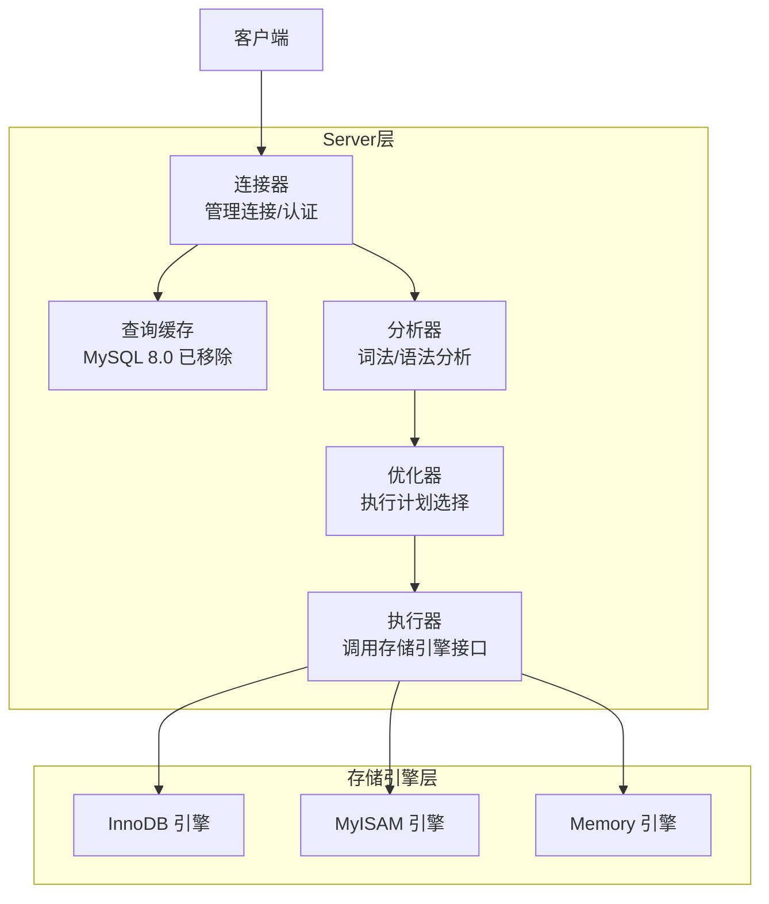

# 存储引擎

---

## 速览

- MySQL 最常用的引擎是 **InnoDB**（默认）和 **MyISAM**。
- 核心区别：InnoDB 支持事务、行锁、外键；MyISAM 不支持事务、用表锁。
- 绝大多数业务场景选 InnoDB，MyISAM 已基本退出历史舞台。
- InnoDB 通过锁 + redo log + undo log + MVCC 实现完整事务支持。

---

## 四种引擎对比

> **一句话理解：** 引擎决定数据怎么存、怎么锁、能不能回滚。

**核心结论（可背）：**
| 特性 | InnoDB | MyISAM | Memory | Archive |
|---|---|---|---|---|
| 事务 | ✅ | ❌ | ❌ | ❌ |
| 行级锁 | ✅ | ❌（表锁） | ❌（表锁） | ❌ |
| 外键 | ✅ | ❌ | ❌ | ❌ |
| 崩溃恢复 | ✅（redo log） | ❌ | ❌（断电数据丢失） | ❌ |
| 数据存储位置 | 磁盘 | 磁盘 | 内存 | 磁盘（高压缩） |
| 适用场景 | 通用，高并发写 | 读多写少，无事务 | 临时表、缓存 | 日志归档 |

🎯 **Interview Triggers:**
- 四种引擎最核心的差异维度是什么？（COMPARISON）
- 为什么 InnoDB 能支持行锁而 MyISAM 只能表锁？（WHY）
- Memory 引擎在什么场景下比 Redis 更合适？（SCENARIO）
- 选错引擎会带来哪些生产事故？举例说明（FAILURE）
- Archive 引擎不支持索引，查询时如何处理？（MECHANISM）

🧠 **Question Type:** comparison/tradeoff · classification · scenario application · principle explanation

🔥 **Follow-up Paths:**
- InnoDB 行锁 → 多事务并发修改不同行互不阻塞 → 高并发写吞吐远高于 MyISAM
- MyISAM 无事务 → 写失败无法回滚 → 数据不一致风险 → 新项目禁止使用
- Memory 引擎表级锁 → 高并发写同样是瓶颈 → 适合读多写少的临时数据
- Archive 高压缩比 → 磁盘占用小 → 仅适合只写不查的时序/归档数据

🛠 **Engineering Hooks:**
- 建表时不显式指定引擎则继承 default_storage_engine，确认生产环境该参数为 InnoDB。
- 存量 MyISAM 表可用 `ALTER TABLE t ENGINE=InnoDB` 在线迁移，大表操作前先评估锁表时间或用 gh-ost。
- Memory 引擎表数据在 MySQL 重启后清空，若用作会话缓存需配合业务层重建逻辑，或改用 Redis 更安全。
- `SHOW TABLE STATUS LIKE 'tablename'\G` 可快速查看表当前使用的引擎及行数、数据大小等信息。

---

## InnoDB

> **一句话理解：** MySQL 默认引擎，支持 ACID，行锁高并发，redo/undo log 保数据安全。

**核心结论（可背）：**
- 支持完整 **ACID 事务**（undo log 保原子性，redo log 保持久性）。
- **行级锁**：只锁需要的行，高并发写性能强。
- 支持**外键约束**，维护参照完整性。
- **Buffer Pool**：内存缓存数据和索引，减少磁盘 I/O。
- **崩溃自恢复**：宕机后 redo log 重放，数据不丢失。

**InnoDB 实现事务的四个机制：**
```
锁（行锁/间隙锁）   → 隔离性
redo log            → 持久性
undo log            → 原子性 + MVCC（隔离性）
MVCC               → 非锁定读，提升并发度
```

**面试官常问：**
- InnoDB 怎么实现事务？→ 锁 + redo log + undo log + MVCC 四件套。
- InnoDB 为什么适合高并发写？→ 行级锁，多事务可以同时修改不同行，互不阻塞。

🎯 **Interview Triggers:**
- InnoDB 的 Buffer Pool 命中率低时会有什么表现？（FAILURE）
- redo log 和 undo log 分别保证 ACID 的哪个特性？（MECHANISM）
- InnoDB 的行锁是加在索引上的，不走索引会怎样？（FAILURE）
- 为什么 InnoDB 的聚簇索引叶子节点存完整行数据？（WHY）
- InnoDB 如何用 MVCC 实现非锁定读从而提升并发？（MECHANISM）

🧠 **Question Type:** mechanism explanation · principle explanation · debugging/failure analysis · concept linkage

🔥 **Follow-up Paths:**
- InnoDB 行锁加在索引上 → SQL 不走索引 → 退化为表锁 → 并发度骤降
- Buffer Pool 命中率低 → 频繁磁盘 I/O → 查询延迟上升 → 需扩大 innodb_buffer_pool_size
- undo log 版本链 → MVCC Read View → 快照读无需加锁 → 读写并发互不阻塞
- 聚簇索引 → 数据与主键索引共存 → 回表成本为零 → 主键查询最优路径

🛠 **Engineering Hooks:**
- innodb_buffer_pool_size 建议设为物理内存的 50%-75%，是影响 InnoDB 读性能最关键的单一参数。
- 确保高频查询走索引，否则行锁退化为表锁，用 `EXPLAIN` 确认 type 不为 ALL。
- 外键约束会在 INSERT/UPDATE/DELETE 时触发额外查询，高并发写场景建议在业务层维护引用完整性，不在数据库层加外键。
- 定期监控 `Innodb_buffer_pool_reads`（物理读次数）与 `Innodb_buffer_pool_read_requests` 的比值，命中率应保持在 99% 以上。

---

## MyISAM

> **一句话理解：** 老式引擎，无事务无行锁，读快但写并发差，新项目不建议使用。

**核心结论（可背）：**
- **表级锁**：写操作锁整张表，高并发写严重瓶颈。
- **无事务**：写入失败无法回滚，数据一致性无保证。
- **无崩溃恢复**：宕机可能导致数据损坏。
- 唯一优势：全文索引（旧版本）、简单只读场景速度快。

**与 InnoDB 的核心区别（必背）：**
| 维度 | InnoDB | MyISAM |
|---|---|---|
| 锁粒度 | 行锁 | 表锁 |
| 事务 | 支持 | 不支持 |
| 外键 | 支持 | 不支持 |
| 崩溃恢复 | redo log 自动恢复 | 手动修复或数据丢失 |
| COUNT(*) | 需扫描（无维护行数） | O(1)（维护了总行数） |

**易错点：**
- ❌ 以为 MyISAM COUNT(*) 性能好所以该用 → COUNT(*) 快是因为维护了行数，但无事务的代价远大于此。
- ❌ 以为新项目可以用 MyISAM 读多写少场景 → InnoDB 读性能已足够好，且有事务保障，新项目一律 InnoDB。

🎯 **Interview Triggers:**
- MyISAM 的 COUNT(*) 为什么比 InnoDB 快？这是否意味着应该选 MyISAM？（TRADEOFF）
- MyISAM 表锁在什么情况下会造成生产故障？（FAILURE）
- 历史上 MyISAM 有哪些场景优势，现在是否还适用？（COMPARISON）
- MyISAM 崩溃后数据损坏如何修复？（SCENARIO）
- 为什么 InnoDB 的 COUNT(*) 不维护总行数？（WHY）

🧠 **Question Type:** comparison/tradeoff · debugging/failure analysis · principle explanation · classification

🔥 **Follow-up Paths:**
- MyISAM 表锁 → 一个写操作阻塞全表读写 → 高并发下锁等待堆积 → 连接数打满服务崩溃
- MyISAM 无事务 → 批量写中途宕机 → 部分数据写入部分未写入 → 数据不一致且无法回滚
- InnoDB COUNT(*) 需扫描 → 因 MVCC 不同事务看到不同行数 → 无法维护单一准确总数
- MyISAM 崩溃 → .MYI/.MYD 文件损坏 → 需 myisamchk 手动修复 → 可能仍有数据丢失

🛠 **Engineering Hooks:**
- 发现线上有 MyISAM 表时，评估迁移到 InnoDB 的成本，优先迁移有写操作的表，只读统计表可最后处理。
- 迁移前检查业务是否依赖 MyISAM 的 COUNT(*) 性能，如有需要改写为缓存计数（Redis incr）。
- `mysqlcheck --all-databases --auto-repair` 可批量检测和修复 MyISAM 损坏表，建议纳入定期巡检。
- MySQL 8.0 已将系统表从 MyISAM 迁移到 InnoDB，如发现 8.0 环境仍有 MyISAM 表，大概率是历史遗留需清理。

---

## Memory 引擎

> **一句话理解：** 数据放内存，极快但断电全丢，只用于临时表或会话级缓存。

**核心结论（可背）：**
- 数据全在内存 → 读写极快，服务重启 → 数据全部丢失。
- 支持哈希索引（默认），等值查询快。
- 表级锁，高并发写性能差。
- 适合：临时计算结果、会话级缓存、不需要持久化的热点数据。

🎯 **Interview Triggers:**
- Memory 引擎和 Redis 的使用场景如何区分？（COMPARISON）
- Memory 引擎重启数据丢失，有哪些场景仍然适合使用？（SCENARIO）
- Memory 引擎的哈希索引和 B+ 树索引各适合什么查询？（TRADEOFF）
- 为什么 MySQL 内部临时表会优先使用 Memory 引擎？（WHY）
- Memory 引擎表级锁在高并发写时会有什么问题？（FAILURE）

🧠 **Question Type:** comparison/tradeoff · scenario application · classification · principle explanation

🔥 **Follow-up Paths:**
- Memory 引擎哈希索引 → 等值查询 O(1) → 范围查询不支持 → 需显式创建 BTREE 索引才能范围查
- Memory 表级锁 → 写操作串行 → 高并发写堆积 → 性能不如预期需换 Redis
- MySQL 内部临时表 → 优先 Memory 引擎 → 数据量超 tmp_table_size → 自动转为磁盘临时表（InnoDB/MyISAM）
- 服务重启 → Memory 数据清空 → 依赖它的功能失效 → 业务层必须有重建逻辑

🛠 **Engineering Hooks:**
- Memory 引擎适合存放 MySQL 内的中间计算结果（如复杂 JOIN 的中间表），不适合跨服务共享缓存（用 Redis）。
- 通过 `max_heap_table_size` 控制单张 Memory 表最大内存占用，超出后写入报错，需预估数据量合理设置。
- 如果 Memory 表需要范围查询，建表时显式指定 `USING BTREE`：`INDEX USING BTREE (col)`。
- 监控 `Created_tmp_disk_tables` / `Created_tmp_tables` 比值，比值高说明内存临时表频繁溢出到磁盘，需调大 tmp_table_size。

---

## Archive 引擎

> **一句话理解：** 高度压缩存归档数据，只能追加写，不支持索引，查询极慢。

**核心结论（可背）：**
- 压缩比高，节省存储空间。
- 支持高速 INSERT，不支持 UPDATE/DELETE。
- 无索引，查询只能全表扫描。
- 适合：传感器数据、历史日志等只写不查的场景。

🎯 **Interview Triggers:**
- Archive 引擎不支持 UPDATE/DELETE，如何处理数据修正需求？（SCENARIO）
- Archive 和直接写压缩文件相比，使用 MySQL Archive 引擎有什么优势？（COMPARISON）
- Archive 无索引，在什么条件下全表扫描仍然可接受？（TRADEOFF）
- 为什么 Archive 引擎适合时序/传感器数据写入？（WHY）
- 大量历史数据归档选 Archive 引擎还是分库分表还是对象存储？（COMPARISON）

🧠 **Question Type:** scenario application · comparison/tradeoff · classification · system design

🔥 **Follow-up Paths:**
- Archive 高压缩比 → 磁盘成本低 → 但无索引全表扫描 → 只适合写多查极少的归档场景
- Archive 不支持 UPDATE/DELETE → 数据修正只能追加新记录并在业务层标记作废 → 增加业务复杂度
- 数据量超大归档 → Archive 引擎仍在单机限制内 → 超出后考虑对象存储（S3/OSS）+ Presto/Athena 查询
- INSERT 极快（追加写无索引维护）→ 适合高频写低频读的传感器/埋点场景

🛠 **Engineering Hooks:**
- 生产中日志归档优先考虑对象存储（OSS/S3）而非 Archive 引擎，对象存储更易扩展且成本更低。
- 若使用 Archive 引擎，做好分表按时间维度切分（如按月建表），避免单表过大导致全表扫描超时。
- Archive 引擎文件（.ARZ）可直接压缩备份，比 InnoDB 的 .ibd 文件体积小 60%-80%，适合冷数据长期存档。
- 评估归档方案时优先顺序：对象存储 > 冷库（低配 MySQL InnoDB）> Archive 引擎，Archive 使用场景极为有限。

---

## MySQL 架构与引擎位置



**关键：binlog 在 Server 层，redo log / undo log 在 InnoDB 层。**

🎯 **Interview Triggers:**
- MySQL 的 Server 层和存储引擎层分离带来了什么好处？（WHY）
- 执行器调用引擎接口时，一条 SELECT 的完整执行路径是怎样的？（MECHANISM）
- 查询缓存为什么在 MySQL 8.0 被移除？（TRADEOFF）
- 优化器如何决定用哪个索引？可以被干预吗？（MECHANISM）
- binlog 在 Server 层而非引擎层，这个设计有什么影响？（COMPARISON）

🧠 **Question Type:** principle explanation · mechanism explanation · concept linkage · system design

🔥 **Follow-up Paths:**
- Server 层与引擎层分离 → 引擎可插拔 → 同一 SQL 层可切换不同存储后端 → InnoDB/MyISAM/Memory 共用同一 SQL 解析
- 一条 SELECT → 分析器词法语法分析 → 优化器生成执行计划 → 执行器调用引擎接口 → 引擎返回数据
- 查询缓存 → 任何相关表写操作导致缓存失效 → 高写场景命中率极低反而增加开销 → 8.0 移除
- binlog 在 Server 层 → 任何引擎的写操作都被 binlog 记录 → 主从复制不依赖具体引擎实现

🛠 **Engineering Hooks:**
- MySQL 8.0 已移除查询缓存，若从旧版本迁移需删除 SQL_CACHE/SQL_NO_CACHE 提示，否则报语法错误。
- 优化器选错索引时，用 `FORCE INDEX(idx_name)` 强制指定，但要配合监控定期验证强制索引是否仍是最优选择。
- 分析执行计划用 `EXPLAIN FORMAT=JSON` 获得最详细输出，包括 cost 估算和实际使用的索引条件。
- 连接器管理连接生命周期，长连接占用内存不释放时用 `FLUSH TABLES` 或设置 `wait_timeout` 自动断开空闲连接。

---

## 引擎选择决策树

```
需要事务？
  是 → InnoDB（基本上所有业务场景）
  否 → 需要持久化？
         否 → Memory（临时缓存）
         是 → 只写不查且量大？
                是 → Archive（归档日志）
                否 → InnoDB（仍然更好）
```

🎯 **Interview Triggers:**
- 面对一个新业务场景，如何系统地选择存储引擎？（SCENARIO）
- 有没有 InnoDB 不是最优选择的场景？（TRADEOFF）
- 临时表选 Memory 引擎还是 InnoDB 临时表，取决于什么？（COMPARISON）
- 如果需要同时满足高速写入和高压缩比，应该怎么设计存储方案？（SYSTEM DESIGN）
- 引擎选择错误后，迁移的代价和风险有哪些？（FAILURE）

🧠 **Question Type:** scenario application · system design · comparison/tradeoff · classification · implementation detail

🔥 **Follow-up Paths:**
- 有事务需求 → 无论读写比如何直接选 InnoDB → 避免无事务引擎带来的数据一致性风险
- 无持久化需求 + 生命周期短 → Memory 引擎 → 但要考虑 MySQL 重启后数据丢失的处理逻辑
- 只写不查 + 数据量大 → Archive → 但超过单机容量后要升级为对象存储方案
- 存量 MyISAM 迁移 → 评估 COUNT(*) 依赖 + 全文索引依赖 → 逐表迁移 → 优先高写入频率表

🛠 **Engineering Hooks:**
- 新项目统一 InnoDB，不要因为"读多写少"就尝试 MyISAM，InnoDB 的读性能已完全足够且有事务保障。
- 决策树中的 Archive 分支在实际生产中几乎不用，绝大多数"只写不查"场景用 Kafka + 冷存储更合适。
- 对于超大规模时序数据，考虑专用时序数据库（InfluxDB、TimescaleDB）而非在 MySQL 中折腾引擎选择。
- 引擎迁移前用 `pt-online-schema-change` 或 `gh-ost` 做在线 DDL，避免 `ALTER TABLE ENGINE=InnoDB` 锁表影响业务。

---

## 面试高频考点汇总

| 考点 | 核心答案 |
|---|---|
| InnoDB 和 MyISAM 核心区别？ | 行锁 vs 表锁；有事务 vs 无事务；支持外键 vs 不支持 |
| 为什么 InnoDB 适合高并发？ | 行级锁，多事务可并发修改不同行 |
| InnoDB 如何实现事务？ | 锁 + redo log + undo log + MVCC |
| Memory 引擎的致命缺点？ | 断电数据全丢，不可持久化 |
| MyISAM 的 COUNT(*) 为什么快？ | 维护了总行数，O(1) 直接返回 |
| binlog 属于哪一层？ | Server 层，所有引擎共用 |
| redo log 属于哪一层？ | InnoDB 引擎层 |
