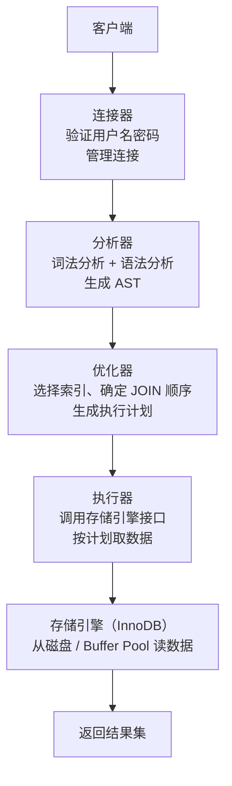

# 数据库基础

---

## 速览

- 主键唯一标识行，外键建立表间关系，索引加速查询——三者职责不同。
- SQL 执行流程：连接 → 解析 → 优化 → 执行 → 返回，MySQL 8.0 已移除查询缓存。
- 三大范式消除冗余：1NF 原子性，2NF 消除部分依赖，3NF 消除传递依赖。
- 分片（跨实例）vs 分区（单实例内）：解决不同规模的大表问题。

---

## 主键、外键、索引的区别

> **一句话理解：** 主键保证行唯一，外键建立关联，索引加速查询——功能完全不同。

**核心结论（可背）：**
| 概念 | 定义 | 是否可重复 | 是否可为 NULL | 作用 |
|---|---|---|---|---|
| 主键 | 唯一标识一行的字段 | ❌ 不可重复 | ❌ 不可为 NULL | 唯一标识 + 聚簇索引基础 |
| 外键 | 引用另一张表主键的字段 | ✅ 可重复 | ✅ 可为 NULL | 建立表间关系，维护参照完整性 |
| 索引 | 加速查询的数据结构 | 普通索引可重复 | ✅ 可为 NULL（唯一索引除外） | 提升查询性能 |

**易错点：**
- ❌ 主键 = 索引：主键会自动建聚簇索引，但索引不一定是主键。
- ❌ 外键约束性能好：外键在高并发写入时增加检查开销，互联网项目多不使用数据库外键，改为应用层保证。

🎯 **Interview Triggers:**
- 主键和唯一索引有什么区别？（COMPARISON）
- 为什么互联网项目普遍不用数据库外键？（TRADEOFF）
- 聚簇索引和非聚簇索引的区别是什么？（MECHANISM）
- 索引建多了有什么代价？（TRADEOFF）
- 什么情况下索引会失效？（SCENARIO）

🧠 **Question Type:** comparison/tradeoff · concept linkage · mechanism explanation · principle explanation

🔥 **Follow-up Paths:**
- 主键 → 自动创建聚簇索引 → 决定数据物理存储顺序 → 影响范围查询性能
- 外键约束 → 每次写入需校验关联表 → 高并发下成为锁争用热点 → 改为应用层维护
- 索引过多 → 写操作需维护所有索引结构 → 写性能下降 → 按查询频率选择性建索引

🛠 **Engineering Hooks:**
- 互联网项目通常禁用数据库外键，改在服务层做参照完整性校验，避免跨表锁。
- 主键推荐用自增整数，避免用 UUID（随机写入导致 B+ 树页频繁分裂，写性能下降 30%+）。
- 唯一约束不等于主键：业务唯一字段（如手机号）建唯一索引，ID 字段做主键，两者分开。
- 联合索引遵循最左前缀原则，字段顺序影响索引利用率，设计时把区分度高的字段放左边。
- 定期用 `SHOW INDEX FROM table` 检查索引使用情况，结合慢查询日志删除无效索引。

---

## SQL 执行流程

> **一句话理解：** 一条 SQL 从连接到返回，要经过连接器、分析器、优化器、执行器、存储引擎五个阶段。

**核心结论（可背）：**



**关键节点说明：**
| 阶段 | 职责 | 面试要点 |
|---|---|---|
| 连接器 | TCP 握手 + 用户认证 | 长连接复用，短连接每次新建 |
| 查询缓存 | （MySQL 8.0 已移除）完全匹配才命中 | 表更新即失效，命中率低 |
| 分析器 | 词法分析 + 语法分析，生成 AST | 语法错误在此阶段报出 |
| 优化器 | 基于统计信息选最优执行计划 | 不一定选最优索引，可 FORCE INDEX |
| 执行器 | 按执行计划逐步取数据 | 权限校验在此阶段 |

**面试官常问：**
- MySQL 8.0 为什么移除查询缓存？→ 表一更新所有相关缓存失效，高并发写场景命中率极低，维护成本高于收益。
- 慢 SQL 如何诊断？→ `EXPLAIN` 看执行计划；开启 `slow_query_log`；`SHOW ENGINE INNODB STATUS` 查锁。

🎯 **Interview Triggers:**
- MySQL 8.0 为什么移除查询缓存？（WHY）
- 优化器为什么有时候不选择最优索引？（MECHANISM）
- 权限校验在执行流程的哪个阶段发生？（MECHANISM）
- 长连接和短连接的区别及适用场景？（SCENARIO）
- 慢查询如何定位和分析？（SCENARIO）

🧠 **Question Type:** mechanism explanation · principle explanation · debugging/failure analysis · scenario application

🔥 **Follow-up Paths:**
- 查询缓存 → 任意写操作使相关缓存全部失效 → 高并发写场景缓存命中率趋近于零 → MySQL 8.0 彻底移除
- 优化器选错索引 → 统计信息过期或数据分布不均 → 用 FORCE INDEX 强制指定 → 或 ANALYZE TABLE 更新统计
- 慢 SQL → EXPLAIN 查 type 和 rows → 发现全表扫描 → 补充合适索引 → 验证执行计划变化

🛠 **Engineering Hooks:**
- 生产环境开启慢查询日志：`slow_query_log=ON`，`long_query_time=1`，配合 pt-query-digest 分析 TOP SQL。
- 连接池最大连接数不超过数据库 `max_connections` 的 80%，留余量给运维紧急连接。
- `EXPLAIN FORMAT=JSON` 比普通 EXPLAIN 提供更详细的执行计划，包括实际 cost 估算。
- 优化器统计信息异常时用 `ANALYZE TABLE` 重建，避免因统计偏差选错执行计划。
- 定期监控 `Threads_connected` 和 `Threads_running`，区分连接数打满和 CPU 打满两类瓶颈。

---

## 三大范式

> **一句话理解：** 三大范式层层递进，逐步消除冗余——1NF 原子，2NF 完全依赖，3NF 直接依赖。

**核心结论（可背）：**
| 范式 | 要求 | 解决的问题 |
|---|---|---|
| 1NF | 每个字段值不可再分（原子性） | 消除集合/复合字段 |
| 2NF | 满足 1NF + 非主键字段完全依赖于整个主键 | 消除部分依赖（针对复合主键） |
| 3NF | 满足 2NF + 非主键字段直接依赖于主键 | 消除传递依赖（A→B→主键变成 A→主键） |

**典型违反示例：**
```
违反 2NF：
  表 (学生ID, 课程ID, 学生姓名, 成绩)
  主键是 (学生ID, 课程ID)，但"学生姓名"只依赖于学生ID → 部分依赖
  拆分 → 学生表(学生ID, 姓名) + 成绩表(学生ID, 课程ID, 成绩)

违反 3NF：
  表 (员工ID, 员工姓名, 部门ID, 部门名称)
  部门名称依赖部门ID，部门ID依赖员工ID → 传递依赖
  拆分 → 员工表(员工ID, 员工姓名, 部门ID) + 部门表(部门ID, 部门名称)
```

**易错点：**
- ❌ 实际开发严格遵守三范式 → 有时为性能适当反范式（如冗余字段减少 JOIN）。

🎯 **Interview Triggers:**
- 三大范式分别解决什么问题？（MECHANISM）
- 什么场景下应该做反范式设计？（TRADEOFF）
- 反范式冗余字段带来哪些维护风险？（FAILURE）
- 2NF 和 3NF 的核心区别是什么？（COMPARISON）

🧠 **Question Type:** principle explanation · comparison/tradeoff · scenario application · concept linkage

🔥 **Follow-up Paths:**
- 严格遵循三范式 → 数据无冗余但 JOIN 增多 → 查询性能下降 → 反范式冗余热点字段
- 违反 2NF → 部分依赖导致更新异常 → 修改一处需同步多行 → 数据不一致风险
- 反范式冗余字段 → 写入时需双写维护一致性 → 引入异步同步或触发器 → 增加系统复杂度

🛠 **Engineering Hooks:**
- 读多写少的查询热点字段（如用户名、商品标题）可以在订单表冗余存储，避免高频 JOIN。
- 冗余字段必须明确维护策略：同步双写、异步消息更新或定时对账，三选一并写入文档。
- OLTP 场景遵循三范式减少写放大；OLAP/数仓场景用星型/雪花模型，允许大量冗余换取查询效率。
- 表设计评审时检查是否存在重复列组（如 phone1, phone2, phone3），这是违反 1NF 的典型信号。

---

## JOIN 操作

> **一句话理解：** JOIN 是多表连接的核心，内连接取交集，外连接保留一侧全量。

**核心结论（可背）：**
| 类型 | 返回结果 | 适用场景 |
|---|---|---|
| INNER JOIN | 两表都有匹配的行 | 只要有关联的数据 |
| LEFT JOIN | 左表全部 + 右表匹配（无则 NULL） | 保留左表所有数据 |
| RIGHT JOIN | 右表全部 + 左表匹配（无则 NULL） | 保留右表所有数据 |
| FULL JOIN | 两表全部（无匹配补 NULL） | MySQL 不直接支持，用 UNION 模拟 |
| CROSS JOIN | 笛卡尔积（所有组合） | 生成测试数据 |

🎯 **Interview Triggers:**
- LEFT JOIN 和 INNER JOIN 返回结果有何不同？（COMPARISON）
- MySQL 为什么不直接支持 FULL JOIN？（WHY）
- 多表 JOIN 时优化器如何决定驱动表？（MECHANISM）
- JOIN 条件写在 ON 里和写在 WHERE 里有什么区别？（SCENARIO）
- 大表 JOIN 小表和小表 JOIN 大表哪个更快？（TRADEOFF）

🧠 **Question Type:** comparison/tradeoff · mechanism explanation · scenario application · principle explanation

🔥 **Follow-up Paths:**
- LEFT JOIN 条件写在 WHERE → 等价于 INNER JOIN → 过滤掉了 NULL 行 → 结果与预期不符
- 大表驱动小表 → 外层循环次数多 → 每次内层走索引快 → 整体效率反而高于小表驱动大表
- JOIN 无索引关联 → Nested Loop 退化为全表扫描 → 数据量大时性能灾难 → 关联字段必须建索引

🛠 **Engineering Hooks:**
- JOIN 关联字段两侧数据类型必须一致，隐式类型转换会导致索引失效（如 INT 关联 VARCHAR）。
- 超过三表的 JOIN 考虑拆分为多次查询在应用层组装，避免优化器生成低效执行计划。
- EXPLAIN 中 `Using join buffer (Block Nested Loop)` 说明关联字段缺索引，必须补充。
- FULL JOIN 用 `LEFT JOIN UNION RIGHT JOIN` 模拟时注意去重，避免中间数据重复计算。
- 小表作为驱动表时可用 `STRAIGHT_JOIN` 强制固定驱动顺序，跳过优化器误判。

---

## 分片 vs 分区

> **一句话理解：** 分区在单机内拆表，分片跨多机拆库，应对不同数据规模。

**核心结论（可背）：**
| 维度 | 分区（Partitioning） | 分片（Sharding） |
|---|---|---|
| 范围 | 单一数据库实例内 | 多个数据库实例/服务器 |
| 目的 | 优化大表查询性能和管理 | 水平扩展容量和吞吐 |
| 复杂度 | 较低（MySQL 内置支持） | 较高（需要路由层、分布式事务） |
| 适用场景 | 数据量大但单机能承受 | 单机无法承受，需分布式 |

🎯 **Interview Triggers:**
- 分区和分片分别解决什么规模的问题？（COMPARISON）
- 分片后跨分片的 JOIN 和事务怎么处理？（FAILURE）
- 分片键如何选择？选不好会有什么后果？（TRADEOFF）
- 什么时候用分区就够了，不需要分片？（SCENARIO）
- 分片后如何做全局唯一 ID？（MECHANISM）

🧠 **Question Type:** comparison/tradeoff · scenario application · system design · debugging/failure analysis · mechanism explanation

🔥 **Follow-up Paths:**
- 分片键选择热点字段（如时间） → 写入集中在同一分片 → 热点分片成瓶颈 → 需引入哈希分片打散
- 跨分片 JOIN → 无法在数据库层合并 → 改为应用层聚合 → 增加网络往返和代码复杂度
- 分布式事务 → 两阶段提交（2PC）→ 协调者单点故障风险 → 改用 Saga 或最终一致性补偿

🛠 **Engineering Hooks:**
- 分片键一旦确定极难修改，设计阶段要充分评估数据增长模式和查询模式再决策。
- 全局唯一 ID 推荐雪花算法（Snowflake）：时间戳 + 机器 ID + 序列号，无需中心协调。
- 分区表查询条件中必须包含分区键，否则触发全分区扫描，性能比普通表更差。
- 读写分离和分片是不同层面的优化：读写分离解决读压力，分片解决容量和写压力，可组合使用。
- ShardingSphere、Vitess 等中间件可透明化分片路由，降低业务层改造成本。

---

## 连接池

> **一句话理解：** 连接池预先建立一批连接，复用而不是每次新建，大幅降低建连开销。

**核心结论（可背）：**
- 建立数据库连接需要 TCP 握手 + 认证，开销大。
- 连接池维护一个连接复用池，请求来了从池里取，用完还回去。
- 关键参数：最大连接数（限制并发）、最小空闲连接数（避免频繁建连）、连接超时时间。

🎯 **Interview Triggers:**
- 连接池的核心作用是什么？（WHY）
- 连接池最大连接数设置过大或过小分别有什么影响？（TRADEOFF）
- 连接池连接泄漏如何排查？（FAILURE）
- 连接池在微服务场景下有什么特殊挑战？（SCENARIO）
- 连接超时和查询超时的区别？（COMPARISON）

🧠 **Question Type:** principle explanation · comparison/tradeoff · debugging/failure analysis · scenario application

🔥 **Follow-up Paths:**
- 最大连接数过大 → 超过数据库 max_connections → 新连接被拒绝 → 服务雪崩
- 连接泄漏 → 连接未归还池中 → 可用连接耗尽 → 请求排队超时 → 业务报错
- 微服务实例数增多 → 每个实例持有连接池 → 总连接数 = 实例数 × 池大小 → 数据库连接数爆炸

🛠 **Engineering Hooks:**
- 连接池最大连接数经验值：`(CPU核心数 × 2) + 磁盘数`，不要无脑设置成几百。
- 设置连接最大存活时间（maxLifetime）略小于数据库 wait_timeout，避免使用已被服务端关闭的连接。
- 开启连接池的连接检活（testOnBorrow 或 keepalive），防止拿到已断开的陈旧连接。
- 微服务场景下使用 PgBouncer 或 ProxySQL 在数据库前做连接多路复用，减少数据库侧连接总数。
- 监控连接池 active/idle/pending 指标，pending 长期大于 0 说明连接池瓶颈，需扩容或优化 SQL。

---

## MySQL vs Redis

**核心结论（可背）：**
| 维度 | MySQL | Redis |
|---|---|---|
| 类型 | 关系型数据库 | 键值对缓存/NoSQL |
| 存储 | 磁盘 | 内存（可持久化） |
| 数据结构 | 表/行/列 | String、Hash、List、Set、ZSet |
| 事务 | 完整 ACID | 弱事务（MULTI/EXEC，不支持回滚） |
| 持久化 | redo log（InnoDB） | RDB 快照 + AOF 日志 |
| 适用场景 | 复杂查询、事务、关系数据 | 缓存、计数、排行榜、会话存储 |

🎯 **Interview Triggers:**
- MySQL 和 Redis 的适用场景如何划分？（SCENARIO）
- Redis 的弱事务和 MySQL 的 ACID 事务差距在哪里？（COMPARISON）
- 什么时候缓存会导致数据不一致，如何应对？（FAILURE）
- Redis 持久化 RDB 和 AOF 各有什么优缺点？（TRADEOFF）
- 如何设计缓存与数据库的双写一致性方案？（MECHANISM）

🧠 **Question Type:** comparison/tradeoff · scenario application · system design · debugging/failure analysis · mechanism explanation

🔥 **Follow-up Paths:**
- 先写 DB 再删缓存 → 并发读请求拿到旧缓存 → 缓存重建后覆盖新数据 → 延迟双删或订阅 binlog
- Redis 无回滚机制 → MULTI/EXEC 中部分命令失败 → 其余命令仍然执行 → 数据处于中间状态
- AOF 每次写都 fsync → 持久化最强 → IO 开销大 → 生产常用 AOF everysec 折中

🛠 **Engineering Hooks:**
- 缓存 Key 设计要带版本号或业务前缀，避免不同模块的 Key 冲突（如 `user:v2:1001`）。
- 缓存穿透（查不存在的 Key）用布隆过滤器拦截；缓存击穿（热点 Key 过期）用互斥锁或永不过期策略。
- Redis 集群模式下 MULTI/EXEC 事务的 Key 必须在同一 slot，否则报错，设计时注意 Hash Tag。
- 双写一致性推荐订阅 MySQL binlog（Canal）异步更新缓存，比业务层双写更可靠，解耦更彻底。
- Redis 内存使用率超过 80% 时触发 maxmemory-policy 淘汰，生产环境需监控并提前扩容。

---

## 面试高频考点汇总

| 考点 | 核心答案 |
|---|---|
| SQL 执行流程？ | 连接→分析→优化→执行→存储引擎→返回 |
| 为什么 MySQL 8.0 移除查询缓存？ | 更新即失效，高并发写命中率极低 |
| 三大范式？ | 1NF 原子，2NF 消除部分依赖，3NF 消除传递依赖 |
| 外键性能影响？ | 写入时需校验关联，高并发场景通常在应用层维护 |
| 分片 vs 分区？ | 分区单实例内，分片跨实例；应对规模不同 |
| JOIN 类型？ | INNER（交集）、LEFT（保左）、RIGHT（保右）、CROSS（笛卡尔积） |
