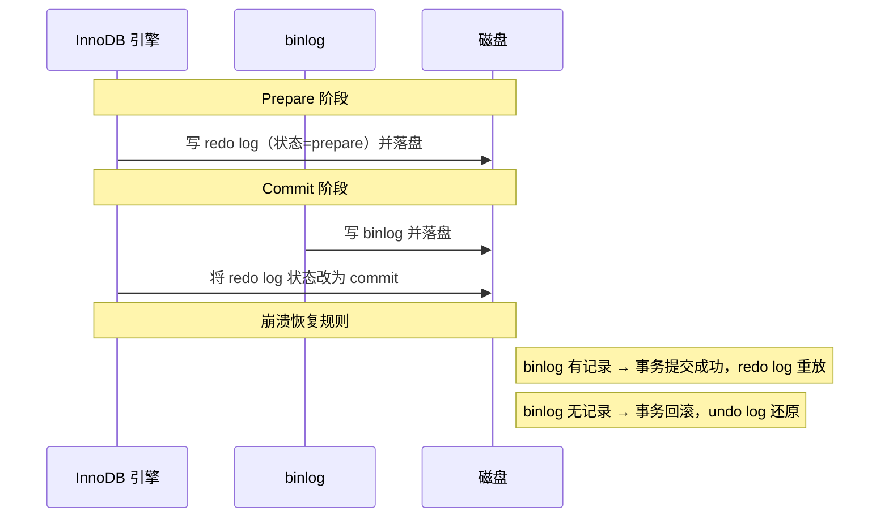

# 日志（undo log / redo log / binlog）

---

## 速览

- MySQL 有三种核心日志：undo log（回滚）、redo log（重做）、binlog（归档）。
- undo log 和 redo log 属于 InnoDB 层；binlog 属于 Server 层，所有引擎共用。
- redo log 和 binlog 必须保持一致，通过**两阶段提交（2PC）**来保证。
- 崩溃后：提交前崩溃 → 用 undo log 回滚；提交后崩溃 → 用 redo log 恢复。

---

## 三大日志对比

> **一句话理解：** undo 管"撤销"，redo 管"重做"，binlog 管"同步"。

**核心结论（可背）：**
| 日志 | 所属层 | 格式 | 写入方式 | 用途 |
|---|---|---|---|---|
| undo log | InnoDB 层 | 逻辑日志（旧值） | 随事务产生 | 事务回滚 + MVCC 版本链 |
| redo log | InnoDB 层 | 物理日志（页修改） | 循环写，固定大小 | 崩溃恢复（持久性） |
| binlog | Server 层 | Statement/Row/Mixed | 追加写，不覆盖 | 主从复制 + 数据备份 |

**机制解释：**
- **undo log**：记录操作前的旧值，构成版本链（每条记录有 `roll_pointer` 串联历史）。事务回滚时逆向执行；MVCC 快照读时沿版本链找可见版本。
- **redo log**：记录某数据页做了什么物理修改。事务提交前先把 redo log 写盘（WAL，Write-Ahead Log），崩溃重启后回放即可。
- **binlog**：记录所有 DDL 和 DML（不含 SELECT），用于从库同步和数据恢复。

**面试官常问：**
- undo log 和 redo log 有什么区别？→ undo 记录前值（回滚用），redo 记录后值（重做用）；方向相反。
- redo log 和 binlog 有什么区别？→ 见上表；核心：层次不同、格式不同、写入方式不同、用途不同。

**易错点：**
- ❌ 混淆 undo（原子性）和 redo（持久性）→ 记方向：undo = 撤销，redo = 重做。
- ❌ 以为 binlog 是 InnoDB 的 → binlog 是 MySQL Server 层，与引擎无关。

🎯 **Interview Triggers:**
- 三种日志分别保证 ACID 哪个特性？（MECHANISM）
- redo log 为什么是物理日志而 binlog 是逻辑日志？（COMPARISON）
- binlog 的三种格式 Statement/Row/Mixed 各有什么取舍？（TRADEOFF）
- 为什么 binlog 追加写而 redo log 循环写？（WHY）
- 如果只有 redo log 没有 binlog，主从复制会有什么问题？（FAILURE）

🧠 **Question Type:** comparison/tradeoff · principle explanation · mechanism explanation · concept linkage

🔥 **Follow-up Paths:**
- undo log → 版本链 → MVCC 快照读找可见版本
- redo log 循环写 → 写满覆盖旧记录 → 旧记录已刷盘才可覆盖
- binlog Row 格式 → 记录行前后完整数据 → 主从数据精确一致但日志体积大
- redo（持久性）+ undo（原子性）→ 合力保证崩溃安全事务

🛠 **Engineering Hooks:**
- 生产环境 binlog_format 优先选 ROW，主从数据一致性最强，避免 Statement 格式函数不确定性问题。
- redo log 大小（innodb_log_file_size）设太小会导致频繁 checkpoint，加剧写压力，建议至少 1GB。
- 开启 sync_binlog=1 + innodb_flush_log_at_trx_commit=1 保证双日志都落盘，代价是写性能下降约 30%。
- 排查主从延迟时，先看 binlog 格式是否为 ROW，再看从库 relay log 回放是否单线程成为瓶颈。

---

## undo log 详解

> **一句话理解：** 每次修改都留一份"后悔药"，版本链让 MVCC 能穿越时间读旧数据。

**核心结论（可背）：**
```
每行数据有两个隐藏字段：
  trx_id        — 最后修改该行的事务 ID
  roll_pointer  — 指向 undo log 版本链上一条记录

版本链：旧值₁ ← 旧值₂ ← 旧值₃ ← ... ← 当前值
                  ↑
          MVCC Read View 在此链上找到可见版本
```

**两个用途：**
1. **事务回滚** — 按版本链逆向恢复旧值。
2. **MVCC 快照读** — Read View 沿版本链找第一个符合可见性规则的版本。

🎯 **Interview Triggers:**
- undo log 版本链是怎么构建的？（MECHANISM）
- MVCC 的 Read View 如何利用 undo log 版本链判断可见性？（MECHANISM）
- undo log 什么时候可以被清理（purge）？（WHY）
- 长事务为什么会导致 undo log 膨胀？（FAILURE）
- undo log 保证的是 ACID 哪个特性？（COMPARISON）

🧠 **Question Type:** mechanism explanation · concept linkage · debugging/failure analysis · principle explanation

🔥 **Follow-up Paths:**
- 修改一行 → 生成 undo log 记录旧值 → roll_pointer 串联形成版本链
- 事务回滚 → 沿 roll_pointer 逆向执行 undo log → 数据恢复原状
- 长事务未提交 → Read View 存活 → 版本链尾部旧记录无法 purge → undo 表空间膨胀
- MVCC 快照读 → Read View 可见性判断 → 沿版本链向旧找 trx_id 满足条件的版本

🛠 **Engineering Hooks:**
- 生产中避免长事务（超过几分钟未提交），会阻止 purge 线程回收 undo log，导致 ibdata1 或 undo 表空间持续膨胀。
- 可通过 `SHOW ENGINE INNODB STATUS` 中的 `History list length` 监控 undo log 积压程度，超过几千条需告警。
- MySQL 8.0 支持独立 undo 表空间（innodb_undo_tablespaces），方便在线 truncate 收缩空间。
- 排查数据"读到旧值"问题时，检查当前连接的事务隔离级别和 Read View 创建时机。

---

## redo log 详解

> **一句话理解：** 先写日志再写磁盘（WAL），保证提交的事务在崩溃后也能恢复。

**核心结论（可背）：**
```
写入顺序：
  修改内存（Buffer Pool）
    → 写 redo log（顺序写，极快）
      → 事务提交（只需 redo log 落盘即可算"成功"）
        → 后台异步刷脏页到磁盘

崩溃场景：
  提交前崩溃 → undo log 回滚
  提交后崩溃 → redo log 重放，恢复已提交的修改
```

- redo log 是**循环写**（固定大小），写满后覆盖最旧的；被覆盖的说明已刷盘，安全。

🎯 **Interview Triggers:**
- WAL（Write-Ahead Log）的核心思想是什么，为什么能提升写性能？（WHY）
- redo log 循环写满了会怎样？（FAILURE）
- innodb_flush_log_at_trx_commit 三个值的含义和取舍？（TRADEOFF）
- redo log 为什么是物理日志（记录页修改）而不是逻辑日志？（WHY）
- redo log 和 Buffer Pool 脏页的关系是什么？（MECHANISM）

🧠 **Question Type:** principle explanation · mechanism explanation · comparison/tradeoff · debugging/failure analysis

🔥 **Follow-up Paths:**
- WAL → 顺序写 redo log 替代随机写磁盘 → 写性能提升数倍
- redo log 写满 → checkpoint 强制刷脏页 → 刷盘期间写入暂停 → 写性能抖动
- innodb_flush_log_at_trx_commit=2 → redo log 写 OS 缓存不立刻 fsync → 性能好但宕机丢 1 秒数据
- redo log 物理日志 → 幂等重放（重放多次结果一样）→ 崩溃恢复安全可靠

🛠 **Engineering Hooks:**
- innodb_flush_log_at_trx_commit=1 是最安全设置（每次提交都 fsync），金融类业务必须使用。
- innodb_log_file_size 设置过小时，高写入场景下 checkpoint 频繁，可用 `SHOW ENGINE INNODB STATUS` 中 Log sequence number 与 Log flushed up to 的差值判断压力。
- redo log 文件默认在 datadir 下的 ib_logfile0/ib_logfile1，调大后需重启 MySQL 才生效。
- 监控 `Innodb_log_waits` 计数器，若持续增长说明 redo log 写入成为瓶颈，需调大日志文件或降低写入频率。

---

## binlog 与两阶段提交

> **一句话理解：** redo log 和 binlog 各写各的，用两阶段提交保证两者不会不一致。

**为什么需要 2PC：**
- redo log 写成功但 binlog 没写 → 主库有数据，从库没有 → 主从不一致。
- binlog 写成功但 redo log 没写 → 主库无数据，从库有 → 主从不一致。

**两阶段提交过程（可背）：**



**易错点：**
- ❌ 以为只要 redo log 落盘就够了 → binlog 用于主从同步，两者都要一致。
- ❌ redo log commit 状态不需要立刻落盘 → 只要 binlog 成功写盘，redo log prepare 状态也被认为成功。

🎯 **Interview Triggers:**
- 两阶段提交崩溃在 prepare 和 commit 之间会怎样恢复？（FAILURE）
- 为什么以 binlog 是否写入作为事务提交的最终判定依据？（WHY）
- 2PC 能否完全避免主从数据不一致？有什么边界情况？（TRADEOFF）
- 组提交（group commit）是如何优化 2PC 写盘性能的？（MECHANISM）
- sync_binlog 和 innodb_flush_log_at_trx_commit 应该如何组合配置？（SCENARIO）

🧠 **Question Type:** mechanism explanation · debugging/failure analysis · scenario application · comparison/tradeoff

🔥 **Follow-up Paths:**
- 崩溃在 prepare 后 binlog 写入前 → binlog 无记录 → 恢复时回滚事务 → 主从一致
- 崩溃在 binlog 写入后 commit 前 → binlog 有记录 → 恢复时补写 redo log commit → 事务提交 → 主从一致
- group commit → 多个事务 binlog 合并一次 fsync → 减少磁盘 I/O → 大幅提升高并发写吞吐
- sync_binlog=1 + flush_log_at_trx_commit=1 → 双重落盘 → 最强持久性但写性能最低

🛠 **Engineering Hooks:**
- 生产环境主库必须设置 sync_binlog=1，否则 binlog 未落盘宕机后从库会比主库多数据，导致主从切换时数据不一致。
- 使用 GTID 模式复制（gtid_mode=ON）时，2PC 的一致性保证更易于主从切换和故障自动恢复。
- 大事务会导致 binlog 单条记录体积巨大，拖慢从库回放；生产中对批量操作拆分为小事务（每批 500-1000 行）。
- 可通过 `mysqlbinlog` 工具解析 binlog 做数据闪回，误操作后恢复到指定时间点。

---

## 面试高频考点汇总

| 考点 | 核心答案 |
|---|---|
| 三种日志各自作用？ | undo=回滚+MVCC，redo=崩溃恢复，binlog=主从复制+备份 |
| undo 和 redo 区别？ | 记录前值 vs 后值；回滚 vs 重做；原子性 vs 持久性 |
| redo log 和 binlog 区别？ | InnoDB层 vs Server层；物理日志 vs 逻辑日志；循环写 vs 追加写 |
| 为什么需要两阶段提交？ | 防止 redo log 和 binlog 不一致导致主从数据分裂 |
| 崩溃后如何恢复？ | 提交前→undo回滚；提交后→redo重放 |
| MVCC 和 undo log 关系？ | undo log 维护版本链，Read View 在版本链上找可见数据 |
