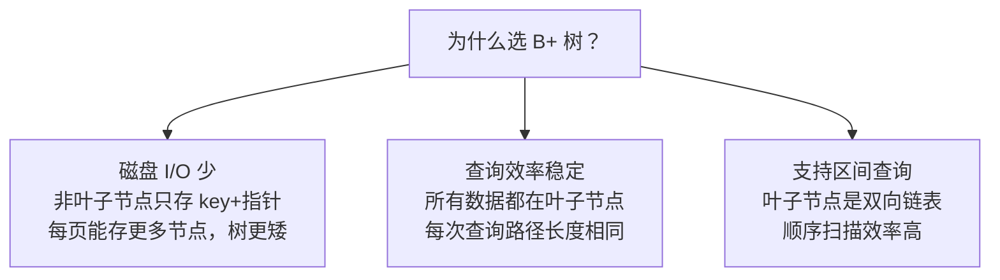

# 索引

---

## 速览

- 索引 = 数据库的"目录"，用空间换时间，大幅减少扫描行数。
- MySQL InnoDB 默认使用 **B+ 树**索引，叶子节点双向链表支持区间查询。
- 分类：按数据结构（B+树/Hash）、按存储方式（聚簇/二级索引）、按字段数（单列/联合）。
- 覆盖索引避免回表，联合索引遵循**最左匹配原则**。
- 索引不是越多越好：写操作需维护索引，增加开销。

---

## 索引分类

> **一句话理解：** 索引有多种分类维度，面试按维度分层回答最清晰。

**核心结论（可背）：**
| 分类维度 | 类型 |
|---|---|
| 数据结构 | B+树索引（默认）、Hash 索引、全文索引（Full-text） |
| 物理存储 | 聚簇索引（主键索引）、二级索引（非主键） |
| 字段特性 | 主键索引、唯一索引、普通索引、前缀索引 |
| 字段个数 | 单列索引、联合索引（复合索引） |

🎯 **Interview Triggers:**
- 索引有哪几种分类维度，每种各举一例？（MECHANISM）
- Hash 索引和 B+树索引分别适合什么查询场景？（COMPARISON）
- 全文索引和普通索引的底层结构区别？（MECHANISM）
- 唯一索引和主键索引的区别是什么？（COMPARISON）
- 前缀索引如何选取合适的前缀长度？（TRADEOFF）

🧠 **Question Type:** 概念辨析 分类记忆 场景选型

🔥 **Follow-up Paths:**
- 分类维度 → 物理存储 → 聚簇 vs 二级 → 回表问题
- Hash 索引 → 不支持范围查询 → 场景限制 → 为何 InnoDB 默认 B+树
- 前缀索引 → 节省空间 → 但无法覆盖索引 → 权衡点

🛠 **Engineering Hooks:**
- 建表时优先确认索引类型：等值查询多考虑 Hash，范围/排序场景必选 B+树。
- 字符串字段超过 20 字符建议用前缀索引，通过 `COUNT(DISTINCT LEFT(col, n)) / COUNT(*)` 计算区分度选 n。
- 唯一索引在插入时会额外做唯一性校验，高并发写场景下考虑改用普通索引 + 应用层去重。
- 全文索引（FULLTEXT）适合长文本搜索，但生产环境建议用 Elasticsearch 替代，MySQL 全文索引维护代价高。

---

## 为什么用 B+ 树

> **一句话理解：** B+ 树矮胖、叶子链表、只存数据在叶子——三个特性完美契合数据库需求。

**核心结论（可背）：**


**B 树 vs B+ 树（必考）：**
| 维度 | B 树 | B+ 树 |
|---|---|---|
| 数据存储 | 所有节点都存数据 | 只有叶子节点存数据 |
| 区间查询 | 需要中序遍历 | 叶子链表直接扫 |
| 非叶子节点容量 | 存数据，容量小，树更高 | 只存 key，容量大，树更矮 |
| 适用场景 | 文件系统 | 数据库索引 |

**易错点：**
- ❌ 以为 B+ 树区间查询时要从根开始 → 找到起始叶子后，沿叶子链表顺序扫即可。

🎯 **Interview Triggers:**
- 为什么数据库索引不用二叉树或红黑树，而用 B+树？（WHY）
- B 树和 B+树的核心区别是什么？（COMPARISON）
- B+树的树高大概是多少，能支撑多少数据量？（MECHANISM）
- 叶子节点双向链表对哪类查询有优势？（SCENARIO）
- 为什么非叶子节点只存 key 不存数据？（WHY）

🧠 **Question Type:** 原理推导 对比分析 数量级估算

🔥 **Follow-up Paths:**
- 二叉树高度大 → 磁盘 I/O 次数多 → B+树矮胖 → 减少 I/O → 性能优势
- 非叶子只存 key → 每页容纳节点数更多 → 树更矮 → 千万数据只需 3 层
- 叶子双向链表 → ORDER BY / BETWEEN 查询直接顺序扫 → 避免回溯根节点

🛠 **Engineering Hooks:**
- InnoDB 默认页大小 16KB，非叶子节点一个 key+指针约 14 字节，每页约存 1170 个 key，三层树可支撑约 2000 万行。
- 主键选自增整型而非 UUID：UUID 随机写导致页分裂频繁，自增主键总是追加到最后一页，B+树维护代价最低。
- 可用 `SHOW INDEX FROM table` 查看索引的 Cardinality（基数），基数过低说明区分度差，索引可能被优化器忽略。
- 树高可通过 `information_schema.INNODB_TABLESPACES` 估算，生产中超过 4 层需考虑分表。

---

## 聚簇索引 vs 二级索引

> **一句话理解：** 聚簇索引的叶子存完整行数据；二级索引的叶子存主键值，查完还要回表。

**核心结论（可背）：**
```
聚簇索引（主键索引）：
  叶子节点 = 完整的数据行
  一张表只有一个聚簇索引
  InnoDB 默认用主键建聚簇索引

二级索引（非主键索引）：
  叶子节点 = 索引列值 + 主键值
  查到主键后，再去聚簇索引查完整行 → 回表

覆盖索引：
  查询的列都在索引中，不需要回表
  例：SELECT id, name FROM users WHERE name = 'xxx'
      若 (name, id) 是联合索引 → 覆盖索引，无需回表
```

**面试官常问：**
- 什么是回表？→ 二级索引查到主键后，需再去聚簇索引取完整行，多一次 B+ 树查询。
- 什么是覆盖索引？→ 查询所需列全在索引中，不需回表，性能更好。

🎯 **Interview Triggers:**
- 什么是回表，回表的代价是什么？（MECHANISM）
- 覆盖索引如何消除回表，举一个实际例子？（SCENARIO）
- InnoDB 没有显式主键时，聚簇索引怎么建？（MECHANISM）
- 二级索引叶子节点存的是什么？（MECHANISM）
- 什么场景下应该刻意设计覆盖索引？（SCENARIO）

🧠 **Question Type:** 原理机制 性能优化 场景设计

🔥 **Follow-up Paths:**
- 二级索引查询 → 找到主键值 → 回表到聚簇索引 → 多一次 B+树查找 → 高频查询需优化
- 覆盖索引 → 减少回表 → 降低随机 I/O → 显著提升查询性能
- 无显式主键 → InnoDB 选唯一非空列 → 都没有则生成 6 字节隐藏 rowid → 影响二级索引存储

🛠 **Engineering Hooks:**
- 高频列表查询（如用户列表页只需 id、name、status）建联合索引 `(name, id, status)` 即可覆盖，避免回表。
- `EXPLAIN` 输出 `Extra: Using index` 表示走了覆盖索引；`Using index condition` 表示仍需回表。
- 主键尽量短（整型 4-8 字节），因为所有二级索引叶子都存主键值，主键越长二级索引越膨胀。
- 对于大宽表，优先为高频查询设计覆盖索引而非依赖 `SELECT *`，可将回表消除率作为索引评审指标。

---

## 联合索引与最左匹配原则

> **一句话理解：** 联合索引按最左字段开始匹配，跳过任一前缀则索引失效。

**核心结论（可背）：**
```
联合索引 (a, b, c)：

能走索引：
  WHERE a = 1
  WHERE a = 1 AND b = 2
  WHERE a = 1 AND b = 2 AND c = 3
  WHERE a = 1 AND b > 2         ← a 精确，b 范围，c 失效

不走索引：
  WHERE b = 2                   ← 跳过 a
  WHERE c = 3                   ← 跳过 a、b
  WHERE b = 2 AND c = 3         ← 跳过 a
```

**建联合索引原则：区分度高的字段排在前面。**

🎯 **Interview Triggers:**
- 联合索引 (a, b, c)，WHERE b = 1 AND c = 2 能走索引吗？（MECHANISM）
- 最左匹配原则的底层原因是什么？（WHY）
- 范围查询在联合索引中如何影响后续列的匹配？（MECHANISM）
- 如何为既有等值查询又有范围查询的 SQL 设计联合索引？（SCENARIO）
- 联合索引字段顺序如何决定？（TRADEOFF）

🧠 **Question Type:** 原理推导 SQL 分析 索引设计

🔥 **Follow-up Paths:**
- 联合索引排序 → 先按 a 排，a 相同再按 b 排 → 跳过 a 则 b 无序 → 无法用索引定位
- 范围条件之后的列失效 → `a = 1 AND b > 2 AND c = 3`，c 的索引失效 → 需额外回表过滤
- 区分度高的字段放前面 → 更早过滤数据 → 扫描行数更少 → 查询更快

🛠 **Engineering Hooks:**
- 用 `EXPLAIN` 观察 `key_len`：`key_len` 越长说明联合索引用到的列越多，可验证最左匹配是否生效。
- 设计联合索引时先枚举高频 SQL 的 WHERE 条件，将等值查询字段放前、范围查询字段放后。
- MySQL 8.0+ 支持跳跃扫描（Index Skip Scan），部分场景可绕过最左匹配限制，但性能不稳定，不可依赖。
- 联合索引可替代单列索引：`(a, b)` 已包含对 a 的单列索引语义，建了联合索引后 a 的单列索引可删除。

---

## 索引失效场景

> **一句话理解：** 这几种写法会让优化器放弃索引，直接全表扫——面试必考。

**核心结论（可背）：**
| 场景 | 示例 | 原因 |
|---|---|---|
| 前缀通配符 | `LIKE '%abc'` | 无法确定起始位置 |
| 索引列参与计算 | `WHERE age + 1 = 18` | 无法直接用索引定位 |
| 索引列使用函数 | `WHERE UPPER(name) = 'A'` | 函数结果无索引 |
| OR 后列无索引 | `WHERE a = 1 OR b = 2`（b 无索引） | 全表扫更高效 |
| 违反最左匹配 | 跳过联合索引前缀列 | 见上节 |
| 隐式类型转换 | `WHERE id = '1'`（id 是 int） | 转换导致索引失效 |
| 区分度太低 | 性别字段 | 全表扫代价更低 |

**面试官常问：**
- `LIKE 'abc%'` 能走索引吗？→ 能，后缀通配符可以利用 B+ 树前缀定位。
- `LIKE '%abc'` 呢？→ 不能，前缀不确定，需全表扫。

🎯 **Interview Triggers:**
- WHERE id = '1' 其中 id 是 int，会走索引吗？为什么？（MECHANISM）
- 隐式类型转换导致索引失效的根本原因？（WHY）
- 什么情况下优化器会主动放弃索引选择全表扫？（SCENARIO）
- 如何用函数又不让索引失效？（SCENARIO）
- OR 条件如何保证索引生效？（MECHANISM）

🧠 **Question Type:** 失效排查 SQL 审查 原理推导

🔥 **Follow-up Paths:**
- 隐式类型转换 → MySQL 对索引列做函数转换 → 索引列值被改变 → 无法走索引
- 函数作用于索引列 → B+树存的是原始值 → 函数结果无对应索引项 → 全表扫
- 区分度低 → 优化器估算全表扫 cost 更低 → 主动放弃索引 → 可用 `FORCE INDEX` 强制但要谨慎

🛠 **Engineering Hooks:**
- Code Review 中重点检查 WHERE 条件里的隐式类型转换：字符串传给整型字段是最常见的失效来源。
- 对函数场景改用函数索引（MySQL 8.0+ 支持生成列索引）：`ALTER TABLE t ADD COLUMN name_upper VARCHAR(50) GENERATED ALWAYS AS (UPPER(name))` 再对 name_upper 建索引。
- OR 条件中每个列都要有独立索引，否则整个 OR 退化成全表扫；可改写为 UNION ALL 保证各分支走索引。
- 上线前用 `EXPLAIN` 检查所有核心 SQL 的执行计划，`type` 为 `ALL` 即为全表扫，需立即排查。

---

## 索引优化技巧

> **一句话理解：** 建对索引，查少数据，尽量覆盖，避免回表。

**核心结论（可背）：**
| 技巧 | 说明 |
|---|---|
| 覆盖索引 | 查询列包含在索引中，避免回表 |
| 前缀索引 | 对长字符串字段取前 N 个字符建索引，节省空间 |
| 主键自增 | 避免页分裂，插入总是追加，性能好 |
| 区分度优先 | 联合索引中区分度高的字段放前面 |
| 避免冗余索引 | (a) 和 (a, b) 同时存在，(a) 是冗余的 |

**什么时候不建索引：**
- 小表（索引开销 > 收益）
- 区分度极低的字段（如性别、状态值只有几种）
- 频繁更新的字段（维护索引成本高）
- 极少用于查询的字段

🎯 **Interview Triggers:**
- 如何评估一个索引是否值得建？（TRADEOFF）
- 索引过多会带来哪些负面影响？（FAILURE）
- 什么是冗余索引，如何发现并清理？（SCENARIO）
- 主键为何推荐自增，用 UUID 会有什么问题？（WHY）
- 前缀索引的缺点是什么？（TRADEOFF）

🧠 **Question Type:** 优化设计 权衡分析 生产运维

🔥 **Follow-up Paths:**
- 索引过多 → 写操作维护每棵 B+树 → 插入/更新变慢 → 写密集场景需减少索引数量
- UUID 主键 → 随机插入 → 频繁页分裂 → 碎片多 → 表膨胀 + 写性能下降
- 前缀索引 → 节省空间 → 但无法覆盖索引（查询列包含原始值时仍需回表） → 需权衡

🛠 **Engineering Hooks:**
- 用 `pt-duplicate-key-checker`（Percona 工具包）自动扫描冗余索引，定期清理生产库。
- 评估索引收益可查 `information_schema.INDEX_STATISTICS`（开启后）或 `sys.schema_unused_indexes` 找出从未被使用的索引。
- 写多读少的表（如日志表、流水表）索引控制在 3 个以内；读多写少的查询表可适当多建。
- 大批量数据导入前先 `DISABLE KEYS`，导入完成后 `ENABLE KEYS`，避免每行插入都触发索引维护。

---

## 面试高频考点汇总

| 考点 | 核心答案 |
|---|---|
| 为什么用 B+ 树？ | 矮胖（磁盘 I/O 少）、叶子双向链表（区间查询快）、数据只在叶子（稳定） |
| 聚簇索引和二级索引区别？ | 聚簇存完整行；二级存主键值，需回表 |
| 什么是回表？ | 二级索引找到主键，再去聚簇索引取完整行 |
| 什么是覆盖索引？ | 查询列全在索引中，不需回表 |
| 最左匹配原则？ | 联合索引从最左列开始，跳过前缀则失效 |
| 索引失效典型场景？ | 前缀 LIKE、索引列参与计算/函数、隐式类型转换、违反最左匹配 |
| 索引越多越好吗？ | 不是，写操作需维护索引，增加开销，按需建索引 |
