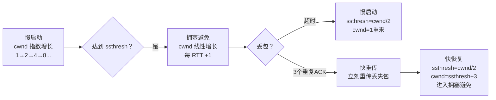

# 传输层协议（TCP / UDP）

---

## 速览

- TCP 面向连接、可靠；UDP 无连接、快速——核心权衡是可靠性 vs 速度。
- TCP 可靠性靠：序列号、确认应答、超时重传、流量控制、拥塞控制。
- TCP 流量控制用**滑动窗口**，拥塞控制用**慢启动 → 拥塞避免 → 快重传 → 快恢复**。
- TCP Keepalive ≠ HTTP Keep-Alive：前者是传输层保活，后者是应用层长连接。

---

## TCP vs UDP

> **一句话理解：** TCP 是挂号信（确认送达），UDP 是明信片（发完不管）。

**核心结论（可背）：**
| 对比维度 | TCP | UDP |
|---|---|---|
| 连接方式 | 面向连接（三次握手建立） | 无连接 |
| 可靠性 | 可靠（确认、重传、校验） | 不可靠（可能丢包、乱序） |
| 传输顺序 | 有序（序列号保证） | 不保证顺序 |
| 速度 | 较慢（连接开销 + 控制机制） | 极快 |
| 头部大小 | 最小 20 字节 | 固定 8 字节 |
| 流量控制 | 有（滑动窗口） | 无 |
| 拥塞控制 | 有（慢启动等） | 无 |
| 适用场景 | HTTP、SMTP、FTP、数据库 | DNS、视频流、游戏、直播 |

**面试官常问：**
- UDP 能实现可靠传输吗？→ 能，在应用层加序列号 + ACK + 超时重传模拟 TCP 的可靠性（QUIC 协议就是这样做的）。

🎯 **Interview Triggers:**
- 为什么 TCP 比 UDP 慢，实际业务中如何选择？（TRADEOFF）
- UDP 能实现可靠传输吗？如何在应用层实现可靠性？（MECHANISM）
- 什么场景下必须选 TCP，什么场景下应该用 UDP？（SCENARIO）
- TCP 的头部为什么比 UDP 大那么多，多的字段有什么用？（CONCEPT）

🧠 **Question Type:** concept comparison · scenario selection · tradeoff analysis

🔥 **Follow-up Paths:**
- TCP 可靠性 → 序列号与确认应答机制
- UDP 可靠化 → QUIC 协议实现原理
- 场景选择 → 视频流/游戏为何用 UDP
- 头部字段 → TCP 控制位与标志位详解
- 传输效率 → 连接开销与延迟分析

🛠 **Engineering Hooks:**
- 游戏服务器通常基于 UDP 自研可靠传输层，控制重传策略以降低延迟抖动
- DNS 查询用 UDP，但超过 512 字节的响应会自动回退到 TCP
- Nginx 代理 UDP（如 DNS、游戏流量）需单独配置 stream 模块，与 HTTP 模块分离

---

## TCP 三次握手

> **一句话理解：** 三次握手确认双方的收发能力都正常，是建立全双工连接的最少次数。

**核心结论（可背）：**
```
客户端 → SYN(seq=x)               → 服务器   "我想连"
客户端 ← SYN+ACK(seq=y, ack=x+1)  ← 服务器   "同意，你能收到吗？"
客户端 → ACK(ack=y+1)             → 服务器   "能，连接建立"
```

**为什么是三次不是两次？**
- 两次：服务器无法确认客户端能收到消息（缺少第三次 ACK）。
- 还有历史 SYN 包的问题：若旧的 SYN 到达服务器，两次握手下服务器误认为连接建立；三次握手时客户端会拒绝，服务器及时释放。

**为什么不是四次？**
- 三次已经确认双方都能正常收发，无需第四次。

🎯 **Interview Triggers:**
- 为什么 TCP 握手需要三次，两次不够吗？（WHY）
- 三次握手的每一步分别验证了什么能力？（MECHANISM）
- 历史遗留 SYN 包如何通过三次握手处理？（FAILURE）
- SYN Flood 攻击的原理是什么，如何防御？（SCENARIO）
- 第三次握手丢失了会发生什么？（FAILURE）

🧠 **Question Type:** mechanism explanation · failure analysis · security scenario

🔥 **Follow-up Paths:**
- 握手次数 → 两次握手的缺陷与历史连接问题
- SYN Flood → TCP 半连接队列与 SYN Cookie 防御
- 握手丢包 → 重传机制与超时策略
- 序列号初始化 → ISN 随机化与安全意义
- 全双工建立 → 双方收发能力验证逻辑

🛠 **Engineering Hooks:**
- Linux 内核参数 `tcp_syn_retries` 控制 SYN 重传次数，默认 6 次（约 127 秒超时）
- SYN Cookie 技术在半连接队列满时启用，无需存储连接状态即可验证握手
- 高并发服务器需调大 `tcp_max_syn_backlog` 和 `somaxconn` 避免连接拒绝

---

## TCP 四次挥手

> **一句话理解：** 四次挥手因为 TCP 全双工，双方各自关闭发送通道，所以需要各自一个 FIN+ACK。

**核心结论（可背）：**
```
客户端 → FIN          → 服务器   "我不发了"
客户端 ← ACK          ← 服务器   "收到，我还有数据要发"
客户端 ← FIN          ← 服务器   "我也发完了"
客户端 → ACK          → 服务器   "好，再见"
↑
客户端进入 TIME_WAIT（等待 2MSL）再关闭
```

**为什么需要 TIME_WAIT（2MSL）？**
1. 确保最后一个 ACK 能到达服务器（若丢失，服务器重传 FIN，客户端可以重发 ACK）。
2. 让网络中的旧数据包消亡，避免影响下一个连接。

**易错点：**
- ❌ 三次挥手就能关闭 → 服务器在收到 FIN 后可能还有数据要发，必须等发完再发 FIN，所以 ACK 和 FIN 是分开的。

🎯 **Interview Triggers:**
- 为什么 TCP 挥手需要四次而不是三次？（WHY）
- TIME_WAIT 状态的作用是什么，为什么是 2MSL？（MECHANISM）
- 大量 TIME_WAIT 会带来什么问题，如何解决？（FAILURE）
- 服务器出现大量 CLOSE_WAIT 是什么原因？（FAILURE）
- 能否主动关闭 TIME_WAIT 状态以释放端口？（TRADEOFF）

🧠 **Question Type:** mechanism explanation · failure diagnosis · tradeoff analysis

🔥 **Follow-up Paths:**
- 四次挥手 → 半关闭状态与全双工关闭逻辑
- TIME_WAIT → MSL 定义与 2MSL 计算依据
- CLOSE_WAIT 堆积 → 应用层未调用 close() 的排查
- 端口复用 → SO_REUSEADDR 与 SO_REUSEPORT 的使用场景
- 挥手丢包 → FIN 重传与服务器重入 LAST_ACK

🛠 **Engineering Hooks:**
- 开启 `tcp_tw_reuse` 允许处于 TIME_WAIT 的端口被新连接复用，减少端口耗尽风险
- `SO_LINGER` 选项设为 0 可让连接立即发 RST 跳过 TIME_WAIT，但可能导致数据丢失
- 监控 `ss -s` 中 TIME_WAIT 数量，超过数万时需排查是否存在短连接风暴

---

## TCP 可靠性机制

> **一句话理解：** TCP 靠序列号+确认+重传+流控+拥塞五件套保证数据可靠有序。

**核心结论（可背）：**
| 机制 | 作用 |
|---|---|
| 序列号（Seq） | 保证数据有序重组，检测丢包 |
| 确认应答（ACK） | 通知发送方哪些数据已收到 |
| 数据校验和 | 检测传输过程中的数据损坏 |
| 超时重传 | ACK 超时则重传，保证数据不丢失 |
| 流量控制（滑动窗口） | 防止接收方被淹没 |
| 拥塞控制 | 防止网络过载 |

🎯 **Interview Triggers:**
- TCP 通过哪些机制保证数据可靠传输？（MECHANISM）
- 超时重传的时间是如何确定的？（MECHANISM）
- 如果 ACK 丢失了会发生什么？（FAILURE）
- TCP 的校验和能检测所有数据错误吗？（TRADEOFF）

🧠 **Question Type:** mechanism enumeration · failure analysis · reliability guarantee

🔥 **Follow-up Paths:**
- 超时重传 → RTO 动态计算与 Karn 算法
- 序列号 → 滑动窗口协议与累积确认
- 校验和 → 16 位校验和的局限性与补充手段
- 重传策略 → 超时重传 vs 快重传对比
- 可靠性上层 → 应用层如何在 UDP 上模拟可靠性

🛠 **Engineering Hooks:**
- TCP 重传超时（RTO）初始值通常为 1 秒，指数退避至最大值（Linux 默认约 120 秒）
- 使用 Wireshark 抓包时，重传包会标记 `[TCP Retransmission]`，可快速定位网络丢包位置
- 长肥管道（高带宽高延迟网络）场景需开启 TCP Window Scaling 扩展窗口到 1GB 以上

---

## 流量控制：滑动窗口

> **一句话理解：** 接收方通过 ACK 告知自己的接收窗口大小，发送方动态调整发送量，防止接收缓冲区溢出。

**核心结论（可背）：**
```
接收方在每次 ACK 中携带 rwnd（接收窗口大小）
发送方实际发送量 = min(cwnd拥塞窗口, rwnd接收窗口)

窗口 = 0 → 发送方停止发送，等待接收方通知新的窗口大小
```

🎯 **Interview Triggers:**
- 滑动窗口是如何实现流量控制的？（MECHANISM）
- 接收窗口为 0 时会发生什么，如何恢复？（FAILURE）
- 流量控制和拥塞控制有什么区别？（COMPARISON）
- 窗口大小是固定的还是动态变化的？（CONCEPT）

🧠 **Question Type:** mechanism explanation · concept comparison · failure recovery

🔥 **Follow-up Paths:**
- 滑动窗口 → 发送缓冲区与接收缓冲区的对应关系
- 零窗口 → 持续定时器（Persist Timer）与 ZWP 探测
- 流量控制 vs 拥塞控制 → 控制对象与作用层面的区别
- 窗口缩放 → TCP Window Scaling 选项与大带宽场景
- Nagle 算法 → 小包合并与流量控制的交互

🛠 **Engineering Hooks:**
- 通过 `setsockopt` 设置 `SO_RCVBUF` 和 `SO_SNDBUF` 手动调整收发缓冲区大小
- Linux 内核支持自动调整 TCP 缓冲区（`tcp_rmem`/`tcp_wmem`），默认范围 4KB–6MB
- 零窗口探测（ZWP）使用持续定时器，若持续无法发送数据最终会触发 RST 断开连接

---

## 拥塞控制：四个阶段

> **一句话理解：** 慢启动探路，拥塞避免稳增，快重传急救，快恢复快恢复——不让网络崩。

**核心结论（可背）：**


**四阶段要点（可背）：**
| 阶段 | 触发条件 | cwnd 变化 |
|---|---|---|
| 慢启动 | 新连接建立或超时 | 指数增长（每收一个 ACK +1MSS） |
| 拥塞避免 | cwnd ≥ ssthresh | 线性增长（每 RTT +1MSS） |
| 快重传 | 收到 3 个重复 ACK | 立即重传，不等超时 |
| 快恢复 | 快重传后 | ssthresh=cwnd/2，cwnd=ssthresh，直接进拥塞避免 |

**超时 vs 快重传的区别：**
- 超时：cwnd 归 1，从慢启动重来（更严重）。
- 快重传（3 个重复 ACK）：cwnd 减半，进快恢复，不归 1（更温和）。

🎯 **Interview Triggers:**
- TCP 拥塞控制经历哪四个阶段，分别如何触发？（MECHANISM）
- 超时丢包和三个重复 ACK 触发的处理有什么不同？（COMPARISON）
- 为什么慢启动初始窗口是 1，不能更大一些吗？（WHY）
- BBR 拥塞控制算法和传统 CUBIC 有什么区别？（COMPARISON）
- 拥塞控制如何在多条 TCP 流间公平分配带宽？（TRADEOFF）

🧠 **Question Type:** mechanism explanation · comparison · algorithm analysis

🔥 **Follow-up Paths:**
- 慢启动 → 指数增长原理与 ssthresh 初始值设定
- 快重传触发条件 → 为什么是 3 个重复 ACK 而不是 2 个
- 拥塞算法演进 → Reno → CUBIC → BBR 的改进思路
- 公平性 → 多流竞争带宽时的收敛性分析
- 移动网络 → 随机丢包对拥塞控制的误判问题

🛠 **Engineering Hooks:**
- Linux 默认拥塞算法为 CUBIC，可通过 `sysctl net.ipv4.tcp_congestion_control=bbr` 切换到 BBR
- BBR 基于带宽和 RTT 估计而非丢包触发，在高延迟或存在随机丢包的网络中表现更优
- 数据中心内网延迟极低，通常使用 DCTCP 算法通过 ECN 信号提前感知拥塞，减少队列积压

---

## TCP Keepalive vs HTTP Keep-Alive

> **一句话理解：** 两者名字像但完全不同，一个在传输层探活，一个在应用层复用连接。

**核心结论（可背）：**
| 维度 | TCP Keepalive | HTTP Keep-Alive |
|---|---|---|
| 所属层 | 传输层 | 应用层 |
| 作用 | 检测空闲连接是否仍然有效（探活） | 在一个 TCP 连接上复用多个 HTTP 请求/响应 |
| 实现 | TCP 协议栈发送探测包 | HTTP 头 `Connection: keep-alive` |
| 触发时机 | 连接空闲一段时间后自动发送 | 客户端/服务器协商 |

🎯 **Interview Triggers:**
- TCP Keepalive 和 HTTP Keep-Alive 有什么区别？（COMPARISON）
- TCP Keepalive 是如何检测死连接的？（MECHANISM）
- 为什么 HTTP/1.1 默认开启 Keep-Alive？（WHY）
- 长连接复用和连接池有什么关系？（CONCEPT）
- 如果 TCP Keepalive 探测失败，连接会如何处理？（FAILURE）

🧠 **Question Type:** concept comparison · mechanism explanation · connection management

🔥 **Follow-up Paths:**
- TCP Keepalive → 探活参数配置与死连接检测原理
- HTTP Keep-Alive → HTTP/1.0 vs HTTP/1.1 长连接默认行为差异
- 连接复用 → HTTP/2 多路复用与 HTTP/1.1 Keep-Alive 的本质区别
- 连接池 → 数据库/Redis 连接池的设计原理
- 长连接管理 → Nginx keepalive_timeout 配置与资源消耗权衡

🛠 **Engineering Hooks:**
- Linux TCP Keepalive 三个关键参数：`tcp_keepalive_time`（空闲多久开始探测，默认 2h）、`tcp_keepalive_intvl`（探测间隔）、`tcp_keepalive_probes`（探测次数）
- Nginx 的 `keepalive_timeout` 设置 HTTP 长连接超时，与上游连接池的 `keepalive` 指令配合使用
- gRPC 基于 HTTP/2，通过 PING 帧实现应用层心跳，独立于 TCP Keepalive 维持长连接健康状态

---

## 面试高频考点汇总

| 考点 | 核心答案 |
|---|---|
| TCP vs UDP 核心区别？ | 连接/可靠/有序 vs 无连接/不可靠/无序；速度换可靠性 |
| 三次握手为什么不能两次？ | 两次无法确认客户端接收能力；历史连接问题 |
| 四次挥手为什么不能三次？ | 服务器 ACK 和 FIN 要分开，中间可能还有数据要发 |
| TIME_WAIT 的作用？ | 确保最后 ACK 到达；让旧数据包消亡 |
| TCP 可靠性靠什么保证？ | 序列号+ACK+校验和+超时重传+流量控制+拥塞控制 |
| 拥塞控制四阶段？ | 慢启动→拥塞避免→（丢包）→快重传+快恢复 |
| 超时和快重传的区别？ | 超时：cwnd 归 1 慢启动；快重传：cwnd 减半进快恢复 |
