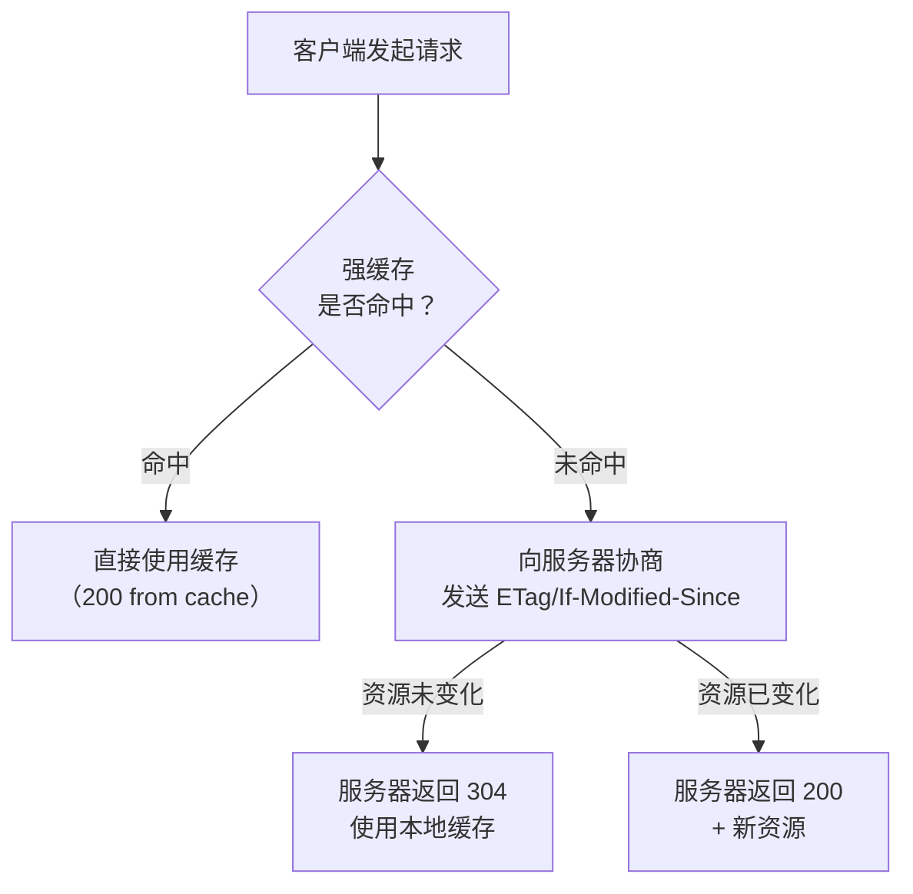

# 应用层协议

---

## 速览

- HTTP 报文 = 请求行/状态行 + 头部 + 空行 + 报文体，掌握 10 个高频状态码。
- GET vs POST：GET 幂等、参数在 URL、可缓存；POST 非幂等、参数在 body、默认不缓存。
- 缓存两类：强缓存（Cache-Control/Expires，不过服务器）、协商缓存（ETag/Last-Modified，过服务器）。
- HTTP 版本进化：1.0（短连接）→ 1.1（Keep-Alive，持久连接）→ 2.0（多路复用，二进制帧）→ 3.0（QUIC/UDP，彻底解决队头阻塞）。
- DNS 查询：先查本地缓存 → 本地 DNS → 根/顶级/权限 DNS（迭代查询）。
- Cookie（浏览器端）vs Session（服务器端）：都用于维持状态，Cookie 安全性低，Session 依赖服务器资源。

---

## HTTP 报文结构

> **一句话理解：** 请求报文 = 请求行 + 请求头 + 空行 + 请求体；响应报文 = 状态行 + 响应头 + 空行 + 响应体。

**核心结论（可背）：**
```
HTTP 请求报文：
┌─────────────────────────────┐
│ POST /api/login HTTP/1.1    │ ← 请求行：方法 + URL + 版本
├─────────────────────────────┤
│ Host: example.com           │
│ Content-Type: application/json│ ← 请求头
│ Authorization: Bearer xxx   │
├─────────────────────────────┤
│                             │ ← 空行（分隔头和体）
├─────────────────────────────┤
│ {"username":"test","pwd":""} │ ← 请求体（GET 请求无此部分）
└─────────────────────────────┘

HTTP 响应报文：
┌─────────────────────────────┐
│ HTTP/1.1 200 OK             │ ← 状态行：版本 + 状态码 + 描述
├─────────────────────────────┤
│ Content-Type: application/json│
│ Cache-Control: max-age=3600 │ ← 响应头
├─────────────────────────────┤
│                             │ ← 空行
├─────────────────────────────┤
│ {"code":0,"data":{...}}     │ ← 响应体
└─────────────────────────────┘
```

🎯 **Interview Triggers:**
- HTTP 请求报文由哪几部分组成，各部分的作用是什么？（CONCEPT）
- 请求头和响应头中有哪些常见的字段，分别有什么作用？（MECHANISM）
- GET 请求和 POST 请求的报文结构有什么区别？（COMPARISON）
- 为什么 HTTP 报文中需要一个空行来分隔头部和报文体？（WHY）

🧠 **Question Type:** 结构拆解 · 字段机制说明

🔥 **Follow-up Paths:**
- HTTP 报文结构 → 常见请求头字段（Host/Content-Type/Authorization）
- HTTP 报文结构 → 状态码体系（2xx/3xx/4xx/5xx）
- HTTP 报文结构 → HTTP 缓存机制（Cache-Control 响应头）
- 请求体格式 → JSON vs Form-data vs multipart 编码区别
- 报文结构 → HTTPS 对报文的加密粒度（头部是否加密）

🛠 **Engineering Hooks:**
- 调试接口时用 Chrome DevTools Network 面板可直接查看完整请求/响应报文，定位参数传递问题。
- 后端框架（如 Spring/Flask）解析请求体时需根据 `Content-Type` 选择正确的解析器，类型不匹配会导致 400。
- 大文件上传应使用 `multipart/form-data` 而非 JSON body，避免 base64 编码导致体积膨胀约 33%。
- 响应头中设置 `Content-Type: application/json; charset=utf-8` 可避免中文乱码问题。

---

## 常见 HTTP 状态码

> **一句话理解：** 2xx 成功，3xx 重定向，4xx 客户端错误，5xx 服务器错误。

**核心结论（可背）：**
| 状态码 | 含义 | 典型场景 |
|---|---|---|
| **200** OK | 请求成功 | 网页加载成功、API 返回数据 |
| **301** Moved Permanently | 资源永久重定向（浏览器缓存新地址） | 旧域名跳转新域名、HTTP→HTTPS |
| **302** Found | 资源临时重定向 | 登录后跳转、OAuth 回调 |
| **304** Not Modified | 资源未修改，使用本地缓存 | 浏览器缓存验证（If-Modified-Since） |
| **400** Bad Request | 客户端请求格式错误 | 参数缺失、JSON 格式错误 |
| **401** Unauthorized | 未认证（没有凭证） | 未登录、Token 过期 |
| **403** Forbidden | 已认证但无权限 | 普通用户访问管理员接口 |
| **404** Not Found | 资源不存在 | URL 错误、资源被删除 |
| **500** Internal Server Error | 服务器内部错误 | 代码异常、数据库崩溃 |
| **503** Service Unavailable | 服务暂不可用 | 服务器维护、熔断降级 |

**易错点：**
- ❌ 401 和 403 混淆 → 401：没有身份（需要登录）；403：有身份但没权限（无权访问）。
- ❌ 301 和 302 混淆 → 301：永久重定向（浏览器缓存新地址）；302：临时重定向（不缓存）。

🎯 **Interview Triggers:**
- 401 和 403 的区别是什么，分别在什么场景下返回？（COMPARISON）
- 301 和 302 重定向有什么区别，对 SEO 有什么影响？（COMPARISON）
- 504 和 503 的区别是什么，如何在生产环境中处理这两类错误？（SCENARIO）
- 为什么接口幂等性设计中需要关注 HTTP 状态码的规范使用？（WHY）
- RESTful API 设计时如何正确选择和返回状态码？（IMPLEMENTATION）

🧠 **Question Type:** 概念辨析 · 场景判断

🔥 **Follow-up Paths:**
- HTTP 状态码 → RESTful API 设计规范
- 301/302 重定向 → 浏览器缓存机制（永久重定向被缓存的影响）
- 401/403 → 认证与授权体系（JWT/OAuth2）
- 503/504 → 微服务熔断降级策略（Hystrix/Sentinel）
- 500 错误 → 服务端错误监控与告警体系

🛠 **Engineering Hooks:**
- 网关层（Nginx/Kong）可统一拦截 5xx 错误并返回自定义错误页，避免内部堆栈信息泄露给用户。
- 前端应对 401 统一跳转登录页，对 403 展示权限不足提示，通过 axios 拦截器实现全局处理。
- 监控系统（Prometheus + Grafana）应对 5xx 比例设置告警阈值，超过 1% 需立即介入排查。
- 接口文档（Swagger/OpenAPI）中应明确标注每个接口可能返回的状态码及含义，便于前后端联调。

---

## GET vs POST

> **一句话理解：** GET 请求资源（幂等，参数在 URL），POST 提交数据（非幂等，参数在 body）。

**核心结论（可背）：**
| 维度 | GET | POST |
|---|---|---|
| 功能 | 请求/获取资源 | 提交/修改数据 |
| 幂等性 | ✅ 幂等（多次结果相同） | ❌ 非幂等（多次会重复提交） |
| 参数位置 | URL 后（?key=value） | 请求体（body） |
| 安全性 | 低（参数可见，有历史记录） | 相对高（参数不在 URL） |
| 长度限制 | 有（URL 长度受浏览器限制） | 无明确限制 |
| 缓存 | 可以缓存 | 默认不缓存 |

🎯 **Interview Triggers:**
- GET 和 POST 的本质区别是什么，仅仅是参数位置不同吗？（CONCEPT）
- 为什么说 GET 请求是幂等的而 POST 不是，幂等性在系统设计中有什么意义？（WHY）
- 能否用 GET 请求传递敏感数据，为什么？（SCENARIO）
- POST 请求一定比 GET 安全吗，HTTP 层面 POST 的参数真的不可见吗？（TRADEOFF）

🧠 **Question Type:** 概念对比 · 安全性分析

🔥 **Follow-up Paths:**
- GET vs POST → RESTful 语义（GET/POST/PUT/DELETE/PATCH 各自职责）
- 幂等性 → 分布式接口幂等设计（Token 机制/去重表）
- 参数安全 → HTTPS 加密对 URL 参数的保护
- GET 缓存 → HTTP 缓存机制（强缓存/协商缓存）
- 表单提交 → CSRF 攻击原理与防御（利用 Cookie 自动携带）

🛠 **Engineering Hooks:**
- 搜索、列表过滤等查询接口应使用 GET，便于浏览器缓存和书签收藏，也方便日志追踪。
- 涉及写操作的接口（创建/更新/删除）必须使用 POST/PUT/DELETE，避免用 GET 触发副作用（如爬虫误触发）。
- 幂等性保障：支付、下单等关键 POST 接口需在服务端通过唯一请求 ID 实现幂等，防止重复提交。
- GET 请求参数不要传递密码、Token 等敏感信息，即使有 HTTPS 加密，服务器日志仍会记录完整 URL。

---

## HTTP 缓存机制

> **一句话理解：** 强缓存直接使用本地缓存，不问服务器；协商缓存先问服务器资源是否变化，没变就返回 304。

**核心结论（可背）：**


**强缓存：**
| 字段 | 作用 | 缺点 |
|---|---|---|
| `Expires` | 设置过期时间点（HTTP 1.0） | 依赖本地时钟，时钟不准会失效 |
| `Cache-Control: max-age=N` | 设置缓存有效期（相对时间，HTTP 1.1） | 推荐使用，优先级高于 Expires |

**协商缓存：**
| 字段对 | 原理 | 缺点 |
|---|---|---|
| `Last-Modified` / `If-Modified-Since` | 比较文件最后修改时间 | 秒级精度；改名再改回也会判断为已修改 |
| `ETag` / `If-None-Match` | 比较文件内容的哈希指纹 | 计算 ETag 有性能开销，但精确 |

**面试官常问：**
- ETag 和 Last-Modified 哪个优先？→ ETag 优先级更高（更精确），服务器同时返回时以 ETag 为准。

🎯 **Interview Triggers:**
- 强缓存和协商缓存的区别是什么，分别适用于什么场景？（COMPARISON）
- ETag 和 Last-Modified 的区别是什么，为什么 ETag 优先级更高？（COMPARISON）
- 如何让浏览器立即更新缓存的静态资源，有哪些常见方案？（IMPLEMENTATION）
- Cache-Control 的 no-cache 和 no-store 有什么区别？（CONCEPT）
- 前端部署时如何利用 HTTP 缓存策略优化页面加载速度？（SCENARIO）

🧠 **Question Type:** 机制对比 · 工程实践

🔥 **Follow-up Paths:**
- HTTP 缓存 → CDN 缓存策略（边缘节点缓存与回源逻辑）
- ETag 机制 → 分布式环境下 ETag 一致性问题（多节点生成的 ETag 可能不同）
- Cache-Control → Service Worker 离线缓存策略
- 缓存更新 → 前端构建工具 hash 文件名方案（webpack contenthash）
- 强缓存命中 → 浏览器缓存分类（memory cache vs disk cache）

🛠 **Engineering Hooks:**
- 前端静态资源（JS/CSS）部署时应使用文件 hash 命名（如 `app.a3f2c1.js`），配合 `Cache-Control: max-age=31536000` 实现永久强缓存，更新时只需更改 HTML 引用的文件名。
- HTML 入口文件不应设置强缓存，应使用 `Cache-Control: no-cache` 配合 ETag，确保用户每次获取最新版本。
- 分布式部署时 Nginx 生成 ETag 基于文件 inode + 修改时间，多节点间 inode 可能不同导致 ETag 不一致，需关闭 Nginx 的 `etag` 或统一生成策略。
- 接口数据通常不应被强缓存，API 响应头应设置 `Cache-Control: no-store` 或 `private`，防止敏感数据被代理缓存。

---

## HTTP 版本对比

> **一句话理解：** 每个版本都在解决上一个版本的性能瓶颈。

**核心结论（可背）：**
| 版本 | 核心改进 | 遗留问题 |
|---|---|---|
| HTTP/1.0 | 基础请求/响应；短连接（每次请求新建 TCP） | 连接开销大，无持久连接 |
| HTTP/1.1 | Keep-Alive 持久连接；管道化；Host 头 | 管道化有队头阻塞（响应必须按序） |
| HTTP/2.0 | 二进制帧；多路复用（解决应用层队头阻塞）；HPACK 头压缩；服务器推送 | TCP 层仍有队头阻塞（丢包重传） |
| HTTP/3.0 | 基于 QUIC/UDP；彻底解决 TCP 队头阻塞；0-RTT 握手 | 生态尚在成熟阶段 |

**多路复用 vs 管道化：**
```
HTTP/1.1 管道化：请求可并发发送，但响应必须按顺序返回
  → 第一个响应慢了，后续所有响应都被阻塞（队头阻塞）

HTTP/2.0 多路复用：请求/响应都有 StreamID，可乱序传输，互不影响
  → 真正解决了应用层的队头阻塞

HTTP/3.0 QUIC：基于 UDP，每个流独立丢包重传，不影响其他流
  → 解决了 TCP 层的队头阻塞（丢包不影响其他请求）
```

🎯 **Interview Triggers:**
- HTTP/1.1 的队头阻塞问题是什么，HTTP/2.0 是如何解决的？（MECHANISM）
- HTTP/2.0 的多路复用和 HTTP/1.1 的管道化有什么区别？（COMPARISON）
- HTTP/3.0 为什么要基于 UDP 而不是 TCP，QUIC 协议解决了什么问题？（WHY）
- HTTP/2.0 的服务器推送功能在实际场景中有哪些应用和局限？（TRADEOFF）
- 升级到 HTTP/2 需要满足哪些前提条件，是否需要修改应用代码？（SCENARIO）

🧠 **Question Type:** 版本演进 · 机制对比 · 性能优化

🔥 **Follow-up Paths:**
- HTTP 版本演进 → TCP 队头阻塞原理（丢包重传机制）
- HTTP/2 多路复用 → 二进制帧结构（Frame Type/Stream ID）
- HTTP/3 QUIC → TLS 1.3 内置加密（QUIC 握手与 TLS 握手合并）
- 服务器推送 → 与 WebSocket/SSE 推送方式的对比
- HTTP/2 头部压缩 → HPACK 算法（静态表 + 动态表 + Huffman 编码）

🛠 **Engineering Hooks:**
- 启用 HTTP/2 需要 HTTPS（浏览器要求），可通过 Nginx 配置 `listen 443 ssl http2` 开启，无需修改应用代码。
- HTTP/2 多路复用使得域名分片（将资源分散到多个域名以突破 HTTP/1.1 连接数限制）优化策略在 HTTP/2 下反而有负面影响，应合并域名。
- 移动端弱网场景下 HTTP/3/QUIC 优势明显，丢包率高时 TCP 重传严重拖慢加载，QUIC 的独立流传输损耗更小。
- Nginx 从 1.25.0 版本开始支持 HTTP/3，生产环境升级前需确认 OpenSSL 版本及防火墙对 UDP 443 端口的放行。

---

## DNS 查询

> **一句话理解：** 浏览器缓存 → OS 缓存 → 本地 DNS → 根 DNS → 顶级 DNS → 权限 DNS，层层委托，结果被缓存。

**核心结论（可背）：**
```
迭代查询（实际采用）：
  客户端 → 本地 DNS（递归查询，帮我全查完）
  本地 DNS → 根 DNS → 返回顶级 DNS 地址
  本地 DNS → 顶级 DNS → 返回权限 DNS 地址
  本地 DNS → 权限 DNS → 返回最终 IP
  本地 DNS 缓存并返回给客户端

递归查询（与迭代的区别）：
  根 DNS 自己去查顶级 DNS，层层递归直到获得结果返回
  实际上根 DNS 负载高，通常使用迭代查询

DNS 缓存层次：
  浏览器缓存 → 操作系统缓存（/etc/hosts + DNS 缓存） → 本地 DNS 服务器缓存 → ...
```

🎯 **Interview Triggers:**
- DNS 迭代查询和递归查询的区别是什么，实际场景中用哪种？（COMPARISON）
- 从浏览器输入 URL 到页面显示，DNS 解析处于哪个阶段，有哪些缓存层次？（MECHANISM）
- DNS 缓存中毒攻击是什么原理，如何防御？（FAILURE）
- 如何通过 DNS 实现负载均衡，有哪些局限性？（SCENARIO）
- TTL 值设置过大或过小分别有什么影响？（TRADEOFF）

🧠 **Question Type:** 流程梳理 · 缓存机制 · 安全分析

🔥 **Follow-up Paths:**
- DNS 查询 → 浏览器完整请求流程（DNS → TCP 握手 → TLS 握手 → HTTP 请求）
- DNS 缓存 → CDN 工作原理（CNAME 链路与就近节点调度）
- DNS 负载均衡 → Round-Robin DNS vs 智能 DNS（基于地理位置解析）
- DNS 安全 → DNSSEC 数字签名防篡改机制
- /etc/hosts 文件 → 本地开发环境域名映射与 hosts 优先级

🛠 **Engineering Hooks:**
- 生产环境域名 TTL 建议设置为 300 秒（5 分钟），发布前可临时调低至 60 秒，方便快速切换 IP 而不影响大量用户的 DNS 缓存。
- 使用 `dig +trace example.com` 命令可完整追踪 DNS 迭代查询链路，排查 DNS 解析异常时非常有用。
- 前端性能优化：对第三方域名使用 `<link rel="dns-prefetch" href="//cdn.example.com">` 提前完成 DNS 解析，减少首次请求延迟。
- 微服务架构中服务发现（Consul/etcd）本质上是在内网做 DNS 解析，TTL 通常设置极短（几秒）以支持快速故障切换。

---

## Cookie vs Session

> **一句话理解：** Cookie 存在客户端（浏览器），Session 存在服务器；SessionID 通过 Cookie 传递。

**核心结论（可背）：**
| 维度 | Cookie | Session |
|---|---|---|
| 存储位置 | 浏览器（客户端） | 服务器 |
| 数据容量 | 小（约 4KB） | 大（取决于服务器配置） |
| 安全性 | 低（可被读取和篡改，XSS 风险） | 高（数据在服务器端） |
| 生命周期 | 可设置过期时间 | 依赖会话时长或用户活动 |
| 传输方式 | 每次请求自动发送（Cookie 头） | SessionID 通过 Cookie 或 URL 参数传递 |

**Session 工作流：**
```
① 用户登录 → 服务器创建 Session，生成唯一 SessionID
② 服务器将 SessionID 写入 Cookie 发给浏览器
③ 后续请求浏览器自动携带 Cookie（含 SessionID）
④ 服务器根据 SessionID 查找对应的 Session 数据
```

🎯 **Interview Triggers:**
- Cookie 和 Session 的区别是什么，各自适用于什么场景？（COMPARISON）
- 分布式系统中 Session 共享有哪些方案，各有什么优缺点？（SCENARIO）
- Cookie 的 HttpOnly 和 Secure 属性分别有什么作用？（MECHANISM）
- Session 和 JWT Token 各有什么优缺点，如何选择？（TRADEOFF）
- 如何防止 Cookie 被 XSS 攻击窃取？（FAILURE）

🧠 **Question Type:** 概念对比 · 安全机制 · 分布式场景

🔥 **Follow-up Paths:**
- Cookie/Session → JWT 无状态认证方案（Header.Payload.Signature 结构）
- Session 共享 → Redis 集中式 Session 存储方案
- Cookie 安全 → XSS 攻击原理与 HttpOnly 防御
- Cookie 安全 → CSRF 攻击原理与 SameSite 属性防御
- 认证方案 → OAuth2.0 授权流程（第三方登录）

🛠 **Engineering Hooks:**
- 生产环境 Cookie 必须设置 `HttpOnly`（防 XSS 读取）和 `Secure`（仅 HTTPS 传输），敏感操作还应设置 `SameSite=Strict` 防 CSRF。
- 分布式 Session 最常见方案：Spring Session + Redis，SessionID 仍通过 Cookie 传递，Session 数据集中存储在 Redis，支持水平扩展。
- JWT 适合无状态微服务场景，但无法主动失效（Token 未过期无法强制下线），需通过黑名单（Redis 存储已注销 Token）解决。
- Cookie 大小限制约 4KB，不要在 Cookie 中存储大量用户信息，仅存 SessionID 或 JWT Token 即可。

---

## WebSocket

> **一句话理解：** WebSocket 在 HTTP 握手后升级为全双工 TCP 长连接，服务器可主动推送数据给客户端。

**核心结论（可背）：**
```
HTTP 请求：客户端发起，服务器响应（单向请求-响应模式）
WebSocket：握手后建立持久双向通道，服务器可主动推送

握手过程：
  ① 客户端发 HTTP Upgrade 请求（Upgrade: websocket）
  ② 服务器返回 101 Switching Protocols
  ③ 连接升级为 WebSocket，保持持久双向通道

适用场景：实时聊天、在线游戏、股票行情、协同文档
```

🎯 **Interview Triggers:**
- WebSocket 和 HTTP 长轮询（Long Polling）有什么区别，各自适用什么场景？（COMPARISON）
- WebSocket 的握手过程是怎样的，为什么要基于 HTTP 升级？（MECHANISM）
- WebSocket 在高并发场景下如何保证连接的稳定性和扩展性？（SCENARIO）
- WebSocket 和 SSE（Server-Sent Events）分别适合什么场景？（TRADEOFF）
- WebSocket 连接断开后如何实现自动重连？（IMPLEMENTATION）

🧠 **Question Type:** 协议机制 · 实时通信方案对比

🔥 **Follow-up Paths:**
- WebSocket → HTTP/2 Server Push 对比（单向推送 vs 双向通信）
- WebSocket 扩展性 → 集群环境下连接状态共享（Redis Pub/Sub 广播）
- 实时通信 → SSE（Server-Sent Events）单向推送适用场景
- WebSocket 安全 → wss:// 加密传输与跨域鉴权（Origin 头验证）
- 心跳机制 → Ping/Pong 帧检测连接存活状态

🛠 **Engineering Hooks:**
- WebSocket 服务在 Nginx 反向代理时需配置 `proxy_http_version 1.1` 和 `proxy_set_header Upgrade $http_upgrade`，否则连接升级会失败。
- 高并发 WebSocket 服务需调整系统文件描述符限制（`ulimit -n`），每个连接占用一个 fd，默认 1024 的限制远不够生产使用。
- 集群部署时同一用户的多次请求可能落到不同节点，需用 Redis Pub/Sub 实现跨节点消息广播，或使用 sticky session 保证同一用户路由到同一节点。
- 客户端应实现指数退避重连机制（首次 1s，失败后 2s、4s、8s...），避免服务端重启时大量客户端同时重连造成雪崩。
- 生产环境监控 WebSocket 连接数和消息吞吐量，通过 Prometheus 暴露指标，设置连接数告警阈值。

---

## 面试高频考点汇总

| 考点 | 核心答案 |
|---|---|
| GET vs POST 核心区别？ | 幂等性；参数位置（URL vs body）；可缓存性 |
| 强缓存 vs 协商缓存？ | 强：Cache-Control，不经服务器；协商：ETag/Last-Modified，经服务器验证 |
| HTTP/2.0 核心改进？ | 多路复用（解决队头阻塞）+ 二进制帧 + 头部压缩 + 服务器推送 |
| HTTP/3.0 为什么用 UDP？ | QUIC 在 UDP 上自己实现可靠传输，每个流独立，丢包不阻塞其他流 |
| DNS 迭代 vs 递归？ | 迭代：本地 DNS 自己去问各级；递归：根 DNS 帮你问完整个链路 |
| Cookie vs Session？ | Cookie 存客户端（安全性低）；Session 存服务器（SessionID 通过 Cookie 传） |
| 304 什么时候返回？ | 协商缓存命中时：服务器验证资源未变化，返回 304，客户端使用本地缓存 |
