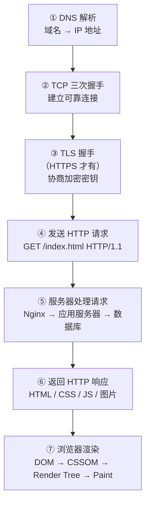

# 输入 URL 到页面显示发生了什么

---

## 速览

- 这是计算机网络最高频的综合考题，能串联 DNS、TCP、HTTP、TLS、浏览器渲染全链路。
- 回答时按七个阶段展开，每个阶段可根据面试官追问深入展开。
- 关键词：DNS 解析 → TCP 三次握手 → TLS 握手（HTTPS）→ HTTP 请求/响应 → 浏览器渲染。

---

## 七阶段流程

> **一句话理解：** 从 URL 到页面，经历了域名解析、建立连接、发送请求、接收响应、渲染页面五大核心过程。

**核心结论（可背）：**



🎯 **Interview Triggers:**
- 从输入 URL 到页面显示，完整经历了哪些步骤？（MECHANISM）
- 这个过程中哪些环节最容易成为性能瓶颈，如何优化？（SCENARIO）
- HTTP/2 和 HTTP/3 分别改进了这个流程中的哪些环节？（COMPARISON）
- 如果页面加载很慢，你会从哪些方向排查？（FAILURE）

🧠 **Question Type:** 全链路机制解释 · 综合系统设计

🔥 **Follow-up Paths:**
- DNS 解析 → 递归查询与迭代查询的区别
- TCP 三次握手 → 为什么不是两次或四次
- TLS 握手 → 证书链验证与 OCSP Stapling
- 浏览器渲染 → 关键渲染路径优化
- HTTP 缓存 → 强缓存与协商缓存策略

🛠 **Engineering Hooks:**
- Chrome DevTools 的 Network 面板可以完整还原每个请求的各阶段耗时（DNS Lookup、Initial Connection、SSL、TTFB、Content Download），是排查页面加载慢的首选工具。
- 预连接（`<link rel="preconnect">`）和 DNS 预解析（`<link rel="dns-prefetch">`）可以提前完成 DNS 和 TCP/TLS 握手，减少关键资源的等待时间。
- 服务端渲染（SSR）将 HTML 生成提前到服务器端，减少客户端 JS 执行和渲染时间，改善首屏 TTFB 和 LCP 指标。
- HTTP/3 基于 QUIC（UDP），消除了 TCP 队头阻塞和 TLS 重协商开销，在弱网环境下页面加载速度有显著提升。

---

## ① DNS 解析

> **一句话理解：** 把域名翻译成 IP 地址，查缓存优先，无缓存才递归查询。

**核心结论（可背）：**
```
查询顺序（就近原则）：
  浏览器 DNS 缓存
    → 系统 hosts 文件
      → 操作系统 DNS 缓存
        → 路由器缓存
          → ISP DNS 服务器
            → 根 DNS → 顶级域 DNS → 权威 DNS
```

**面试官常问：**
- DNS 用什么协议？→ UDP（默认）；响应超 512 字节或区域传输用 TCP。
- DNS 递归查询和迭代查询的区别？→ 客户端到 Local DNS 是递归（由 Local DNS 代查）；Local DNS 到上级是迭代（自己一步步查）。

🎯 **Interview Triggers:**
- DNS 解析的完整流程是什么，各级缓存的作用是什么？（MECHANISM）
- DNS 为什么默认使用 UDP 而不是 TCP？（WHY）
- DNS 解析失败会导致什么现象，如何排查？（FAILURE）
- TTL 设置太长或太短分别有什么问题？（TRADEOFF）
- DNS 污染和 DNS 劫持的原理和区别是什么？（CONCEPT）

🧠 **Question Type:** 协议机制解释 · 故障排查分析

🔥 **Follow-up Paths:**
- DNS 协议 → DoH（DNS over HTTPS）与 DoT 加密 DNS
- DNS 缓存 → 浏览器 TTL 与操作系统 nscd 缓存的关系
- DNS 负载均衡 → Round-robin DNS 与健康检查局限性
- DNS 安全 → DNSSEC 数字签名防篡改原理
- CDN → 智能 DNS（GeoDNS）如何实现就近调度

🛠 **Engineering Hooks:**
- 微服务部署时 DNS TTL 需与服务发现机制配合：TTL 过长导致扩缩容后流量仍打到旧实例，建议将 TTL 设为 30~60 秒，客户端也需实现 DNS 缓存刷新逻辑。
- Kubernetes 中 CoreDNS 负责集群内服务发现，Pod 的 `/etc/resolv.conf` 指向 CoreDNS ClusterIP；排查 Service 访问失败时，先用 `nslookup <service>` 确认 DNS 解析是否正常。
- `dig` 命令是 DNS 排查的利器：`dig +trace domain` 可还原完整递归查询链路，`dig @8.8.8.8 domain` 可指定 DNS 服务器排除本地污染。
- 灰度发布时可利用 DNS 权重分配（如 AWS Route 53 Weighted Routing）将少量流量切到新版本，验证无误后再切全量，比 LB 权重调整更灵活。

---

## ② TCP 三次握手

> **一句话理解：** 三次握手确认双方都能收发，建立可靠全双工连接。

**核心结论（可背）：**
```
客户端 → SYN(seq=x)              → 服务器    "我要连"
客户端 ← SYN+ACK(seq=y,ack=x+1) ← 服务器    "我同意，你能收到吗"
客户端 → ACK(ack=y+1)            → 服务器    "能，连接建立"
```

**为什么是三次不是两次？**
两次握手无法确认客户端能收到服务器的数据，存在历史连接请求误触发的风险。三次是建立可靠连接的最少次数。

🎯 **Interview Triggers:**
- TCP 三次握手的过程是什么，为什么不能用两次？（WHY）
- 三次握手中，SYN 报文携带的序列号有什么作用？（MECHANISM）
- SYN Flood 攻击的原理是什么，如何防御？（FAILURE）
- TCP 握手完成后，服务器端连接从哪个队列转移到哪个队列？（MECHANISM）
- 如果第三次 ACK 丢失了会发生什么？（SCENARIO）

🧠 **Question Type:** 协议机制解释 · 安全与可靠性分析

🔥 **Follow-up Paths:**
- 三次握手 → 四次挥手断连过程与 TIME_WAIT 状态
- SYN Flood → SYN Cookie 防御机制原理
- TCP 连接队列 → SYN 半连接队列与 Accept 全连接队列调优
- TCP 序列号 → ISN 随机化防止序列号预测攻击
- HTTP/1.1 → Keep-Alive 长连接复用减少握手次数

🛠 **Engineering Hooks:**
- 高并发服务器需调整 TCP 连接队列参数：`net.core.somaxconn`（全连接队列上限）和 `net.ipv4.tcp_max_syn_backlog`（半连接队列），队列满会导致新连接被丢弃，表现为客户端 Connection refused 或 timeout。
- `ss -lnt` 或 `netstat -lnt` 可查看监听端口的 Recv-Q（全连接队列积压），积压持续增大说明应用处理连接速度跟不上，需扩容或优化 accept 逻辑。
- TIME_WAIT 状态大量累积（通常在主动断连方）会占用端口资源；可开启 `net.ipv4.tcp_tw_reuse` 允许复用 TIME_WAIT 连接，但需确保对端支持 TCP timestamp 选项。
- 开启 SYN Cookie（`net.ipv4.tcp_syncookies=1`）可在半连接队列满时仍正常处理合法连接，同时抵御 SYN Flood 攻击，是生产环境的标配配置。

---

## ③ TLS 握手（HTTPS）

> **一句话理解：** 握手阶段用非对称加密安全交换密钥，之后用对称加密高效传数据。

**核心结论（可背）：**
```
① Client Hello   → 发送支持的 TLS 版本、加密套件、随机数 C
② Server Hello   ← 选定加密套件、随机数 S、发送证书（含公钥）
③ 证书验证       → 客户端验证 CA 签名、域名、有效期
④ 密钥交换       → 客户端用公钥加密预主密钥发给服务器
⑤ 会话密钥生成   → 双方用 C + S + 预主密钥推导出会话密钥
⑥ 握手完成       → 双方确认，后续用会话密钥对称加密通信
```

**为什么握手用非对称，通信用对称？**
非对称加密安全但慢，只用于安全地传递密钥；对称加密快，用于大量数据加密。

🎯 **Interview Triggers:**
- TLS 握手的完整过程是什么，每一步的目的是什么？（MECHANISM）
- TLS 为什么握手用非对称加密，通信用对称加密？（WHY）
- 证书验证失败会有哪些原因，如何排查？（FAILURE）
- TLS 1.3 相比 TLS 1.2 做了哪些改进？（COMPARISON）
- HTTPS 能防止中间人攻击吗，什么情况下仍然不安全？（SCENARIO）

🧠 **Question Type:** 安全协议机制解释 · 加密原理对比

🔥 **Follow-up Paths:**
- TLS 证书 → CA 证书链与根证书信任机制
- TLS 1.3 → 0-RTT 握手的安全性权衡
- HTTPS 安全 → HSTS 防止 SSL 剥离攻击
- 密钥交换 → ECDHE 前向安全性原理
- 证书管理 → Let's Encrypt 自动续签与 ACME 协议

🛠 **Engineering Hooks:**
- 证书过期是最常见的 HTTPS 故障之一，建议在监控系统中配置证书到期告警（提前 30 天），并使用 Let's Encrypt + certbot 自动续签，避免人工遗漏。
- TLS 1.3 将握手从 2-RTT 优化到 1-RTT，0-RTT 会话恢复进一步减少延迟；Nginx 1.13+ 和 OpenSSL 1.1.1+ 已支持 TLS 1.3，生产环境建议开启并禁用 TLS 1.0/1.1。
- mTLS（双向 TLS）要求客户端也提供证书，常用于微服务间的身份认证（如 Istio Service Mesh），比 API Key 更安全，密钥泄露后可直接吊销证书。
- `openssl s_client -connect host:443` 可快速检查服务器证书链、TLS 版本、加密套件，是排查 HTTPS 握手失败的基础命令。

---

## ④⑤⑥ HTTP 请求与响应

> **一句话理解：** 客户端发报文，服务器处理后返回资源。

**请求报文结构：**
```
GET /index.html HTTP/1.1
Host: www.example.com
User-Agent: Mozilla/5.0
Accept: text/html
```

**服务器处理链路：**
```
Nginx（反向代理/负载均衡）→ 应用服务器（业务逻辑）→ 数据库 / 缓存 → 响应
```

🎯 **Interview Triggers:**
- HTTP 请求报文由哪几部分组成，各部分有什么作用？（CONCEPT）
- GET 和 POST 的区别是什么，什么时候应该用哪个？（COMPARISON）
- HTTP 状态码有哪些分类，常见状态码各代表什么？（CONCEPT）
- 服务器端 Nginx 到应用服务器的请求处理链路是怎样的？（MECHANISM）
- HTTP/1.1 的队头阻塞问题是什么，HTTP/2 如何解决？（TRADEOFF）

🧠 **Question Type:** 协议结构解释 · 工程架构分析

🔥 **Follow-up Paths:**
- HTTP 方法 → RESTful API 设计中 GET/POST/PUT/DELETE 语义规范
- HTTP 状态码 → 4xx 客户端错误与 5xx 服务端错误的区分处理
- Nginx 反向代理 → 负载均衡算法（轮询、IP Hash、最少连接）
- HTTP/2 → 多路复用与 Server Push 机制
- HTTP 缓存 → Cache-Control 指令详解（no-cache vs no-store）

🛠 **Engineering Hooks:**
- Nginx access log 中记录了请求耗时（`$request_time` 和 `$upstream_response_time`），两者差值可反映 Nginx 自身处理开销；`upstream_response_time` 过大则说明后端应用服务器是瓶颈。
- HTTP 499 状态码（Nginx 特有）表示客户端在服务器响应前主动断开，通常说明接口超时或用户提前关闭页面；大量 499 往往是接口响应慢的信号，需结合 `upstream_response_time` 排查。
- 反向代理转发时需正确设置 `X-Forwarded-For` 或 `X-Real-IP` 头，否则应用层拿到的客户端 IP 是 Nginx 的 IP，影响限流、风控和日志分析。
- 大文件上传/下载场景需在 Nginx 配置 `client_max_body_size` 和 `proxy_read_timeout`，避免因默认限制导致请求被截断或超时中断。

---

## ⑦ 浏览器渲染

> **一句话理解：** 拿到 HTML/CSS/JS 后，浏览器按固定流水线把它变成像素。

**核心结论（可背）：**
```
HTML 解析 → DOM Tree
CSS 解析  → CSSOM Tree
           ↓
      Render Tree（DOM + CSSOM 合并，只含可见节点）
           ↓
      Layout（计算每个元素的位置和尺寸）
           ↓
      Paint（将元素绘制成位图）
           ↓
      Composite（图层合成，显示到屏幕）
```

**阻塞关系（重要）：**
- CSS 阻塞渲染：CSSOM 未构建完毕，Render Tree 无法生成。
- JS 阻塞 HTML 解析：遇到 `<script>` 默认立即执行，阻塞后续 HTML 解析。
- 解决：`<script defer>` 延迟执行；`<script async>` 异步加载。

🎯 **Interview Triggers:**
- 浏览器渲染流水线的各个阶段分别做了什么？（MECHANISM）
- 什么是重排（Reflow）和重绘（Repaint），哪个性能开销更大？（COMPARISON）
- CSS 为什么会阻塞渲染，JS 为什么会阻塞 HTML 解析？（WHY）
- `defer` 和 `async` 有什么区别，分别适用于什么场景？（COMPARISON）
- 如何减少页面渲染的卡顿，提升动画流畅度？（IMPLEMENTATION）

🧠 **Question Type:** 渲染机制解释 · 前端性能优化

🔥 **Follow-up Paths:**
- 重排重绘 → 触发重排的 CSS 属性与批量 DOM 操作优化
- 合成层 → GPU 加速（transform/opacity）与图层爆炸问题
- 关键渲染路径 → 首屏优化与 LCP/FID/CLS 核心 Web 指标
- JS 执行 → V8 引擎 JIT 编译与事件循环（Event Loop）关系
- 懒加载 → IntersectionObserver API 实现图片懒加载

🛠 **Engineering Hooks:**
- 频繁读取 `offsetWidth`、`scrollTop` 等布局属性会强制触发同步重排（强制布局），在循环中尤其危险；应将读操作批量提前、写操作延后，或使用 `requestAnimationFrame` 分帧执行。
- CSS 动画优先使用 `transform` 和 `opacity`，这两个属性的变化只触发合成阶段（不触发 Layout 和 Paint），由 GPU 处理，动画帧率更稳定。
- Chrome DevTools Performance 面板可录制完整渲染过程，分析各帧耗时、识别长任务（Long Task > 50ms）和 Layout Shift，是定位渲染性能问题的核心工具。
- 首屏关键 CSS 可内联到 HTML `<head>` 中（Critical CSS），避免渲染阻塞；非关键 CSS 通过 `media` 属性或动态加载延迟获取，减少关键渲染路径长度。

---

## 性能优化拓展（可主动引导）

| 优化手段 | 原理 |
|---|---|
| HTTP 缓存（强缓存/协商缓存） | 减少重复请求，304 Not Modified |
| CDN | 静态资源就近分发，减少 RTT |
| 懒加载（Lazy Load） | 图片/组件按需加载，减少首屏资源 |
| JS/CSS 压缩合并 | 减小文件体积，减少请求数 |
| `defer` / `async` | 避免 JS 阻塞页面渲染 |

🎯 **Interview Triggers:**
- 强缓存和协商缓存的区别是什么，分别由哪些 HTTP 头控制？（COMPARISON）
- 如何设计一套完整的前端资源缓存策略？（IMPLEMENTATION）
- 懒加载和预加载的区别是什么，分别适用于什么场景？（COMPARISON）
- 页面首屏性能指标有哪些，如何系统性地优化首屏加载速度？（SCENARIO）

🧠 **Question Type:** 工程优化方案设计 · 缓存策略对比

🔥 **Follow-up Paths:**
- HTTP 缓存 → ETag 与 Last-Modified 协商缓存机制
- 资源加载优化 → Resource Hints（preload/prefetch/preconnect）
- 首屏性能 → Core Web Vitals（LCP/FID/CLS）指标含义与优化
- 代码分割 → Webpack/Vite 动态 import 与 chunk 拆分策略
- 服务端优化 → Gzip/Brotli 压缩传输与 HTTP/2 多路复用

🛠 **Engineering Hooks:**
- 静态资源文件名打内容哈希（contenthash）配合 `Cache-Control: max-age=31536000, immutable`，实现永久缓存；HTML 文件不能设长缓存（需配合协商缓存），否则更新无法生效。
- `Link: <url>; rel=preload` 响应头或 `<link rel="preload">` 标签可提前加载关键资源（字体、首屏图片），避免关键资源被发现太晚导致渲染延迟。
- Brotli 压缩比 Gzip 高约 20%~26%，Nginx 1.11.6+ 支持 brotli 模块；开启后需确保客户端支持（现代浏览器均支持），可在响应头 `Accept-Encoding: br` 中检查。
- 使用 Lighthouse 或 WebPageTest 定期对关键页面进行性能基准测试，将 LCP < 2.5s、FID < 100ms、CLS < 0.1 作为 CI/CD 门禁指标，防止性能回退。

---

## 面试高频考点汇总

| 考点 | 核心答案 |
|---|---|
| DNS 查询顺序？ | 浏览器缓存→系统缓存→路由器→ISP DNS→根→权威 DNS |
| 三次握手为什么不能两次？ | 两次无法确认客户端接收能力，且无法防历史连接 |
| TLS 为什么握手用非对称、通信用对称？ | 非对称安全但慢（只传密钥）；对称快（大量数据加密） |
| 浏览器渲染流程？ | HTML→DOM，CSS→CSSOM，合并→Render Tree→Layout→Paint→Composite |
| JS 为什么阻塞渲染？怎么解决？ | 默认同步执行，用 `defer`/`async` 解决 |
| CSS 为什么阻塞渲染？ | CSSOM 未就绪则无法生成 Render Tree |
