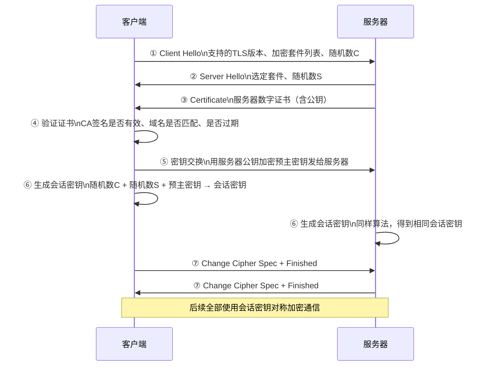

# 网络安全（HTTPS / TLS）

---

## 速览

- HTTPS = HTTP + SSL/TLS，解决三大风险：窃听、篡改、冒充。
- TLS 握手用**非对称加密**安全传递密钥，通信用**对称加密**高效传数据（混合加密）。
- 证书由 CA 颁发，客户端验证证书确认服务器身份合法。
- HTTP/3（QUIC）将 TLS 1.3 内置，握手 1-RTT 甚至 0-RTT。

---

## HTTP vs HTTPS

> **一句话理解：** HTTP 是明文裸奔，HTTPS 是加密通道，现代 Web 标配 HTTPS。

**核心结论（可背）：**
| 特性 | HTTP | HTTPS |
|---|---|---|
| 安全性 | 明文传输，易窃听篡改 | 加密传输，安全 |
| 端口 | 80 | 443 |
| 协议层 | 直接 TCP | TCP + SSL/TLS |
| 证书 | 不需要 | 必须配置 CA 证书 |
| 握手开销 | TCP 三次握手即可 | TCP 握手 + TLS 握手 |
| 浏览器标识 | "不安全"警告 | 锁形图标 |

**HTTPS 解决三大安全问题：**
```
窃听风险    → 混合加密（对称+非对称）
篡改风险    → 摘要算法（数字指纹校验完整性）
冒充风险    → CA 数字证书验证服务器身份
```

🎯 **Interview Triggers:**
- HTTP 和 HTTPS 的核心区别是什么，HTTPS 解决了哪些安全问题？（COMPARISON）
- 从 HTTP 升级到 HTTPS 会带来哪些性能开销？（TRADEOFF）
- 为什么现代浏览器对 HTTP 页面显示"不安全"警告？（WHY）
- HTTPS 能防止中间人攻击吗，原理是什么？（MECHANISM）

🧠 **Question Type:** concept comparison · security mechanism · tradeoff analysis

🔥 **Follow-up Paths:**
- HTTP vs HTTPS → TLS 握手引入的延迟与优化手段
- 中间人攻击 → 证书链验证如何防止伪造
- HSTS → 强制 HTTPS 策略与 Preload List
- 混合内容 → HTTPS 页面加载 HTTP 资源的安全风险
- 证书配置 → Let's Encrypt 自动化证书申请与续期

🛠 **Engineering Hooks:**
- Nginx 配置 `return 301 https://$host$request_uri;` 将所有 HTTP 请求强制重定向到 HTTPS
- 开启 HSTS 响应头（`Strict-Transport-Security`）告知浏览器此域名永远使用 HTTPS，防止降级攻击
- TLS 1.3 将握手从 2-RTT 缩减到 1-RTT，现代服务器应优先启用 TLS 1.3 并禁用 TLS 1.0/1.1

---

## HTTPS 混合加密原理

> **一句话理解：** 握手时用非对称加密安全地交换对称密钥，之后全程对称加密通信。

**核心结论（可背）：**
```
非对称加密（RSA / ECDHE）：
  公钥加密，私钥解密
  安全但慢（计算复杂）→ 只用于握手阶段传递密钥

对称加密（AES 等）：
  加解密用同一密钥
  快，适合大量数据 → 用于正式通信

混合方案：
  握手 → 非对称安全交换会话密钥
  通信 → 对称加密高效传输数据
```

**面试官常问：**
- 为什么握手用非对称，通信用对称？→ 非对称安全但慢，只用于安全传密钥；对称快，用于大量数据加密。

🎯 **Interview Triggers:**
- 为什么 HTTPS 不全程使用非对称加密？（WHY）
- RSA 和 ECDHE 在密钥交换上有什么区别，为什么现代 TLS 偏向 ECDHE？（COMPARISON）
- 什么是前向保密，ECDHE 如何实现前向保密？（MECHANISM）
- 对称加密的密钥是如何安全地传递给对方的？（MECHANISM）
- AES 加密的密钥长度和安全性的关系是什么？（CONCEPT）

🧠 **Question Type:** mechanism explanation · algorithm comparison · security property

🔥 **Follow-up Paths:**
- 非对称加密 → RSA 数学原理与密钥长度安全性
- ECDHE → 椭圆曲线 Diffie-Hellman 与前向保密（PFS）
- 对称加密 → AES-GCM 模式的认证加密特性
- 密钥交换 → 会话密钥派生（PRF/HKDF）
- 量子安全 → 后量子密码学对 RSA 的威胁与应对

🛠 **Engineering Hooks:**
- 推荐 TLS 配置优先使用 ECDHE 套件（如 `ECDHE-RSA-AES256-GCM-SHA384`），禁用不支持前向保密的 RSA 密钥交换
- 使用 `openssl speed rsa2048 aes256` 可直观对比非对称与对称加密的性能差距（通常差 1000 倍以上）
- AEAD 加密模式（如 AES-GCM）同时提供加密和完整性校验，TLS 1.3 只允许 AEAD 套件

---

## TLS 握手过程

> **一句话理解：** 握手目的就是让双方安全地协商出一个只有彼此知道的会话密钥。

**核心结论（可背）：**



**证书验证三步（必背）：**
1. CA 签名验证：证书是否由受信任的 CA 机构签发。
2. 有效期验证：证书是否在有效期内。
3. 域名验证：证书中的域名是否与访问的域名一致。

**易错点：**
- ❌ 以为 HTTPS 全程用非对称加密 → 握手才用非对称，正式通信全用对称。
- ❌ 以为会话密钥是直接传输的 → 会话密钥不在网络中传输，双方各自用相同算法推导出来。

🎯 **Interview Triggers:**
- 请描述 TLS 握手的完整过程？（MECHANISM）
- TLS 握手中为什么需要三个随机数来生成会话密钥？（WHY）
- TLS 1.2 和 TLS 1.3 握手过程有什么主要区别？（COMPARISON）
- 会话密钥是如何在不传输的情况下双方都得到同一个值的？（MECHANISM）
- TLS 握手失败的常见原因有哪些？（FAILURE）

🧠 **Question Type:** mechanism explanation · version comparison · failure analysis

🔥 **Follow-up Paths:**
- TLS 握手 → 三个随机数的作用与会话密钥推导
- TLS 1.2 vs TLS 1.3 → 握手轮次减少与废弃不安全套件
- 会话恢复 → Session ID 与 Session Ticket 机制
- 0-RTT → TLS 1.3 早期数据的安全性权衡
- 握手延迟优化 → TLS False Start 与 OCSP Stapling

🛠 **Engineering Hooks:**
- 使用 `openssl s_client -connect host:443 -tls1_3` 可手动模拟 TLS 握手并查看证书链和协商套件
- OCSP Stapling 让服务器预先获取证书吊销状态并随握手下发，避免客户端额外 OCSP 请求延迟
- TLS Session Ticket 允许客户端在会话恢复时跳过完整握手，将延迟从 2-RTT 降至 1-RTT

---

## CA 数字证书

> **一句话理解：** CA 是权威第三方，给服务器的公钥盖章背书，客户端信任 CA 就信任服务器。

**核心结论（可背）：**
```
证书内容：
  ├── 服务器公钥
  ├── 服务器域名
  ├── 证书有效期
  ├── 颁发机构（CA）
  └── CA 对以上内容的数字签名（用 CA 私钥签）

验证方式：
  客户端用 CA 公钥（内置在操作系统/浏览器）
  解密证书签名 → 验证证书真实性
```

**为什么需要 CA？**
防止中间人伪造服务器证书。没有 CA 背书，客户端无法判断公钥是否来自真实服务器。

🎯 **Interview Triggers:**
- CA 证书是如何防止中间人伪造服务器身份的？（MECHANISM）
- 证书链是什么，为什么需要根证书、中间证书的层级结构？（CONCEPT）
- 证书被吊销后如何通知客户端，CRL 和 OCSP 有什么区别？（COMPARISON）
- 自签名证书和 CA 签发证书有什么区别，自签名证书有什么风险？（TRADEOFF）
- 如果 CA 机构本身被攻破，会有什么影响？（FAILURE）

🧠 **Question Type:** mechanism explanation · security model · failure impact

🔥 **Follow-up Paths:**
- 证书链 → 根 CA → 中间 CA → 叶证书的信任传递
- 证书吊销 → CRL 列表 vs OCSP 实时查询的性能与可靠性
- CA 攻击 → DigiNotar 事件与证书透明度（CT）机制
- 证书类型 → DV / OV / EV 证书的验证级别差异
- 双向 TLS → mTLS 客户端证书认证在微服务中的应用

🛠 **Engineering Hooks:**
- 使用 `openssl verify -CAfile ca.crt server.crt` 手动验证证书链是否完整可信
- 部署时需确保服务器发送完整证书链（含中间证书），否则部分客户端因找不到中间 CA 会握手失败
- 证书透明度（Certificate Transparency）要求所有 CA 将签发记录写入公开日志，可用 crt.sh 查询域名所有历史证书

---

## HTTP/3 与 QUIC

> **一句话理解：** HTTP/3 基于 QUIC（UDP），内置 TLS 1.3，握手更快，解决了 TCP 的队头阻塞。

**核心结论（可背）：**
| 版本 | 传输层 | TLS | 握手 RTT |
|---|---|---|---|
| HTTP/1.1 | TCP | 外置 TLS | TCP(1.5RTT) + TLS(2RTT) |
| HTTP/2 | TCP | 外置 TLS | TCP(1.5RTT) + TLS(1RTT，TLS1.3) |
| HTTP/3 | QUIC（UDP） | 内置 TLS 1.3 | 1-RTT，可 0-RTT |

- **0-RTT**：重连时复用之前的会话信息，首包即携带数据，延迟极低。

🎯 **Interview Triggers:**
- HTTP/2 已经有多路复用了，HTTP/3 为什么还要切换到 UDP？（WHY）
- QUIC 是如何解决 TCP 队头阻塞问题的？（MECHANISM）
- HTTP/3 的 0-RTT 是如何实现的，有什么安全风险？（TRADEOFF）
- QUIC 在 UDP 上如何实现可靠传输？（IMPLEMENTATION）
- 什么场景下 HTTP/3 的优势最明显？（SCENARIO）

🧠 **Question Type:** mechanism explanation · comparison · tradeoff analysis · scenario application

🔥 **Follow-up Paths:**
- QUIC vs TCP → 队头阻塞的根本原因与 QUIC 的流级别解决方案
- 0-RTT 安全 → 重放攻击风险与幂等请求限制
- QUIC 可靠性 → 基于 UDP 的丢包恢复与乱序处理
- 连接迁移 → QUIC Connection ID 机制与移动网络切换
- 部署现状 → CDN 对 HTTP/3 的支持与回退策略

🛠 **Engineering Hooks:**
- Nginx 1.25+ 原生支持 HTTP/3（QUIC），需编译时加入 `--with-http_v3_module` 并配置 UDP 443 端口监听
- 浏览器通过 `Alt-Svc` 响应头发现服务器支持 HTTP/3，首次仍用 HTTP/2，后续连接自动升级
- 0-RTT 数据只应用于幂等请求（GET/HEAD），POST 等非幂等请求不应通过 0-RTT 发送以防重放攻击

---

## 面试高频考点汇总

| 考点 | 核心答案 |
|---|---|
| HTTPS 解决哪三个问题？ | 窃听（加密）、篡改（摘要算法）、冒充（CA 证书） |
| 为什么握手用非对称、通信用对称？ | 非对称安全但慢，只传密钥；对称快，用于数据加密 |
| TLS 握手流程？ | Client Hello → Server Hello + 证书 → 验证证书 → 密钥交换 → 生成会话密钥 → 完成 |
| 会话密钥是如何生成的？ | 客户端随机数 + 服务器随机数 + 预主密钥 → 双方各自推导，不经网络传输 |
| CA 的作用？ | 权威第三方给公钥背书，防止中间人伪造 |
| HTTP/3 为什么快？ | 基于 UDP + QUIC，内置 TLS 1.3，1-RTT 或 0-RTT，无队头阻塞 |
