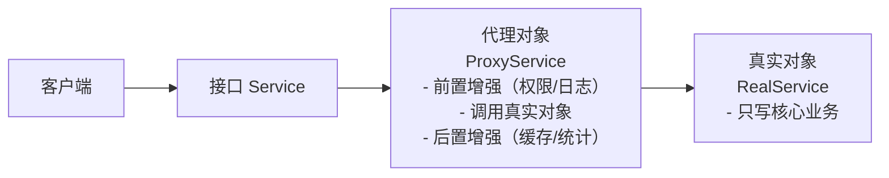

# 代理模式

---

## 速览

- 代理模式 = 在访问对象前插入一层代理，控制访问并添加增强逻辑。
- 分静态代理（编译期生成）和动态代理（运行期反射生成）。
- Java 动态代理两种：JDK 动态代理（基于接口）、CGLIB（基于继承）。
- Spring AOP、`@Transactional`、RPC 框架都是代理模式的典型应用。

---

## 代理模式结构

> **一句话理解：** 客户端只和代理打交道，代理在核心业务前后插入增强逻辑，真实对象专注业务。

**核心结论（可背）：**


**三个角色：**
| 角色 | 职责 |
|---|---|
| 抽象主题（Subject） | 定义代理和真实对象的公共接口 |
| 真实主题（RealSubject） | 实现核心业务逻辑，不关心增强逻辑 |
| 代理（Proxy） | 持有真实对象引用，实现增强逻辑，控制访问 |

🎯 **Interview Triggers:**
- 代理模式的三个角色分别是什么，各自职责是什么？（CONCEPT）
- 代理模式的核心意图是什么，和装饰者模式有什么本质区别？（COMPARISON）
- 客户端为什么要通过代理而不是直接调用真实对象？（WHY）
- 代理模式如何做到在不修改真实对象的前提下扩展行为？（MECHANISM）

🧠 **Question Type:** 结构型设计模式的角色划分与意图理解

🔥 **Follow-up Paths:**
- 代理模式结构 → 静态代理 vs 动态代理
- 代理模式结构 → JDK 动态代理实现原理
- 代理模式结构 → Spring AOP 底层代理机制
- 代理模式结构 → 代理模式 vs 装饰者模式

🛠 **Engineering Hooks:**
- 设计代理层时，保持代理类与真实类实现同一接口，确保对客户端透明。
- 代理类只做横切关注点（日志、权限、事务），不混入业务逻辑，职责清晰。
- 在微服务网关中，API 网关本质就是一个远程代理，统一处理鉴权和限流。

---

## 示例代码

**机制解释：**
```java
// 抽象主题
interface Service {
    void doWork();
}

// 真实主题：只写核心业务
class RealService implements Service {
    @Override
    public void doWork() {
        System.out.println("执行真实核心业务");
    }
}

// 代理：增强逻辑 + 调用真实对象
class ProxyService implements Service {
    private final Service realService;

    public ProxyService(Service realService) {
        this.realService = realService;
    }

    @Override
    public void doWork() {
        System.out.println("前置增强：权限校验 / 日志记录");
        realService.doWork();   // 核心业务委托给真实对象
        System.out.println("后置增强：缓存结果 / 统计耗时");
    }
}

// 客户端：只和代理交互
Service proxy = new ProxyService(new RealService());
proxy.doWork();
```

🎯 **Interview Triggers:**
- 手写一个静态代理的示例，说明代理是如何在业务前后插入逻辑的？（IMPLEMENTATION）
- 为什么代理类要持有真实对象的引用而不是继承它？（WHY）
- 代理中的前置增强和后置增强分别适合做哪些事情？（SCENARIO）
- 如果真实对象的接口新增了一个方法，静态代理需要如何修改？（FAILURE）

🧠 **Question Type:** 代理模式静态实现的代码理解与扩展性分析

🔥 **Follow-up Paths:**
- 示例代码 → 静态代理的维护成本问题
- 示例代码 → 引出动态代理的必要性
- 示例代码 → InvocationHandler 如何替代手写代理类
- 示例代码 → AOP 切面的前置通知和后置通知对应关系

🛠 **Engineering Hooks:**
- 静态代理适合代理逻辑固定、接口方法少的场景，如数据库连接封装。
- 生产环境中，代理的前置逻辑应做幂等校验，防止重复调用造成副作用。
- 代理类中异常处理要完善，后置逻辑应放在 finally 块中保证执行。

---

## 静态代理 vs 动态代理

> **一句话理解：** 静态代理手写麻烦扩展差，动态代理运行期自动生成，是实际开发的选择。

**核心结论（可背）：**
| 维度 | 静态代理 | 动态代理 |
|---|---|---|
| 生成时机 | 编译期，手动编写 | 运行期，JVM 反射自动生成 |
| 扩展性 | 差，真实类新增方法需同步修改代理类 | 好，一个代理类可代理任意真实类 |
| 类数量 | 每个真实类一个代理类，类爆炸 | 动态生成，无需额外类 |
| 性能 | 略好（无反射） | 稍有反射开销，可忽略 |
| 适用场景 | 业务固定、代理逻辑简单 | 通用增强（日志、权限、事务） |

🎯 **Interview Triggers:**
- 静态代理和动态代理的核心区别是什么？（COMPARISON）
- 为什么业务迭代频繁时静态代理维护成本很高？（TRADEOFF）
- 动态代理是如何在运行期自动生成代理类的？（MECHANISM）
- 什么场景下静态代理反而比动态代理更合适？（SCENARIO）

🧠 **Question Type:** 代理实现方式的对比权衡与选型判断

🔥 **Follow-up Paths:**
- 静态 vs 动态代理 → JDK 动态代理的 InvocationHandler 机制
- 静态 vs 动态代理 → CGLIB 字节码增强原理
- 静态 vs 动态代理 → Spring AOP 选择代理方式的逻辑
- 静态 vs 动态代理 → 反射性能开销与优化

🛠 **Engineering Hooks:**
- 动态代理在框架层统一实现，业务开发者无需手写代理类，降低心智负担。
- 使用动态代理时，InvocationHandler 的 invoke 方法是所有方法调用的统一入口，适合做全局拦截。
- 静态代理类数量爆炸时，考虑用动态代理 + 注解驱动的方式重构。

---

## JDK 动态代理 vs CGLIB

**核心结论（可背）：**
| 维度 | JDK 动态代理 | CGLIB |
|---|---|---|
| 实现原理 | 基于接口，实现同一接口 | 基于继承，生成子类 |
| 要求 | 目标类必须实现接口 | 目标类不能是 final |
| 生成方式 | `java.lang.reflect.Proxy` | 字节码增强（ASM） |
| 性能 | JDK 8+ 后差距不大 | 无接口时唯一选择 |

**Spring 的选择逻辑：**
```
目标类实现了接口 → 默认 JDK 动态代理
目标类没有接口   → CGLIB
Spring Boot 2.x 默认全用 CGLIB（可配置）
```

🎯 **Interview Triggers:**
- JDK 动态代理和 CGLIB 的底层原理分别是什么？（MECHANISM）
- 为什么 JDK 动态代理要求目标类必须实现接口？（WHY）
- Spring Boot 2.x 为什么默认改用 CGLIB？（TRADEOFF）
- final 类为什么不能被 CGLIB 代理？（FAILURE）
- 项目中如何强制指定 Spring 使用 JDK 动态代理？（IMPLEMENTATION）

🧠 **Question Type:** 两种动态代理底层原理对比与 Spring 选型策略

🔥 **Follow-up Paths:**
- JDK vs CGLIB → Spring AOP 代理创建流程
- JDK vs CGLIB → 字节码增强技术（ASM、Javassist）
- JDK vs CGLIB → `@Transactional` 自调用失效问题
- JDK vs CGLIB → 代理对象强转类型时的 ClassCastException

🛠 **Engineering Hooks:**
- 使用 CGLIB 时，被代理类不要加 final，方法不要加 final，否则代理失效。
- `@Transactional` 注解在同类内部自调用时事务不生效，本质是绕过了代理对象。
- 可通过 `spring.aop.proxy-target-class=false` 强制切回 JDK 动态代理。

---

## 四种代理类型

**核心结论（可背）：**
| 类型 | 用途 |
|---|---|
| 远程代理（Remote Proxy） | 本地调用远程服务，屏蔽网络细节（RPC 框架的核心） |
| 虚拟代理（Virtual Proxy） | 延迟创建开销大的对象（懒加载） |
| 保护代理（Protection Proxy） | 控制访问权限，权限不足则拒绝 |
| 智能引用（Smart Reference） | 调用时附加额外操作，如引用计数 |

🎯 **Interview Triggers:**
- 远程代理在 RPC 框架中是如何屏蔽网络细节的？（MECHANISM）
- 虚拟代理的懒加载和单例模式的懒加载有什么区别？（COMPARISON）
- 保护代理和权限拦截器在设计上有什么异同？（COMPARISON）
- 四种代理类型中，哪种在微服务架构中最常见？（SCENARIO）

🧠 **Question Type:** 代理模式变体的场景识别与应用分析

🔥 **Follow-up Paths:**
- 四种代理类型 → RPC 框架客户端存根（Stub）实现原理
- 四种代理类型 → 懒加载与虚拟代理结合使用
- 四种代理类型 → Spring Security 基于代理的权限控制
- 四种代理类型 → 智能引用与 Java 弱引用/软引用的关系

🛠 **Engineering Hooks:**
- Dubbo/Feign 的客户端调用本质是远程代理，开发者感知不到网络传输细节。
- 虚拟代理适合延迟初始化大对象，如图片懒加载、数据库连接懒初始化。
- 保护代理中权限校验逻辑应集中维护，避免分散在各业务方法中。

---

## 面试官常问

**Q: 代理模式和装饰者模式有什么区别？**
> - **代理模式**：核心是**控制访问**，代理决定是否调用真实对象，增强逻辑是辅助（权限、日志）。
> - **装饰者模式**：核心是**功能扩展**，装饰者增强真实对象的核心功能，两者都实现接口动态叠加。

**Q: 静态代理 vs 动态代理，为什么选动态代理？**
> 业务频繁迭代，新增接口方法时，静态代理需同步修改所有代理类，维护成本高；动态代理自动适配，无需修改。

**Q: Spring 中哪里用了代理模式？**
> `@Transactional` — Spring 为带注解的 Bean 生成代理对象，代理在方法调用前开启事务，调用后提交/回滚。AOP 切面同理。

**Q: 你在项目中用过代理模式吗？**
> 用动态代理统一处理日志和权限校验，为所有业务类生成代理，在调用核心方法前验证 token 和权限，业务类只需关注核心逻辑。

🎯 **Interview Triggers:**
- 代理模式和装饰者模式的意图区别是什么，怎么在代码上区分两者？（COMPARISON）
- Spring 的 @Transactional 是如何通过代理实现事务管理的？（MECHANISM）
- 如果一个方法上同时有 @Transactional 和自定义 AOP 切面，执行顺序是怎样的？（SCENARIO）
- 你在项目中遇到过代理失效的问题吗，原因是什么？（FAILURE）

🧠 **Question Type:** 代理模式在 Spring 生态中的实际应用与常见问题排查

🔥 **Follow-up Paths:**
- 面试官常问 → @Transactional 自调用失效的根本原因
- 面试官常问 → AOP 切面执行顺序与 @Order 注解
- 面试官常问 → 代理模式 vs 装饰者模式的意图对比
- 面试官常问 → Spring Bean 生命周期中代理对象的创建时机

🛠 **Engineering Hooks:**
- @Transactional 注解只对 public 方法生效，private 方法不走代理。
- 同类内部调用不走代理，可通过注入自身或使用 AopContext.currentProxy() 解决。
- 多个切面作用于同一方法时，用 @Order 控制切面优先级，数字越小越先执行。

---

## 易错点

- ❌ 代理 = 装饰者 → 代理控制访问，装饰者扩展功能；意图不同。
- ❌ 以为 JDK 动态代理不需要接口 → JDK 代理要求目标类必须实现接口，否则用 CGLIB。
- ❌ 以为代理修改了真实对象的代码 → 代理模式的核心是**不修改**真实对象，符合开闭原则。

🎯 **Interview Triggers:**
- 开发中有哪些常见的代理模式使用误区？（FAILURE）
- 为什么说代理模式符合开闭原则？（WHY）
- JDK 动态代理在没有接口时会报什么错误，如何排查？（FAILURE）
- 代理和装饰者在结构上几乎一样，面试中如何区分两者的意图？（COMPARISON）

🧠 **Question Type:** 代理模式常见误区的识别与规避策略

🔥 **Follow-up Paths:**
- 易错点 → 开闭原则与代理模式的关系
- 易错点 → 接口缺失导致 JDK 代理失败的排查
- 易错点 → 代理模式 vs 装饰者模式的意图辨析
- 易错点 → Spring 中因误解代理机制导致的事务失效

🛠 **Engineering Hooks:**
- 发现 @Transactional 不生效时，首先检查是否是同类内部自调用绕过了代理。
- 接口设计时优先面向接口编程，确保 JDK 动态代理可用，提升可测试性。
- 代码 review 时注意区分代理（控制访问）和装饰者（功能叠加），防止混用导致设计混乱。

---

## 面试高频考点汇总

| 考点 | 核心答案 |
|---|---|
| 代理模式的作用？ | 控制对象访问，在不修改真实对象的前提下添加增强逻辑 |
| 静态 vs 动态代理？ | 编译期手写 vs 运行期反射生成；扩展性差 vs 好 |
| JDK vs CGLIB？ | 基于接口 vs 基于继承；有接口用 JDK，无接口用 CGLIB |
| 代理 vs 装饰者？ | 控制访问 vs 功能扩展 |
| Spring 中的应用？ | @Transactional、AOP 切面，都是动态代理 |
