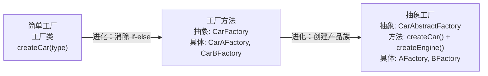

# 工厂模式

---

## 速览

- 工厂模式 = 将对象创建逻辑封装，客户端只知道接口，不知道具体实现类。
- 三种形式：简单工厂（静态方法，违反开闭）→ 工厂方法（一厂一产品，符合开闭）→ 抽象工厂（一厂一产品族）。
- 核心价值：创建与使用分离、扩展新产品不修改已有代码（开闭原则）。
- Spring 应用：BeanFactory（简单工厂+工厂方法）、FactoryBean（工厂方法，处理复杂 Bean 创建）。
- 不适合场景：创建逻辑极简（一行 new）、产品类型极少且固定。

---

## 三种工厂模式对比

> **一句话理解：** 简单工厂一个类管所有，工厂方法一个类管一种，抽象工厂一个类管一族产品。

**核心结论（可背）：**
| 模式 | 角色 | 扩展性 | 适用场景 |
|---|---|---|---|
| 简单工厂 | 一个工厂类 + if-else | ❌ 新增产品要改工厂类（违反开闭原则） | 产品类型少且固定 |
| 工厂方法 | 抽象工厂接口 + 多个具体工厂 | ✅ 新增产品只需新增工厂类 | 产品类型多，频繁扩展 |
| 抽象工厂 | 抽象工厂接口 + 多个具体工厂（每个管一族） | ✅ 产品族扩展符合开闭；❌ 产品等级扩展需改所有代码 | 创建一组相关产品（产品族） |



🎯 **Interview Triggers:**
- 三种工厂模式的区别是什么？（OVERVIEW）
- 为什么说简单工厂违反开闭原则？（PRINCIPLE）
- 抽象工厂的限制是什么？（LIMITATION）

🧠 **Question Type:** classification · design principle · tradeoff

🔥 **Follow-up Paths:**
- 简单工厂 → if-else → 开闭原则违反 → 工厂方法进化
- 工厂方法 → 一厂一产品 → 类数量增加的代价
- 抽象工厂 → 产品族 vs 产品等级 → 扩展方向的选择

🛠 **Engineering Hooks:**
- Spring BeanFactory 是工厂模式的典型应用，getBean() 屏蔽 Bean 创建细节
- 多数据源场景（MySQL/Elasticsearch/Redis）用工厂模式动态选择数据访问层实现
- 避免在工厂方法中写复杂的 if-else，优先用 Map + 反射 / SPI 机制代替

---

## 简单工厂模式

> **一句话理解：** 一个工厂类通过 if-else（或 switch）根据参数创建不同产品，简单但违反开闭原则。

**核心结论（可背）：**
```java
// 产品接口
interface Car {
    void drive();
}

// 具体产品
class CarA implements Car {
    public void drive() { System.out.println("驾驶A车"); }
}
class CarB implements Car {
    public void drive() { System.out.println("驾驶B车"); }
}

// 简单工厂：用静态方法集中创建逻辑
class CarFactory {
    public static Car createCar(String type) {
        if ("CarA".equals(type)) return new CarA();
        else if ("CarB".equals(type)) return new CarB();
        return null;
    }
}

// 客户端：不需要知道 CarA、CarB 的存在
Car car = CarFactory.createCar("CarA");
car.drive();
```

**三个角色：**
| 角色 | 职责 |
|---|---|
| 工厂类（Factory） | 核心，封装创建逻辑，可被客户端直接调用 |
| 抽象产品（Product） | 所有具体产品的父类/接口，定义公共方法 |
| 具体产品（ConcreteProduct） | 实际被创建的对象，实现产品接口 |

**缺点：**
- 新增产品必须修改工厂类的 if-else → **违反开闭原则**。

🎯 **Interview Triggers:**
- 简单工厂违反什么设计原则，为什么？（PRINCIPLE）
- JDK 中有哪些简单工厂的例子？（EXAMPLE）
- 如何改造简单工厂让它符合开闭原则？（IMPROVEMENT）

🧠 **Question Type:** design principle · real-world example · improvement direction

🔥 **Follow-up Paths:**
- 违反开闭原则 → 每次新增产品改工厂 → 工厂方法解决
- `Calendar.getInstance()` → 根据地区返回不同实现 → JDK 中的简单工厂
- 改造方向 → Map + 反射注册 → 或直接升级为工厂方法

🛠 **Engineering Hooks:**
- JDK: `DateFormat.getInstance()`, `Calendar.getInstance()` 都是简单工厂
- 简单场景（产品类型 ≤ 3 且极少变化）可接受简单工厂，避免过度设计
- 用 Map 缓存产品或工厂对象，结合枚举做类型安全的简单工厂

---

## 工厂方法模式

> **一句话理解：** 把工厂类变成抽象接口，每种产品对应一个具体工厂类，新增产品只需新增工厂类，不改已有代码。

**核心结论（可背）：**
```java
// 工厂接口
interface CarFactory {
    Car createCar();  // 无需传参，每个工厂只创建一种产品
}

// 具体工厂：一个工厂对应一个产品
class CarAFactory implements CarFactory {
    public Car createCar() { return new CarA(); }
}
class CarBFactory implements CarFactory {
    public Car createCar() { return new CarB(); }
}

// 客户端：通过工厂接口获取产品，不直接依赖具体产品类
CarFactory factory = new CarBFactory();  // 替换工厂即换产品
Car car = factory.createCar();
car.drive();

// 新增产品：只需新增 CarC + CarCFactory，不改任何已有代码 ✅
```

**四个角色：**
| 角色 | 职责 |
|---|---|
| 抽象工厂（Factory Interface） | 定义创建产品的方法签名 |
| 具体工厂（ConcreteFactory） | 实现创建方法，创建对应产品 |
| 抽象产品（Product Interface） | 产品的公共接口 |
| 具体产品（ConcreteProduct） | 工厂创建的实际对象 |

🎯 **Interview Triggers:**
- 工厂方法如何解决简单工厂违反开闭原则的问题？（MECHANISM）
- JDK Collection.iterator() 是什么工厂模式？（REAL-WORLD）
- 工厂方法的缺点是什么？（LIMITATION）

🧠 **Question Type:** mechanism · real-world · limitation

🔥 **Follow-up Paths:**
- 工厂方法 → 开闭原则 → 新增产品只加类，不改旧代码
- `ArrayList.iterator()` → 各集合实现自己的迭代器工厂方法
- 缺点 → 类数量爆炸 → 每个产品需一对工厂+产品类

🛠 **Engineering Hooks:**
- `Collection.iterator()` 是 JDK 中工厂方法的经典案例
- 框架中大量使用工厂方法：JDBC `DriverManager.getConnection()`、Slf4j `LoggerFactory.getLogger()`
- 配合 SPI（ServiceLoader）实现插件化扩展，无需修改框架代码

---

## 抽象工厂模式

> **一句话理解：** 一个工厂接口创建一组相关产品（产品族），保证同族产品的一致性。

**核心结论（可背）：**
```java
// 抽象工厂接口：创建一族产品
interface CarAbstractFactory {
    Car createCar();      // 产品族的第一个产品
    Engine createEngine(); // 产品族的第二个产品
}

// 具体工厂：创建 A 系列产品族
class AFactory implements CarAbstractFactory {
    public Car createCar()       { return new CarA(); }
    public Engine createEngine() { return new AEngine(); }
}

// 客户端：通过抽象工厂接口使用产品族，保证一致性
CarAbstractFactory factory = new AFactory(); // 切换整个产品族
Car car = factory.createCar();       // 得到 A 系列车
Engine engine = factory.createEngine(); // 得到 A 系列发动机
```

**扩展性注意：**
```
产品族扩展（新增 C 工厂）→ 符合开闭原则，新增 CFactory 类即可
产品等级扩展（新增 Tire 轮胎接口）→ 违反开闭原则，需修改所有工厂接口和实现类
```

🎯 **Interview Triggers:**
- 抽象工厂和工厂方法的区别是什么？（COMPARISON）
- 抽象工厂的"产品族"和"产品等级"是什么意思？（CONCEPT）
- 新增一种产品等级（而非产品族）时，抽象工厂会遇到什么问题？（TRADEOFF）

🧠 **Question Type:** comparison · concept · tradeoff

🔥 **Follow-up Paths:**
- 产品族扩展 → 新增工厂类 → 符合开闭原则
- 产品等级扩展 → 修改接口 → 所有具体工厂都要改
- 工厂方法 vs 抽象工厂 → 单产品 vs 产品族

🛠 **Engineering Hooks:**
- 典型场景：跨平台 UI 工厂（Windows/macOS 工厂各创建一套风格一致的 Button+Dialog）
- MyBatis 的 `SqlSessionFactory` 可视为抽象工厂，创建 Session+Transaction 一套配套组件
- 与依赖注入结合：Spring 通过配置切换不同工厂实现，无需改业务代码

---

## Spring 中的应用

> **一句话理解：** BeanFactory 是简单工厂+工厂方法的结合，FactoryBean 是自定义复杂 Bean 的工厂方法。

**核心结论（可背）：**
```
BeanFactory（Spring IoC 根接口）：
  是简单工厂 + 工厂方法的结合体
  getBean("userService") → 返回对应的 Bean 对象
  封装了 Bean 的创建、初始化、依赖注入等全部过程
  客户端不需要知道 Bean 如何被创建

FactoryBean（Spring 扩展接口）：
  用于创建某个特定的、创建逻辑复杂的 Bean
  实现 getObject() 方法定义具体创建逻辑
  Spring 调用 getObject() 获取 Bean 实例
  例如：MyBatis 的 SqlSessionFactoryBean 就是 FactoryBean
```

🎯 **Interview Triggers:**
- BeanFactory 和 FactoryBean 有什么区别？（COMPARISON）
- Spring 的工厂模式体现在哪些地方？（OVERVIEW）
- 什么时候需要自定义 FactoryBean？（SCENARIO）

🧠 **Question Type:** comparison · real-world · scenario

🔥 **Follow-up Paths:**
- BeanFactory → IoC 容器 → getBean 工厂方法
- FactoryBean → getObject → 复杂初始化逻辑封装
- MyBatis SqlSessionFactoryBean → 构建 SqlSessionFactory 复杂过程封装

🛠 **Engineering Hooks:**
- MyBatis 集成 Spring 通过 `SqlSessionFactoryBean`（FactoryBean）实现，无需手动创建 SqlSessionFactory
- 自定义 FactoryBean 常用于：连接第三方 SDK、初始化复杂对象（如加密客户端、消息队列连接）
- `&beanName` 可获取 FactoryBean 本身而非其 getObject() 返回值

---

## 面试高频考点汇总

| 考点 | 核心答案 |
|---|---|
| 三种工厂模式的区别？ | 简单工厂：一类管所有（违反开闭）；工厂方法：一厂一产品（符合开闭）；抽象工厂：一厂一族（扩展族符合，扩展等级违反） |
| 工厂方法 vs 简单工厂？ | 工厂方法将工厂抽象化，新增产品不需要修改工厂类，符合开闭原则 |
| 抽象工厂的限制？ | 适合产品族扩展，不适合产品等级扩展（后者需改所有工厂接口和实现） |
| Spring 中的工厂模式应用？ | BeanFactory（简单工厂+工厂方法，管理所有 Bean）；FactoryBean（自定义复杂 Bean 创建） |
| 什么时候不用工厂模式？ | 创建逻辑极简（一行 new）、产品类型极少且固定、小型工具项目 |
| 工厂模式的设计原则？ | 开闭原则（扩展不修改）、单一职责（工厂专注创建）、依赖倒置（依赖接口不依赖实现） |
