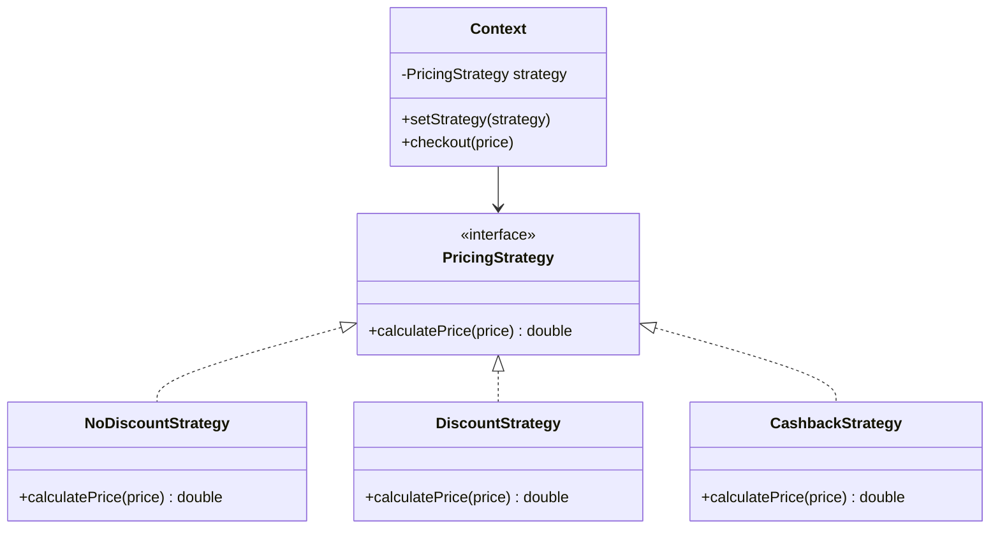

# 策略模式

---

## 速览

- 策略模式 = 把一族算法封装成独立类，通过接口互相替换，消灭 if-else 链。
- 三个角色：策略接口（定义算法）、具体策略（实现算法）、上下文（持有并调用策略）。
- 核心价值：对修改关闭，对扩展开放——新增算法只需新增策略类，不修改已有代码。
- 策略类过多时，结合工厂模式 + Map 缓存解决。

---

## 模式结构

> **一句话理解：** 把可变的算法抽出来，让上下文只依赖接口，运行时动态切换行为。

**核心结论（可背）：**



**三个角色：**
| 角色 | 职责 |
|---|---|
| 策略接口（Strategy） | 定义所有策略的统一方法签名 |
| 具体策略（ConcreteStrategy） | 实现具体算法，互相可替换 |
| 上下文（Context） | 持有策略引用，调用策略执行算法 |

🎯 **Interview Triggers:**
- 策略模式解决了什么问题，替代了什么？（PROBLEM）
- 策略模式和工厂模式有什么关系？（RELATIONSHIP）
- 策略类过多怎么管理？（SCALE）

🧠 **Question Type:** problem-solution · pattern relationship · scalability

🔥 **Follow-up Paths:**
- if-else → 开闭原则违反 → 策略模式替代
- 策略 + 工厂 → 工厂负责创建策略 → 策略负责执行算法
- 策略过多 → Map 注册 + 参数化 → 减少类数量

🛠 **Engineering Hooks:**
- Spring `@Qualifier` + 策略接口：注入不同实现 Bean，代替 if-else 分支选择
- 支付渠道（支付宝/微信/银联）、消息发送（SMS/邮件/钉钉）均是策略模式典型场景
- 策略类用单例（无状态），通过 Map 缓存避免频繁创建对象

---

## 示例代码（促销计价）

**机制解释：**
```java
// 策略接口
interface PricingStrategy {
    double calculatePrice(double price);
}

// 具体策略：无折扣
class NoDiscountStrategy implements PricingStrategy {
    public double calculatePrice(double price) { return price; }
}

// 具体策略：九折
class DiscountStrategy implements PricingStrategy {
    public double calculatePrice(double price) { return price * 0.9; }
}

// 具体策略：满 200 减 50
class CashbackStrategy implements PricingStrategy {
    public double calculatePrice(double price) {
        return price >= 200 ? price - 50 : price;
    }
}

// 上下文：持有策略，运行时切换
class ShoppingCart {
    private PricingStrategy strategy;
    public void setStrategy(PricingStrategy strategy) { this.strategy = strategy; }
    public double checkout(double price) { return strategy.calculatePrice(price); }
}

// 客户端：动态注入策略
ShoppingCart cart = new ShoppingCart();
cart.setStrategy(new DiscountStrategy());    // 随时可以换策略
cart.checkout(100);   // → 90.0
```

🎯 **Interview Triggers:**
- 上下文（Context）为什么要持有策略接口而非具体实现？（PRINCIPLE）
- 策略如何在运行时动态切换？（MECHANISM）
- 策略模式中策略对象应该是有状态还是无状态的？（DESIGN）

🧠 **Question Type:** design principle · mechanism · stateless design

🔥 **Follow-up Paths:**
- 依赖接口 → 依赖倒置原则 → 上下文不感知具体算法
- 运行时切换 → setStrategy → 对比模板方法（编译期固定）
- 无状态策略 → 线程安全 → 可被 Map 复用（单例化）

🛠 **Engineering Hooks:**
- 策略对象无状态时可做成单例，注入 Map 避免每次 new（高并发场景必做）
- Spring 中用 `@Component` + 接口类型 Map 注入所有策略 Bean，零配置扩展
- 策略选择逻辑（查 Map）和策略执行逻辑（算法）分离，分别独立测试

---

## 策略模式 vs if-else

> **一句话理解：** if-else 是硬编码，新增条件必须修改已有代码；策略模式只需新增类。

**核心结论（可背）：**
```
// 反模式：if-else 链（违反开闭原则）
if (type.equals("no_discount")) {
    return price;
} else if (type.equals("discount")) {
    return price * 0.9;
} else if (type.equals("cashback")) {
    return price >= 200 ? price - 50 : price;
}
// 每次新增促销类型都要改这里 ❌

// 策略模式（符合开闭原则）
Map<String, PricingStrategy> strategies = new HashMap<>();
strategies.put("no_discount", new NoDiscountStrategy());
strategies.put("discount", new DiscountStrategy());
// 新增策略 → 只需新增类 + 注册，不修改已有代码 ✅
PricingStrategy strategy = strategies.get(type);
return strategy.calculatePrice(price);
```

🎯 **Interview Triggers:**
- 什么情况下 if-else 比策略模式更合适？（TRADEOFF）
- 如何把一段 if-else 代码重构为策略模式？步骤是什么？（REFACTOR）
- 策略模式和表驱动法的关系？（RELATIONSHIP）

🧠 **Question Type:** tradeoff · refactoring · pattern relationship

🔥 **Follow-up Paths:**
- if-else ≤ 3 分支 → 简单直接，策略模式是过度设计
- 重构步骤 → 抽接口 → 各分支成类 → 注册 Map → 查表替代 if-else
- 表驱动法 → Map 查表 → 是策略模式的简化形式（策略是函数时）

🛠 **Engineering Hooks:**
- 规则引擎场景：用 Map<条件, 策略> 替代 100+ 行 if-else（实际项目常见）
- Spring `@ConditionalOnProperty` 结合策略模式，按配置选择不同算法实现
- 策略注册用枚举 key（类型安全），避免 String 拼写错误

---

## 策略类过多的解决方案

> **一句话理解：** 策略工厂 + Map 缓存 + 参数化，三层优化解决策略爆炸。

**核心结论（可背）：**
```
第一层：策略工厂（封装策略创建逻辑）
  StrategyFactory.getStrategy("discount") → 返回对应策略对象

第二层：Map 缓存（项目启动时注册，O(1) 查询）
  Map<String, PricingStrategy> strategyMap = new HashMap<>();
  strategyMap.put("discount", new DiscountStrategy());

第三层：参数化复用（同一策略类，不同参数）
  new DiscountStrategy(0.9)   // 九折
  new DiscountStrategy(0.8)   // 八折
  // 不需要新建两个类
```

🎯 **Interview Triggers:**
- 策略类爆炸时如何优化？（SCALE）
- 参数化策略和独立策略类各自适用什么场景？（TRADEOFF）
- Lambda/函数式接口能否替代策略类？（MODERN）

🧠 **Question Type:** scalability · tradeoff · modern approach

🔥 **Follow-up Paths:**
- 策略过多 → 参数化 → 同一类多实例，减少类数量
- Java 8 Lambda → 策略接口只有一个方法 → 直接传 Lambda 代替策略类
- Spring 批量注入 → `Map<String, Strategy>` 自动收集所有 Bean

🛠 **Engineering Hooks:**
- Java 8 中单方法策略接口可直接用 Lambda：`cart.setStrategy(price -> price * 0.9)`
- Spring 中 `@Autowired Map<String, XxxStrategy>` 自动注入所有实现，键为 Bean 名称
- 高并发下策略对象无状态则共享，有状态则每次 new（明确区分）

---

## 面试高频考点汇总

| 考点 | 核心答案 |
|---|---|
| 策略模式的三个角色？ | 策略接口、具体策略、上下文 |
| 解决什么问题？ | 消灭 if-else，让算法可替换，符合开闭原则 |
| 策略类过多怎么办？ | 策略工厂 + Map 缓存 + 参数化复用 |
| 策略模式 vs 模板方法模式？ | 策略：整体算法可替换（组合）；模板：骨架固定，步骤可变（继承） |
| 项目中如何应用？ | 促销策略、支付渠道选择、消息发送方式等 if-else 多的地方 |
