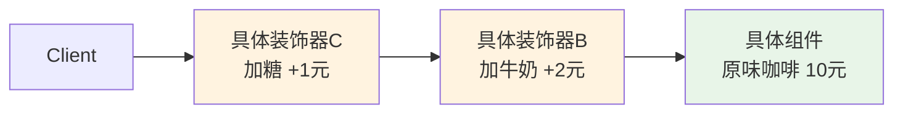

# 装饰器模式

---

## 速览

- 装饰器模式 = 通过包装对象动态叠加功能，替代继承，解决类爆炸问题。
- 核心思想：组合优于继承——n 个装饰器可以实现 2ⁿ 种功能组合。
- 装饰器和被装饰对象实现同一接口，客户端无感知差异。
- Java IO 流（BufferedInputStream、DataInputStream）就是典型应用。

---

## 模式结构

> **一句话理解：** 装饰器持有被装饰对象的引用，在调用时叠加自己的功能，就像俄罗斯套娃。

**核心结论（可背）：**



**四个角色：**
| 角色 | 职责 |
|---|---|
| 组件接口（Component） | 定义被装饰对象和装饰器的公共接口 |
| 具体组件（ConcreteComponent） | 只包含核心基础功能 |
| 抽象装饰器（Decorator） | 持有组件引用，实现组件接口，供具体装饰器继承 |
| 具体装饰器（ConcreteDecorator） | 在调用原有方法时叠加自己的扩展功能 |

🎯 **Interview Triggers:**
- 装饰器模式为什么说"组合优于继承"？（PRINCIPLE）
- Java IO 流为什么用装饰器模式？（REAL-WORLD）
- 装饰器和代理模式有什么区别？（COMPARISON）

🧠 **Question Type:** design principle · real-world · comparison

🔥 **Follow-up Paths:**
- 继承爆炸 → n 种扩展需 2ⁿ 子类 → 装饰器只需 n 个类
- Java IO → FileInputStream + BufferedInputStream + DataInputStream → 套娃结构
- 装饰器 vs 代理 → 功能扩展 vs 访问控制 → 客户端主动组合 vs 透明替换

🛠 **Engineering Hooks:**
- Spring AOP 的动态代理本质上也是装饰器思想（在方法前后叠加切面逻辑）
- HTTP 中间件链（过滤器链）是装饰器模式的典型：认证→限流→日志→业务
- 避免多层嵌套超过 4 层（可读性骤降），复杂场景考虑职责链模式替代

---

## 示例代码（咖啡加配料）

**机制解释：**
```java
// 组件接口
interface Coffee {
    String getDescription();
    double getPrice();
}

// 具体组件：核心业务
class PlainCoffee implements Coffee {
    public String getDescription() { return "原味咖啡"; }
    public double getPrice() { return 10.0; }
}

// 抽象装饰器：持有组件引用
abstract class CoffeeDecorator implements Coffee {
    protected Coffee coffee;
    public CoffeeDecorator(Coffee coffee) { this.coffee = coffee; }
}

// 具体装饰器：叠加新功能
class MilkDecorator extends CoffeeDecorator {
    public MilkDecorator(Coffee coffee) { super(coffee); }
    public String getDescription() { return coffee.getDescription() + " + 牛奶"; }
    public double getPrice() { return coffee.getPrice() + 2.0; }
}

class SugarDecorator extends CoffeeDecorator {
    public SugarDecorator(Coffee coffee) { super(coffee); }
    public String getDescription() { return coffee.getDescription() + " + 糖"; }
    public double getPrice() { return coffee.getPrice() + 1.0; }
}

// 客户端：自由组合
Coffee coffee = new PlainCoffee();           // 10.0
coffee = new MilkDecorator(coffee);          // 12.0
coffee = new SugarDecorator(coffee);         // 13.0
```

🎯 **Interview Triggers:**
- 为什么抽象装饰器也要实现组件接口？（MECHANISM）
- 多个装饰器嵌套时，方法调用顺序是什么？（CALL-CHAIN）
- 装饰器能修改被装饰对象的状态吗？（DESIGN）

🧠 **Question Type:** mechanism · call chain · design constraint

🔥 **Follow-up Paths:**
- 实现同一接口 → 客户端透明替换 → 装饰链对外仍是组件接口
- 调用顺序 → 最外层装饰器先 → 逐层深入 → 最终到具体组件
- 不修改原对象 → 包装而非修改 → 原始对象始终不变

🛠 **Engineering Hooks:**
- Java IO: `new DataInputStream(new BufferedInputStream(new FileInputStream("f.txt")))` 经典三层嵌套
- Spring Security 过滤器链是装饰器链的实际应用（每个 Filter 包装下一个）
- 装饰器叠加顺序影响行为（先加密再压缩 vs 先压缩再加密结果不同，需明确约定）

---

## 装饰器 vs 继承

> **一句话理解：** 继承功能组合会产生 2ⁿ 个子类，装饰器只需 n 个类，运行时自由组合。

**核心结论（可背）：**
```
假设有 3 种扩展功能：加牛奶、加糖、加巧克力

继承方案：需要创建 2³=8 个子类（所有组合）
  原味咖啡、加牛奶、加糖、加巧克力、
  加牛奶+糖、加牛奶+巧克力、加糖+巧克力、全加...

装饰器方案：只需 3 个装饰器类
  new ChocolateDecorator(new MilkDecorator(new SugarDecorator(new PlainCoffee())))
  → 任意顺序、任意组合
```

🎯 **Interview Triggers:**
- 为什么继承不适合解决功能组合问题？（PRINCIPLE）
- 装饰器模式违反了里氏替换原则吗？（PRINCIPLE）
- 什么情况下继承比装饰器更合适？（TRADEOFF）

🧠 **Question Type:** principle analysis · tradeoff · comparative design

🔥 **Follow-up Paths:**
- 继承 → 编译期固定 → 组合爆炸 → 难以维护
- 里氏替换 → 装饰器实现同接口 → 满足 LSP
- 继承更适合 → is-a 关系明确 + 扩展点少且固定

🛠 **Engineering Hooks:**
- 组合功能超过 2 种时应优先考虑装饰器（避免子类爆炸）
- Kotlin 委托属性（`by`）是语言级别的装饰器简化实现
- Python 的函数装饰器（@decorator）是装饰器模式在函数式上的变体

---

## 装饰器 vs 代理模式

**核心结论（可背）：**
| 维度 | 装饰器模式 | 代理模式 |
|---|---|---|
| 设计目的 | 功能扩展（增强核心业务） | 控制访问（权限校验、日志） |
| 装饰器来源 | 客户端主动选择和组合 | 客户端不知道代理的存在 |
| 功能方向 | 扩展对象能做什么 | 控制对象能不能做 |
| 叠加方式 | 多层嵌套叠加 | 通常单层 |

🎯 **Interview Triggers:**
- 结构上装饰器和代理都"包装"对象，本质区别是什么？（CORE-DIFF）
- Spring AOP 用的是代理还是装饰器？（REAL-WORLD）
- 什么场景应该选装饰器而非代理？（SCENARIO）

🧠 **Question Type:** core difference · real-world classification · scenario selection

🔥 **Follow-up Paths:**
- 意图不同 → 装饰：增强功能；代理：控制访问（权限/缓存/日志）
- Spring AOP → 动态代理 → 透明增强（客户端不感知），更接近代理
- 装饰器 → 客户端主动组合 → 明确知道叠加了哪些功能

🛠 **Engineering Hooks:**
- 日志、权限、缓存 → 代理（AOP 切面，业务代码无感知）
- 功能叠加、配料组合 → 装饰器（客户端主动选择组合方式）
- 两者混用时：代理控制"能不能用"，装饰器控制"怎么用"

---

## 面试高频考点汇总

| 考点 | 核心答案 |
|---|---|
| 装饰器模式解决什么问题？ | 避免继承类爆炸，n 个装饰器实现 2ⁿ 种功能组合 |
| 装饰器 vs 代理？ | 功能扩展 vs 访问控制；客户端主动选 vs 透明 |
| Java IO 为什么用装饰器？ | 多种流类型 × 多种功能，继承会产生大量子类无法维护 |
| 具体实现关键点？ | 装饰器和组件实现同一接口；持有组件引用；叠加时调用 `super.method()` |
