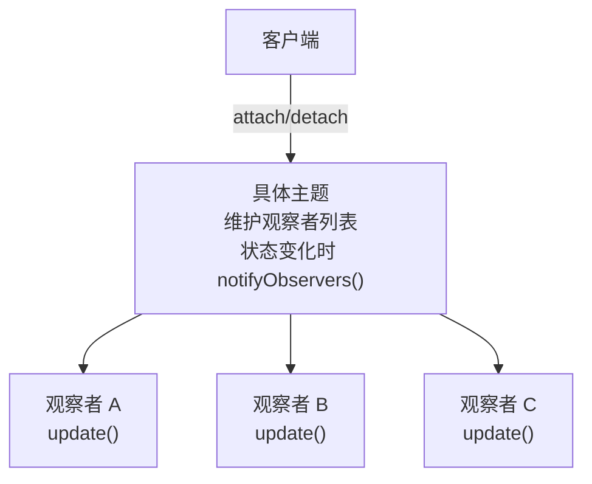

# 观察者模式

---

## 速览

- 观察者模式 = 一对多依赖，主题状态变化时自动通知所有订阅的观察者。
- 四个角色：抽象主题、具体主题、抽象观察者、具体观察者。
- 核心价值：解耦发布者和订阅者，主题不需要知道具体有哪些观察者。
- 观察者模式 vs 发布-订阅：前者主题直接持有观察者引用；后者有中间层完全解耦。
- Spring `ApplicationEvent`、Redis Pub/Sub 都是观察者模式的应用。

---

## 模式结构

> **一句话理解：** 主题维护一个观察者列表，状态变化时遍历通知所有观察者——像微信公众号推送。

**核心结论（可背）：**



**四个角色：**
| 角色 | 职责 |
|---|---|
| 抽象主题（Subject） | 提供注册/移除/通知观察者的接口 |
| 具体主题（ConcreteSubject） | 维护观察者列表，状态变化时通知全部 |
| 抽象观察者（Observer） | 定义 `update()` 接口 |
| 具体观察者（ConcreteObserver） | 实现 `update()` 响应主题变化 |

🎯 **Interview Triggers:**
- 观察者模式和发布-订阅模式的区别是什么？（COMPARISON）
- 观察者模式如何解耦发布者和订阅者？（MECHANISM）
- Spring 的事件机制是观察者模式还是发布-订阅？（CLASSIFICATION）

🧠 **Question Type:** comparison · mechanism · real-world classification

🔥 **Follow-up Paths:**
- 观察者 → 直接耦合（主题持有观察者列表） → 同进程、同步通知
- 发布-订阅 → 中间层（消息代理）→ 跨进程、异步解耦
- Spring ApplicationEvent → 有 ApplicationContext 作中间层 → 更接近发布-订阅

🛠 **Engineering Hooks:**
- Spring `@EventListener` + `ApplicationEventPublisher` 实现模块间事件解耦（代替直接方法调用）
- 观察者数量大时同步通知会阻塞主线程，改用线程池异步通知（`@Async`）
- 分布式事件通知升级为消息队列（Kafka/RabbitMQ），彻底解耦生产者和消费者

---

## 示例代码

**机制解释：**
```java
// 观察者接口
interface Observer {
    void update(String message);
}

// 主题接口
interface Subject {
    void attach(Observer observer);
    void detach(Observer observer);
    void notifyObservers(String message);
}

// 具体主题：维护订阅列表，状态变化时通知
class ConcreteSubject implements Subject {
    private List<Observer> observers = new ArrayList<>();

    public void attach(Observer o) { observers.add(o); }
    public void detach(Observer o) { observers.remove(o); }

    public void notifyObservers(String message) {
        for (Observer o : observers) {
            o.update(message);  // 逐个通知
        }
    }

    // 业务方法：状态变化时调用 notify
    public void changeState(String newState) {
        notifyObservers("状态变更为：" + newState);
    }
}

// 具体观察者：响应通知
class ConcreteObserver implements Observer {
    private String name;
    public ConcreteObserver(String name) { this.name = name; }
    public void update(String message) {
        System.out.println(name + " 收到: " + message);
    }
}

// 客户端
ConcreteSubject subject = new ConcreteSubject();
subject.attach(new ConcreteObserver("张三"));
subject.attach(new ConcreteObserver("李四"));
subject.changeState("运行中");
// 输出：张三 收到: 状态变更为：运行中
//       李四 收到: 状态变更为：运行中
```

🎯 **Interview Triggers:**
- 观察者列表用什么数据结构存，为什么？（IMPLEMENTATION）
- 主题通知观察者是推模式还是拉模式？有何区别？（PATTERN）
- 观察者注册后不注销会导致什么问题？（FAILURE）

🧠 **Question Type:** implementation detail · push-pull · memory leak

🔥 **Follow-up Paths:**
- 列表选型 → ArrayList（顺序通知）vs CopyOnWriteArrayList（线程安全）
- 推模式 → 主题推送完整数据；拉模式 → 观察者主动查询主题状态
- 不注销 → 主题持有引用 → 内存泄漏 → WeakReference 或生命周期绑定

🛠 **Engineering Hooks:**
- 并发场景下观察者列表用 `CopyOnWriteArrayList`（避免遍历时 ConcurrentModificationException）
- GUI 组件（按钮点击事件）推荐拉模式：观察者按需获取所需数据，避免推送冗余字段
- Android Lifecycle 绑定观察者生命周期（LiveData），Activity 销毁自动解除注册

---

## 观察者模式 vs 发布-订阅模式

> **一句话理解：** 观察者直接耦合，发布-订阅通过中间层完全解耦。

**核心结论（可背）：**
| 维度 | 观察者模式 | 发布-订阅模式 |
|---|---|---|
| 耦合程度 | 主题直接持有观察者引用 | 发布者和订阅者互不知道对方 |
| 中间层 | 无 | 有（消息代理/事件总线） |
| 通信方式 | 同步调用（默认） | 异步（通过消息队列） |
| 适用场景 | 单机、轻量级场景 | 分布式、跨进程（Kafka、RabbitMQ） |

🎯 **Interview Triggers:**
- 观察者模式和发布-订阅哪个解耦程度更高？为什么？（COMPARISON）
- Redis Pub/Sub 算观察者模式还是发布-订阅？（CLASSIFICATION）
- 什么时候从观察者升级为消息队列？（EVOLUTION）

🧠 **Question Type:** degree of decoupling · classification · architectural evolution

🔥 **Follow-up Paths:**
- 无中间层 → 发布者知道订阅者 → 观察者（同进程适用）
- Redis Pub/Sub → 有 Channel 中间层 → 发布-订阅（跨进程）
- 观察者 → 单机 → 消息队列 → 分布式（可靠性、持久化、扩展性）

🛠 **Engineering Hooks:**
- 同服务内部事件（如订单完成后发送通知）用 Spring Event 观察者模式即可
- 跨服务通知（如订单服务通知库存服务）必须用消息队列（Kafka/RocketMQ）
- Spring ApplicationEvent + @Async 是观察者升级为异步的过渡方案

---

## 常见问题和解决方案

**核心结论（可背）：**
| 问题 | 解决方案 |
|---|---|
| 通知无序 | 给观察者设置优先级，按优先级排序通知 |
| 内存泄漏 | 使用弱引用存储观察者；生命周期结束时主动 detach |
| 循环通知（A 通知 B，B 又触发 A） | update 中加状态标记，避免重复触发 |
| 同步通知性能瓶颈 | 用线程池异步通知 |

🎯 **Interview Triggers:**
- 观察者模式在高并发下有什么问题，如何解决？（FAILURE）
- 如何处理观察者通知中的异常，一个观察者失败了怎么办？（ROBUSTNESS）
- 循环通知问题如何避免？（EDGE-CASE）

🧠 **Question Type:** failure analysis · robustness · edge case

🔥 **Follow-up Paths:**
- 高并发 → 同步通知阻塞 → 异步线程池 + 队列缓冲
- 异常处理 → try-catch 隔离每个观察者 → 一个失败不影响其他
- 循环通知 → 状态标记 + 防重入检查 → 或设计时避免观察者修改主题

🛠 **Engineering Hooks:**
- 生产代码通知观察者时 try-catch 每个，防止单个观察者异常导致后续全部跳过
- 异步观察者注意线程安全：update() 操作共享资源需加锁或用 CAS
- Spring `@TransactionalEventListener` 在事务提交后触发事件（避免事务回滚后通知已发送）

---

## 面试高频考点汇总

| 考点 | 核心答案 |
|---|---|
| 观察者模式的四个角色？ | 抽象主题、具体主题、抽象观察者、具体观察者 |
| 解决什么问题？ | 一对多依赖通知，主题和观察者解耦 |
| 和发布-订阅的区别？ | 观察者直接耦合（无中间层），发布-订阅有中间层完全解耦 |
| 内存泄漏怎么解决？ | 弱引用 + 生命周期结束时主动 detach |
| Spring 中的应用？ | ApplicationEvent + ApplicationListener |
| 设计原则？ | 依赖倒置（依赖抽象）、开闭原则（新增观察者不改主题）、单一职责 |
